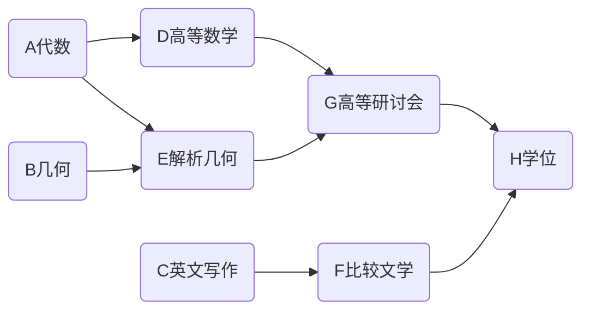
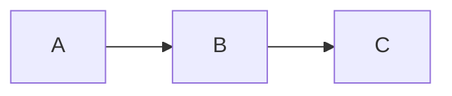
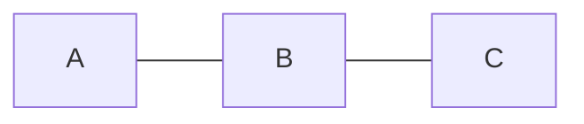
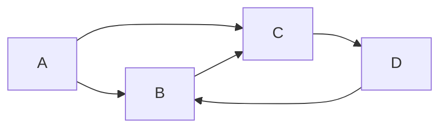

# 有向图

## 概念

### 有向图表示

::: tip 提示
案例来自[《Java数据结构和算法第二版》](https://book.douban.com/subject/1144007/)
:::

为了获取学位，需要学会写作和研讨会，高级研讨会需要先学习解析几何，解析几何又需要几何和代数知识。



### 有向图与无向图的区别

需要在边上增加方向

* 有向图



* 无向图



## 存储方式

### 邻接矩阵

在邻接矩阵中行A列B是连通的，但是列B行A是非连通的
|     | A   | B   | C   |
| --- | --- | --- | --- |
| A   | 0   | 1   | 0   |
| B   | 0   | 0   | 1   |
| C   | 0   | 0   | 0   |

### 邻接表

在邻接表中A中包含了B，但是B中没有包含A

| 顶点 | 包含邻接顶点的链表 |
| ---- | :----------------: |
| A    |         B          |
| B    |         C          |
| C    |                    |

### 拓扑排序

1. 找到一个没有后继的顶点
2. 从图中删除这个顶点，在列表的前面插入顶点的标记

### 环和树

`B-C-D-B`就是一个环，其实在`maven`里面就是循环依赖(可参考[《架构整洁之道》消除循环依赖](https://book.douban.com/subject/30333919/))，在架构里是不允许出现的一种形态。



计算无向图是否存在环，仅仅需要判断边是否等于顶点个数-1，看到这里我在想如何判断有向图是否有环呢？

## 代码

1. 找到一个没有后继的顶点，如果有一条边A指向B，那么B是A的后继

```Go
// 查找后继续节点
func (g *Graph) noSuccessors() int {
  var isEdge bool
  vertex := g.nVertex
  for row := 0; row < vertex; row++ {
    isEdge = false
    for col := 0; col < vertex; col++ {
      if g.adjMat[row][col] > 0 {
        isEdge = true
        break
      }
    }
    if !isEdge {
      return row
    }
  }
  return -1
}
```

2. 删除顶点

```Go
func (g *Graph) deleteVertex(delVel int) {
  if delVel != g.nVertex-1 {
    // 删除节点
    for j := delVel; j < g.nVertex-1; j++ {
      g.vertexList[j] = g.vertexList[j+1]
    }
    // 删除连接，主要处理行
    for row := delVel; row < g.nVertex-1; row++ {
      g.moveRowUp(row, g.nVertex)
    }
    // 删除连接，处理列
    for col := delVel; col < g.nVertex-1; col++ {
      g.moveColLeft(col, g.nVertex)
    }
  }
  g.nVertex = g.nVertex - 1
}

// 行向上移动
func (g *Graph) moveRowUp(row int, length int) {
  for col := 0; col < length; col++ {
    g.adjMat[row][col] = g.adjMat[row+1][col]
  }
}
// 列向左移动
func (g *Graph) moveColLeft(col int, length int) {
  for row := 0; row < length; row++ {
    g.adjMat[row][col] = g.adjMat[row][col+1]
  }
}
```

3. 拓扑排序

```Go
func (g *Graph) topo() {
  var st [MaxVertex]rune
  vertex := g.nVertex
  for vertex > 0 {
    currentNode := g.noSuccessors()
    // 有环
    if currentNode == vertex-1 {
      fmt.Println("error graph have cycles")
      return
    }
    st[g.nVertex-1] = g.vertexList[currentNode].label
    g.deleteVertex(currentNode)
  }

  // 打印要处理的数据
  fmt.Println("sort order")
  for _, r := range st {
    fmt.Println(r)
  }
}
```
