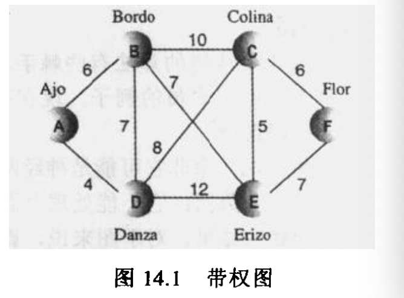
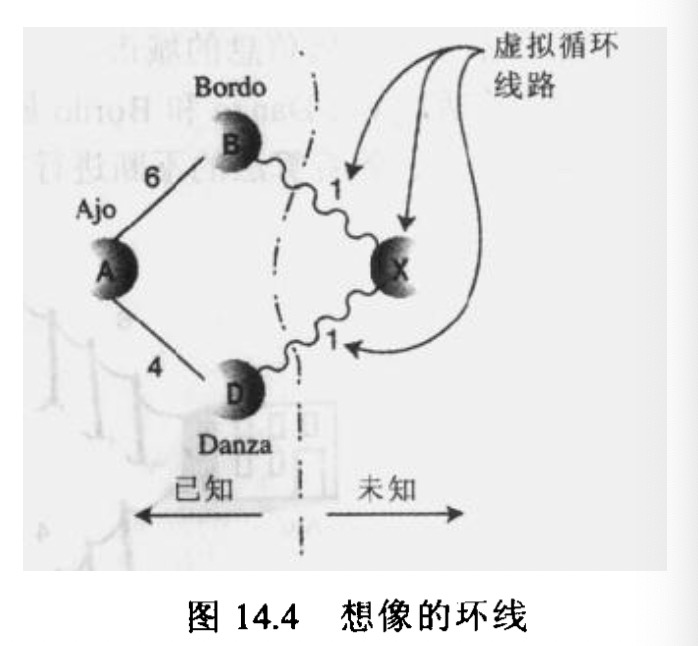
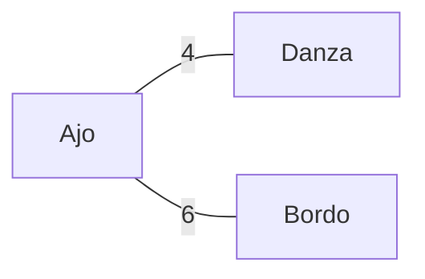
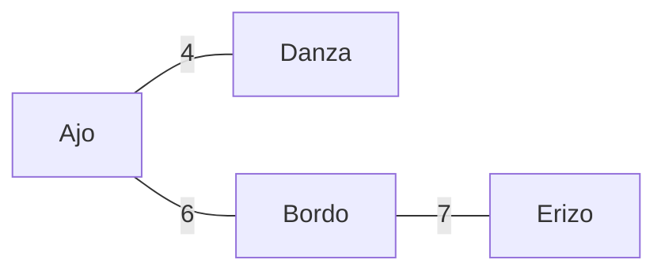
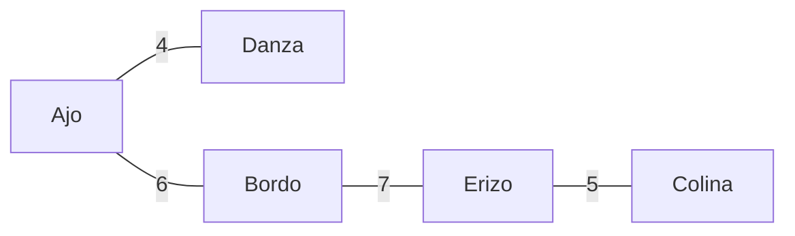
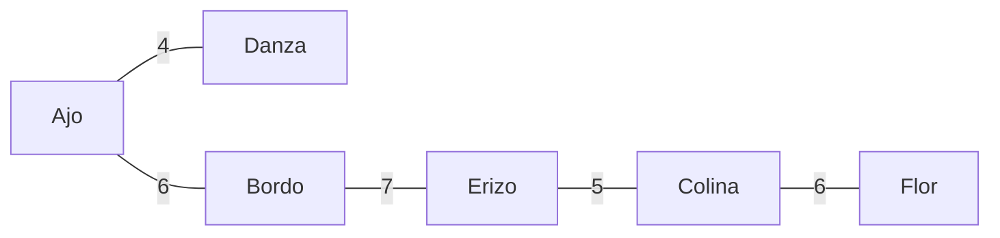

<!-- # 带权图

## 导读

* 最小生成树
* 最短路径

## 使用场景

* 城市之间路程
* 飞机之间的航班
* 高速公路流量
* 好友的亲密度

## 带权图最小生成树

当所有的边权重相等时，可以随意选择一边生成最小生成树，但是权重不一样的时候，需要一些算法策略生成最小生成树。

### 案例

对于6个城市，`Ajo,Bordo,Colina,Danza,Erizo和Flor`需要搭建有限电视网，应该如何选择边，使得整体造价最低。

由于地形原因会导致距离太远，所以一些边是不必要的，例如`Ajo-Colina,Danza-Flor`，所以这些边被忽略掉。

#### 问题

计算机算法不能一次知道给定问题的所有数据，所以只能一点点的处理数据，并且可能会使用到回溯，修正问题结果。

1. Ajo开始，按照价值排序，生成Ajo-Danza连接
   + Ajo-Danza  4

   + Ajo-Bordo  6

2. 回溯判断，如果现在在未知城市比Ajo-Danza更省钱，其必然经过了Bordo，但是现在Ajo-Danza比Ajo-Bordo省钱，这里就不需要回溯。

3. 从当前节点Danza或者Ajo出发，现在需要处理三个顶点，分别为`Bordo,Colina,Erizo`，这时候最小值为Ajo-Bordo，对Ajo-Bordo进行连接
   + Ajo-Bordo  6

   + Danza-Bordo  7

   + Danza-Colina  8

   + Danza-Erizo  12

4. 对城市进行分类
   + 类别1，已经有连接，并且已经处理过的城市，例如：`Ajo,Bordo,Danza`

   + 类别2，有连接还没处理过的城市，例如：`Colina,Erizo`

   + 类别3，无连接还没处理的城市，例如：`Flor`

5. 对类别1数据进一步处理，选择Bordo-Erizo
   + Bordo-Erizo  7

   + Danza-Colina  8

   + Bordo-Colina  10

   + Danza-Erizo  12

6. 对类别1数据进一步处理，选择Erizo-Colina
   + Erizo-Colina  5

   + Erizo-Flor  7

   + Danza-Colina  8

   + Bordo-Colina  10

7. 处理Flor
   + Colina-Flor  6

   + Erizo-Flor  7

#### 算法

1. 从一个顶点开始，把它放到树的集合中，然后重复做下面事情

2. 找到从最新的顶点到其他顶点的所有的边，这些顶点不能在树的集合里，把这些边放到优先级队列

3. 找出权值最小的边，把它和它到达的顶点放到树的集合里 -->
