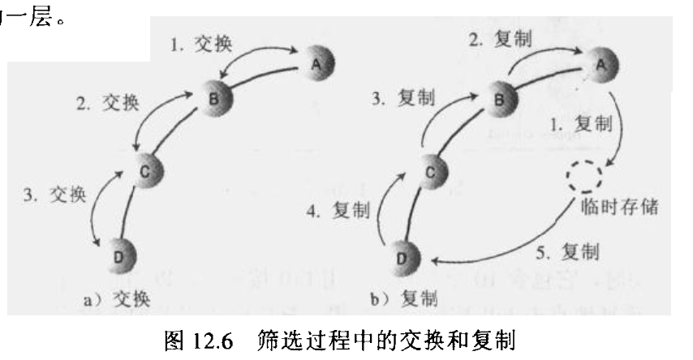

# Heap

## 使用场景

* 优先级队列
* 任务调度
* [leetcode:215. 数组中的第 K 个最大元素](https://leetcode-cn.com/problems/kth-largest-element-in-an-array/)
* 堆排序

### 特点

* 完全二叉树（除了数的最后一层节点不需要是满的）
* 使用数组实现

* 减少`left right`保存，[图中](https://book.douban.com/subject/1144007/)左孩子节点为`2*n+1`，右孩子节点为左孩子`2*(n+1)`

::: tip 提示
有的堆不使用第 0 个索引位置，左孩子节点为 `2*n` ，右孩子节点为左孩子 `2*n+1`
:::

* 插入和删除节点复杂度`O(logN)`

## 与二叉树搜索树区别

* 相同点
  + 都是二叉树
  + 如果是大顶堆，则孩子都小于父节点
* 不同点
  + 不需要数据存储左右孩子引用
  + 弱序，例如大顶堆，不保证左孩子一定大于右孩子，当时看`PriorityQueue`源码时候没看明白，脑海一直按照二叉树搜索树进行处理，查资料很很少有人讲
  + 不支持遍历排序，排序只能按照栈出栈方式推出
  + 优先级队列查找元素只能迭代数组

## 堆化

1. 数组中已经填充了数据，这个时候需要堆话` heapify(); `，按照层级从最后一层父节点开始下沉，推荐使用[堆工具](https://www.cs.usfca.edu/~galles/visualization/Heap.html)，`BuildHeap`，并且放慢 Speed。
2. 先下沉最后一层父节点

3. 在下沉倒数二次父亲节点

## 上浮

1. 在插入时候进行上浮，只需要与父亲节点进行比较，比较简单

2. 插入元素使用交换还是移动，交换的方式比较容易理解，而移动的方式性能比较高，移动的更少，由于`PriorityQueue`是由`Josh Bloch, Doug Lea`两位大神写的，而且是基础包，性能优先。
3. 交换还是移动，请参考[Java 数据结构和算法 P456](https://book.douban.com/subject/1144007/)

### 下沉

1. 删除元素
   * 删除第 0 个元素，所有数据全部向前移动
   * 删除第 0 个元素，并将最后一个数据放置到索引 0 处，进行下沉
2. 进行下沉的示意图

## 源码

* [java版本](../../languages/java/heap-java.md)
* [go版本](../../languages/go/heap-go.md)

## 参考资料

* [Java 数据结构和算法](https://book.douban.com/subject/1144007/)
* [算法（第 4 版）](https://book.douban.com/subject/19952400/)
* [堆工具](https://www.cs.usfca.edu/~galles/visualization/Heap.html)
