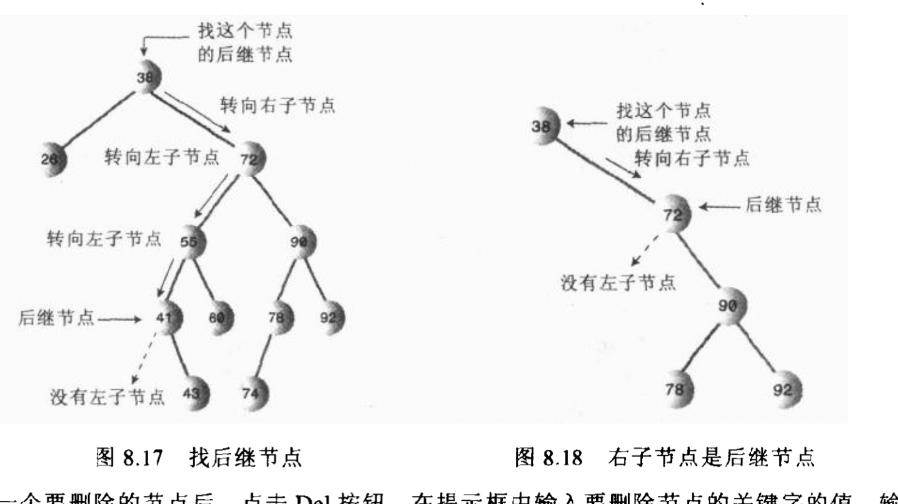
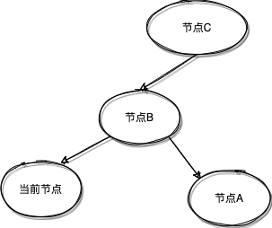
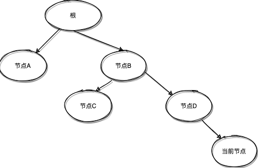

# 二叉树-算法4

在读[算法4](https://algs4.cs.princeton.edu/32bst/)的时候发现了一些知识点遗漏，进行梳理补充。

### 树的所有节点个数

1. 使用二叉树套路计算树的节点个数，从图中我们可以看到一个二叉树可以分解成n个二叉树。


2. 编写代码

```Go
func binaryTreeSize(tree *BinaryTree) int {
	// 如果子树为空返回0
	if tree == nil {
		return 0
	}
	// 递归计算左子树
	lSize := binaryTreeSize(tree.leftNode)
	// 递归计算右子树
	rSize := binaryTreeSize(tree.rightNode)
	// 加上当前节点
	return rSize + lSize + 1
}
```

### Floor

Floor and ceiling. If a given key key is less than the key at the root of a BST, then the floor of key (the largest key in the BST less than or equal to key) must be in the left subtree. If key is greater than the key at the root, then the floor of key could be in the right subtree, but only if there is a key smaller than or equal to key in the right subtree; if not (or if key is equal to the key at the root) then the key at the root is the floor of key. Finding the ceiling is similar, interchanging right and left.

1. 向下取整

* 如果当前子树根节点与给定的key相等，直接返回当前子树根节点
* 给定key比当前子树根节点小，向下取整的值一定在当前子树左子树。
* 给定key比当前子树根节点大，结果可能在当前子树右子树，前提是当前子树右子树有一个key小于等于要查找的key，如果没有的话，这个key向下取整就是当前子树根节点。

```Go
func floor(b *BinaryTree, key int) *BinaryTree {
	// 如果找不到当前节点，直接返回空
	if b == nil {
		return nil
	}
	// 如果在左子树一定存在
	if key < b.key {
		return floor(b.leftNode, key)
	}
	// 查询右子树
	if b.key < key {
		tree := floor(b.rightNode, key)
		if nil == tree {
			// 返回为空的话就说明右节点没有小于等于key的节点
			return b
		} else {
			return tree
		}
	}
	return b
}
```

2. `TreeMap#getFloorEntry`源码

```java
final Entry<K,V> getFloorEntry(K key) {
    // 当前节点
    Entry<K,V> p = root;
    while (p != null) {
        int cmp = compare(key, p.key);
        // 如果大于当前节点，并且右节点还有值，继续向右走
        if (cmp > 0) {
            if (p.right != null)
                p = p.right;
            else
            // 因为右边没节点了，向下取整就是当前节点
                return p;
        } else if (cmp < 0) {
            // 如果小于当前节点，并且还有比它小的值，一定在左子树
            if (p.left != null) {
                p = p.left;
            } else {
                // 查找当前节点的前驱节点
                Entry<K,V> parent = p.parent;
                Entry<K,V> ch = p;
                while (parent != null && ch == parent.left) {
                    ch = parent;
                    parent = parent.parent;
                }
                return parent;
            }
        } else
            return p;

    }
    // 如果头节点为空的话，返回空
    return null;
}
```

### Ceiling

1. 向上取整，这个套路与刚才相反
* 如果当前子树根节点与给定的key相等，直接返回当前子树根节点
* 给定key比当前子树根节点大，结果一定在当前子树右子树上
* 给定key比当前子树根节点小，如果当前子树左子树有大于等于key的节点，结果在当前子树左子树上，否则当前子树的根节点就是取整的结果。

```Go
func ceiling(b *BinaryTree, key int) *BinaryTree {
	// 子树为空，返回空
	if b == nil {
		return nil
	}
	//  key与子树的根节点相同
	if b.key == key {
		return b
	}
	// 如果在右子树上，一定存在
	if b.key < key {
		return ceiling(b.rightNode, key)
	}
	// 左子树不一定存在，因为没有大于等于key的节点的话，根节点就是结果
	r := ceiling(b.leftNode, key)
	if nil != r {
		return r
	}
	return b
}
```

2. `TreeMap#getCeilingEntry`源码

```java
 final Entry<K,V> getCeilingEntry(K key) {
        Entry<K,V> p = root;
        while (p != null) {
            int cmp = compare(key, p.key);
            // 如果左边没节点了，相上取整就是当前节点
            if (cmp < 0) {
                if (p.left != null)
                    p = p.left;
                else
                    return p;
            } else if (cmp > 0) {
                // 如果右边还有右孩子，继续迭代
                if (p.right != null) {
                    p = p.right;
                } else {
                    // 如果右边没孩子，查找当前节点后继节点
                    Entry<K,V> parent = p.parent;
                    Entry<K,V> ch = p;
                    while (parent != null && ch == parent.right) {
                        ch = parent;
                        parent = parent.parent;
                    }
                    // 返回结果
                    return parent;
                }
            } else
            // 节点相等直接返回
                return p;
        }
        // 如果整个tree为空，不存在
        return null;
    }
```

### Selection

Suppose that we seek the key of rank k (the key such that precisely k other keys in the BST are smaller). If the number of keys t in the left subtree is larger than k, we look (recursively) for the key of rank k in the left subtree; if t is equal to k, we return the key at the root; and if t is smaller than k, we look (recursively) for the key of rank k - t - 1 in the right subtree.

其实上面这句话就是查找二叉树第k个大的元素，其实使用一般排序或者堆排序都可以获得。

* 如果当前左子树的节点数量大于k，说明一定在其左子树上
* 如果左子树的节点数等于k，返回根节点，
* 如果当前子树左子树的节点数量小于k，我们递归的从右子树里面找到(k-t-1)，因为从左子树计算了t个，根节点1个，所以需要从当前子树的右子树里面找到部分左子树

```Go
func selection(b *BinaryTree, k int) *BinaryTree {
	size := binaryTreeSize(b.leftNode)
	if size > k {
		// 如果在左边，一直向左边缩小
		return selection(b.leftNode, k)
	} else if size < k {
		// 从右子树的左子树
		return selection(b.rightNode, k-size-1)
	} else {
		// 如果正好相等，则这个就是结果
		return b
	}
}
```

### Rank

 If the given key is equal to the key at the root, we return the number of keys t in the left subtree; if the given key is less than the key at the root, we return the rank of the key in the left subtree; and if the given key is larger than the key at the root, we return t plus one (to count the key at the root) plus the rank of the key in the right subtree.

* 给定一个key，等于当前子树的根节点，返回当前子树的左子树数量
* 给定的key小于当前子树的根，返回其在当前子树左孙树数量，这里可能找了好多次
* 给定的key大于当前子树的根，我们返回当前子树左子树总量 + 1 + 当前子树右子树下的左子树的数量

```Go
func rank(b *BinaryTree, key int) int {
	// 如果为空，返回0
	if b == nil {
		return 0
	}
	// 如果这个key相等，返回左子树数量
	if b.key == key {
		return binaryTreeSize(b.leftNode)
	} else if b.key > key {
		// 如果key小于子树的根，继续左子树查找
		return rank(b.leftNode, key)
	} else {
		// 如果在右子树，先加上所有左子树数量+根节点
		// 从右树上继续找左节点数量
		return 1 + binaryTreeSize(b.leftNode) + rank(b.rightNode, key)
	}
}
```

### Delete

之前写删除元素使用的递归写法，其思想来源于《Java数据结构和算法》一书，使用了父节点，个人代码编码不太好，这里使用非外部变量进行编写

1. 查找最小值，为什么要查找最小值呢？其实后继节点也就是要删除节点右孩子的最小节点

```Go
func findMin(head *BinaryTree) *BinaryTree {
	if head == nil {
		return nil
	}
	if head.leftNode != nil {
		return findMin(head.leftNode)
	}
	return head
}
```

2. 删除最小节点
   1. 查找最小节点的时候一直向左查找，所以被删除的节点肯定是某个子树根节点的左孩子
   2. 被删除节点肯定没有左节点，所以让被删除节点的父亲的左节点指向删除节点的右节点即可

```Go
func deleteMin(b *BinaryTree) *BinaryTree {
	// 因为左边没节点了，当前节点就是最小节点
	if nil == b.leftNode {
		return b.rightNode
	}
	// 还有小节点继续处理
	b.leftNode = deleteMin(b.leftNode)
	return b
}
```

3. 重新产生连接
   1. 如果后继节点为删除节点的右子节点，这时候 `uccessor.rightNode = head.rightNode.rightNode`

   2. 如果后继节点是删除节点的右子左孙节点，这时候，这时候 `successor.rightNode = head.rightNode` ， `b.leftNode = deleteMin(b.leftNode)` 会把后继节点父亲的左节点连接到后继节点的右节点上。

```Go
func deleteKeyFour(head *BinaryTree, key int) *BinaryTree {
	// 没找到元素，不进行处理
	if nil == head {
		return nil
	}
	if head.key < key {
		// 如果要删除根节点的右节点，继续在右子树上查找
		head.rightNode = deleteKeyFour(head.rightNode, key)
	} else if head.key > key {
		// 如果要删除根节点的左节点，继续在左子树上查找
		head.leftNode = deleteKeyFour(head.leftNode, key)
	} else {
		// 要删除节点
		// 两个都为空
		if head.leftNode == nil && head.rightNode == nil {
			return nil
		}
		// 如果左节点为空，返回右节点
		if head.leftNode == nil {
			return head.rightNode
		}
		// 如果右节点为空，返回左节点
		if head.rightNode == nil {
			return head.leftNode
		}
		// 先查找到后继节点，也就是当前子树的右子树的最小节点
		successor := findMin(head.rightNode)
		// 因为后继节点可能是右子树的根节点，所以这时候的右节点就变成了原来的head.rightNode.rightNode
		// 1.如果后继节点为删除节点的右子节点，这时候，successor.rightNode = head.rightNode.rightNode
		// 2.如果后继节点为删除节点的右子左孙节点，这时候，递归会把后继节点的右孩子连接到后继节点父亲的左子树上，这时候successor.rightNode = head.rightNode
		successor.rightNode = deleteMin(head.rightNode)
		// 后继节点的左节点是删除节点的左节点
		successor.leftNode = head.leftNode
	}
	return head
}
```

### 后继节点

1. 当前节点有右节点，则其后继节点就是当前节点右子树的最小值，效果如图所示：



```Go
func findBinaryTreeSuccessor(head *BinaryTreeSuccessor) *BinaryTreeSuccessor {
	// 当前节点的右节点不为空情况下
	if head.rightNode != nil {
		return findMinBinaryTreeSuccessor(head)
	}

	// 等待补充
	return  nil
}

// 右节点不为空的情况下，右子树不为空
func findMinBinaryTreeSuccessor(head *BinaryTreeSuccessor) *BinaryTreeSuccessor {
	for head.leftNode != nil {
		head = head.leftNode
	}
	return head
}

```

2. 如果当前节点没有右节点，向上查找到其在链路上的第一个左链接，其父亲节点就是后继
   1. 第一种情况，需要向上找到节点C，就是其后继节点


   2. 第二种情况，当前节点就是节点B的左节点，所以节点B就是当前节点后继节点



   3. 第三种情况，没有后继节点



```Go
func findBinaryTreeSuccessor(head *BinaryTreeSuccessor) *BinaryTreeSuccessor {
	// 当前节点的右节点不为空情况下
	if head.rightNode != nil {
		return findMinBinaryTreeSuccessor(head)
	}

	// 第二种情况，当前节点就是节点B的左节点，所以节点B就是当前节点后继节点
	current := head
	currentParent := head.parent
	// 当前节点就是第情况2，直接就不循环了
	for currentParent.leftNode != current {
		current = currentParent
		currentParent = currentParent.parent
	}
	return currentParent
}
```
