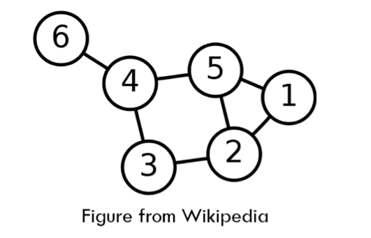
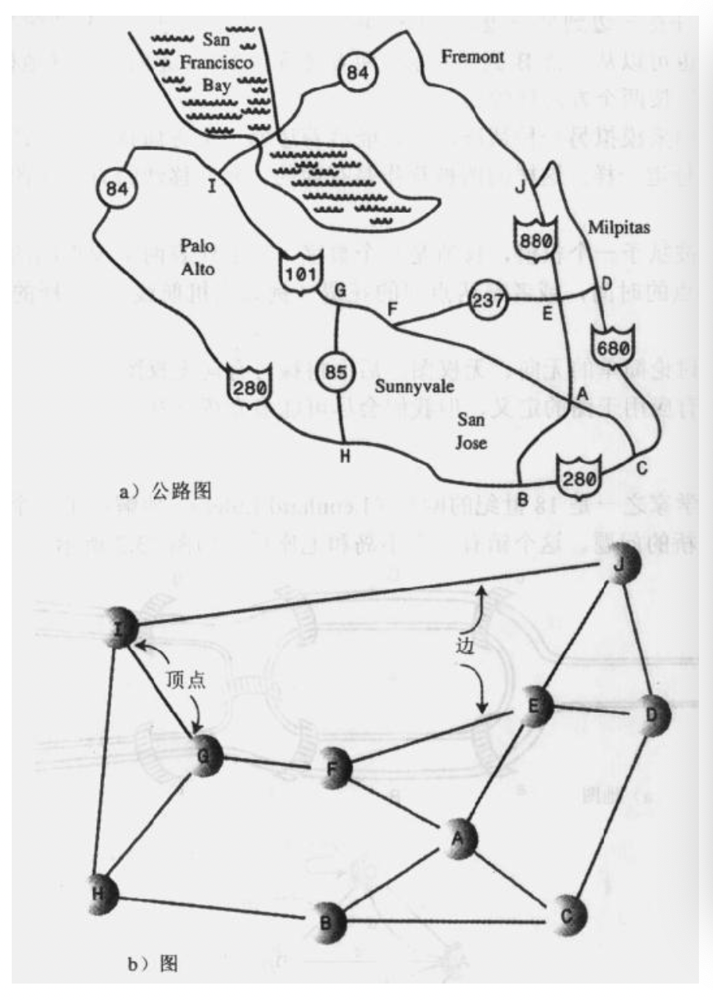
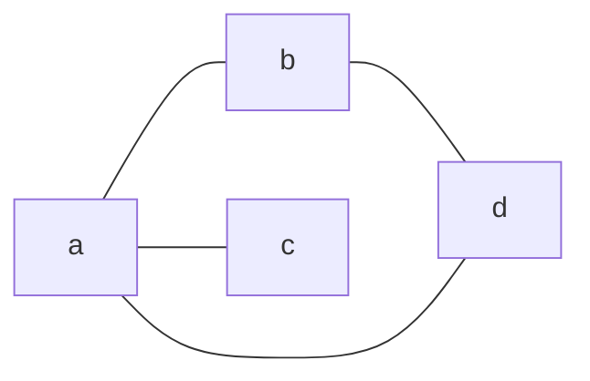
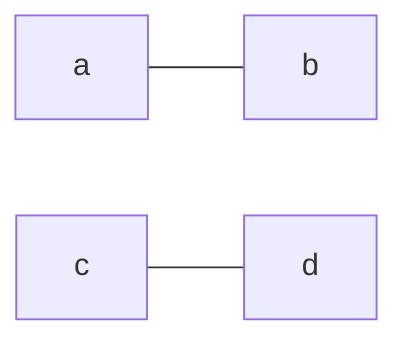
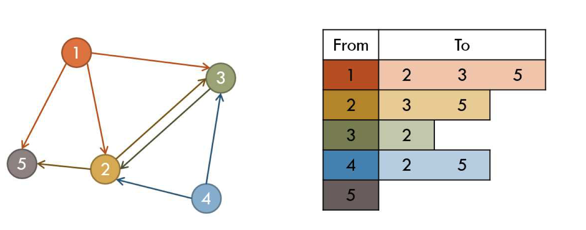
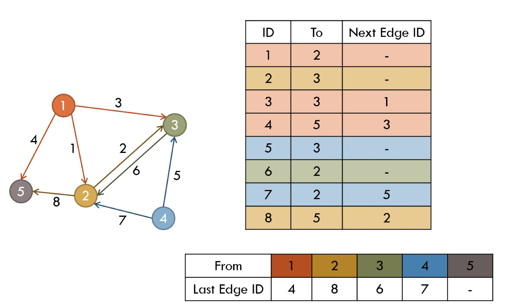

# 概念

* 一种抽象的方式表达节点(也叫顶点)和边的连接方式
* 我们使用1～n标记节点
* m条边连接一些节点
  * 边可以是单向（有向）或双向
* 节点和边可以有一些辅助信息



## 场景

* 最短路径问题
* 网络流量问题
* 匹配问题
* `2-SAT`问题
* 图着色问题
* 旅行商问题（TSP）：仍未解决！
* 其他等等

## 术语

### 顶点

顶点，也就是节点

### 度

* 顶点的入度，表示有多少条边指向这个顶点
* 顶点的出度，表示有多少条边是以这个顶点为起点指向其他顶点

### 邻接

邻接，如果两个顶点被同一个边连接，就称这两个顶点是邻接的。

### 路径

路径，边的序列，例如图中显示了一条从 B 到顶点 J 的路径，这条路径通过了顶点 A 和顶点 E，这条路径叫做 BAEJ。这两个顶点之间还有其他路径，从 B 到 J 的另外一个路径是 BCDJ。



### 连通图

连通图，如果至少有一条路径可以连接起所有的顶点，那么这个图就被称为连通的。如果没有这样一条路径，就被称为非连通的。

* 非连通的子图可以是连通的。
* 连通



* 非连通



* 连通无环图
  * 一类最重要的特殊图
    * 许多问题在树上更容易解决
  * 其他等效定义：
    * 连通图需要n-1条边
    * 连通无环图需要n-1条边
    * 每对节点之间只有一条路径
    * 连通无环图增加一条边就会有环
    * 连通图去掉一条边就不再连通
* 有向连通无环图
  * 有向连通无环图(DAG):名字已经说的很清楚
    * 等价于节点的有序
* 二部图
  * 节点可以分为两组S和T，这样边只存在于S和T之间（S内或T内没有边）

### 有向图和无向图

1. 可以任意一边到另一边，比如公路上没有设定方向，可以从 `A->B，B->A`
2. 有向图就像公路上的双向道

* 设定 `A->B , B->A` ，等价于无向图
* 设定 `A->B` ，则 `B->A` 等于在单行道上逆行
* 设定 `B->A` ，则 `A->B` 等于在单行道上逆行

### 有权图和无权图

* 有权图代表着每一条边都不一样，例如不同距离高速收费不同
* 无权图代表每条边都是等价的

## 存储方式

* 保存集合节点V和集合边E
  * 节点可以存储到数组中
  * 边必须使用其他方式存储
* 需要支持的操作
  * 检索与特定节点关联的所有边
  * 检验两个节点是否可以连接
* 使用邻接矩阵或者邻接列表存储边

### 邻接矩阵

* 一种简单的方式存储连接信息
  * 检验两个基点是否连接的时间负责度:O(1)
* 使用 n * n 矩阵 A
  * $a_{ij}$= 1 代表从i到j有边
  * $a_{ij}$= 0 代表从i到j无边
* 使用空间O($n^2$)内存
  * 当n比较小的时候适合使用
  * 稠密图比较适合

|     | A   | B   | C   |    D |
| --- | --- | --- | --- | ---: |
| A   | 0   | 1   | 1   |    1 |
| B   | 1   | 0   | 0   |    0 |
| C   | 1   | 0   | 0   |    0 |
| D   | 1   | 1   | 0   |    0 |

### 邻接表

* 每一个节点都有向外的边
  * 容易迭代某个顶点上的边
  * 列表长度可变
  * 空间使用O(n + m)



#### 邻接表实现

1. 使用链表
   1. 内存/时间开销过大
   2. 使用动态分配内存或指针性能好不好
2. 使用矢量数组
   1. 易于编码，没有内存问题
   2. 但是很慢
3. 使用数组(!)
   1. 假定总边是知道的
   2. 速度非常快，内存效率也很高

#### 邻接表数组优化



#### 邻接表数组实现

* 使用两个数组，并且数组E的长度问m，数组LE的长度为n
  * E包含所有的边
  * LE包含开始的顶点和边列表
* 对于数组全部初始化初始化`LE[i]= -1`
  * `LE[i]=0` 如果数组是1索引也可以
* 插入一个边从u->v，并使用ID=k
  * E[k].to = v
  * E[k].nextID = LE[u]
  * LE[u] = k
* 迭代从u开始的所有边

```java
for(ID = LE[u]; ID != -1; ID = E[ID].nextID)
       // E[ID] is an edge starting from u
```

* 一旦构建，就很难修改边
  * 图必须是静态的
  * 增加边很难

## 代码

### 邻接矩阵代码

1. 编写顶点

```Go
type Vertex struct {
  // 这里是数据，后面可以转换成对象
  label rune
  // 是否访问过，在遍历的时候很有用
  wasVisited bool
}

func newVertex(label rune) *Vertex {
  return &Vertex{label: label, wasVisited: false}
}
```

2. 图结构和初始化图

```java
const MaxVertex int = 20
const LINK int = 1

type Graph struct {
  vertexList []*Vertex
  adjMat     [][]int
  nVertex    int
}

func newGraph() *Graph {
  return &Graph{
    vertexList: make([]*Vertex, MaxVertex),
    adjMat:     make([][]int, MaxVertex, MaxVertex),
    nVertex:    0,
  }
}
```

3. 新增顶点

```Go
func (g *Graph) addVertex(label rune) {
  g.nVertex++
  g.vertexList[g.nVertex] = newVertex(label)
}
```

4. 连接边

```Go
func (g *Graph) addEdge(start, end int) {
  g.adjMat[start][end] = LINK
  g.adjMat[end][start] = LINK
}
```

### 邻接表代码

::: tip 提示

代码来源于[算法4](https://algs4.cs.princeton.edu/41graph/Graph.java.html)，源码使用邻接表方式编写。

:::

1. 数据表现

```java
 *  % java Graph tinyG.txt
 *  13 vertices, 13 edges
 *  0: 6 2 1 5
 *  1: 0
 *  2: 0
 *  3: 5 4
 *  4: 5 6 3
 *  5: 3 4 0
 *  6: 0 4
 *  7: 8
 *  8: 7
 *  9: 11 10 12
 *  10: 9
 *  11: 9 12
 *  12: 11 9
```

2. 基础代码，后面使用的[Bag](https://algs4.cs.princeton.edu/13stacks/Bag.java.html)其实也就是`List`。

```java
public class Bag<Item> implements Iterable<Item> {
  private Node<Item> first;    // beginning of bag
  private int n;               // number of elements in bag

  // helper linked list class
  private static class Node<Item> {
      private Item item;
      private Node<Item> next;
  }

  public Bag() {
      first = null;
      n = 0;
  }

  public boolean isEmpty() {
      return first == null;
  }

  // 数量
  public int size() {
      return n;
  }

  // 增加元素
  public void add(Item item) {
      Node<Item> oldfirst = first;
      first = new Node<Item>();
      first.item = item;
      first.next = oldfirst;
      n++;
  }

  public Iterator<Item> iterator()  {
      return new LinkedIterator(first);
  }
  // 迭代器设计模式
  // an iterator, doesn't implement remove() since it's optional
  private class LinkedIterator implements Iterator<Item> {
      private Node<Item> current;

      public LinkedIterator(Node<Item> first) {
          current = first;
      }

      public boolean hasNext()  { return current != null;                     }
      public void remove()      { throw new UnsupportedOperationException();  }

      public Item next() {
          if (!hasNext()) throw new NoSuchElementException();
          Item item = current.item;
          current = current.next;
          return item;
      }
  }
}
```

3. 无向图的顶点命名从0～n（n = V-1)

```java
public class Graph {
  private static final String NEWLINE = System.getProperty("line.separator");
  // 命名从0～n，顶点
  private final int V;
  // 边
  private int E;
  private Bag<Integer>[] adj;
}

```

4. 无向图有两个主要的操作
   1. 增加一个边到图中

```java
public void addEdge(int v, int w) {
  validateVertex(v);
  validateVertex(w);
  E++;
  adj[v].add(w);
  adj[w].add(v);
}
```

   2. 从一个顶点迭代所有相邻的顶点

```java
public Iterable<Integer> adj(int v) {
  validateVertex(v);
  return adj[v];
}
```

   3. 返回顶点的度

```java
public int degree(int v) {
  validateVertex(v);
  return adj[v].size();
}
```

   4. 查看顶点数量

```java
/**
* 返回这个图中顶点的数量
* Returns the number of vertices in this graph.
*
* @return the number of vertices in this graph
*/
public int V() {
  return V;
}
```

   5. 查看边数量

```java
/**
  * Returns the number of edges in this graph.
  *
  * @return the number of edges in this graph
  */
public int E() {
  return E;
}
```

   6. 初始化图

```Go
public Graph(int V) {
  if (V < 0) throw new IllegalArgumentException("Number of vertices must be non-negative");
  this.V = V;
  this.E = 0;
  // 数组长度为V
  adj = (Bag<Integer>[]) new Bag[V];
  // 数组全部初始化
  for (int v = 0; v < V; v++) {
      adj[v] = new Bag<Integer>();
  }
}

public Graph(In in) {
  if (in == null) throw new IllegalArgumentException("argument is null");
  try {
      // 数组数量
      this.V = in.readInt();
      if (V < 0) throw new IllegalArgumentException("number of vertices in a Graph must be non-negative");
      // 初始化
      adj = (Bag<Integer>[]) new Bag[V];
      for (int v = 0; v < V; v++) {
          adj[v] = new Bag<Integer>();
      }
      // 图的边
      int E = in.readInt();
      if (E < 0) throw new IllegalArgumentException("number of edges in a Graph must be non-negative");
      for (int i = 0; i < E; i++) {
          // 连通两个边
          int v = in.readInt();
          int w = in.readInt();
          validateVertex(v);
          validateVertex(w);
          // v w 连通
          addEdge(v, w);
      }
  }
  catch (NoSuchElementException e) {
      throw new IllegalArgumentException("invalid input format in Graph constructor", e);
  }
}

// 原型设计模式，深克隆
public Graph(Graph G) {
  this.V = G.V();
  this.E = G.E();
  if (V < 0) throw new IllegalArgumentException("Number of vertices must be non-negative");

  // 初始化
  // update adjacency lists
  adj = (Bag<Integer>[]) new Bag[V];
  for (int v = 0; v < V; v++) {
      adj[v] = new Bag<Integer>();
  }

  for (int v = 0; v < G.V(); v++) {
      // reverse so that adjacency list is in same order as original
      // 反转原来数据
      Stack<Integer> reverse = new Stack<Integer>();
      for (int w : G.adj[v]) {
          reverse.push(w);
      }
      // 数据增加到bag中
      for (int w : reverse) {
          adj[v].add(w);
      }
  }
}
```
