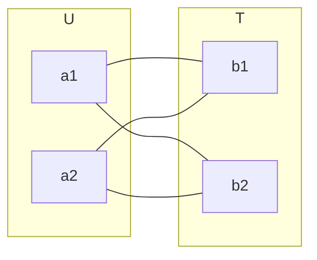
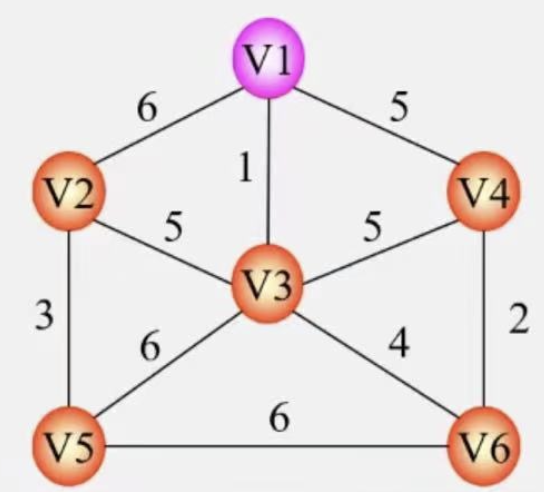
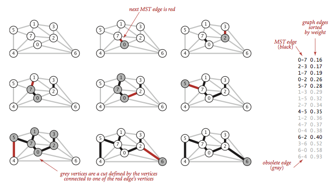

# 最小生成树

## 概念

最小（权重）生成树算法从给定节点开始，找到其所有可到达的节点以及以可能的最小权重将节点连接在一起的一组关系。它从任何已访问节点遍历到下一个具有最低权重的未访问节点，从而避免循环。

第一个已知的最小权重生成树算法是由捷克科学家`Otakar Borůvka`于1926年开发的。`Prim`算法于1957年发明，是最简单和最著名的算法。

`Prim`的算法类似于`Dijkstra`的最短路径算法，但不是最小化以每个关系结束的路径的总长度，而是分别最小化每个关系的长度。与 `Dijkstra` 算法不同，它可以存在负权重关系。

## 场景

* n个城市建立通信网问题

## MST性质

* 已经落在生成树上的顶点集合：U
* 尚未落在子生成树上的顶点集合：T = V - U

* 从U的顶点和T中顶点的边中选取权值最小的边



设 N = (V,E) 是一个连网，U是顶点集合V的非空子集。若边(u,v)是一条具有最小权值的边，其中u $\in$ U , v $\in$  T ，则必存在一棵包含(u,v)的最小生成树。



* N = `(V,{E})`
* v = `{v1,v2,v3,v4,v5,v6}`
* E = `{(v1,v2),(v1,v3),(v1,v4),(v2,v3),(v2,v5),(v3,v4),(v3,v5),(v3,v6),(v4,v6),(v5,v6)}`
* U = `(v1)`

## 常见算法

* [Prim’s algorithm](./minimum-spanning-tree.md#Prim)
* [Kruskal’s algorithm](./minimum-spanning-tree.md#Kruskal)

## Prim

* 设N =(V,E)是连通网，TE是N上最小生成树中边的集合
* 初始化U={$u_0$}，（ $u_0$ $\in$  V）TE={}
* 在所有u $\in$ U,v $\in$ V - U的边（u,v) $\in$ E中找到一条代价最小的边($u_0$,$v_0$)
* 将($u_0$,$v_0$)加入集合TE，同时$v_0$加入U。
* 重复上述操作直至U=V为止，则T=(V,TE)为N的最小生成树

### [Prim代码](https://algs4.cs.princeton.edu/43mst/PrimMST.java.html)

* 从每个顶点都开始迭代一次，这样可以处理深林问题
* 处理过`marked`的数据不在处理
* `if (pq.contains(w)) pq.decreaseKey(w, distTo[w]);`回溯修正最小顶点问题

```java
public class PrimMST {
  private static final double FLOATING_POINT_EPSILON = 1E-12;
  // 从树中到非树的顶点
  private Edge[] edgeTo;        // edgeTo[v] = shortest edge from tree vertex to non-tree vertex
  // 边的权重保存
  private double[] distTo;      // distTo[v] = weight of shortest such edge
  // 是否已经处理过
  private boolean[] marked;     // marked[v] = true if v on tree, false otherwise
  private IndexMinPQ<Double> pq;

  /**
  * Compute a minimum spanning tree (or forest) of an edge-weighted graph.
  * @param G the edge-weighted graph
  */
  public PrimMST(EdgeWeightedGraph G) {
      // 初始化数据
      edgeTo = new Edge[G.V()];
      distTo = new double[G.V()];
      marked = new boolean[G.V()];
      pq = new IndexMinPQ<Double>(G.V());
      for (int v = 0; v < G.V(); v++)
          distTo[v] = Double.POSITIVE_INFINITY;
      // 没有访问过进行处理，这里主要处理森林问题
      for (int v = 0; v < G.V(); v++)      // run from each vertex to find
          if (!marked[v]) prim(G, v);      // minimum spanning forest

      // check optimality conditions
      assert check(G);
  }

    // run Prim's algorithm in graph G, starting from vertex s
  private void prim(EdgeWeightedGraph G, int s) {
      // 从这个节点开始
      distTo[s] = 0.0;
      pq.insert(s, distTo[s]);
      // 队列不为空
      while (!pq.isEmpty()) {
          // 获取最小的顶点
          int v = pq.delMin();
          // 处理图中最小顶点
          scan(G, v);
      }
  }

    // scan vertex v
  private void scan(EdgeWeightedGraph G, int v) {
      // 标记顶点已经处理过
      marked[v] = true;
      for (Edge e : G.adj(v)) {
          // 找到边的另外一个顶点
          int w = e.other(v);
          // 如果已经处理过跳过
          if (marked[w]) continue;         // v-w is obsolete edge
          // 修正边的权重
          if (e.weight() < distTo[w]) {
              // 修正权重
              distTo[w] = e.weight();
              // w 到 e 修正
              edgeTo[w] = e;
              // 动态修正最小边
              if (pq.contains(w)) pq.decreaseKey(w, distTo[w]);
              // 否则插入顶点和权重
              else                pq.insert(w, distTo[w]);
          }
      }
  }
}
```

## Kruskal

* 设连通网 N =(V,E)，令最小生成树初始状态为只有n个顶点而无边的非连通图T=(V,{})，每个顶点自成一个连通分量。
* 在E中选择代价最小的边，若该边依附的顶点骡子T中不同的连通分量上（不能成环)，则将此边加入到T中，否则舍去此边，选取下一条代价最小的边。
* 以此类推，直到T中所有顶点都在同一连通分量上为止。

<!--  -->

### Kruskal实现

* 优先级队列处理权重问题
* `union-find`处理循环问题
* 队列存储边

### [Kruskal代码](https://algs4.cs.princeton.edu/43mst/KruskalMST.java.html)

这里使用了以下性质

* 使用选择边为基础进行连接，每次都选择最小的边，可以使用数组排序，也可以使用小根堆
* 使用[并查集](../structure/union-find-structure.md)，保证集合里面没有循环
* 如果边数等于顶点数量-1，这时候已经是最小生成树，如果在加一条边必然后有循环

```java
public class KruskalMST {
  private static final double FLOATING_POINT_EPSILON = 1E-12;

  // 最小生成树的权重
  private double weight;                        // weight of MST
  // 保存边
  private Queue<Edge> mst = new Queue<Edge>();  // edges in MST

  /**
    * Compute a minimum spanning tree (or forest) of an edge-weighted graph.
    * @param G the edge-weighted graph
    */
  public KruskalMST(EdgeWeightedGraph G) {

      // create array of edges, sorted by weight
      // 所有边的数组
      Edge[] edges = new Edge[G.E()];
      int t = 0;
      for (Edge e: G.edges()) {
          // 保存边的数组
          edges[t++] = e;
      }
      // 进行排序，从小到大，也可以使用小根堆
      Arrays.sort(edges);

      // 并查集
      // run greedy algorithm
      UF uf = new UF(G.V());
      // 迭代所有的数据，并且边小于顶点-1，在加一条必然有环
      for (int i = 0; i < G.E() && mst.size() < G.V() - 1; i++) {
          Edge e = edges[i];
          // 顶点1
          int v = e.either();
          // 顶点2
          int w = e.other(v);

          // 如果两个顶点不在一个集合里
          // v-w does not create a cycle
          if (uf.find(v) != uf.find(w)) {
              // 进行合并
              uf.union(v, w);     // merge v and w components
              // 放到队列
              mst.enqueue(e);     // add edge e to mst
              weight += e.weight();
          }
      }

      // check optimality conditions
      assert check(G);
  }
}
```

## 结论

| 算法名   | 普里姆算法         | 克鲁斯卡尔       |
| -------- | ------------------ | ---------------- |
| 算法思想 | 选择点             | 选择边           |
| 算法思想 | O($n^2$) n为顶点数 | O(eloge) e为边数 |
| 适用范围 | 稠密图             | 稀疏图           |
