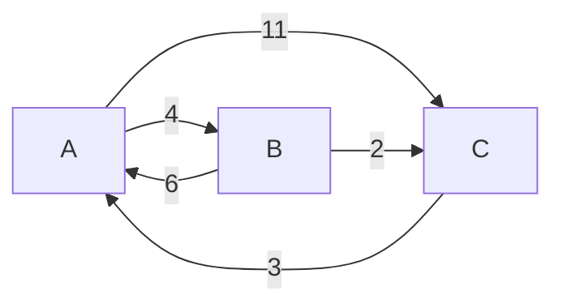
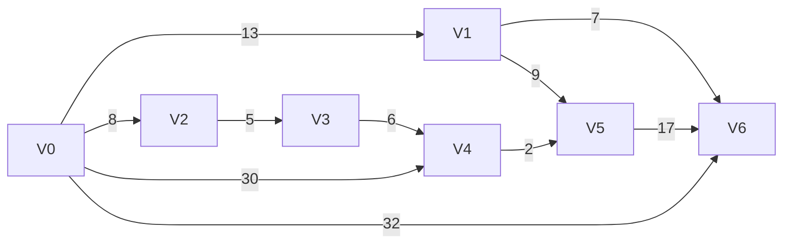

# 最短路径算法

## 最短路径问题

### 输入：一个有权图`G=(V,E)`

1. 边可以有向也可以无向
2. 有时候，我们允许负边权重
3. 注：未加权图使用BFS(广度优先搜索代码)

### 输出：两个给定节点`u`和`v`之间路径的总权重(消费，长度)

1. 有时，我们需要计算所有对最短路径
2. 有时，我们需要计算从`u`到其他所有节点的最短路径

## 概述

* Floyd-Warshall Algorithm
  * 解决所有顶点间的最短路径问题
* Dijkstra’s Algorithm
  * 解决单源最短路径问题
<!-- * Bellman-Ford Algorithm -->

## Floyd-Warshall

* 给定一个有向权重图G
* 输出矩阵D，其中$d_{ij}$是距离节点i至j
* 可以检测到负重循环
* 时间复杂度O($x^3$)
* 非常容易编码
  * 极易编码，编码时间不到几分钟

### 伪代码

* 将D初始化为给定的成本矩阵
* `For = 1,...,n :`
  * `For all i and j :`
    * $d_{ij}$= min($d_{ij}$,$d_{ik}$+$d_{ki}$)
* 对于i和j，if $d_{ij}$ + $d_{ji}$ < 0,则这个图存在负权循环
* 我们怎么运行

### 原理

* 定义`f(i,j,k)`作为i到j的最小路径，使用节点1，...，k作为中间节点
  * `f(i,j,n)`为i到j的最小路径
  * `f(i,j,0)` = `cost(i,j)`
  * `f(i,j,k)`的最佳路径可以有k作为中间节点，也可以没有k做为中间节点
    * 如果有,`f(i,j,k) = f(i,k,k − 1) + f(k,j,k − 1)`
    * 没有,`f(i,j,k)=f(i,j,k−1)`
  * 因此，`f(i,j,k)`就是上述两个量中的最小值
  * 我们有了以下结果和通用案例
    * `f(i,j,0) = cost(i,j)`
    * `f(i,j,k) = min(f(i,k,k − 1) + f(k,j,k − 1),f(i,j,k − 1))`
  * 对于`f(·,·,k−1)`的值，我们可以计算`f(·,·,k)`
    * 结果表明，我们不需要为每个k单独使用一个矩阵，可以覆盖现有值
  * 这就是我们获取`Floyd-Warshall algorithm`

### Floyd案例

1. 案例图示

1. 转换成邻接矩阵

$
\begin{bmatrix}
    +\infty  & (AB,4) & (AC,11)\\
    (BA,6) &+\infty & (BC,2)\\
    (CA,3) & +\infty&+\infty
\end{bmatrix} \qquad
$

### 开始加入中间节点

1. 加入A节点，CB之间因为A的加入从无穷缩小到7

$
\begin{bmatrix}
    +\infty  & (AB,4) & (AC,11)\\
    (BA,6) &+\infty & (BC,2)\\
    (CA,3) & (CAB,7)&+\infty
\end{bmatrix} \qquad
$

2. 加入B节点，AC之间因为B的加入从无穷缩小到6

$
\begin{bmatrix}
    +\infty  & (AB,4) & (ABC,6)\\
    (BA,6) &+\infty & (BC,2)\\
    (CA,3) & (CAB,7)&+\infty
\end{bmatrix} \qquad
$

3. 加入C节点，BA之间因为C的加入从无穷缩小到5

$
\begin{bmatrix}
    +\infty  & (AB,4) & (ABC,6)\\
    (BCA,5) &+\infty & (BC,2)\\
    (CA,3) & (CAB,7)&+\infty
\end{bmatrix} \qquad
$

## Dijkstra

* 给定有向权重图G和一个源点s
  * 实现：边的权重为非负数
* 输出一个矢量d，$d_i$是从源头s到节点i
* 时间负责度依赖于实现
  * 可能为O($n^2$ + m) , O($\lg n$ + m), O(n $\lg n$ + m)
* 特别像`Prim`算法
* 发现靠近源头s的最近节点，然后是第二个最近，然后第三个，等
* 维持一个set集合，命名为S，其保存可以到达的最小路径节点
* 一个矢量d，从源头算出的最小距离
* 初始化，S:={s},并且$d_v$ := cost(s,v)
* 重复直到S = V
  * 查找v $\notin$ S，并且存在$d_v$，将其加入到S
  * 迭代边 v -> u ,并计算花费c:
    * $d_u$ := min ($d_u$ , $d_v$ + c)

<!-- ## Bellman-Ford Algorithm -->
### Dijkstra案例

### Dijkstra案例解析

* `S = {v0}，T = {v1,v2,v3,v4,v5,v6}`
* 从v0出发找到与T集合之间的最小的边(可以直接连接，也可以是节点加入回溯所得)，从这里我们选择v2，`v0->v2 = 8`加入`S = {v0,v2}`

| 开始 | 结束 | 距离 | 路径  |
| ---- | ---- | ---- | ----- |
| v0   | v1   | 13   | v0,v1 |
| v0   | v2   | 8    | v0,v2 |
| v0   | v3   | ∞    |       |
| v0   | v4   | 30   | v0,v4 |
| v0   | v5   | ∞    |       |
| v0   | v6   | 32   | v0,v6 |

* 从v0出发，判断是否有距离缩短，从这里我们选择v1/v3`v0->v1 = 13`，加入`S = {v0,v1,v2}`

| 开始 | 结束 | 距离 | 路径     |
| ---- | ---- | ---- | -------- |
| v0   | v1   | 13   | v0,v1    |
| v0   | v3   | 13   | v0,v2,v3 |
| v0   | v4   | 30   | v0,v4    |
| v0   | v5   | ∞    |          |
| v0   | v6   | 32   | v0,v6    |

* 从v0出发，判断是否有距离缩短，选择v3加入`S = {v0,v1,v2,v3}`

| 开始 | 结束 | 距离 | 路径     |
| ---- | ---- | ---- | -------- |
| v0   | v3   | 13   | v0,v2,v3 |
| v0   | v4   | 30   | v0,v4    |
| v0   | v5   | 22   | v0,v1,v5 |
| v0   | v6   | 32   | v0,v6    |

* 从v0出发，判断是否有距离缩短，选择v4加入`S = {v0,v1,v2,v3,v4}`

| 开始 | 结束 | 距离 | 路径        |
| ---- | ---- | ---- | ----------- |
| v0   | v4   | 19   | v0,v2,v3,v4 |
| v0   | v5   | 22   | v0,v1,v5    |
| v0   | v6   | 20   | v0,v1,v6    |

* 从v0出发，判断是否有距离缩短，选择v6，加入`S = {v0,v1,v2,v3,v4,v6}`

| 开始 | 结束 | 距离 | 路径           |
| ---- | ---- | ---- | -------------- |
| v0   | v5   | 21   | v0,v2,v3,v4,v5 |
| v0   | v6   | 20   | v0,v1,v6       |

* 从v0出发，判断是否有距离缩短，加入v5，S = V

| 开始 | 结束 | 距离 | 路径           |
| ---- | ---- | ---- | -------------- |
| v0   | v5   | 21   | v0,v2,v3,v4,v5 |
