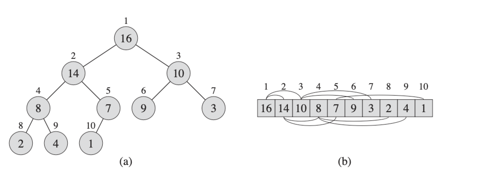
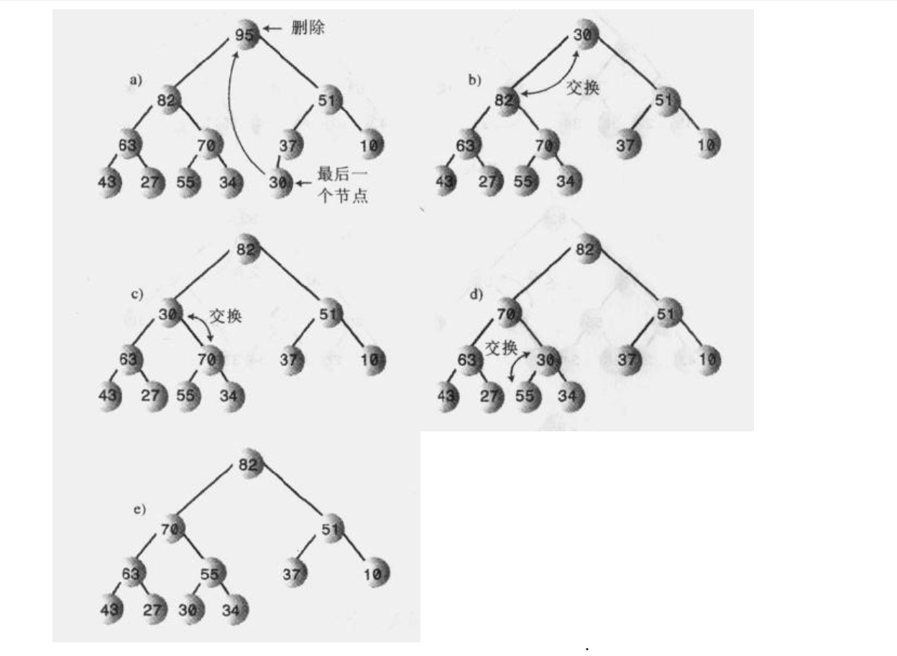
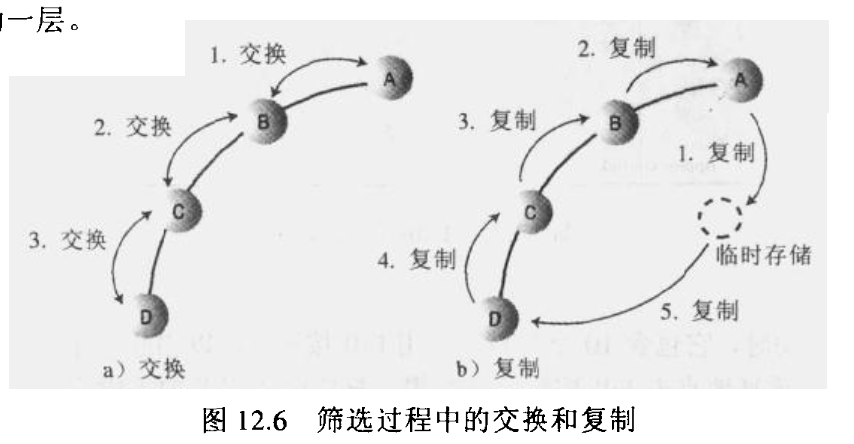
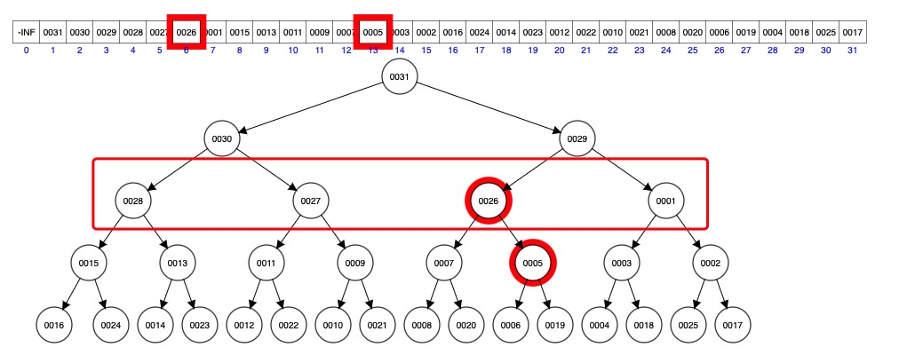

# Heap

## 使用场景

* 优先级队列（一般使用小顶堆）
* 堆排序 （一般使用大顶堆）
* 任务调度
* [数组中的第 K 个最大元素](https://leetcode-cn.com/problems/kth-largest-element-in-an-array/)

## 堆排序优点

### 时间空间复杂度

* `merge sort`时间负责度;
* `insertion sort`空间复杂度。

## 堆特点

* 完全二叉树（除了数组的最后一层节点不需要是满的）;
* 使用数组实现;

::: center

图来自《算法导论》
:::

* 无须`left right`指针保存孩子节点，使用规约维持关系;
  * `PARENT(i) = Array[i/2]`
  * `LEFT(i) = Array[2*i]`
  * `RIGH(i) = Arriy[2*i+1]`
* 插入和删除节点复杂度`O(lgn)`。

::: tip 提示
根的位置为索引 0 或 1处，这是两种实现方案。
:::

## 二叉树搜索树区别

* 相同点
  + 父节点大于/小于子节点；
* 不同点
  + 使用规约代替指针维持关系；
  + 弱序，同一父亲兄弟节点大小关系不定；
  + 不支持遍历，想要获取数据只能一一推出，弱序决定的。

## 核心功能

### 下沉

1. 删除元素
   * 删除第 0 个元素，所有数据全部向前移动
   * 删除第 0 个元素，并将最后一个数据放置到索引 0 处，进行下沉
2. 进行下沉的示意图

### 上浮

1. 在插入时候进行上浮，只需要与父亲节点进行比较，比较简单

2. 插入元素使用交换还是移动，交换的方式比较容易理解，而移动的方式性能比较高，移动的更少，由于`PriorityQueue`是由`Josh Bloch, Doug Lea`两位大神写的，而且是基础包，性能优先。
3. 交换还是移动，请参考[Java 数据结构和算法 P456](https://book.douban.com/subject/1144007/)

### 堆化

1. 数组中填充了数据，这个时候需要堆话` heapify(); `，按照层级从最后一层父节点开始下沉，推荐使用[堆工具](https://www.cs.usfca.edu/~galles/visualization/Heap.html)，`BuildHeap`，并且放慢 Speed。
2. 先下沉最后一层父节点

3. 在下沉倒数二次父亲节点

## 源码

* [Java版本](../../../languages/java/heap-java.md)
* [Go版本](../../../languages/go/heap-go.md)

## 参考资料

* [《算法导论（原书第3版）》](https://book.douban.com/subject/20432061/)
* [Java 数据结构和算法](https://book.douban.com/subject/1144007/)
* [算法（第 4 版）](https://book.douban.com/subject/19952400/)
* [堆工具](https://www.cs.usfca.edu/~galles/visualization/Heap.html)
