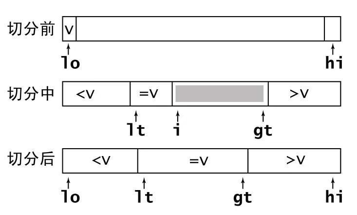

# 荷兰国旗

## [原题](https://leetcode-cn.com/problems/sort-colors/)

给定一个包含红色、白色和蓝色，一共 n 个元素的数组，原地对它们进行排序，使得相同颜色的元素相邻，并按照红色、白色、蓝色顺序排列。

此题中，我们使用整数 0、 1 和 2 分别表示红色、白色和蓝色。

::: tip 提示

* 来源：力扣（LeetCode）
* 链接：<https://leetcode-cn.com/problems/sort-colors>
* 著作权归领扣网络所有。商业转载请联系官方授权，非商业转载请注明出处。
:::

## 算法4

* Dijkstra的解法如“三向切分的快速排序”中极为简洁的切分代码所示。
  + 它从左到右遍历数组一次
  + 维护一个指针lt使得a[lo..lt-1]中的元素都小于v
  + 一个指针gt使得a[gt+1..hi]中的元素都大于v
  + 一个指针i使得a[lt..i-1]中的元素都等于v
  + a[i..gt]中的元素都还未确定

如图所示。一开始i和lo相等，我们使用Comparable接口（而非less()）对a[i]进行三向比较来直接处理以下情况：



* a[i]小于v，将a[lt]和a[i]交换，将lt和i加一；
  + 因为数据小于v，直接将数据放到[lo..lt-1]区域
  + lt索引增加，i索引增加相当于窗口向后滑动一个位置
* a[i]大于v，将a[gt]和a[i]交换，将gt减一；
  + 因为当前a[i]大于v，所以将当前元素交换到[gt+1..hi]
  + 被交换过来的元素因为没有进行任何比较，这时候可能会出现三种结果，仍然大于a[i]，等于a[i]，小于a[i]，所以在i位置进行新的一轮比较
* a[i]等于v，将i加一。
  + 因为这里a[i] = v，所以校验元素和特定值相等，所以这里只需要将索引向后走一步

## 代码

```Go

func sortColors(nums []int) {
  sortCol(nums, 0, len(nums)-1)
}

func sortCol(nums []int, low, high int) {
  if low >= high {
    return
  }
  // 先设置小于区域
  lowIndex := low
  // 在设置index，其实这个index可以等于low,等于low,多一次循环走index++
  index := low + 1
  // 大于区域
  highIndex := high
  // 使用第一个元素为对比数据
  compareV := nums[low]
  for index <= highIndex {
    // 如果当前元素大于对比元素，将index放到[lo..lt-1]
    if nums[index] < compareV {
      nums[lowIndex], nums[index] = nums[index], nums[lowIndex]
      lowIndex++
      index++
    } else if nums[index] > compareV {
      // 如果当前元素大于对比元素，将index放到[gt+1..hi]
      // 被交换过来的元素因为还是一个？，所以需要在此index在走一遍
      nums[index], nums[highIndex] = nums[highIndex], nums[index]
      highIndex--
    } else {
      // 等于元素，直接index++
      index++
    }
  }
  sortCol(nums, low, lowIndex-1)
  sortCol(nums, highIndex+1, high)
}

```

## 错误案例

1. 在编写代码时候没有对左边和右边在进行处理，导致`[2,0,2,1,1,0]`排序后出现了`[0 1 1 0 2 2]`结果，所以对原数据排序后需要对`lowIndex-1`和`highIndex+1`重复上面处理。
