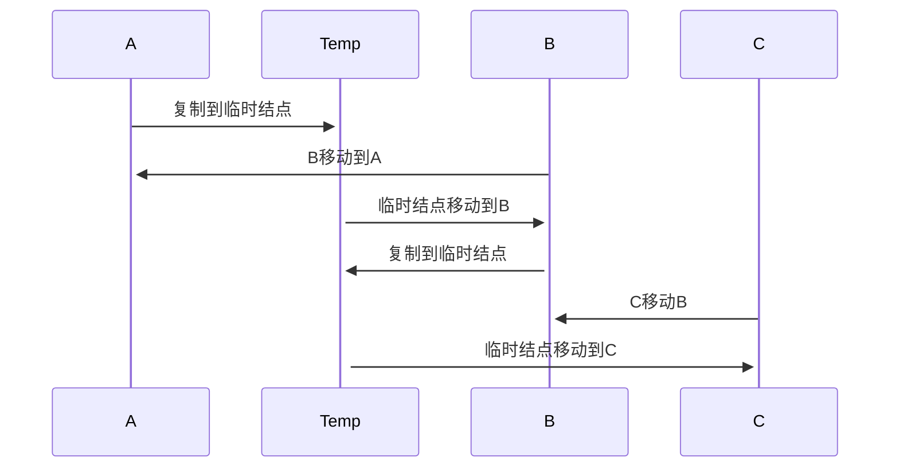
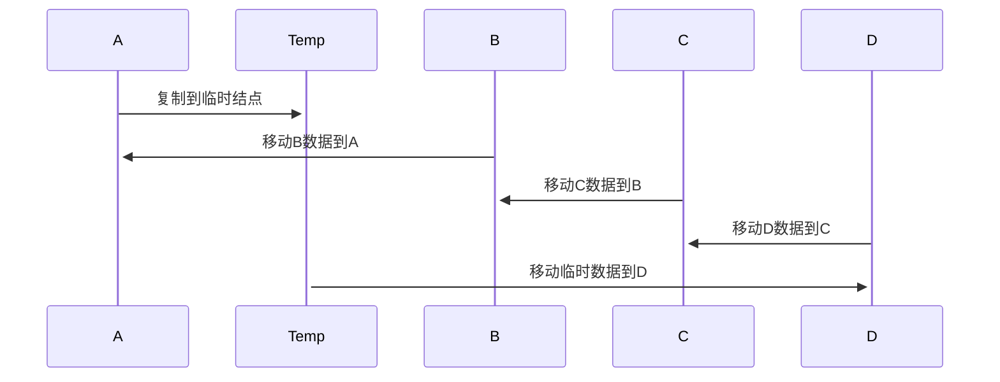

# 交换还是移动？

## 交换

数据交换最常用、简单的交换方式就是使用临时变量，对象和内置数据都可使用，如果需要交换的数据是内置数据（非引用），可以使用[异或交换](/basic-skill/algorithms/other/xor.md)进行交换，以达到节省空间目的。

::: center



数据处理流程如图所示
:::

### 优点

易理解、易维护，具体参考[Go-heap-h.Swap(i, j)](https://cs.opensource.google/go/go/+/refs/tags/go1.17.8:src/container/heap/heap.go)代码。

```Go
func up(h Interface, j int) {
  for {
    i := (j - 1) / 2 // parent
    if i == j || !h.Less(j, i) {
      break
    }
    // 使用交换原则
    h.Swap(i, j)
    j = i
  }
}
```

[《算法4》](https://algs4.cs.princeton.edu/24pq/Heap.java.html)一书也是方便大家理解，默认使用了交换原则。

```java
public static void sort(Comparable[] pq) {
    int n = pq.length;
    // 堆化
    for (int k = n/2; k >= 1; k--)
        sink(pq, k, n);
    int k = n;
    while (k > 1) {
        // 进行交换
        exch(pq, 1, k--);
        sink(pq, 1, k);
    }
}
// 三方变量
private static void exch(Object[] pq, int i, int j) {
    Object swap = pq[i-1];
    pq[i-1] = pq[j-1];
    pq[j-1] = swap;
}
```

### 缺点

性能低，n个元素交换，使用三方变量会进行 3(n-1）赋值，使用异或交换有需要 2(n-1）赋值。

## 移动

::: center



数据（非对象类型）处理流程如图所示
:::

先移动其他数据到正确位置，在放置需要排序的数据

### 优点

性能高，数据交换、赋值次数少，使用 n+1次移动。

### 缺点

代码理解负责，维护成本高。

```java
public class PriorityQueue<E> extends AbstractQueue<E>
    implements java.io.Serializable {

  private void siftDownComparable(int k, E x) {
      Comparable<? super E> key = (Comparable<? super E>)x;
      int half = size >>> 1;        // loop while a non-leaf
      // 先移动数据
      while (k < half) {
          // 假定只有左孩子
          int child = (k << 1) + 1; // assume left child is least
          Object c = queue[child];
          int right = child + 1;
          // 如果有右孩子，并且右孩子还小于左孩子
          if (right < size &&
              // 弱序性
              ((Comparable<? super E>) c).compareTo((E) queue[right]) > 0)
              c = queue[child = right];
          if (key.compareTo((E) c) <= 0)
              break;
          // 移动策略
          queue[k] = c;
          k = child;
      }
      // 放到正确位置
      queue[k] = key;
  }
}
```

## 总结

如果项目没有特别高性能要求，建议使用交换编写代码，后期维护成本低。
