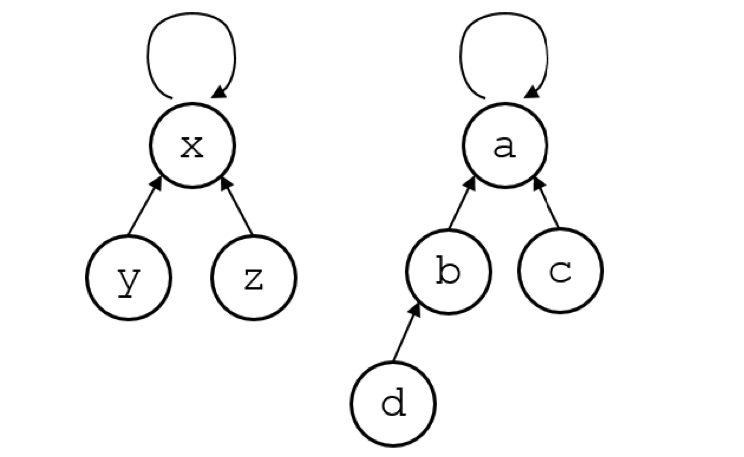
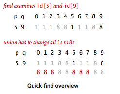
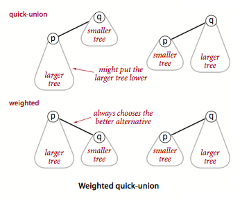

# 并查集

## 概念

* 用于存储不相交的集合
* 可以高效支持两种操作
  * `Find(x)`：返回 x 所属集合的“代表”
  * `Union(x, y)`: 合并包含 x 和 y 的两个集合
* 两种操作都可以在常量时间内完成
* 简单实现
* 主要思想：用有根树表示每个集合
  * 每个节点都维护着一个到它的父节点的链接
  * 根节点是对应集合的“代表”
  * 例如: 两个集合`{x, y, z}` and `{a, b, c, d}`


### 代码实现

```java
int Find(int x) {
    // 自己不是根节点，递归查找
    while(x != L[x]) x = L[x];
    return x;
}
void Union(int x, int y) {
    // 直接连接
    L[Find(x)] = Find(y);
}
```

## Find(x)

1. 跟随从 x 的连接直到一个节点指向自己，这可能需要 O(n) 时间，但我们会让它更快

2. [Quick-find](https://algs4.cs.princeton.edu/15uf/QuickFindUF.java.html)，在查找时候直接返回`id[p]`

```java
public class QuickFindUF {
    private int[] id;    // id[i] = component identifier of i
    private int count;   // number of components
    // 其他省略
    public int find(int p) {
        validate(p);
        return id[p];
    }

    public void union(int p, int q) {
      validate(p);
      validate(q);
      int pID = id[p];   // needed for correctness
      int qID = id[q];   // to reduce the number of array accesses

      // p and q are already in the same component
      if (pID == qID) return;

      for (int i = 0; i < id.length; i++)
          // 这里性能比较低，需要全部都修改
          if (id[i] == pID) id[i] = qID;
      count--;
  }
}
```

## Union(x, y)

1. 运行 Find(x) 和 Find(y) 以找到对应的根节点并将一个指向另一个

2. [Quick-union](https://algs4.cs.princeton.edu/15uf/QuickUnionUF.java.html)

```java
public class QuickUnionUF {
  private int[] parent;  // parent[i] = parent of i
  private int count;     // number of components

  public void union(int p, int q) {
    int rootP = find(p);
    int rootQ = find(q);
    if (rootP == rootQ) return;
    // 这里只变更了一个节点，所以需要变更的是根节点
    parent[rootP] = rootQ;
    count--;
  }

  public int find(int p) {
      validate(p);
      while (p != parent[p])
          p = parent[p];
      return p;
    }
}
```

## Weighted quick-union

1. 主要是将小子树挂到大子树上面

1. [代码](https://algs4.cs.princeton.edu/15uf/WeightedQuickUnionUF.java.html)实现

```java
public class WeightedQuickUnionUF {
  private int[] parent;   // parent[i] = parent of i
  private int[] size;     // size[i] = number of elements in subtree rooted at i
  private int count;      // number of components

  public int find(int p) {
    validate(p);
    while (p != parent[p])
        p = parent[p];
    return p;
  }

  public void union(int p, int q) {
    int rootP = find(p);
    int rootQ = find(q);
    if (rootP == rootQ) return;
    // 让小节点挂在到大节点上
    // make smaller root point to larger one
    if (size[rootP] < size[rootQ]) {
        parent[rootP] = rootQ;
        size[rootQ] += size[rootP];
    }
    else {
        parent[rootQ] = rootP;
        size[rootP] += size[rootQ];
    }
    count--;
  }
}
```

## Path Compression

* 在糟糕的情况下，树可能会变得太深
  * 这会减慢未来的运行速度
* 每次调用`Find()` 时，路径压缩都会使树变浅
* 只要根保持不变，我们不在乎树的样子
  * `Find(x)`返回根后，回溯到 x 并将所有链接重新路由到根

### Path-Compression实现

我们将假设链接存储在 L[]

```java
int Find(int x) {
    if(x == L[x]) return x;
    int root = Find(L[x]);
    // 路径压缩
    L[x] = root;
    return root;
}
int Find(int x) {
    return x == L[x] ? x : L[x] = Find(L[x]);
}
```

### Java代码下载

* 下载[算法4 jar包](https://algs4.cs.princeton.edu/code/)
  * [UF](https://algs4.cs.princeton.edu/code/edu/princeton/cs/algs4/UF.java.html)
* [maven下载](https://mvnrepository.com/artifact/edu.princeton.cs/algs4/1.0.4)

```java
<!-- https://mvnrepository.com/artifact/edu.princeton.cs/algs4 -->
<dependency>
    <groupId>edu.princeton.cs</groupId>
    <artifactId>algs4</artifactId>
    <version>1.0.4</version>
</dependency>
```

#### 通用代码

1. 设计数据结构

```java
public class UF {
    private int[] parent;  // parent[i] = parent of i
    private byte[] rank;   // rank[i] = rank of subtree rooted at i (never more than 31)
    private int count;
}
```

2. 初始化数据

```java
public UF(int n) {
    if (n < 0) throw new IllegalArgumentException();
    count = n;
    parent = new int[n];
    rank = new byte[n];
    for (int i = 0; i < n; i++) {
        // 自己指向自己
        parent[i] = i;
        rank[i] = 0;
    }
}
```

3. 可以忽略不重要代码

```java
// 判断索引
private void validate(int p) {
    int n = parent.length;
    if (p < 0 || p >= n) {
        throw new IllegalArgumentException("index " + p + " is not between 0 and " + (n-1));
    }
}
```

#### Find(x)代码

```java
/**
* Returns the component identifier for the component containing site {@code p}.
*
* @param  p the integer representing one site
* @return the component identifier for the component containing site {@code p}
* @throws IllegalArgumentException unless {@code 0 <= p < n}
*/
public int find(int p) {
  // 校验索引
  validate(p);
  // 如果当前元素的父亲不是自己，继续查找
  while (p != parent[p]) {
      // 路径压缩
      parent[p] = parent[parent[p]];    // path compression by halving
      p = parent[p];
  }
  // 找到了根节点
  return p;
}
```

#### Union(x, y)代码

```java
/**
* Merges the component containing site {@code p} with the
* the component containing site {@code q}.
*
* @param  p the integer representing one site
* @param  q the integer representing the other site
* @throws IllegalArgumentException unless
*         both {@code 0 <= p < n} and {@code 0 <= q < n}
*/
public void union(int p, int q) {
  // 查找p的根
  int rootP = find(p);
  // 查找q的根
  int rootQ = find(q);
  // 如果相等，已经连接过了
  if (rootP == rootQ) return;

  // 集合数量多的不变，少的将父亲指向多的
  // make root of smaller rank point to root of larger rank
  if      (rank[rootP] < rank[rootQ]) parent[rootP] = rootQ;
  else if (rank[rootP] > rank[rootQ]) parent[rootQ] = rootP;
  else {
      // 子树数量相等
      parent[rootQ] = rootP;
      // 等级+1
      rank[rootP]++;
  }
  // 集合数量减1
  count--;
}
```

### [Go实现](https://github.com/sona0402/leetcode/blob/master/src/structure/UF.go)

1. 创建数据结构

```Go
type UF struct {
  parent, rank []int
  nComponents  int
}
```

2. 初始化数据结构

```Go
func newUF(initSize int) *UF {
  // 初始化数据结构
  uf := &UF{
    parent:      make([]int, initSize),
    rank:        make([]int, initSize),
    nComponents: initSize,
  }
  // 子树等级初始化
  for index := range uf.rank {
    uf.rank[index] = 0
  }
  // 自己的父亲指向自己
  for index := range uf.parent {
    uf.rank[index] = index
  }
  return uf
}
```

3. Find(x)

```Go
func (uf *UF) find(item int) int {
  for item != uf.parent[item] {
    // 路径压缩
    uf.parent[item] = uf.parent[uf.parent[item]]
    // 向上走
    item = uf.parent[item]
  }
  return item
}
```

4. Union(x, y)

```Go
func (uf *UF) merge(p, q int) {
  // 查找p的根
  rootP := uf.find(p)
  // 查找q的根
  rootQ := uf.find(q)
  // 已经在一个集合里面了
  if rootQ == rootP {
    return
  }
  subTreeP := uf.rank[rootP]
  subTreeQ := uf.rank[rootQ]
  if subTreeP < subTreeQ {
    uf.parent[rootP] = rootQ
  } else if subTreeP > subTreeQ {
    uf.parent[rootQ] = rootP
  } else {
    // 子树等级相同，使用那个都行
    // uf.parent[rootP]  = rootQ
    // uf.parent[rootQ]  = rootP
    uf.parent[rootQ] = rootP
    uf.rank[rootP]++
  }
  // 集合个数减少一个
  uf.nComponents--
}
```

## 总结

* 核心思想为树，查找根节点
* 使用位运算也可以进行处理，例如[Go程序设计语言 6.5 位向量](https://book.douban.com/subject/27044219/)[代码](https://github.com/sona0402/go-study/blob/dev/ch06/intset/intset.go)

## 参考材料

* [《算法4》 Union-Find](https://algs4.cs.princeton.edu/15uf/)
* [《算法导论》 21章](https://book.douban.com/subject/20432061/)
* [《Go程序设计语言》 6.5 位向量](https://book.douban.com/subject/27044219/)
* [CS 97SI-Data Structures](https://web.stanford.edu/class/cs97si/03-data-structures.pdf)
* [Data Structures Easy to Advanced Course - Full Tutorial from a Google Engineer](https://www.youtube.com/watch?v=RBSGKlAvoiM)
