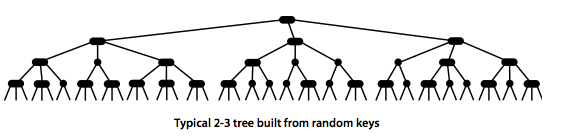

# [2-3-搜索树](https://algs4.cs.princeton.edu/33balanced/)

<!-- We introduce in this section a type of binary search tree where costs are guaranteed to be logarithmic. Our trees have near-perfect balance, where the height is guaranteed to be no larger than 2 lg N. -->
在本节中，我们将介绍一种二叉搜索树，其中成本保证为对数。我们的树具有近乎完美的平衡，高度保证不超过2 lg N

### 2-3 search trees

<!-- The primary step to get the flexibility that we need to guarantee balance in search trees is to allow the nodes in our trees to hold more than one key. -->

要获得保证搜索树平衡所需的灵活性，主要步骤是允许树中的节点持有多个key
<!-- Definition. A 2-3 search tree is a tree that either is empty or
A 2-node, with one key (and associated value) and two links, a left link to a 2-3 search tree with smaller keys, and a right link to a 2-3 search tree with larger keys
A 3-node, with two keys (and associated values) and three links, a left link to a 2-3 search tree with smaller keys, a middle link to a 2-3 search tree with keys between the node's keys and a right link to a 2-3 search tree with larger keys. -->

定义一个2-3搜索树是一棵树或者是空的

* 一个2节点，具有一个键（和相关值）和两个链接，左链接到具有较小键的2-3搜索树，右链接到具有较大键的2-3搜索树
* 一个3节点，具有两个键（和关联值）和三个链接，左链接到具有较小键的2-3搜索树，中间链接到具有节点键之间键的2-3搜索树，右链接到具有较大键的2-3搜索树。
::: center

:::
<!-- A perfectly balanced 2-3 search tree (or 2-3 tree for short) is one whose null links are all the same distance from the root. -->

一个完全平衡的2-3搜索树（简称2-3树）是指其空链接距离根相同的树。
<!-- Search. To determine whether a key is in a 2-3 tree, we compare it against the keys at the root: If it is equal to any of them, we have a search hit; otherwise, we follow the link from the root to the subtree corresponding to the interval of key values that could contain the search key, and then recursively search in that subtree. -->

* 搜索，为了确定一个键是否在2-3树中，我们将它与根上的键进行比较：如果它等于其中任何一个，我们就有一个搜索命中；否则，我们遵循从根到子树的链接，该子树对应于可能包含搜索键的键值间隔，然后在该子树中递归搜索。
::: center

:::
* 插入到2节点中。要在2-3树中插入一个新节点，我们可能会执行一次不成功的搜索，然后在底部的节点上挂接，就像我们在BST中所做的那样，但新树不会保持完全平衡。如果搜索终止的节点是2节点，则很容易保持完美平衡：我们只需将节点替换为包含其key和要插入的key的3节点。
::: center

:::
* 插入到由单个3节点组成的树中。假设我们想插入一个只有一个3节点的2-3树。这样的树有两个键，但在其一个节点中没有空间放置新键。为了能够执行插入，我们临时将新键放入一个4节点，这是节点类型的自然扩展，具有三个键和四个链接。创建4节点很方便，因为很容易将其转换为由三个2节点组成的2-3树，一个具有中间键（在根处），一个具有三个键中最小的键（由根的左链接指向），另一个具有三个键中最大的键（由根的右链接指向）。
::: center

:::
* 插入到其父节点为2节点的3节点中。假设搜索结束于底部的3节点，其父节点为2节点。在这种情况下，我们仍然可以为新的关键点腾出空间，同时保持树中的完美平衡，方法是创建一个临时的4节点（如前所述），然后拆分4节点（如前所述），但不创建一个新节点来保存中间关键点，而是将中间关键点移动到父节点。
::: center

:::
* 插入到其父节点为3节点的3节点中。现在假设搜索在其父节点为3节点的节点处结束。同样，我们创建了一个临时的4节点，如前所述，然后将其拆分并将其中间键插入父节点。父节点是一个3节点，因此我们将其替换为一个临时的新4节点，其中包含来自4节点拆分的中间键。然后，我们在该节点上执行完全相同的转换。也就是说，我们拆分新的4节点，并将其中间键插入其父节点。扩展到一般情况是很清楚的：我们继续沿着树向上，拆分4个节点并将它们的中间键插入它们的父节点，直到到达2个节点，我们将其替换为不需要进一步拆分的3个节点，或者直到到达根节点的3个节点。
::: center

:::
* 切根。如果在从插入点到根的整个路径上有3个节点，那么最终在根上有一个临时4节点。在本例中，我们将临时4节点拆分为三个2节点。
::: center

:::
* 局部变换。2-3树插入算法的基础是所有这些转换都是纯局部的：除了指定的节点和链接之外，不需要检查或修改2-3树的任何部分。每个变换更改的链接数由一个小常量限定。每个转换都会将一个关键点从4节点向上传递到树中的父节点，然后相应地重新构造链接，而不会触及树的任何其他部分。

* 全局属性。这些局部转换保留了树的有序和平衡的全局属性：从根到任何空链接的路径上的链接数是相同的。

提议。在具有N个键的2-3树中的搜索和插入操作保证最多访问lgn个节点。
::: center

:::
然而，我们只是实现的一部分。尽管可以编写代码，在表示2节点和3节点的不同数据类型上执行转换，但我们所描述的大多数任务都不便于在这种直接表示中实现。

#### 代码

::: tip 提示
代码出自[Java数据结构和算法](https://book.douban.com/subject/1144007/)
:::

1. 自定义数据

```go
// DataItem 定义一个内部数据
type DataItem struct {
 val int
}
// 打印数据时候使用
func (i *DataItem) display() {
 fmt.Println(i.val)
}
```

2. 定义node节点和相应功能

```go
// TreeNode node节点
type TreeNode struct {
 numItems   int
 parent     *TreeNode
 childArray [order]*TreeNode
 dataItems  [order - 1]*DataItem
}

// 连接一个子节点
func (r *TreeNode) connectionChild(childNum int, child *TreeNode) {
 r.childArray[childNum] = child
 if nil != child {
  child.parent = r
 }
}

// 删除一个子节点
func (r *TreeNode) disConnectionChild(childNum int) *TreeNode {
 node := r.childArray[childNum]
 r.childArray[childNum] = nil
 return node
}

// 获取第n个位置的孩子
func (r *TreeNode) getChild(childNum int) *TreeNode {
 return r.childArray[childNum]
}

// 获取父亲
func (r *TreeNode) getParent() *TreeNode {
 return r.parent
}

// 是否为叶子节点
func (r *TreeNode) isLeaf() bool {
 return r.childArray[0] == nil
}

// 是否满了
func (r *TreeNode) isFull() bool {
 return r.numItems == (order - 1)
}

// 获取节点数量
func (r *TreeNode) getNumItems() int {
 return r.numItems
}

// 获取节点数据
func (r *TreeNode) getDataItem(index int) *DataItem {
 return r.dataItems[index]
}

// 查找元素
func (r *TreeNode) findItem(key int) int {
 for i := 0; i < order-1; i++ {
  // 如果这里还没有填充跳过
  if r.dataItems[i] == nil {
   break
   // 如果数组中有一个值等于key,返回位置
  } else if r.dataItems[i].val == key {
   return i
  }
 }
 // 没有找到相等的
 return -1
}

func (r *TreeNode) insertDataItem(newItem *DataItem) int {
 // 增加一个元素
 r.numItems++
 // 元素的key
 newVal := newItem.val
 // 从右边开始
 for j := order - 2; j >= 0; j-- {
  // 还没插入元素，因为这里如果是一个4节点的树，也就是0，1，2，3肯定会分裂，所以这里的树只可能到0，1，2
  if r.dataItems[j] == nil {
   continue
  } else {
   // 拿到最后当前数值
   v := r.dataItems[j].val
   // 还没找到正确位置，后面元素肯定比现在都大，向后移动
   if newVal < v {
    r.dataItems[j+1] = r.dataItems[j]
   } else {
    // 现在j+1已经被移动到了j+2
    // 现在j比当前元素小，插入到j+1
    r.dataItems[j+1] = newItem
    return j + 1
   }
  }
 }
 // 没找到大于newItem位置，则插入到0位置
 r.dataItems[0] = newItem
 return 0
}

// 删除最大元素
func (r *TreeNode) removeDataItem() *DataItem {
 // 查找最大元素
 item := r.dataItems[r.numItems-1]
 // 删除引用
 r.dataItems[r.numItems-1] = nil
 // 元素个数减少
 r.numItems--
 // 返回被移除的元素
 return item
}

func (r *TreeNode) displayNode() {
 for j := 0; j < r.numItems; j++ {
  r.dataItems[j].display()
  fmt.Println("/")
 }
}
```

3. 查找元素

```go
type Tree234 struct {
 root *TreeNode
}

func (t Tree234) find(key int) int {
 // 先拿到根节点
 currentNode := t.root
 // 先设置未找到
 childNumber := -1
 for true {
  // 从当前节点查找所有的item是否包含值
  childNumber = currentNode.findItem(key)
  // 找到了返回位置
  if childNumber != -1 {
   return childNumber
   // 如果是叶子节点，肯定不包含
  } else if currentNode.isLeaf() {
   return -1
  } else {
   // 找到下一个节点，然后在继续判断，也就是节点引用
   currentNode = t.getNextNode(currentNode, key)
  }
 }
 return childNumber
}

func (t Tree234) getNextNode(node *TreeNode, key int) *TreeNode {
 i := 0
 // 所有的元素
 items := node.getNumItems()
 //  开始迭代，找到大于key的第一个节点，也就是最左边节点
 for i := 0; i < items; i++ {
  if key < node.dataItems[i].val {
   return node.getChild(i)
  }
 }
 // 走到这里说明全部走完，返回最右边的节点
 return node.getChild(i)
}
```

4. 插入元素

```go
func newDataItem(key int) *DataItem {
 return &DataItem{
  val: key,
 }
}

func (t Tree234) insert(key int) {
 // 设置根节点
 currentNode := t.root
 // 创建一个数据节点
 item := newDataItem(key)
 for true {
  // 如果已经满了
  if currentNode.isFull() {
   // 分裂节点
   t.spilt(currentNode)
   // 找到父亲
   parent := currentNode.getParent()
   // 找到正确节点
   currentNode = t.getNextNode(parent, key)
  } else if currentNode.isLeaf() {
   // 叶子节点，跳出
   break
  } else {
   currentNode = t.getNextNode(currentNode, key)
  }
 }
 // 当前节点插入数据
 currentNode.insertDataItem(item)
}

func (t *Tree234) spilt(node *TreeNode) {
 itemIndex := 0
 // 拿到最右边的数据
 itemC := node.removeDataItem()
 // 中间节点数据
 itemB := node.removeDataItem()
 // 右边数据的两个链接，这两个连接需要放到新node上
 child2 := node.disConnectionChild(2)
 child3 := node.disConnectionChild(3)
 // 创建新的节点
 newRight := newTreeNode()
 parent := node
 if node == t.root {
  // 创建新root
  t.root = newTreeNode()
  parent = t.root
  // 当前节点放到最左节点上，根节点与普通节点区别就是root设置和需要将当前节点放到最左边
  t.root.connectionChild(0, node)
 } else {
  parent = node.getParent()
 }
 // 中间数据上浮上去，这里itemIndex可能等于1或者2
 itemIndex = parent.insertDataItem(itemB)
 // 总元素数量
 items := parent.getNumItems()
 // 如果新插入的元素插入到了中间位置
 for j := items - 1; j > itemIndex; j-- {
  // 后面位置链接的数据需要向后移动
  temp := parent.disConnectionChild(j)
  parent.connectionChild(j+1, temp)
 }
 // 新节点，在其父亲的itemIndex+1处
 parent.connectionChild(itemIndex+1, newRight)
 // 新节点增加数据
 newRight.insertDataItem(itemC)
 // 连接数据
 newRight.connectionChild(0, child2)
 newRight.connectionChild(1, child3)
}

```

### 总结

1. 如果需要插入数据分配到叶子节点并且没有满的话，没有连接，直接插入数据即可
2. 如果需要插入数据分配到不是叶子节点的话，继续递归下去找到叶子节点
3. 如果在递归查找过程中遇到满节点，需要分裂
   1. 如果分裂的不是根节点
      1. 创建新节点，将最右边的数据和连接移动到新节点
      2. 将中间数据插入到父节点
      3. 最左侧节点保持不动
   2. 如果分裂的不是根节点
      1. 创建新的节点1，并将根节点指向新节点1
      2. 将当前节点放到根节点左边
      3. 创建新节点2，将最右边的数据和连接移动到新节点2
      4. 将中间数据插入到父节点
