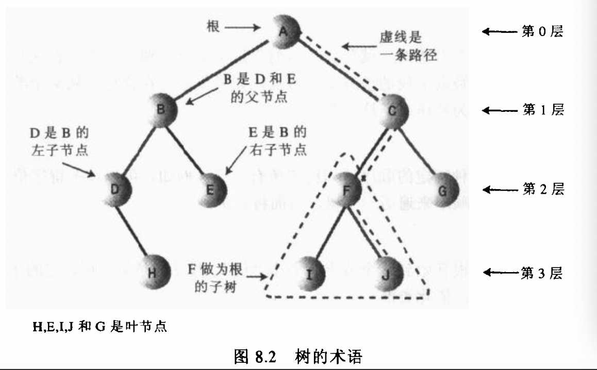

# 二叉树

::: tip 提示
本文主要是梳理概念，学习和加深印象使用，参考[Java数据结构和算法](https://book.douban.com/subject/1144007/)
:::

### 数组

1. 有序数组
   * [二分查找法](../other/binary-Search.md)可以快速查找特定值，查找时间复杂度为O(logN)
   * 插入时间复杂度为O(N)

### 链表

1. 链表
   * 查找时间复杂度为O(N)
   * 插入和删除时间复杂度为O(1)

### 树

1. Q: 有没有插入像链表一样快，查找像数组一样快？
   A: 树
2. 圆代表节点
3. 链接圆的直线代表边
:::center

:::

### 术语

:::center

:::

#### 路径

顺着链接节点的边从一个节点走到另外一个节点，所经过的节点的顺序就称之为“路径”

#### 根

树顶的节点称为“根”，一棵树只有一个根

#### 父节点

每个节点（除了根）都恰好有一条边向上连接到另外一个节点，上面的这个节点就称为下面节点的“父亲节点”

#### 子节点

每个节点都可能有一条或多条边向下连接到其他节点，下面的这些节点就称为它的“子节点”

#### 叶节点

没有子节点的节点称为“叶子节点”或简称“叶节点”，树中只有一个根，但是可以有很多叶子节点

#### 子树

每个节点都可以作为“子树”的根，它和它的所有子节点，子节点的子节点等都含在子树中。

#### 访问

当程序控制流程到达某个节点时，就称为“访问”这个节点，通常是为了在这个节点处执行某种操作，例如查看节点某个数据字段的值或显示节点，如果仅仅是在路径上从某个节点到另外一个节点时经过了一个节点，不认为是访问了这个节点

#### 遍历

遍历树意味着要遵循某种特定顺序访问树中的所有节点。

* 前序遍历(头，左，右)
* 中序遍历(左，头，右)
* 后序遍历(左，右，头)

#### 层

一个节点的层数是指从根开始到这个节点有多少代，假设根是第0层，它的子节点就是1层，它的孙节点就是第二层。

#### 关键字

对象中通常会有一个数据域被指定为关键字，这个值用于查询或其他操作。在树的图形中，如果用圆代表数据项的节点，那么一般将这个数据项的关键字值显示在这个圆中。

这句话写的比较困惑，直接上代码 `TreeMap#Entry` :

```java
 static final class Entry<K,V> implements Map.Entry<K,V> {
        // 关键字
        K key;
        // 保存的值
        V value;
        Entry<K,V> left;
        Entry<K,V> right;
        Entry<K,V> parent;
        boolean color = BLACK;
    // ......
 }
```

#### 二叉树

每个节点都最多只能有两个子节点，这样的树被称为“二叉树”，二叉树每个节点的两个子节点称为“左子节点”和“右子节点”。

* 没有子节点
* 有“左子节点”和“右子节点”
* 有“左子节点”无“右子节点”
* 有“右子节点”无“左子节点”

#### 二叉搜索树

一个节点的左子节点关键字小于当前节点关键字，右子节点关键字大于当前节点关键字

### 代码及部分简单代码

1. 二叉树的数据结构

```go
type BinaryTree struct {
  // key
  key   int
  value int

  // 左节点
  leftNode *BinaryTree
  // 右几点
  rightNode *BinaryTree
}

```

2. 生成一个节点

```go
func newBinaryTree(key, value int, left, right *BinaryTree) *BinaryTree {
  return &BinaryTree{
    key:       key,
    value:     value,
    leftNode:  left,
    rightNode: right,
  }
}
```

3. 插入节点

```go
// 使用递归方式进行插入节点
func insert(head *BinaryTree, key, value int) *BinaryTree {
  // 如果下面节点为空产生一个新节点
  if nil == head {
    head = newBinaryTree(key, value, nil, nil)
  }
  // 如果存在节点，更新value，暂时不支持多个key相同
  if head.key == key {
    head.value = value
  } else if head.key < key {
    // 如果当前key小于需要插入的数据，则一定在当前节点的右节点
    head.rightNode = insert(head.rightNode, key, value)
  } else {
     // 如果当前key大于需要插入的数据，则一定在当前节点的左节点
    head.leftNode = insert(head.leftNode, key, value)
  }
  return head
}

// 使用循环方式查询节点 loop
func insertWithLoop(head *BinaryTree, key, value int) *BinaryTree {
  // 头节点为空，则创建一个新节点
  if nil == head {
    head = newBinaryTree(key, value, nil, nil)
    return head
  }
  current := head
  // 当前值与key不一致，一直循环
  for current.key != key {
    // 当前节点小于key，则向右节点走
    if current.key < key {
      // 右孩子不为空，拿右孩子对比
      if current.rightNode != nil {
        current = current.rightNode
      } else {
        // 右孩子为空，新节点为当前节点右孩子
        current.rightNode = newBinaryTree(key, value, nil, nil)
        return current
      }
      // 当前节点大于key，则向左节点走
    } else if current.key > key {
      // 如果左孩子不为空，拿左孩子节点
      if current.leftNode != nil {
        current = current.leftNode
      } else {
        // 左孩子为空，新节点为当前孩子左孩子
        current.leftNode = newBinaryTree(key, value, nil, nil)
        return current
      }
    }
  }

  // 值一致，更新value
  current.value = value
  return current
}
```

4. 查找最小节点

```go
// 使用递归进行数据查询
func findMin(head *BinaryTree) *BinaryTree {
  // 头节点为空，直接返回空
  if head == nil{
    return nil
  }
   // 如果当前节点孩子左边不为空，继续递归
  if head.leftNode!=nil {
    return findMin(head.leftNode)
  }
   // 左孩子为空，返回当前节点
  return head
}

// 使用循环进行数据查询
func findMinWithLoop(head *BinaryTree) *BinaryTree {
  // 头节点为空
  if nil == head {
    return nil
  }
  // 当前节点设计为头
  current := head
  for current.leftNode != nil {
    // 左孩子不为空，一直设置左孩子
    current = current.leftNode
  }
  // 左孩子为空，返回当前节点
  return current
}
```

5. 查找最大元素

```go
func findMax(head *BinaryTree) *BinaryTree {
  if head == nil{
    return nil
  }
  if head.rightNode!=nil {
    return findMax(head.rightNode)
  }
  return head
}

func findMaxWithLoop(head *BinaryTree) *BinaryTree {
  if nil == head {
    return nil
  }
  current := head
  for current.rightNode != nil {
    current = current.rightNode
  }
  return current
}
```

#### 遍历

1. 遍历二叉树
   1. [前序遍历](./pre-order.md)
   2. 中序遍历（左，根，右）
        1. 调用当前节点左节点进行遍历
        2. 访问当前节点
        3. 调用当前节点的右节点进行遍历

```go
func inOrder(head *BinaryTree) {
  if nil == head {
    return
  }
  // 调用当前节点左节点进行遍历
  inOrder(head.leftNode)
  // 访问当前节点
  fmt.Printf("key:%d,value:%d\n", head.key, head.value)
  // 调用当前节点的右节点进行遍历
  inOrder(head.rightNode)
}
```

  3. 后续遍历（左，右，根）
    1. 调用当前节点左节点进行遍历
    2. 调用当前节点的右节点进行遍历
    3. 访问当前节点

```go
func postOrder(head *BinaryTree) {
  if nil == head {
    return
  }
  // 调用当前节点左节点进行遍历
  postOrder(head.leftNode)
  // 调用当前节点的右节点进行遍历
  postOrder(head.rightNode)
  // 访问当前节点
  fmt.Printf("key:%d,value:%d\n", head.key, head.value)
}
```

2. 使用循环方式遍历二叉树，因为这里需要一个辅助栈作为额外空间
   1. 栈数据代码

```go
// 创建一个栈
type Stack struct {
  // 使用切片进行存储
  e []*BinaryTree
}

func NewStack() *Stack {
  // 创建数据
  return &Stack{
    e: make([]*BinaryTree, 0),
  }
}
func (s *Stack) Len() int {
  // 栈的长度
  return len(s.e)
}

func (s *Stack) IsEmpty() bool {
  // 长度是不是为0
  return s.Len() == 0
}

func (s *Stack) Push(element *BinaryTree) bool {
  // 切片增加数据
  s.e = append(s.e, element)
  return true
}

func (s *Stack) Pop() *BinaryTree {
  if s.IsEmpty() {
    return nil
  }
  // 拿到切片最后一个数据
  length := s.Len() - 1
  result := s.e[length]
  // 切片缩小1个位置
  s.e = s.e[:length]
  return result
}

// 展示数据
func (s *Stack) Show() {
  for _, element := range s.e {
    fmt.Println(element)
  }
}

func (s *Stack) peek() *BinaryTree {
  if s.IsEmpty() {
    return nil
  }
  length := s.Len() - 1
  return s.e[length]
}

```

  2. 前序遍历

```go
func preOrderWithLoop(head *BinaryTree) {
  // 如果头节点为空，直接返回
  if nil == head {
    return
  }
  // 创建栈
  stack := NewStack()
  // 推入头
  stack.Push(head)
  // 栈不为空
  for !stack.IsEmpty() {
    // 打印根
    pop := stack.Pop()
    // 拿出根，直接打印
    fmt.Printf("key:%d,value:%d\n", pop.key, pop.value)
    // 先推入右
    if nil != pop.rightNode {
      stack.Push(pop.rightNode)
    }
    // 在推入左
    if nil != pop.leftNode {
      stack.Push(pop.leftNode)
    }
  }
}
```

  3. 中序遍历
     1. 判断条件，当前节点不为空，或者栈没空
     2. 先推入当前节点，在推入左节点
     3. 如果到了叶子节点一层，出栈顺序就成了左，根
     4. 在打印根节点，如果当前节点右右孩子节点，设置右孩子节点

```go
func inOrderWithLoop(head *BinaryTree) {
  current := head
  // 创建一个辅助栈
  stack := NewStack()
  // 当前节点不为空或者栈内有数据
  for current != nil || !stack.IsEmpty() {
    if current != nil {
      // 先推入根节点
      stack.Push(current)
      // 如果根节点的左孩子不为空，在推入左孩子节点，这样出栈的时候就成了左右
      current = current.leftNode
    } else {
      // 推出一个节点
      current = stack.Pop()
      // 先左后根
      fmt.Printf("key:%d,value:%d\n", current.key, current.value)
      current = current.rightNode
    }
  }
}
```

  4. 后序遍历，详解可以查看[《程序员代码面试指南：IT名企算法与数据结构题目最优解》](https://book.douban.com/subject/26638586/)

```go
func postOrderWithLoop(head *BinaryTree) {
  // 如果头节点为空，直接返回
  if nil == head {
    return
  }
  stack := NewStack()
  // 出栈 左 右 根
  resultStack := NewStack()
  // 推入头
  stack.Push(head)
  // 栈不为空
  for !stack.IsEmpty() {
    // 先从栈中拿到根
    pop := stack.Pop()
    // 将根推到结果
    // 在推的时候需要是右节点，所以第一个栈需要右节点先进栈
    // 在推的时候需要是左节点，所以第一个栈需要左节点后进栈
    resultStack.Push(pop)
    if nil != pop.leftNode {
      stack.Push(pop.leftNode)
    }
    // 在推入右
    if nil != pop.rightNode {
      stack.Push(pop.rightNode)
    }
  }
  for !resultStack.IsEmpty() {
    pop := resultStack.Pop()
    fmt.Printf("key:%d,value:%d\n", pop.key, pop.value)
  }
}

func postOrderWithLoopOneStack(head *BinaryTree) {
  if nil == head {
    return
  }
  // 辅助栈
  stack := NewStack()
  // 头推入
  stack.Push(head)
  // 当前节点
  current := head
  for !stack.IsEmpty() {
    // 拿到了根节点但是当前先不推出
    peekNode := stack.peek()
    //  这里判断左节点不为空的时候才处理
    //  为什么这里peekNode.leftNode != current，因为可能上一次推出的是左孩子节点，这里刚回到父亲在推入不出问题了吗
    //  为什么peekNode.rightNode != current，因为这里推完左孩子，已经处理右孩子，而且处理完右孩子，所以当前等于右孩子，如果不判断的话就重复推入左孩子了
    if peekNode.leftNode != nil && peekNode.leftNode != current && peekNode.rightNode != current {
      // 推入左孩子节点
      stack.Push(peekNode.leftNode)
    } else if peekNode.rightNode != nil && peekNode.rightNode != current {
      // 推入右孩子节点
      stack.Push(peekNode.rightNode)
    } else {
      pop := stack.Pop()
      fmt.Printf("key:%d,value:%d\n", pop.key, pop.value)
      current = peekNode
    }
  }
}
```

#### 删除节点

1. 删除节点为叶子节点

```go
func deleteKeyWithLoop(head *BinaryTree, key int) bool {
  current := head
  parent := head
  isLeftChild := true
  // 这里是查找key
  for key != current.key {
    parent = current
    if current.key > key {
      isLeftChild = true
      current = current.leftNode
    } else {
      isLeftChild = false
      current = current.rightNode
    }
    if current == nil {
      return false
    }
  }
  // 当前只删除了叶子节点
  if current.leftNode == nil && current.rightNode == nil {
    if current == head {
      head = nil
    } else if isLeftChild {
      parent.leftNode = nil
    } else {
      parent.rightNode = nil
    }
  }
  return true
}
```

2. 删除节点有一个子节点

```go
  // 因为已经找到了左继
  if (current.leftNode != nil && current.rightNode == nil) ||
    (current.rightNode != nil && current.leftNode == nil) {
    if isLeftChild {
      parent.leftNode = current.leftNode
    } else {
      parent.rightNode = current.rightNode
    }
  }
```

3. 删除节点有两个节点，这里有两种方案进行处理
   1. 查找左子节点的最右孙节点
   2. 右子节点的最左孙节点

4. 查找右子节点的最左孙节点，这里有两种情况
   1. 右子节点就是后继
   2. 右子节点的左子孙节点为后继

::: tip 提示
后继节点一定没有左节点

1. 如果后继节点为删除节点的右子节点，说明没有左子节点
2. 如果后继节点为删除节点的右子节点的左孙节点，如果还有左子节点会继续向下走
:::

```go
func findSuccessor(head *BinaryTree) *BinaryTree {
  // 开始后继节点父亲节点为要删除节点
  successorParent := head
  // 开始后继节点为要删除节点
  successor := head
  //  拿到右节点
  current := head.rightNode
  // 这里要往左边走。如果左边不为空，一直走
  for current != nil {
    // 每向下一步，每次保存后继节点的父亲
    successorParent = successor
    // 后继节点为当前节点
    successor = current
    // 继续向左走，这里可能为空，为空的话，successor = current，这里已经把 current设置成后继
    current = current.leftNode
  }

  // 因为后继节点已经没有左子树了
  if successor != head.rightNode {
    // 让后继节点的父亲的的左孩子等于右继续节点的左孩子
    successorParent.leftNode = successor.rightNode
    //  把要删除的节点的右边给后继节点
    successor.rightNode = head.rightNode
  }
  return successor
}
```


* 如果是图1中第一种的情况，这里会循环n次，`if successor ！= head.rightNode`会执行，这个时候需要将找到的后续节点的右孩子给后继节点的父亲，并把要删除的节点的右边给后继节点
* 如果是图1中第二种的情况，这里会循环1次，也就是图中的第二种情况，这时候直接返回后继续节点即可

5. 设置后继节点
   1. 后继续节点为删除节点的右节点
      1. 删除节点的父亲节点左或者右指向后继节点
      2. 后继节点的左节点指向删除节点的左孩子
   2. 后继续节点为删除节点的右节点的左孙子节点
      1. 后继节点的父亲的左节点等于后继节点的右节点
      2. 后继节点的右节点为要删除孩子的右节点
      3. 删除节点的父亲节点左或者右指向后继节点(与5.1.1一致)
      4. 后继节点的左节点指向删除节点的左孩子(与5.1.2一致)

```go
func deleteKeyWithLoop(head *BinaryTree, key int) bool {
  current := head
  parent := head
  isLeftChild := true
  // 这里是查找key
  for key != current.key {
    parent = current
    if current.key > key {
      isLeftChild = true
      current = current.leftNode
    } else {
      isLeftChild = false
      current = current.rightNode
    }
    if current == nil {
      return false
    }
  }
  // 当前只删除了叶子节点
  if current.leftNode == nil && current.rightNode == nil {
    if current == head {
      head = nil
    } else if isLeftChild {
      parent.leftNode = nil
    } else {
      parent.rightNode = nil
    }
  } else if current.rightNode == nil {
    if current == head {
      head = current.leftNode
    } else if isLeftChild {
      parent.leftNode = current.leftNode
    } else {
      parent.rightNode = current.leftNode
    }
  } else if current.leftNode == nil {
    if current == head {
      head = current.rightNode
    } else if isLeftChild {
      parent.leftNode = current.rightNode
    } else {
      parent.rightNode = current.rightNode
    }
  } else {
    successor := findSuccessor(current)
    // 删除的是根节点
    if current == head {
      head = successor
    } else if isLeftChild {
      parent.leftNode = successor
    } else {
      // 删除节点的父亲的右节点设置为后继
      parent.rightNode = successor
    }
    // 后继节点的左子树为删除节点的左子树
    successor.leftNode = current.leftNode
  }
  return true
}

func findSuccessor(head *BinaryTree) *BinaryTree {
  // 开始是后继节点父亲为要删除节点
  successorParent := head
  // 开始是后继节点为要删除节点
  successor := head
  //  拿到右节点
  current := head.rightNode
  // 这里要往左边走。如果左边不为空，一直走
  for current != nil {
    // 每向下一步，每次保存父亲节点
    successorParent = successor
    // 后继节点为当前节点
    successor = current
    // 继续向左走，这里可能为空，为空的话，successor = current，这里已经把 current设置成后继
    current = current.leftNode
  }
  // 因为后继节点已经没有左子树了
  if successor != head.rightNode {
    // 让后继节点的父亲的的左孩子等于右继续节点的左孩子
    successorParent.leftNode = successor.rightNode
    //  把要删除的节点的右边给后继节点
    successor.rightNode = head.rightNode
  }
  return successor
}
```

6. 设置后继节点使用递归进行处理

```go
// 保存后继节点的父亲
type BinaryTreeWrap struct {
  // 后继续节点
  successor       *BinaryTree
  // 后继节点的父亲
  successorParent *BinaryTree
}
// 创建
func newBinaryTreeWrap(successor, successorParent *BinaryTree) *BinaryTreeWrap {
  return &BinaryTreeWrap{
    successor:       successor,
    successorParent: successorParent,
  }
}

func getSuccessor(head *BinaryTreeWrap) *BinaryTreeWrap {
  // 查找右孩子的左孩子
  if head.successor.leftNode != nil {
    return getSuccessor(newBinaryTreeWrap(head.successor.leftNode, head.successor))
  } else {
    // 如果不在有左节点内部的successor就是后继
    return head
  }
}

func deleteKey(head *BinaryTree, key int) *BinaryTree {
  // 没有找到key，不做处理
  if head == nil {
    return nil
  }
  // 这里会对后继节点进行处理
  // 如果当前大于key,走左边
  if head.key > key {
    head.leftNode = deleteKey(head.leftNode, key)
  } else if head.key < key {
    //  如果当前小于于key,走右边
    head.rightNode = deleteKey(head.rightNode, key)
  } else {
    //  叶子节点，直接让父亲的左或者右指向空
    if head.leftNode == nil && head.rightNode == nil {
      return nil
      // 只有一个节点返回另外一个节点
    } else if head.leftNode == nil {
      return head.rightNode
    } else if head.rightNode == nil {
      return head.leftNode
    } else {
      // 从当前节点的右节点查找后继续
      successorWrap := getSuccessor(newBinaryTreeWrap(head.rightNode, head))
      // 如果后继不是右节点
      if successorWrap.successor != head.rightNode {
        // 后继节点的父亲的左节点等于后继节点的右节点
        successorWrap.successorParent.leftNode = successorWrap.successor.rightNode
        // 后继节点的右节点等于删除节点的右节点
        successorWrap.successor.rightNode = head.rightNode
      }
      // 后继节点的左节点等于删除节点的左节点
      successorWrap.successor.leftNode = head.leftNode
      // 要删除节点设置成后继，会在 head.leftNode = deleteKey(head.leftNode, key)
      // head.rightNode = deleteKey(head.rightNode, key)这里，父亲会进行设置
      head = successorWrap.successor
    }
  }
  // 这里返回的节点让其父亲进行连接
  return head
}
```
