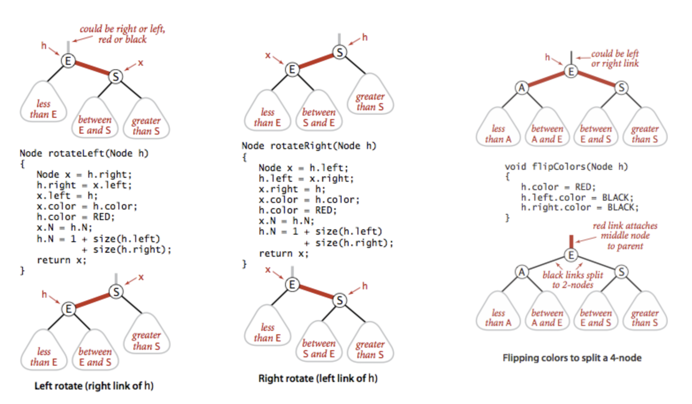

# 红黑树

### 为什么出现红黑树？

1. 解决插入数据有序导致查找时间复杂度从O(logN)上升到O(N)问题
   * 插入数据有序会导致数据结构从二叉树转换成链表
2. 解决方式
   * 自顶而下
   * 自下而上

### 特征

1. 节点都有颜色，以`TreeMap`为例，查看`TreeMap#Entry`

```java

private static final boolean RED   = false;
private static final boolean BLACK = true;

static final class Entry<K,V> implements Map.Entry<K,V> {
    K key;
    V value;
    Entry<K,V> left;
    Entry<K,V> right;
    Entry<K,V> parent;
    // 节点都有颜色
    boolean color = BLACK;

    Entry(K key, V value, Entry<K,V> parent) {
        this.key = key;
        this.value = value;
        this.parent = parent;
    }

    public K getKey() {
        return key;
    }

    public V getValue() {
        return value;
    }

    public V setValue(V value) {
        V oldValue = this.value;
        this.value = value;
        return oldValue;
    }

    public boolean equals(Object o) {
        if (!(o instanceof Map.Entry))
            return false;
        Map.Entry<?,?> e = (Map.Entry<?,?>)o;

        return valEquals(key,e.getKey()) && valEquals(value,e.getValue());
    }

    public int hashCode() {
        int keyHash = (key==null ? 0 : key.hashCode());
        int valueHash = (value==null ? 0 : value.hashCode());
        return keyHash ^ valueHash;
    }

    public String toString() {
        return key + "=" + value;
    }
}
```

2. 在插入和删除过程中，要遵守保持颜色的不同排列规则，其他实现可以直接使用搜索二叉树代码
3. 红黑规则
   * 每一个节点不是红色就是黑色
   * 根总是黑色
   * 如果当前节点是红色的，则它的子节点必须是黑色的
   * 从根到叶子节点或空子节点的每条路径，包含相同数量的黑色节点
4. 修正，主要针对插入和删除
   * 改变节点颜色
   * 执行旋转操作
5. 2-3-4修改为红黑树，红黑树b的左连接使用红色连接表示2-3-4树


### 左右旋和反转颜色



1. 左旋
   1. S右链接和E的左连接不需要动
   2. 使用滑轮将S拉到E处，这时候S颜色变为E颜色，E颜色变为红色
   3. E的父亲变成了S，也就是S的左链接
   4. 这个时候S挂了三个连接，这个时候需要将介于E和S的节点挂到E右连接

```java
// make a left-leaning link lean to the right
private Node rotateRight(Node h) {
    // assert (h != null) && isRed(h.left);
    // 拿到当前节点的左节点
    Node x = h.left;
    // 当前节点左节点等于左节点的右节点
    h.left = x.right;
    // 左节点编程父亲，h变成右节点
    x.right = h;
    // 修正颜色
    x.color = x.right.color;
    x.right.color = RED;
    x.size = h.size;
    h.size = size(h.left) + size(h.right) + 1;
    // 返回子树
    return x;
}
```

2. 右旋
   1. S右链接和E的左连接不需要动
   2. 使用滑轮将E拉到S处，这时候E颜色变为S颜色，S颜色变为红色
   3. S的父亲变成了E，也就是E的右链接
   4. 这个时候E挂了三个连接，这个时候需要将介于E和S的节点挂到S左连接

```java
// make a left-leaning link lean to the right
private Node rotateRight(Node h) {
    // assert (h != null) && isRed(h.left);
    // 先拿到左节点
    Node x = h.left;
    // 当前节点左节点等于当前节点左节点的右节点
    h.left = x.right;
    // 左节点的右节点等于当前节点
    x.right = h;
    // 设置颜色，现在的颜色设置成原来h的颜色
    x.color = x.right.color;
    // h颜色修正为红色
    x.right.color = RED;
    x.size = h.size;
    h.size = size(h.left) + size(h.right) + 1;
    // 返回子树根节点
    return x;
}
```

3. 反转当前节点和孩子节点的颜色
   1. 当前节点和两个孩子节点都不为空
   2. 当前节点黑，左右节点红，或者当前节点红，左右节点黑

```java
// flip the colors of a node and its two children
private void flipColors(Node h) {
    // h must have opposite color of its two children
    // assert (h != null) && (h.left != null) && (h.right != null);
    // 当前节点黑，左右节点红
    // assert (!isRed(h) &&  isRed(h.left) &&  isRed(h.right))
    // 当前节点红，左右节点黑
    //    || (isRed(h)  && !isRed(h.left) && !isRed(h.right));
    h.color = !h.color;
    h.left.color = !h.left.color;
    h.right.color = !h.right.color;
}
```

### 插入数据

1. 如果右子结点是红色的而左子结点是黑色的，进行左旋转
2. 如果左子结点是红色的且它的左左子结点也是红色的，进行右旋转
3. 如果左右子结点均为红色，进行颜色转换

```java
public void put(Key key, Value val) {
    if (key == null) throw new IllegalArgumentException("first argument to put() is null");
    if (val == null) {
        delete(key);
        return;
    }

    root = put(root, key, val);
    // 保证根节点是黑色
    root.color = BLACK;
    // assert check();
}

// insert the key-value pair in the subtree rooted at h
private Node put(Node h, Key key, Value val) {
    if (h == null) return new Node(key, val, RED, 1);

    // 插入数据
    int cmp = key.compareTo(h.key);
    if      (cmp < 0) h.left  = put(h.left,  key, val);
    else if (cmp > 0) h.right = put(h.right, key, val);
    else              h.val   = val;

    // fix-up any right-leaning links
    // 右红左黑，进行左旋
    if (isRed(h.right) && !isRed(h.left))      h = rotateLeft(h);
    // 左红，左左红，右旋
    if (isRed(h.left)  &&  isRed(h.left.left)) h = rotateRight(h);
    // 左红，右红，修正颜色
    if (isRed(h.left)  &&  isRed(h.right))     flipColors(h);
    // 节点个数
    h.size = size(h.left) + size(h.right) + 1;

    return h;
}
```

### 常用工具

1. 移动红色节点

```java
// 设定h是红色节点，左和左左节点是黑色节点
// Assuming that h is red and both h.left and h.left.left
// are black, make h.left or one of its children red.
private Node moveRedLeft(Node h) {
    // assert (h != null);
    // assert isRed(h) && !isRed(h.left) && !isRed(h.left.left);
    // 反转颜色
    flipColors(h);
    // 当前节点的右左节点为红色
    if (isRed(h.right.left)) {
        // 右节点右旋转
        h.right = rotateRight(h.right);
        // 当前节点左旋转
        h = rotateLeft(h);
        // 反转颜色
        flipColors(h);
    }
    return h;
}
// 设定h是红色节点，左和右左节点是黑色节点
// Assuming that h is red and both h.right and h.right.left
// are black, make h.right or one of its children red.
private Node moveRedRight(Node h) {
    // assert (h != null);
    // assert isRed(h) && !isRed(h.right) && !isRed(h.right.left);
    // 反转颜色
    flipColors(h);
    // 当前节点的左左节点为红色
    if (isRed(h.left.left)) {
        // 右旋转
        h = rotateRight(h);
        // 反转颜色
        flipColors(h);
    }
    return h;
}
```

3. 平衡节点

```java
private Node balance(Node h) {
    // assert (h != null);
    // 右边是红的，进行左旋转
    if (isRed(h.right))                      h = rotateLeft(h);
    // 左节点红和左节点的左节点为空，则右旋
    if (isRed(h.left) && isRed(h.left.left)) h = rotateRight(h);
    // 左红，右黑，反转颜色
    if (isRed(h.left) && isRed(h.right))     flipColors(h);

    h.size = size(h.left) + size(h.right) + 1;
    return h;
}
```

### 删除节点

1. 删除最小节点

```java
public void deleteMin() {
    // 如果空的，无法删除
    if (isEmpty()) throw new NoSuchElementException("BST underflow");

    // if both children of root are black, set root to red
    // 孩子节点都是黑色的，先将根节点设置成红色的
    if (!isRed(root.left) && !isRed(root.right))
        root.color = RED;
    // 递归删除
    root = deleteMin(root);
    // 保证根节点是黑色的
    if (!isEmpty()) root.color = BLACK;
    // assert check();
}

// delete the key-value pair with the minimum key rooted at h
private Node deleteMin(Node h) {
    // 如果当前节点最左边为空的，返回空
    if (h.left == null)
        return null;
    // 左黑，左左还是黑
    if (!isRed(h.left) && !isRed(h.left.left))
        // 移动左边红色节点
        h = moveRedLeft(h);
    // 设置节点连接
    h.left = deleteMin(h.left);
    // 平衡节点
    return balance(h);
}

private Node moveRedLeft(Node h) {
    // assert (h != null);
    // assert isRed(h) && !isRed(h.left) && !isRed(h.left.left);
    // 反转颜色
    flipColors(h);
    // 如果当前节点的右边的左边是红的
    if (isRed(h.right.left)) {
        // 右旋转右节点
        h.right = rotateRight(h.right);
        // 在左旋当前节点
        h = rotateLeft(h);
        // 反转颜色
        flipColors(h);
    }
    return h;
}

```

2. 删除最大

```java
public void deleteMax() {
    if (isEmpty()) throw new NoSuchElementException("BST underflow");

    // if both children of root are black, set root to red
    if (!isRed(root.left) && !isRed(root.right))
        root.color = RED;
    // 删除最大值
    root = deleteMax(root);
    if (!isEmpty()) root.color = BLACK;
    // assert check();
}

// delete the key-value pair with the maximum key rooted at h
private Node deleteMax(Node h) {
    // 左孩子是红色先右旋转
    if (isRed(h.left))
        h = rotateRight(h);

    if (h.right == null)
        return null;
    // 右节点和右节点的左孩子都是红色
    if (!isRed(h.right) && !isRed(h.right.left))
        // 移动右边的红色节点
        h = moveRedRight(h);
    // 递归删除
    h.right = deleteMax(h.right);
    // 平衡
    return balance(h);
}
// Assuming that h is red and both h.right and h.right.left
// are black, make h.right or one of its children red.
private Node moveRedRight(Node h) {
    // assert (h != null);
    // assert isRed(h) && !isRed(h.right) && !isRed(h.right.left);
    // 反转颜色
    flipColors(h);
    // 如果左左为红色
    if (isRed(h.left.left)) {
        // 右旋
        h = rotateRight(h);
        // 反转颜色
        flipColors(h);
    }
    return h;
}
```

3. 删除一个节点

```java
public void delete(Key key) {
    if (key == null) throw new IllegalArgumentException("argument to delete() is null");
    if (!contains(key)) return;

    // if both children of root are black, set root to red
    if (!isRed(root.left) && !isRed(root.right))
        root.color = RED;
    // 与删除最大值最小值套路一样
    root = delete(root, key);
    if (!isEmpty()) root.color = BLACK;
    // assert check();
}

// delete the key-value pair with the given key rooted at h
private Node delete(Node h, Key key) {
    // assert get(h, key) != null;
    // key小于当前节点，向左处理
    if (key.compareTo(h.key) < 0)  {
        // 左黑，左左黑
        if (!isRed(h.left) && !isRed(h.left.left))
        // 移动红色节点
            h = moveRedLeft(h);
            // 删除key
        h.left = delete(h.left, key);
    }
    else {
        // 大于当前节点
        if (isRed(h.left))
            // 左红，右旋
            h = rotateRight(h);
            // 相等，并且右节点为空，返回空
        if (key.compareTo(h.key) == 0 && (h.right == null))
            return null;
            // 右黑 右左黑
        if (!isRed(h.right) && !isRed(h.right.left))
            // 移动红色节点到右边
            h = moveRedRight(h);
        if (key.compareTo(h.key) == 0) {
            // 找到最小值
            Node x = min(h.right);
            h.key = x.key;
            h.val = x.val;
            // h.val = get(h.right, min(h.right).key);
            // h.key = min(h.right).key;
            h.right = deleteMin(h.right);
        }
        // 右边节点递归
        else h.right = delete(h.right, key);
    }
    // 平衡节点
    return balance(h);
}
```

### java#TreeMap

1. `TreeMap#put`方法，也就是插入数据
   1. 插入数据，与二叉树基本一致
   2. 保持平衡，进行左右旋

```java
public V put(K key, V value) {
        // 根节点
        Entry<K,V> t = root;
        // 如果根节点为空
        if (t == null) {
            compare(key, key); // type (and possibly null) check
            // 创建新节点
            root = new Entry<>(key, value, null);
            // 设置size
            size = 1;
            modCount++;
            return null;
        }
        // 比较结果
        int cmp;
        Entry<K,V> parent;
        // 比较器
        // split comparator and comparable paths
        Comparator<? super K> cpr = comparator;
        // 比较器不为空的话，使用比较器进行比较
        if (cpr != null) {
            do {
                // loop找到合适节点
                parent = t;
                cmp = cpr.compare(key, t.key);
                if (cmp < 0)
                    t = t.left;
                else if (cmp > 0)
                    t = t.right;
                else
                // 更新值
                    return t.setValue(value);
            } while (t != null);
        }
        else {
            if (key == null)
                throw new NullPointerException();
                // 自然排序，转型
            @SuppressWarnings("unchecked")
                Comparable<? super K> k = (Comparable<? super K>) key;
            do {
                parent = t;
                // 对比
                cmp = k.compareTo(t.key);
                if (cmp < 0)
                    t = t.left;
                else if (cmp > 0)
                    t = t.right;
                else
                // 设定值
                    return t.setValue(value);
            } while (t != null);
        }

        // 创建新节点，并设置新节点key,value,父亲
        Entry<K,V> e = new Entry<>(key, value, parent);
        // 判断设置到那个节点上
        if (cmp < 0)
            parent.left = e;
        else
            parent.right = e;
        // 平衡红黑树
        fixAfterInsertion(e);
        size++;
        modCount++;
        return null;
}

// 判断节点颜色
private static <K,V> boolean colorOf(Entry<K,V> p) {
    return (p == null ? BLACK : p.color);
}
// 找到父亲
private static <K,V> Entry<K,V> parentOf(Entry<K,V> p) {
    return (p == null ? null: p.parent);
}
// 设置节点颜色
private static <K,V> void setColor(Entry<K,V> p, boolean c) {
    if (p != null)
        p.color = c;
}

// 左节点
private static <K,V> Entry<K,V> leftOf(Entry<K,V> p) {
    return (p == null) ? null: p.left;
}
// 右节点
private static <K,V> Entry<K,V> rightOf(Entry<K,V> p) {
    return (p == null) ? null: p.right;
}
```

2. 对于不同状况处理

```java
private void fixAfterInsertion(Entry<K,V> x) {
    // 先设定节点x为红色
    x.color = RED;
    // 不为空和根点，并且父亲也为红节点
    while (x != null && x != root && x.parent.color == RED) {
        // x的父亲 等于 x的父亲的父亲的左节点
        // x的父亲在左连接上
        if (parentOf(x) == leftOf(parentOf(parentOf(x)))) {
            // 拿到x父亲父亲的右节点，假设这个是x的兄弟
            Entry<K,V> y = rightOf(parentOf(parentOf(x)));
            // 如果是红色节点
            if (colorOf(y) == RED) {
                // x父亲设置成黑
                setColor(parentOf(x), BLACK);
                // x父亲的兄弟设置成黑色
                setColor(y, BLACK);
                // 设置x的父亲父亲为红色
                setColor(parentOf(parentOf(x)), RED);
                // x设置成父亲的父亲
                x = parentOf(parentOf(x));
            } else {
                // 如果x父亲父亲的有节点为黑色
                // x为右节点
                if (x == rightOf(parentOf(x))) {
                    // x设置为父亲
                    x = parentOf(x);
                    // 左旋
                    rotateLeft(x);
                }
                // 设置x父亲设置成黑
                setColor(parentOf(x), BLACK);
                // 父亲父亲设置为红色
                setColor(parentOf(parentOf(x)), RED);
                // x父亲父亲右旋
                rotateRight(parentOf(parentOf(x)));
            }
        } else {
            //  x的父亲 等于 x的父亲的父亲的右节点
            // 拿到x的父亲的兄弟
            Entry<K,V> y = leftOf(parentOf(parentOf(x)));
            if (colorOf(y) == RED) {
                // 反转颜色
                setColor(parentOf(x), BLACK);
                setColor(y, BLACK);
                setColor(parentOf(parentOf(x)), RED);
                // 设置连接
                x = parentOf(parentOf(x));
            } else {
                // 黑色节点
                if (x == leftOf(parentOf(x))) {
                    // 找到x的父亲
                    x = parentOf(x);
                    // 右旋
                    rotateRight(x);
                }
                // 旋转颜色
                setColor(parentOf(x), BLACK);
                setColor(parentOf(parentOf(x)), RED);
                rotateLeft(parentOf(parentOf(x)));
            }
        }
    }
    // 保证根节点为黑色
    root.color = BLACK;
}
```

3. CASE 1：如果关注节点是 a，它的叔叔节点 d 是红色
   * 将关注节点 a 的父节点 b、叔叔节点 d 的颜色都设置成黑色；
   * 将关注节点 a 的祖父节点 c 的颜色设置成红色；
   * 关注节点变成 a 的祖父节点 c；


```java
   //  a父亲为红，并且为左连接
   while (a != null && a != root && a.parent.color == RED) {
        if (parentOf(a) == leftOf(parentOf(parentOf(a)))) {
            // 拿到a的叔叔
            Entry<K,V> y = rightOf(parentOf(parentOf(a)));
            // a叔叔为红色
            if (colorOf(y) == RED) {
                // a父亲设置成黑
                setColor(parentOf(a), BLACK);
                // a父亲的兄弟设置成黑色
                setColor(y, BLACK);
                // 设置a的父亲父亲为红色
                setColor(parentOf(parentOf(a)), RED);
                // a设置成父亲的父亲
                a = parentOf(parentOf(a));
                // 省略
```

4. CASE 2：如果关注节点是 a，它的叔叔节点 d 是黑色，关注节点 a 是其父节点 b 的右子节点
   * 关注节点变成节点 a 的父节点 b；
   * 围绕新的关注节点 b 左旋；

```java
 while (a != null && a != root && a.parent.color == RED) {
        // a的父亲在左连接上
        if (parentOf(a) == leftOf(parentOf(parentOf(a)))) {
            // 拿到a的叔叔
            Entry<K,V> y = rightOf(parentOf(parentOf(a)));
            // 如果是红色节点
            if (colorOf(y) == RED) {
                // 省略
                // 如果a的叔叔为黑色节点
            } else {
                // 如果为右连接
                if (a == rightOf(parentOf(a))) {
                    // a 被覆值成了 b
                    a = parentOf(a);
                    // 左旋
                    rotateLeft(a);
                }
                // b的父亲也就是a变更为黑色
                setColor(parentOf(a), BLACK);
                // b的父亲的父亲也就是a的父亲变成红色
                setColor(parentOf(parentOf(a)), RED);
                // 右旋
                rotateRight(parentOf(parentOf(a)));
            }
        } else {
            // 省略
        }
    }
    // 保证根节点为黑色
    root.color = BLACK;
}
```

5. 左右旋

```java
// 左旋
private void rotateLeft(Entry<K,V> p) {
    if (p != null) {
        // 先拿到p的右节点，这个节点会变成新的子树根节点
        Entry<K,V> r = p.right;
        // p的右节点修正为p的右节点的左节点
        p.right = r.left;
        // 需要左旋的节点
        if (r.left != null)
            // r的左边不为空，将其父亲设置为p
            r.left.parent = p;
        // r设置成当前树的根
        r.parent = p.parent;
        // 如果p是根节点
        if (p.parent == null)
        // 设置根节点
            root = r;
        else if (p.parent.left == p)
        // p为左节点，设置到左节点上
            p.parent.left = r;
        else
        // p为右节点，设置到右节点上
            p.parent.right = r;
        // 新根节点左节点为之前根节点
        r.left = p;
        // 修正p节点的父亲
        p.parent = r;
    }
}

private void rotateRight(Entry<K,V> p) {
    if (p != null) {
        // 右旋时候，先拿到当前子树左子树，这个是新根
        Entry<K,V> l = p.left;
        // 左子树的右节点放到右子树的左节点
        p.left = l.right;
        // 修正转移节点的父亲，左右节点父亲改为p
        if (l.right != null) l.right.parent = p;
        // 新根节点父亲为之前根节点父亲
        l.parent = p.parent;
        // 如w为根节点
        if (p.parent == null)
        // 设置根节点
            root = l;
        else if (p.parent.right == p)
        // 右连接
            p.parent.right = l;
        else
        // 左连接
            p.parent.left = l;
        // 新根右节点为之前根
        l.right = p;
        // 之前根的父亲为现在节点
        p.parent = l;
    }
}
```

6. 删除节点

```java
// 移除某个数据
public V remove(Object key) {
    // 查找到某个节点
    Entry<K,V> p = getEntry(key);
    if (p == null)
        return null;

    V oldValue = p.value;
    deleteEntry(p);
    return oldValue;
}

private void deleteEntry(Entry<K,V> p) {
    modCount++;
    size--;

    // If strictly internal, copy successor's element to p and then make p
    // point to successor.
    // p 就是要删除的节点，并且左右节点都不为空
    if (p.left != null && p.right != null) {
        // 找到后继节点
        Entry<K,V> s = successor(p);
        p.key = s.key;
        p.value = s.value;
        p = s;
    } // p has 2 children

    // Start fixup at replacement node, if it exists.
    Entry<K,V> replacement = (p.left != null ? p.left : p.right);

    if (replacement != null) {
        // Link replacement to parent
        replacement.parent = p.parent;
        if (p.parent == null)
            root = replacement;
        else if (p == p.parent.left)
            p.parent.left  = replacement;
        else
            p.parent.right = replacement;

        // Null out links so they are OK to use by fixAfterDeletion.
        p.left = p.right = p.parent = null;

        // Fix replacement
        if (p.color == BLACK)
            fixAfterDeletion(replacement);
    } else if (p.parent == null) { // return if we are the only node.
        root = null;
    } else { //  No children. Use self as phantom replacement and unlink.
        if (p.color == BLACK)
            fixAfterDeletion(p);

        if (p.parent != null) {
            if (p == p.parent.left)
                p.parent.left = null;
            else if (p == p.parent.right)
                p.parent.right = null;
            p.parent = null;
        }
    }
}

private void fixAfterDeletion(Entry<K,V> x) {
    while (x != root && colorOf(x) == BLACK) {
        if (x == leftOf(parentOf(x))) {
            Entry<K,V> sib = rightOf(parentOf(x));

            if (colorOf(sib) == RED) {
                setColor(sib, BLACK);
                setColor(parentOf(x), RED);
                rotateLeft(parentOf(x));
                sib = rightOf(parentOf(x));
            }

            if (colorOf(leftOf(sib))  == BLACK &&
                colorOf(rightOf(sib)) == BLACK) {
                setColor(sib, RED);
                x = parentOf(x);
            } else {
                if (colorOf(rightOf(sib)) == BLACK) {
                    setColor(leftOf(sib), BLACK);
                    setColor(sib, RED);
                    rotateRight(sib);
                    sib = rightOf(parentOf(x));
                }
                setColor(sib, colorOf(parentOf(x)));
                setColor(parentOf(x), BLACK);
                setColor(rightOf(sib), BLACK);
                rotateLeft(parentOf(x));
                x = root;
            }
        } else { // symmetric
            Entry<K,V> sib = leftOf(parentOf(x));

            if (colorOf(sib) == RED) {
                setColor(sib, BLACK);
                setColor(parentOf(x), RED);
                rotateRight(parentOf(x));
                sib = leftOf(parentOf(x));
            }

            if (colorOf(rightOf(sib)) == BLACK &&
                colorOf(leftOf(sib)) == BLACK) {
                setColor(sib, RED);
                x = parentOf(x);
            } else {
                if (colorOf(leftOf(sib)) == BLACK) {
                    setColor(rightOf(sib), BLACK);
                    setColor(sib, RED);
                    rotateLeft(sib);
                    sib = leftOf(parentOf(x));
                }
                setColor(sib, colorOf(parentOf(x)));
                setColor(parentOf(x), BLACK);
                setColor(leftOf(sib), BLACK);
                rotateRight(parentOf(x));
                x = root;
            }
        }
    }

    setColor(x, BLACK);
}
```

### 参考地址

[算法4](https://algs4.cs.princeton.edu/33balanced/)
[数据结构与算法之美](https://time.geekbang.org/column/intro/126)
