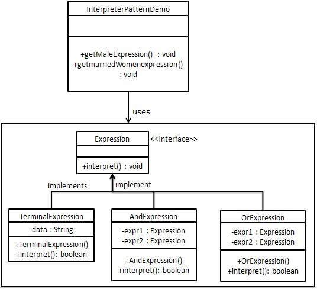

# 解释器

解释器设计模式有啥用？语法分析树？个人因为基础还未夯实，暂时不去研究这一块了，写一个系统中的使用

### 问题

为什么写这篇文章，因为重新梳理算法的时候，想到了之前系统权限和校验的一些瓶颈和错误

### 源代码

[Evaluate.java](https://algs4.cs.princeton.edu/13stacks/Evaluate.java.html)
算法和之前设计模式产生了一些共鸣

```java
 //  java Evaluate
 //  ( 1 + ( ( 2 + 3 ) * ( 4 * 5 ) ) )
 //  101.0
public class Evaluate {
    public static void main(String[] args) {
        Stack<String> ops  = new Stack<String>();
        Stack<Double> vals = new Stack<Double>();
        while (!StdIn.isEmpty()) {
            String s = StdIn.readString();
            if      (s.equals("("))               ;
            else if (s.equals("+"))    ops.push(s);
            else if (s.equals("-"))    ops.push(s);
            else if (s.equals("*"))    ops.push(s);
            else if (s.equals("/"))    ops.push(s);
            else if (s.equals("sqrt")) ops.push(s);
            else if (s.equals(")")) {
                String op = ops.pop();
                double v = vals.pop();
                if      (op.equals("+"))    v = vals.pop() + v;
                else if (op.equals("-"))    v = vals.pop() - v;
                else if (op.equals("*"))    v = vals.pop() * v;
                else if (op.equals("/"))    v = vals.pop() / v;
                else if (op.equals("sqrt")) v = Math.sqrt(v);
                vals.push(v);
            }
            else vals.push(Double.parseDouble(s));
        }
        StdOut.println(vals.pop());
    }
}
```

### 解释器设计模式解释

[解释器设计模式](https://www.tutorialspoint.com/design_pattern/interpreter_pattern.htm)
Interpreter pattern provides a way to evaluate language grammar or expression.
This type of pattern comes under behavioral pattern.
This pattern involves implementing an expression interface which tells to interpret a particular context.
This pattern is used in SQL parsing, symbol processing engine etc.<br/>
解释器模式提供了一种评估语言语法或表达的方式，它属于行为设计模式。
这个设计模式包含一个接口和上下文，可以用于 sql 解析，和语法引擎等。<br/>

### UML 图



Create an expression interface.

```java
// 接口主要是解决上下文问题
public interface Expression {
    boolean interpret(String context);
}
// 真实处理器,未来可以创建很多插件
public class TerminalExpression implements Expression {

   private String data;

   public TerminalExpression(String data){
      this.data = data;
   }

   @Override
   public boolean interpret(String context) {
      return context.contains(data);
   }
}
// or Handler
public class OrExpression implements Expression {

   private Expression expr1 = null;
   private Expression expr2 = null;

   public OrExpression(Expression expr1, Expression expr2) {
      this.expr1 = expr1;
      this.expr2 = expr2;
   }

   @Override
   public boolean interpret(String context) {
      return expr1.interpret(context) || expr2.interpret(context);
   }
}
// and handler
public class AndExpression implements Expression {

   private Expression expr1 = null;
   private Expression expr2 = null;

   public AndExpression(Expression expr1, Expression expr2) {
      this.expr1 = expr1;
      this.expr2 = expr2;
   }

   @Override
   public boolean interpret(String context) {
      return expr1.interpret(context) && expr2.interpret(context);
   }
}

/**
 * 一般情况下别人写代码喜欢用责任链代替解释器
 * 责任链全部都是and 或者 or
 * <p>
 * (e1 or e2) and e3 and ( e4 or e5)
 * 还是解释器牛逼啊
 *
 * @author renfakai
 * @version 1.0
 * @since 2020/12/5
 * (a or b ) and  (c and d)
 */
public class ExpressionMain {

    //Rule: Robert and John are male
    public static Expression getMaleExpression() {
        Expression robert = new TerminalExpression("Robert");
        Expression john = new TerminalExpression("John");
        return new OrExpression(robert, john);
    }

    //Rule: Julie is a married women
    public static Expression getMarriedWomanExpression() {
        Expression julie = new TerminalExpression("Julie");
        Expression married = new TerminalExpression("Married");
        return new AndExpression(julie, married);
    }

//    //Rule: Julie is a married women
//    public static Expression orAnd() {
//        Expression maleExpression = getMaleExpression();
//        Expression marriedWomanExpression = getMarriedWomanExpression();
//        return new AndExpression(maleExpression, marriedWomanExpression);
//    }

    public static void main(String[] args) {
        Expression isMale = getMaleExpression();
        Expression isMarriedWoman = getMarriedWomanExpression();

        Expression ops = new AndExpression(isMale, isMarriedWoman);

        System.out.println("John is male? " + isMale.interpret("John"));
        System.out.println("Julie is a married women? " + isMarriedWoman.interpret("Married Julie"));
        System.out.println("Julie is a married women? " + ops.interpret("Married Julie"));
        System.out.println("John is male?  Julie is a married women? " + ops.interpret("John is male?  Married Julie"));
    }

}
```

对于流程 `A->B->C->D` 很多人喜欢用责任链解决这类问题，并且责任链有三中变种<br/>

* A 处理完直接 return <br/>
* A 处理完 B 会处理<br/>
* A 处理完其他仅仅查看<br/>

### 阿里巴巴案例

责任链可以处理 <br/>

* A and B and C etc <br/>
* A or B or C etc <br/>

阿里巴巴混沌工程中也是这么用的，代码如下:

```java

    package com.alibaba.chaosblade.exec.common.aop.matcher.method;

    import java.util.ArrayList;
    import java.util.List;

    import com.alibaba.chaosblade.exec.common.aop.matcher.MethodInfo;

    /**
     * @author Changjun Xiao
     */
    public class AndMethodMatcher implements MethodMatcher {

        private List<MethodMatcher> matchers = new ArrayList<MethodMatcher>(2);

        /**
         * Add other matcher with and relation
         *
         * @param methodMatcher
         * @return this
         */
        public AndMethodMatcher and(MethodMatcher methodMatcher) {
            if (methodMatcher != null) {
                matchers.add(methodMatcher);
            }
            return this;
        }

        @Override
        public boolean isMatched(String methodName, MethodInfo methodInfo) {
            for (MethodMatcher matcher : matchers) {
                if (!matcher.isMatched(methodName, methodInfo)) {
                    return false;
                }
            }
            return true;
        }

    }

/**
 * @author Changjun Xiao
 */
public class OrMethodMatcher implements MethodMatcher {

    private List<MethodMatcher> matchers = new ArrayList<MethodMatcher>(2);

    /**
     * 添加或组合的方法匹配器
     *
     * @param methodMatcher
     * @return this
     */
    public OrMethodMatcher or(MethodMatcher methodMatcher) {
        if (methodMatcher != null) {
            matchers.add(methodMatcher);
        }
        return this;
    }

    @Override
    public boolean isMatched(String methodName, MethodInfo methodInfo) {
        for (MethodMatcher matcher : matchers) {
            if (matcher.isMatched(methodName, methodInfo)) {
                return true;
            }
        }
        return false;
    }
}

```

### 复杂选择该怎么处理？

例如: 如果我们要解决((a or b) and c and (d or e)) and f 该怎么办呢？<br/>
看下面这段代码是不是就是（a or b) and (c and d), 我们可以编写很多个插件，然后设定父子级和平级关系。
在页面让业务人员进行选择，最后生成一个表达式，后台根据数据上下文和用户进行校验。

```java
  public static void main(String[] args) {
        Expression isMale = getMaleExpression();
        Expression isMarriedWoman = getMarriedWomanExpression();
        Expression ops = new AndExpression(isMale, isMarriedWoman);
        System.out.println("John is male? " + isMale.interpret("John"));
        System.out.println("Julie is a married women? " + isMarriedWoman.interpret("Married Julie"));
        System.out.println("Julie is a married women? " + ops.interpret("Married Julie"));
        System.out.println("John is male?  Julie is a married women? " + ops.interpret("John is male?  Married Julie"));
    }
```

### 应用场景

* OA 权限的设计<br/>
* 用友报税设计<br/>
* 解释器 Sql 解析，动态数据计算，使用字节码生成动态类和反射机制<br/>
