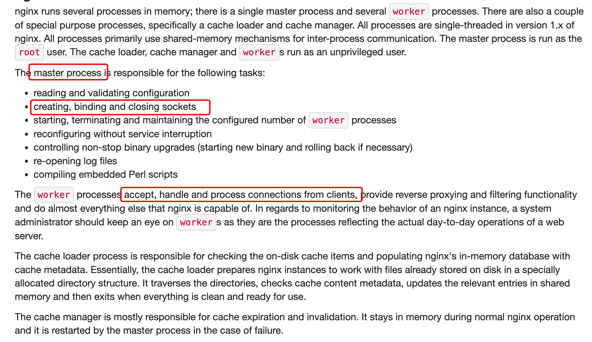

# Reactor

之前写作将`Reactor`模型放到`Netty`目录下，当时只学习了`Netty`源码，认为其思想主要是应用`Jetty、Undertow、Tomcat`，现在看当时眼光太低，像`redis，nginx`优秀框架都是使用这种思想(事件驱动代替父子进程、C10K问题)。

## [Redis ae.c](https://github.com/redis/redis/blob/unstable/src/ae.c)

核心代码如下，关注`wfileProc`和`wfileProc`。

```c
int aeProcessEvents(aeEventLoop *eventLoop, int flags)
{
        // 删除其他代码
        /* Call the multiplexing API, will return only on timeout or when
         * some event fires. */
        numevents = aeApiPoll(eventLoop, tvp);
        // 删除其他代码
        /* After sleep callback. */
        if (eventLoop->aftersleep != NULL && flags & AE_CALL_AFTER_SLEEP)
            eventLoop->aftersleep(eventLoop);
        for (j = 0; j < numevents; j++) {
            int fd = eventLoop->fired[j].fd;
            aeFileEvent *fe = &eventLoop->events[fd];
            int mask = eventLoop->fired[j].mask;
            int fired = 0; /* Number of events fired for current fd. */
            int invert = fe->mask & AE_BARRIER;
            // read
            if (!invert && fe->mask & mask & AE_READABLE) {
                fe->rfileProc(eventLoop,fd,fe->clientData,mask);
                fired++;
                fe = &eventLoop->events[fd]; /* Refresh in case of resize. */
            }
            // wrtie
            if (fe->mask & mask & AE_WRITABLE) {
                if (!fired || fe->wfileProc != fe->rfileProc) {
                    fe->wfileProc(eventLoop,fd,fe->clientData,mask);
                    fired++;
                }
            }
            if (invert) {
                fe = &eventLoop->events[fd]; /* Refresh in case of resize. */
                if ((fe->mask & mask & AE_READABLE) &&
                    (!fired || fe->wfileProc != fe->rfileProc))
                {
                    fe->rfileProc(eventLoop,fd,fe->clientData,mask);
                    fired++;
                }
            }
            processed++;
        }
    }
    if (flags & AE_TIME_EVENTS)
        processed += processTimeEvents(eventLoop);
    return processed; /* return the number of processed file/time events */
}
```

## [nginx Workers Model](http://www.aosabook.org/en/nginx.html)

架构图中如下：


可以查看`work`模型，使用的是事件通知，基本与`Reactor`模型相等。



从图中可以看到`master`职责主要负责创建、绑定、关闭网络连接。`work池`负责接受、处理请求。

## 总结

`Reactor`模型是一个网络高并发常用模型，需要用心和时间去学习。
