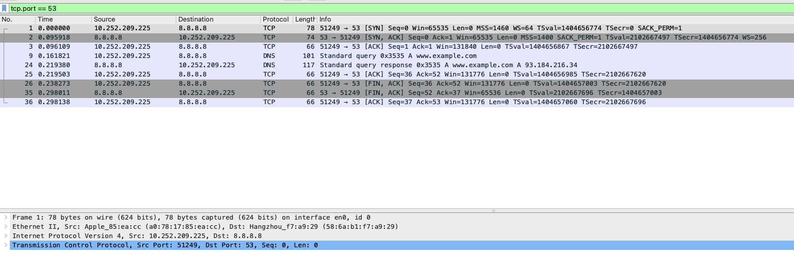
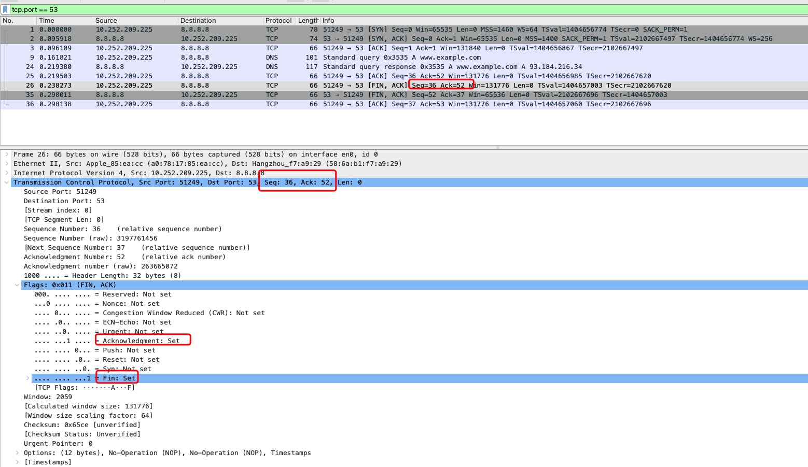
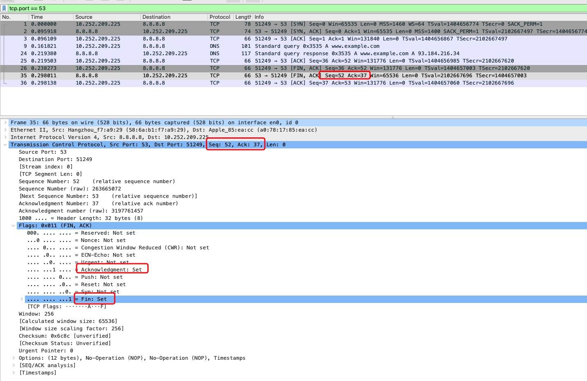
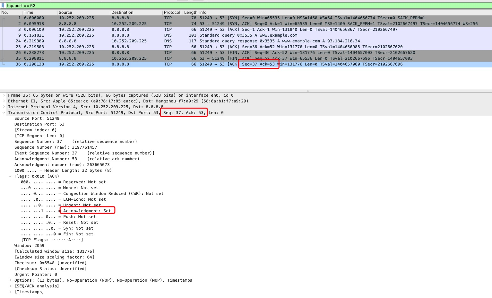
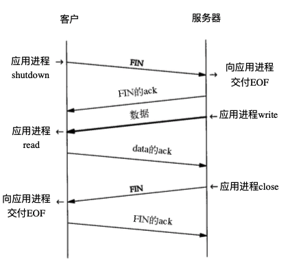

# 四次挥手

四次挥手是客户端和服务端进行关闭连接前置动作。

## 实战

四次挥手基本流程图，也就是下图中的 segment4-7

:::center

:::

::: tip 提示

`FIN ACK`请查看[三次握手](./tree-shake-hands.md)

:::

使用[代码](https://github.com/sona0402/netty/blob/master/src/main/java/channelhandlers/TcpDnsClient.java)进行 DNS 查询，并使用`WireShark`进行抓包，抓包使用 filter 进行过滤，过滤条件为`tcp.port == 53`，过滤后的结果如下图所示:

:::center

:::

TCP 是双工的，所以涉及到半关问题，一般情况下需要 4 次挥手，在合适的场景使用 3 次挥手（合并一次挥手）

::: tip 提示

There are six flag bits in the TCP header. One or more of them can be turned on at the same time. We briefly mention their use here and discuss each flag in more detail in later chapters.

在这里有一句话， `One or more of them can be turned on at the same time.` 在一个段中可能会出现多个 `flag`

* URG The urgent pointer is valid (Section 20.8).
* ACK The acknowledgment number is valid.
* PSH The receiver should pass this data to the application as soon as possible (Section 20.5).
* RST Reset the connection (Section 18.7).
* SYN Synchronize sequence numbers to initiate a connection. This flag and the next are described in Chapter 18.
* FIN The sender is finished sending data.

:::

看一下三次挥手，client 发送完数据，发送一个 FIN 数据段，其中 client 序列号为 36

:::center

:::

server 数据发送完了，所以是可以断开的，所以这里将`FIN ACK`进行合并了，对 client 的序号进行+1 确认，并给出 server 序号 52，这个时候 server 对 client 的写连接已经关闭，并发送读断开的 FIN

:::center

:::

client 收到后，对 server 序号+1，发送到 server，让 server 进行确认

:::center

:::

### 半关

查看半关案例

:::center

图来自《TCP IP 协议详解卷一：协议》

:::

如果想产生 4 次挥手，最好的测试就是 client 发送数据，发送写数据请求，然后 server 发送数据，使用[代码](https://github.com/sona0402/netty/tree/master/src/main/java/tcp)进行半关测试

wireshark 抓本地环绕，使用`tcp.port == 4444`过滤条件进行查看

:::center

:::

1. no.329 client 发送 FIN
2. no.330 server ACK
3. no.415 server 发送数据

:::center

:::
4. no.416 数据的 data 的 ACK
5. no.417 server 发出 FIN
6. no.418 client 发出 ACK

## 参考材料

[TCP/IP 详解 卷 1：协议](https://book.douban.com/subject/1088054/)
