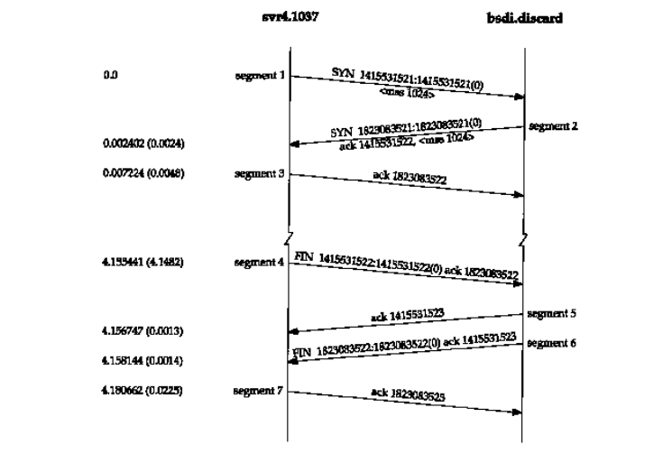
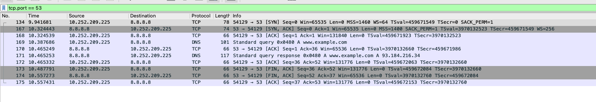
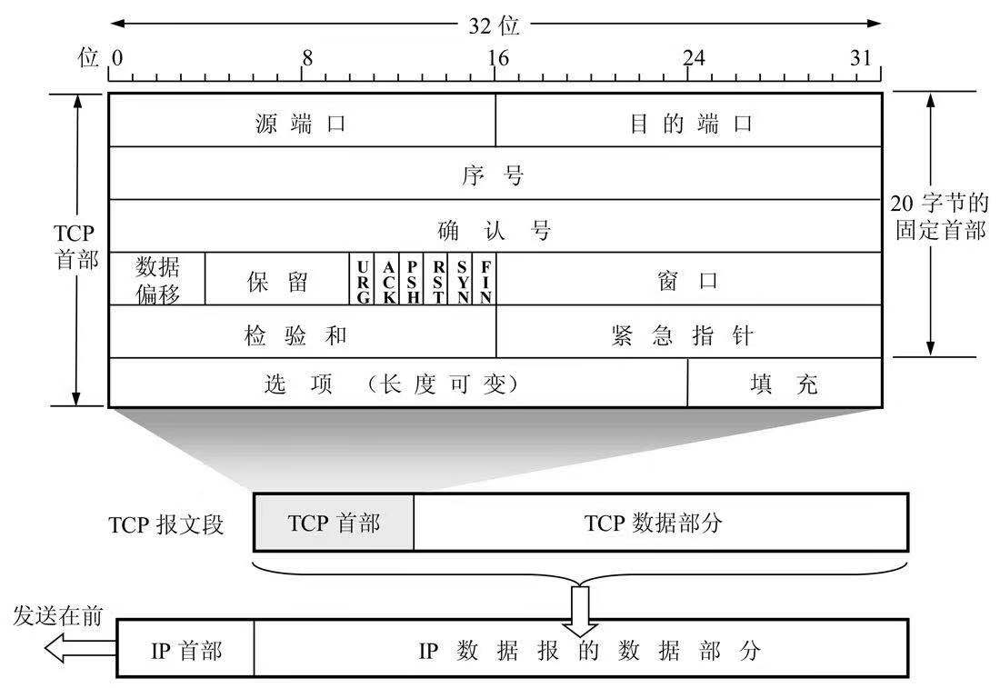
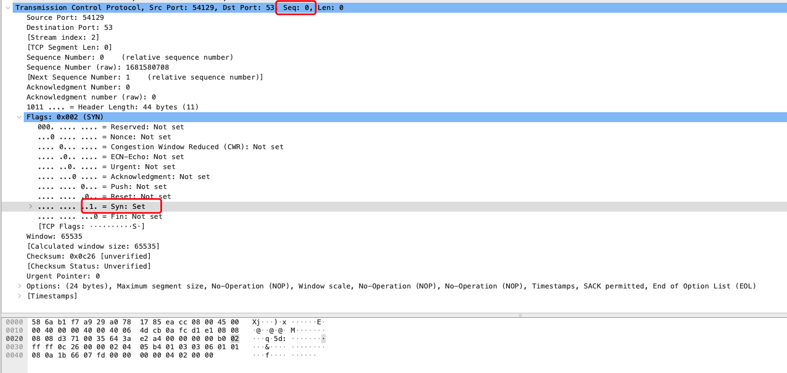
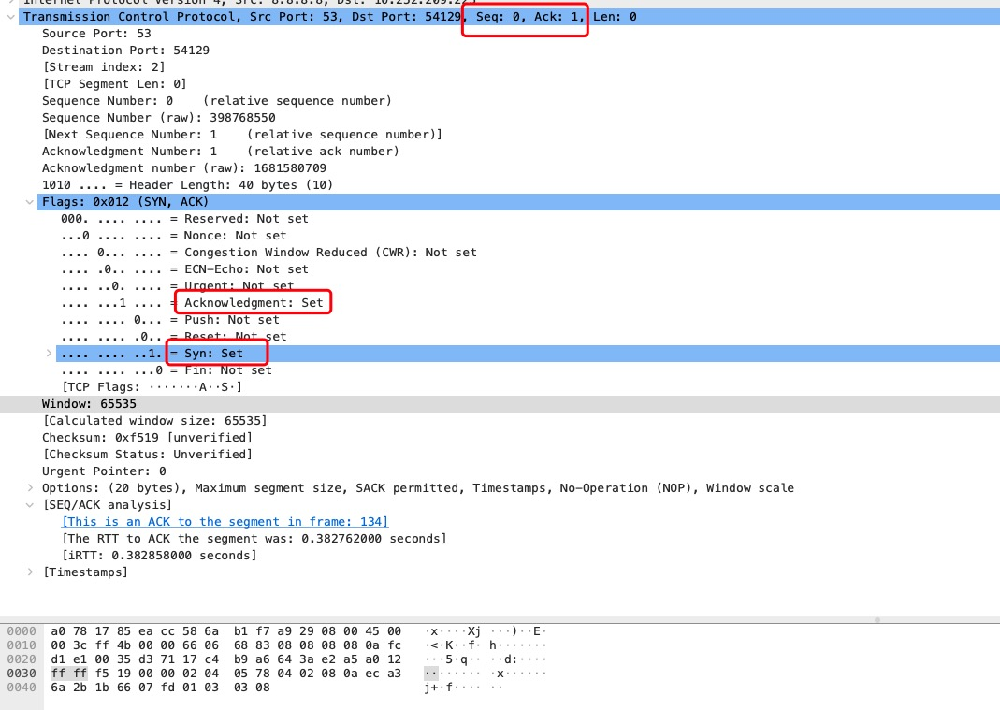
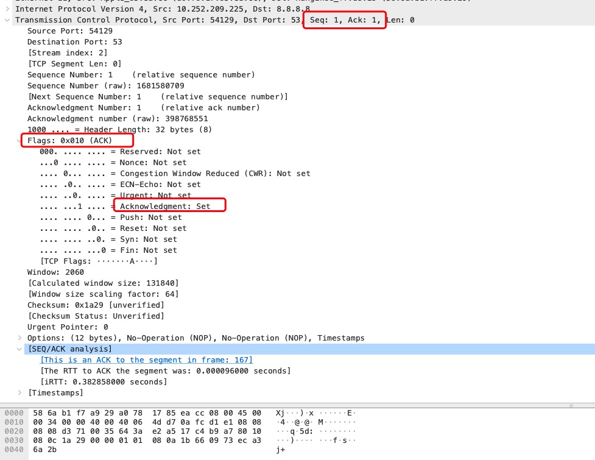

# 三次握手

三次握手是客户端与服务端建立 TCP 连接的前置动作，本文使用 [Wireshark](https://www.wireshark.org/) 抓取数据包进行分解查看。

## 实战

:::center

图来自于《TCP IP 协议详解卷一：协议》
:::

使用[代码](https://github.com/sona0402/netty/blob/master/src/main/java/channelhandlers/TcpDnsClient.java)进行 DNS
查询，并使用`WireShark`进行抓包，抓包使用 `filter` 进行过滤，过滤条件为`tcp.port == 53`，过滤后的结果如下图所示:

:::center

:::

从图中，看到了`SYN ACK SEQ`等常用字段，查看 TCP 报文段结构，先查看 TCP 头部信息

TCP 头部有 6 个标记

- URG The urgent pointer is valid 紧急指针
- ACK The acknowledgment number is valid 确认序列号
- PSH The receiver should pass this data to the application as soon as possible 不需要放到连接的缓存，直接上报给应用
- RST Reset the connection 重制链接
- Synchronize sequence numbers to initiate a connection 连接同步初始化序列号
- The sender is finished sending data 发送数据完成时

info 中的字段信息

- Seq: 包中第一个字节的序号
- Win: 滑动窗口的大小
- Ack: 希望下次收到的 seq 序号
- Len: 传输数据长度(不包括 TCP 头，固定首部 20B)，指用户传输的数据长度
- MSS: 最大消息长度(一般是 1460，也可能不是)，与 MTU(一般 1500，也可能不是)关系: MTU=Ethernet 头+IP 头+TCP/UDP 头+MSS

客户端发出了一个 SYN 数据段请求，对应图 1 中的 segment1，其实这里发送的数据为客户端序列为 0

:::center

:::

服务端返回一个 SYN ACK 数据段，服务端序列为 0，对客户端确认为 1，这里的 1 是使用客户端给的序列 + 1 得到的，对应图 1 中的 segment2

:::center

:::

客户端给出一个 ACK 数据段请求，Seq=1 Ack = 1，客户端序列是自己增长的，而 Ack 是对服务端序号+1 产生的，对应图 1 中的 segment3

:::center

:::

## 参考材料

[TCP/IP 详解 卷 1：协议](https://book.douban.com/subject/1088054/)
