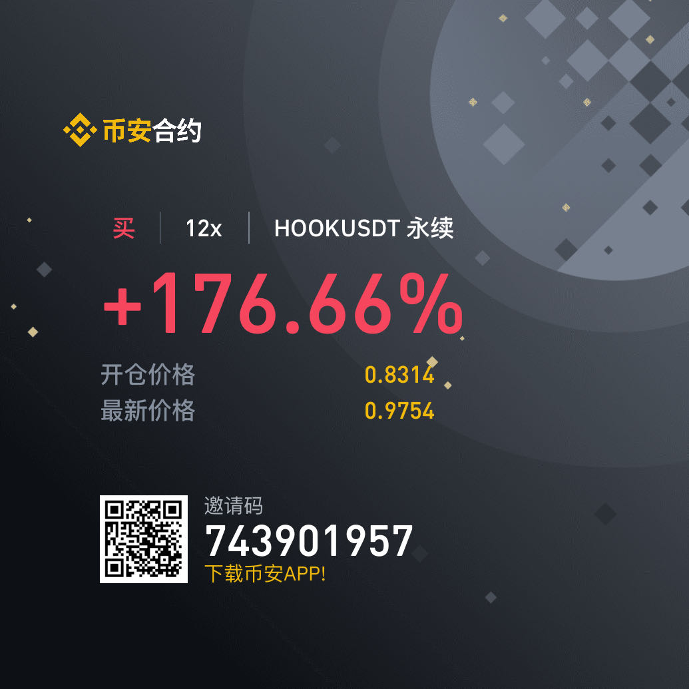

# hook币

随笔写写hook币，也和内心的自己讲讲话。

hook币符合自己的买入指标的，确定性很强，使用分仓的方式杀进去了，买进去也确实涨的很快，很快利润达到了200%，自己内心感觉很强大， 很飘。一直没有止盈，即使知道后面有空头陷阱也没有平仓。
在浮动盈利的情况下进行加仓，加了2次，后续导致亏损。

## 反思

* 对于币没有全局去反思主力常见操盘手法，该盘子属于套牢散户，然后创新低，逼散户割肉，在做一波情绪。
* 以太坊跌的时候跟跌，但是以太坊涨的时候不跟涨。
