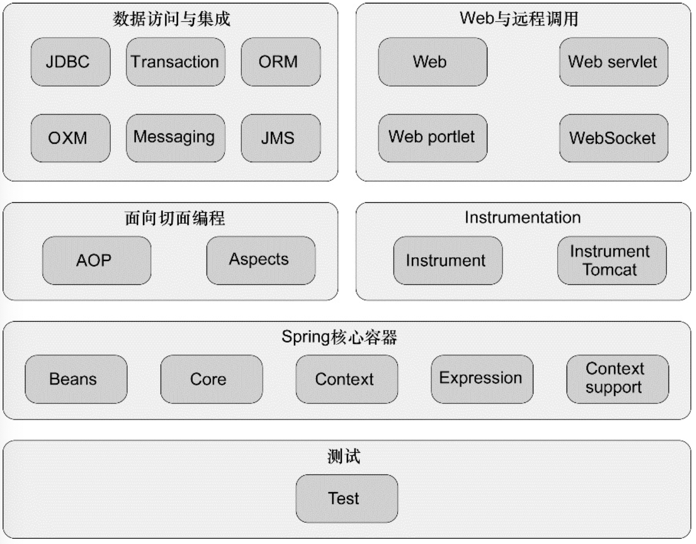

# Spring

[Spring](https://docs.spring.io/spring-framework/docs/current/reference/html/)是`Springboot`、`SpringCloud`的基石，就像`Reactor`是`Netty、Jetty、Undertow、Tomcat`基石一样，使用`Spring`一个点破一个面。

<!-- ::: center

图来自Spring实战（第4版）
::: -->
## IOC

Spring 容器主要管理 bean ，其核心是享元设计模式。

## [DI](./di.md)

通过依赖注入和面向接口实现松耦合。面向对象编程中，接口实现注入就是`DI`，核心代码就是 bean 构造器注入、属性填充。

DI是敏捷设计模式六大原则中的很重要的一个原则，关于相关知识可以参考：

* [《敏捷软件开发》第11章 依赖倒置原则](https://book.douban.com/subject/1140457/)
* [《架构整洁之道》](https://book.douban.com/subject/30333919/)

## Aop

todo

## transaction

todo

## 参考材料

* [Spring官网](https://docs.spring.io/spring-framework/docs/current/reference/html/)
* [《Spring实战（第4版）》](https://book.douban.com/subject/26767354/)
* [《Spring揭秘》](https://book.douban.com/subject/3897837/)
* [《Expert One-on-One J2EE Development without EJB》](https://book.douban.com/subject/1426848/)
