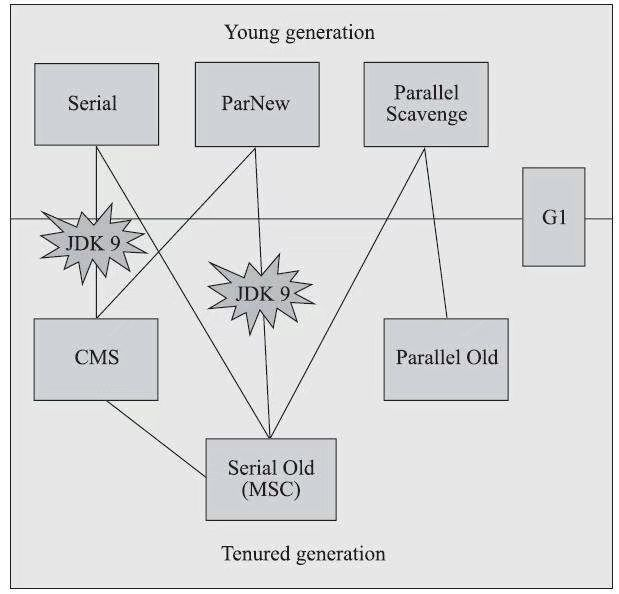

# 生产使用

垃圾回收器的选择还是根据实际生产环境进行选择，选择主要根据两个指标`最大吞吐量、最短回收停顿时间`。

最大吞吐量使用的是`标记-整理`算法，整理过程中需要重新移动对象，所以耗时增加，但是堆内存空间不需要额外的空闲表进行记录，所以在分配对象时间比较快，其流程如下：

最短回收停顿时间使用`标记-清除`算法，由于没有对象的移动，仅仅需要将是释放空间记录到空闲表中，所以垃圾回收阶段停顿时间少，但是在对象分配的时候需要查找空闲表，所以在吞吐量降低

现以常用版本`jdk1.8`为案例进行讲解，现使用下图进行组合:

1. `标记-整理`主要包含`Serial Old、Parallel Old`，最大吞吐量进行组合时可以使用，`Serial Old`在老年代使用单线程，回收较慢，不建议作为老年代主要回收器使用，服务器一般都是web项目。
   * ~~`Serial + Serial Old`~~ 仅客户端应用建议使用
   * ~~`ParNew + Serial Old`~~ 新生代多线程回收很快，老年代单线程回收慢，不建议使用
   * ~~`Parallel Scavenge + Serial Old`~~ 新生代多线程回收很快，老年代单线程回收慢，不建议使用
   * `Parallel Scavenge + Parallel Old` 新生代、老年代都使用多线程，如果峰值应用程序性能是第一个优先级，并且没有暂停时间要求或暂停1秒或更长时间是可以接受的，那么让VM选择集器，或选择带有`-XX:+UseParallelGC`的并行收集器
2. `标记-清除`主要包含`CMS`
   * ~~`Serial + CMS`~~ 新生代回收频率高，单线程版本导致应用`最短回收停顿时间`并未实现
   * `ParNew + CMS +Serial Old` 常用版本，`CMS`在垃圾回收的时候会让内存碎片化，往往会出现老年代还有很多剩余空间，但就是无法找到足够大的连续空间来分配当前对象，而不得不提前触发一次`Full GC`的情况，所以需要`Serial Old`进行辅助
