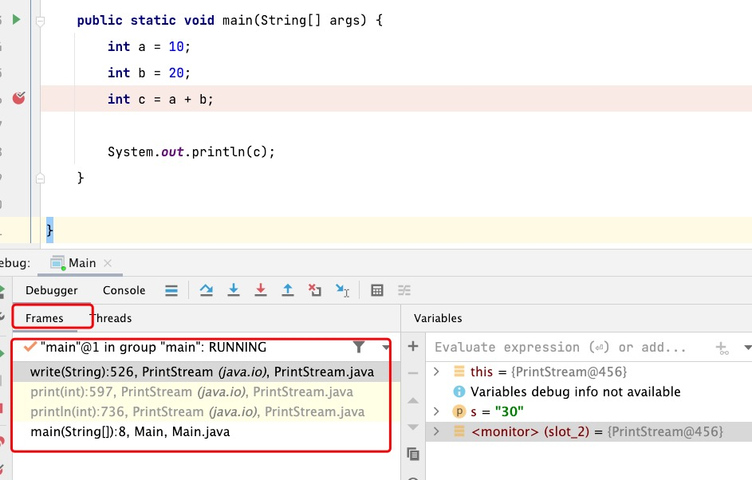
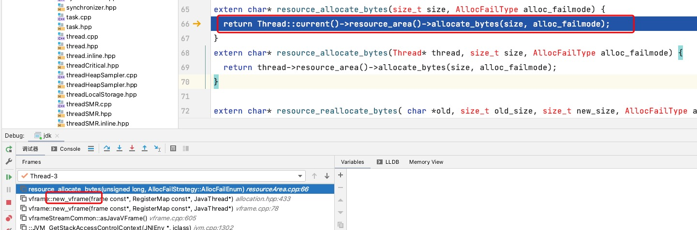

# Stacks

## Java Virtual Machine Stacks

::: tip 官方文档
Each Java Virtual Machine thread has a private Java Virtual Machine stack, created at the same time as the thread. A Java Virtual Machine stack stores frames (§2.6). A Java Virtual Machine stack is analogous to the stack of a conventional language such as C: it holds local variables and partial results, and plays a part in method invocation and return. Because the Java Virtual Machine stack is never manipulated directly except to push and pop frames, frames may be heap allocated. The memory for a Java Virtual Machine stack does not need to be contiguous.

This specification permits Java Virtual Machine stacks either to be of a fixed size or to dynamically expand and contract as required by the computation. If the Java Virtual Machine stacks are of a fixed size, the size of each Java Virtual Machine stack may be chosen independently when that stack is created.
A Java Virtual Machine implementation may provide the programmer or the user control over the initial size of Java Virtual Machine stacks, as well as, in the case of dynamically expanding or contracting Java Virtual Machine stacks, control over the maximum and minimum sizes.
The following exceptional conditions are associated with Java Virtual Machine stacks:
• If the computation in a thread requires a larger Java Virtual Machine stack than is permitted, the Java Virtual Machine throws a StackOverflowError.
• If Java Virtual Machine stacks can be dynamically expanded, and expansion is attempted but insufficient memory can be made available to effect the expansion, or if insufficient memory can be made available to create the initial Java Virtual Machine stack for a new thread, the Java Virtual Machine throws an OutOfMemoryError.
:::

每个Java虚拟机线程都有一个与线程同时创建的专用Java虚拟机堆栈。Java虚拟机堆栈存储帧（§2.6）。Java虚拟机堆栈类似于C等传统语言的堆栈：它包含局部变量和部分结果，并在方法调用和返回中发挥作用。由于Java虚拟机堆栈除了推送和弹出帧外从未直接操作，因此帧可能会被分配堆。Java虚拟机堆栈的内存不需要连续。
本规范允许Java虚拟机堆栈具有固定大小，或根据计算要求动态扩展和收缩。如果Java虚拟机堆栈的大小固定，则可以在创建该堆栈时独立选择每个Java虚拟机堆栈的大小。

Java虚拟机实现可以为程序员或用户提供对Java虚拟机堆栈初始大小的控制，以及在动态扩展或收缩Java虚拟机堆栈的情况下，对最大和最小大小的控制。

以下特殊条件与Java虚拟机堆栈相关联：

* 如果线程中的计算需要比允许更大的Java虚拟机堆栈，Java虚拟机将抛出堆栈溢出错误。
* 如果Java虚拟机堆栈可以动态扩展，并尝试扩展，但可用于实现扩展的内存不足，或者如果可用于为新线程创建初始Java虚拟机堆栈的内存不足，Java虚拟机将抛出内存错误。

### 堆栈溢出

虚拟机栈使用`-Xss`进行设定，从图中可以看出，虚拟机栈包含`Frames`。如果想要`StackOverflowError`，可以从下面那种方式出发:

1. 无跳出递归产生`Frame`
2. 局部变量表无限大



### oom

由于Java不允许对虚拟机栈进行动态扩容，所以想`oom`，在`-Xss`大小指定的情况下，创建线程过多，也会导致内存不足。

### vframe

vframes 是表示源级激活的虚拟堆栈帧。与优化代码一起存储的调试使我们能够将帧展开为`vframe`堆栈。

```java
// vframes are virtual stack frames representing source level activations.
// A single frame may hold several source level activations in the case of
// optimized code. The debugging stored with the optimized code enables
// us to unfold a frame as a stack of vframes.
// A cVFrame represents an activation of a non-java method.

// The vframe inheritance hierarchy:
// - vframe
//   - javaVFrame
//     - interpretedVFrame
//     - compiledVFrame     ; (used for both compiled Java methods and native stubs)
//   - externalVFrame
//     - entryVFrame        ; special frame created when calling Java from C

// - BasicLock
class vframe: public ResourceObj {
 protected:
  // 真实的frame
  frame        _fr;      // Raw frame behind the virtual frame.
  RegisterMap  _reg_map; // Register map for the raw frame (used to handle callee-saved registers).
  JavaThread*  _thread;  // The thread owning the raw frame.

  vframe(const frame* fr, const RegisterMap* reg_map, JavaThread* thread);
  vframe(const frame* fr, JavaThread* thread);
 public:
  // Factory methods for creating vframes
  static vframe* new_vframe(const frame* f, const RegisterMap *reg_map, JavaThread* thread);
  static vframe* new_vframe(StackFrameStream& fst, JavaThread* thread);

  // Accessors
  frame              fr()           const { return _fr;       }
  CodeBlob*          cb()         const { return _fr.cb();  }
  CompiledMethod*   nm()         const {
      assert( cb() != NULL && cb()->is_compiled(), "usage");
      return (CompiledMethod*) cb();
  }

  // ???? Does this need to be a copy?
  frame*             frame_pointer() { return &_fr;       }
  const RegisterMap* register_map() const { return &_reg_map; }
  JavaThread*        thread()       const { return _thread;   }
  // Returns the sender vframe
  virtual vframe* sender() const;
  // Returns the next javaVFrame on the stack (skipping all other kinds of frame)
  javaVFrame *java_sender() const;
  // Answers if the this is the top vframe in the frame, i.e., if the sender vframe
  // is in the caller frame
  virtual bool is_top() const { return true; }
  // 返回栈顶
  virtual vframe* top() const;
  virtual bool is_entry_frame()       const { return false; }
  virtual bool is_java_frame()        const { return false; }
  virtual bool is_interpreted_frame() const { return false; }
  virtual bool is_compiled_frame()    const { return false; }
};
```

从图中可以看出`vframe`是从线程内存进行分配的，调用了`Thread::current()->resource_area()->allocate_bytes(size, alloc_failmode);`方法。


## Native Method Stacks

::: tip 官方文档
An implementation of the Java Virtual Machine may use conventional stacks, colloquially called "C stacks," to support native methods (methods written in a language other than the Java programming language). Native method stacks may also be used by the implementation of an interpreter for the Java Virtual Machine's instruction set in a language such as C. Java Virtual Machine implementations that cannot load native methods and that do not themselves rely on conventional stacks need not supply native method stacks. If supplied, native method stacks are typically allocated per thread when each thread is created.
This specification permits native method stacks either to be of a fixed size or to dynamically expand and contract as required by the computation. If the native method stacks are of a fixed size, the size of each native method stack may be chosen independently when that stack is created.
A Java Virtual Machine implementation may provide the programmer or the user control over the initial size of the native method stacks, as well as, in the case of varying-size native method stacks, control over the maximum and minimum method stack sizes.
The following exceptional conditions are associated with native method stacks:
• If the computation in a thread requires a larger native method stack than is
permitted, the Java Virtual Machine throws a StackOverflowError.
• If native method stacks can be dynamically expanded and native method stack expansion is attempted but insufficient memory can be made available, or if insufficient memory can be made available to create the initial native method stack for a new thread, the Java Virtual Machine throws an OutOfMemoryError.
:::

Java虚拟机的实现可以使用常规堆栈，俗称“C堆栈”，来支持本机方法（用Java编程语言以外的语言编写的方法）。本机方法堆栈也可以用于用C等语言实现Java虚拟机指令集的解释器。无法加载本机方法且本身不依赖于常规堆栈的Java虚拟机实现不需要提供本机方法堆栈。如果提供了本机方法堆栈，通常在创建每个线程时分配给每个线程。

本规范允许本机方法堆栈具有固定大小，或根据计算要求动态扩展和收缩。如果本机方法堆栈的大小固定，则可以在创建该堆栈时独立选择每个本机方法堆栈的大小。

Java虚拟机实现可以为程序员或用户提供对本机方法堆栈初始大小的控制，以及在不同大小的本机方法堆栈的情况下，对最大和最小方法堆栈大小的控制。

以下特殊条件与本机方法堆栈相关联：

* 如果线程中的计算需要比现在更大的本机方法堆栈允许，Java虚拟机抛出StackOverflowError。
* 如果本机方法堆栈可以动态扩展，并尝试本机方法堆栈扩展，但内存不足，或者如果内存不足，无法为新线程创建初始本机方法堆栈，Java虚拟机将抛出OutOfMemoryError。

本地方法栈使用`-Xoss`进行设定，但实际上是没有任何效果。

## 参考材料

* [《深入理解Java虚拟机（第3版）》](https://book.douban.com/subject/34907497/)
* [The Java® VirtualMachine Specification](https://docs.oracle.com/javase/specs/jvms/se17/jvms17.pdf)
* [vframe.cpp](https://hg.openjdk.java.net/jdk8/jdk8/hotspot/file/c40fbf634c90/src/share/vm/runtime/vframe.cpp)
