# 基于栈的指令集

## [原文地址](https://dzone.com/articles/introduction-to-java-bytecode)

Java 字节码简介继续深入研究 JVM 内部和 Java 字节码，以了解如何分解文件以进行深入检查。

读编译后的字节码是很乏味的，但是对 Java 开发者很有用。为什么还要第一时间学习这些低级内容呢？这是我上周发生的情况，我在我的电脑上对一些代码进行了变更，
编译成 Jar 并部署到服务器去测试一个潜在的性能问题。不幸得是这些代码没有提交到版本控制系统，
出于一些其他原因，我电脑对代码的改变被删除了，并且找不到轨迹，过了几个月后，我需要在源代码上进行变更(这些代码花了很大力气编写)，但是我找不到它们了!

幸运的是这些被编译的代码还存在远程的服务器上面，所以我松了一口了气，我从服务器拉下了 Jar 文件并用反编译工具打开它。
有一个问题：反编译 GUI 不是一个完美的工具，而且有很多 Classes 没有在 jar 文件中，
出于某些原因，当我打开特定的 class 去看反编译代码时引起了 UI 的一个 bug，然后我把反编译工具丢进了垃圾箱！

绝望的时候采取绝望的措施，幸好，我熟悉原生字节码，而且我宁愿花费一些时间手动反编译这些代码片段而不是研究更改并再次测试它们。
由于我还记得这些代码位置，读取字节码有助于我找到明确的更改并再次构造到源代码（我确保从错误中吸取教训，并保护它们）。

字节码的好处是你学习它的语法一次，适用于 Java 所有平台，因为它是代码的中间表示，而不是 cpu 下执行的机器语言，
此外，字节码由于 Jvm 的结构比原生机器语言更加简单，简化了指令集。更好的事情就是 Oracle 文档中包含这些指令。

在学习字节码指令之前，让我们熟悉一些有关 JVM 的先决条件。

## 虚拟机数据类型

Java 是静态类型语言，这会影响字节码指令集的设计，从而使一条指令的操作特定的类型，例如，有一个加法指令将两个数字相加： `iadd， ladd， fadd， dadd` .
它们的操作数的类型类型分别为 `int，long，float，double` 。大部分字节码根据操作数类型具有不同形式但相同功能的特征。

数据类型在 JVM 定义为:

1. 主要类型

* 数字类型：`byte`(8 位 2 的补码)，`short`(16 位 2 的补码)，
`int` (32 位 2 的补码)， `long` (64 位 2 的补码）
`char` (16 位 无符号编码），
`float` (32 位 IEEE 754 单精度 FP)， `double` (64 位 IEEE 754 双精度 FP)
* `boolean` 类型
* `returnAddress` 指示指针

2. 引用类型

* Class 类型
* 数组类型
* 接口类型

`boolean` 类型被字节码限制，例如，这里没有指令集直接操作 `boolean` 类型， `Boolean` 值将有编译器转换成 `int` ，并使用相应的 `int` 指令。
Java 开发者应该很熟悉上面的类型，除了返回地址，没有等效的编程语言类型。

## 基于堆栈的架构

字节码指令集的简单性很大归功与 Sun 设计了基于基于堆栈的 VM 体系结构，而不是基于寄存器的。这里有一系列的内存组建应用与 Jvm 进程，
从本质上将只有 Jvm 堆栈需要被检查遵循字节码指令：

**PC 寄存器**：对于 Java 程序的每一个运行的线程，PC 寄存器都存储当前指令的地址。

**虚拟机栈**：对于每一个线程，栈都分配本地向量表，方法参数和返回值。这是显示 3 个线程的堆栈插图。


**堆内存**：内存共享所有线程和被加载的对象（实例对象和数组），对象的回收被垃圾回收器管理。

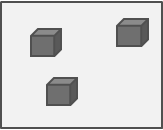

**方法区**: 每一个被加载的 class，它存储方法代码和符号表。(例如引用类型和方法) 和长量池。

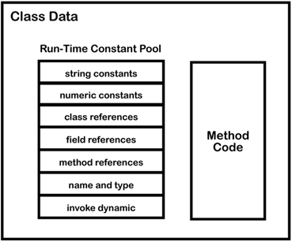

JVM 栈由栈帧组成，当方法调用时候推入栈帧，并在方法完成时（通过正常返回或引发异常）从堆栈中弹出。每个栈帧还包括:

1. 局部变量表，索引从 0~length-1，长度由编辑器计算，局部向量表可以保存任意类型，但是`long`和`double`除外，因为它占两个位置。
2. 一个操作栈用于储存用于存储用作指令的操作数，将参数推送到方法调用。

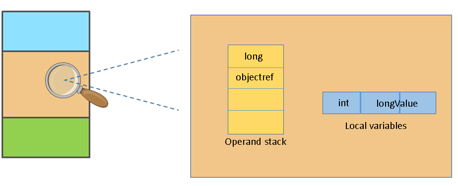

## 字节码探索

关于 JVM 内部想法，我们可以看一些字节码基础案例，这些案例生成于简单代码。在 Java class 文件中每一个访达都会有一些代码段，
它包含一系列的指令集，主要包含以下格式:

```java
opcode (1 byte)      operand1 (optional)      operand2 (optional)      ...
```

该指令由一个字节的操作码和零个或多个包含要操作的数据去操作。
当前执行方法的栈帧，一个指令可以从操作栈中推入或者推出值，而且它可以潜在的加载或存储值到局部变量表，让我门来看一个简单的案例:

```java
public static void main(String[] args) {
  int a = 1;
  int b = 2;
  int c = a + b;
}
```

为了能够打印被编辑的 class(假定这个文件是 `Test.class` )字节码结果，我们可以使用 javap 工具:

```java
javap -v Test.class
```

我们会得到下面字节码

```java
   public static void main(java.lang.String[]);
   descriptor: ([Ljava/lang/String;)V
   flags: (0x0009) ACC_PUBLIC， ACC_STATIC
   Code:
   stack=2， locals=4， args_size=1
   0: iconst_1
   1: istore_1
   2: iconst_2
   3: istore_2
   4: iload_1
   5: iload_2
   6: iadd
   7: istore_3
   8: return
 ...
```

我们能看到 `main` 的签名，形容和表明方法需要一个字符串数组( `[Ljava/lang/String;` )，并且有一个返回类型( `V` )。
后续有一系列的方法形容，例如公有的( `ACC_PUBLIC` )和静态的( `ACC_STATIC` )。

更重要的部分是 `Code` ，它包含了方法的说明和信息，例如操作数栈的最大深度(stack=2)，和一定数量的局部变量表被分配在栈帧中(locals=4)，
以上指令引用了上面的除 0 索引外的所有位置，它包含了参数的引用，其他 3 个局部变量对应源码中的参数 `a，b，c` 。

从 0-8 的指令集操作如下:

`iconst_1` : 推送常数 1 到操作数栈。


`istore_1` : 从操作数栈推出(一个 int 值)并储存到局部变量表索引 1 处，它对应的是变量 a。

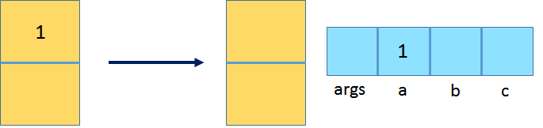

`iconst_2` : 推送数字常量 2 到操作数栈。

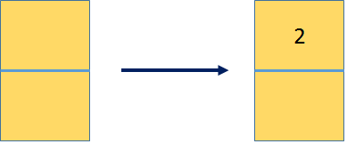

`istore_2` : 从操作数栈推出 int 并储存到局部变量索引 2，它对应向量 b。

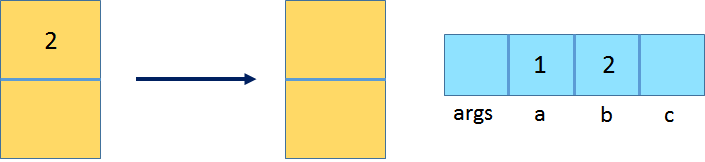

`iload_1` : 将第二个 int 型本地变量推送至栈顶。

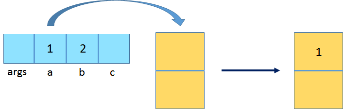

**`iload_2` 将第三个 int 型本地变量推送至栈顶**
**这里请注意原文与原图不符**

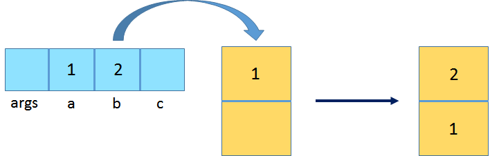

`iadd` : 将栈顶两 int 型数值相加并将结果压入栈顶。


`istore_3` : 从操作数栈推出 int 并储存到局部变量索引 3，它对应向量 c。

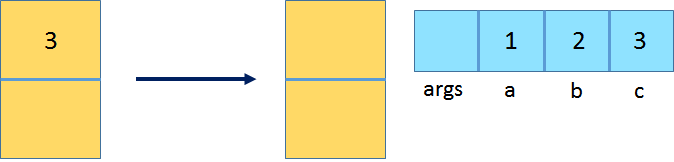

`return` : 从 void 方法返回。

上面的指令集都是都仅有一个操作码，操作码精确的指示了 JVM 要执行的操作。

## 方法调用

在上面试例中，这里只有一个主方法，让我们假定我们需要更京西的计算来计算变量 c，并且我们决定将其放到 calc 方法中:

```java
public static void main(String[] args) {
    int a = 1;
    int b = 2;
    int c = calc(a， b);
}
static int calc(int a， int b) {
    return (int) Math.sqrt(Math.pow(a， 2) + Math.pow(b， 2));
}
```

让我们看字节码结果:

```java
public static void main(java.lang.String[]);
  descriptor: ([Ljava/lang/String;)V
  flags: (0x0009) ACC_PUBLIC， ACC_STATIC
  Code:
    stack=2， locals=4， args_size=1
      0: iconst_1
      1: istore_1
      2: iconst_2
      3: istore_2
      4: iload_1
      5: iload_2
      6: invokestatic  #2         // Method calc:(II)I
      9: istore_3
      10: return
  static int calc(int， int);
  descriptor: (II)I
  flags: (0x0008) ACC_STATIC
  Code:
    stack=6， locals=2， args_size=2
      0: iload_0
      1: i2d
      2: ldc2_w        #3         // double 2.0d
      5: invokestatic  #5         // Method java/lang/Math.pow:(DD)D
      8: iload_1
      9: i2d
      10: ldc2_w        #3         // double 2.0d
      13: invokestatic  #5         // Method java/lang/Math.pow:(DD)D
      16: dadd
      17: invokestatic  #6         // Method java/lang/Math.sqrt:(D)D
      20: d2i
      21: ireturn
```

与主方法唯一的差别是它没有 `iadd` 指令，我们可以看到一个 `invokestatic` 指令，它只是调用了静态方法 `calc` 。
关键要注意操作数栈包含了 `calc` 方法的两个参数，换句话说，调用方法将被调用方法的所有参数以正确的顺序压入操作数堆栈，从而准备这些参数。
`invokestatic` (类似的调用指令，后续在讲)随后讲弹出这些参数，一些新的栈帧将会被调用方法创建，并且参数会被放到局部变量表中。

我们注意到 `invokestatic` 指令使用了 3 个字节进行寻址，
它从 6 到 9，这是因为，它与我们之前看到的指令不同，
`invokestatic` 包含两个额外的字节构造方法引用(额外的操作码)。
这个引用被展示为 `#2` ，它是 `calc` 方法的符号引用，可以从前面讲到的常量池找到。

显然，其他新信息是 `calc` 方法本身的代码。它先将第一个 integer 参数加载到操作数栈( `iload_0` )。
下一个指令， `i2d` ，扩大它的范围将它转换成一个 double，并将结果推到操作数栈顶。

下一个指令推送一个 double 常量 `2.0d` (从常量池获取)到操作数栈，然后使用操作数栈准备的两个操作数值调用 `Math.pow` 静态方法( `calc` 的第一个参数和常量 `2.0d` )，
当 `Math.pow` 方法返回，它的结果会被储存到调用程序的操作数栈中，可以在下面说。

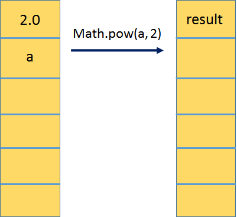

相同的过程适用于计算 `Math.pow（b，2）` :

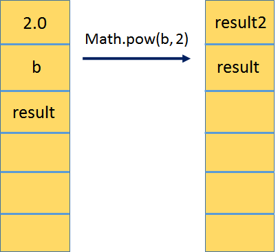

下一个指令， `dadd` ，推出两个中间结果，进行相加，并将结果退回到栈顶，最终，静态调用调用数学平方，然后使用缩小转换（ `d2i` ）将结果从 double 转换为 int。
生成的 int 返回到 main 方法，该方法将其存储回 `c` （ `istore_3` ）。

## 创建实例

让我们修改示例，并引入一个 `Point` 类来封装 XY 坐标。

```java
public class Test {
     public static void main(String[] args) {
         Point a = new Point(1， 1);
         Point b = new Point(5， 3);
         int c = a.area(b);
     }
 }
 class Point {
     int x， y;
     Point(int x， int y) {
         this.x = x;
         this.y = y;
     }
     public int area(Point b) {
         int length = Math.abs(b.y - this.y);
         int width = Math.abs(b.x - this.x);
         return length * width;
     }
 }
```

主要方法的字节码如下:

```java
public static void main(java.lang.String[]);
   descriptor: ([Ljava/lang/String;)V
   flags: (0x0009) ACC_PUBLIC， ACC_STATIC
   Code:
     stack=4， locals=4， args_size=1
        0: new           #2       // class test/Point
        3: dup
        4: iconst_1
        5: iconst_1
        6: invokespecial #3       // Method test/Point."<init>":(II)V
        9: astore_1
       10: new           #2       // class test/Point
       13: dup
       14: iconst_5
       15: iconst_3
       16: invokespecial #3       // Method test/Point."<init>":(II)V
       19: astore_2
       20: aload_1
       21: aload_2
       22: invokevirtual #4       // Method test/Point.area:(Ltest/Point;)I
       25: istore_3
       26: return
```

这里遇到的新的指令 `new，dup` 和 `invokespecial` 。类似与编程语言的新的运算符， `new` 指令创建传递给它的操作数中指定类型的对象( `Point` class 的符号引用)
对象分配在堆内存上，并且将对象引用推动到操作数栈上。

dup 指令复制操作数栈顶的值，这意味着现在我们堆栈顶部有两个 `Point` 对象。
接下来的三条指令将构造函数的参数（用于初始化对象）压入操作数堆栈，然后调用与构造函数相对应的特殊初始化方法，
下一个方法是将字段 x 和 y 初始化。方法完成后，将使用前三个操作数堆栈值，剩下的就是对创建对象的原始引用（到目前为止，该对象已成功初始化）。

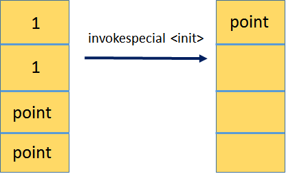

接下来，astore_1 弹出该 Point 引用并将其分配给索引 1 处的局部变量（ `astore_1` 中的 a 表示这是一个引用值）。

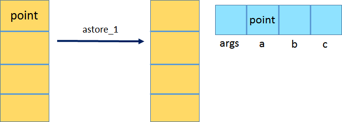

重复相同的创建和初始化 Point，并将它赋于到 b。

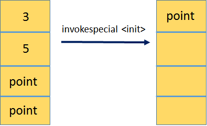

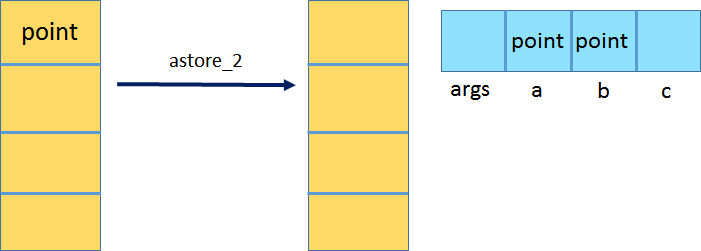

最后一步加载两个 Point 对象引用到局部变量表索引 1 和 2 处(分别使用 `aload_1` 和 `aload_2` )，
并且使用 `invokevirtual` 调用面积计算方法，它根据对象的实际类型处理将调用分配给适当的方法。
例如，如果变量 a 包含扩展 `Point` 的 `SpecialPoint` 类型的实例，并且子类型覆盖 area 方法，则将调用重写方法。
在这种情况下，如果没有子类，因此仅一个区域方法可用。

## 另一种方式

您无需掌握每条指令的理解和确切的执行流程，就可以根据手头的字节码了解程序的功能。
例如，以我为例，我想检查代码是否使用 Java 流读取文件，以及该流是否已正确关闭。现在给出以下字节码，
相对容易地确定确实使用了流，并且很可能作为 `try-with-resources` 语句的一部分将其关闭。

```java
public static void main(java.lang.String[]) throws java.lang.Exception;
  descriptor: ([Ljava/lang/String;)V
  flags: (0x0009) ACC_PUBLIC， ACC_STATIC
  Code:
    stack=2， locals=8， args_size=1
       0: ldc           #2                  // class test/Test
       2: ldc           #3                  // String input.txt
       4: invokevirtual #4                  // Method java/lang/Class.getResource:(Ljava/lang/String;)Ljava/net/URL;
       7: invokevirtual #5                  // Method java/net/URL.toURI:()Ljava/net/URI;
      10: invokestatic  #6                  // Method java/nio/file/Paths.get:(Ljava/net/URI;)Ljava/nio/file/Path;
      13: astore_1
      14: new           #7                  // class java/lang/StringBuilder
      17: dup
      18: invokespecial #8                  // Method java/lang/StringBuilder."<init>":()V
      21: astore_2
      22: aload_1
      23: invokestatic  #9                  // Method java/nio/file/Files.lines:(Ljava/nio/file/Path;)Ljava/util/stream/Stream;
      26: astore_3
      27: aconst_null
      28: astore        4
      30: aload_3
      31: aload_2
      32: invokedynamic #10，  0             // InvokeDynamic #0:accept:(Ljava/lang/StringBuilder;)Ljava/util/function/Consumer;
      37: invokeinterface #11，  2           // InterfaceMethod java/util/stream/Stream.forEach:(Ljava/util/function/Consumer;)V
      42: aload_3
      43: ifnull        131
      46: aload         4
      48: ifnull        72
      51: aload_3
      52: invokeinterface #12，  1           // InterfaceMethod java/util/stream/Stream.close:()V
      57: goto          131
      60: astore        5
      62: aload         4
      64: aload         5
      66: invokevirtual #14                 // Method java/lang/Throwable.addSuppressed:(Ljava/lang/Throwable;)V
      69: goto          131
      72: aload_3
      73: invokeinterface #12，  1           // InterfaceMethod java/util/stream/Stream.close:()V
      78: goto          131
      81: astore        5
      83: aload         5
      85: astore        4
      87: aload         5
      89: athrow
      90: astore        6
      92: aload_3
      93: ifnull        128
      96: aload         4
      98: ifnull        122
     101: aload_3
     102: invokeinterface #12，  1           // InterfaceMethod java/util/stream/Stream.close:()V
     107: goto          128
     110: astore        7
     112: aload         4
     114: aload         7
     116: invokevirtual #14                 // Method java/lang/Throwable.addSuppressed:(Ljava/lang/Throwable;)V
     119: goto          128
     122: aload_3
     123: invokeinterface #12，  1           // InterfaceMethod java/util/stream/Stream.close:()V
     128: aload         6
     130: athrow
     131: getstatic     #15                 // Field java/lang/System.out:Ljava/io/PrintStream;
     134: aload_2
     135: invokevirtual #16                 // Method java/lang/StringBuilder.toString:()Ljava/lang/String;
     138: invokevirtual #17                 // Method java/io/PrintStream.println:(Ljava/lang/String;)V
     141: return
    ...
```

我们可以看到 `java/util/stream/Stream` 被迭代调用，在调用 `InvokeDynamic` 之前，先引用一个 `Consumer` 。
然后，我们看到了一个字节代码块，它调用 `Stream.close` 以及调用 `Throwable.addSuppressed` 的分支。
这是编译器为 `try-with-resources` 语句生成的基本代码。
这是完整性的原始来源：

```java
public static void main(String[] args) throws Exception {
    Path path = Paths.get(Test.class.getResource("input.txt").toURI());
    StringBuilder data = new StringBuilder();
    try(Stream lines = Files.lines(path)) {
        lines.forEach(line -> data.append(line).append("\n"));
    }
    System.out.println(data.toString());
}
```

## 结论

由于字节码指令集的简单性以及生成指令时几乎没有编译器优化的原因，如果需要，反汇编类文件可能是检查源代码中应用程序代码更改的一种方法。
