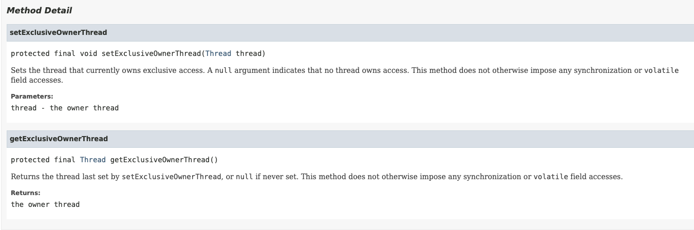
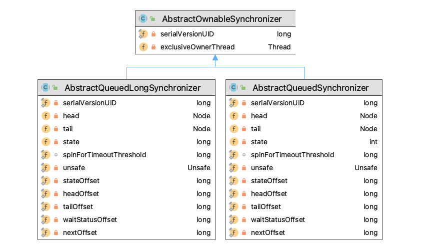

# exclusively

A synchronizer that may be exclusively owned by a thread. This class provides a basis for creating locks and related synchronizers that may entail a notion of ownership. The AbstractOwnableSynchronizer class itself does not manage or use this information. However, subclasses and tools may use appropriately maintained values to help control and monitor access and provide diagnostics.

由线程独占拥有的同步器。此类为创建所有权概念的锁和相关同步器提供了基础。`AbstractOwnableSynchronizer`类本身不管理或使用此信息。但是，子类和工具可以使用适当维护的值来帮助控制和监视访问并提供诊断。

## 核心api



* setExclusiveOwnerThread(Thread thread)
  * `setExclusiveOwnerThread(Thread.currentThread());`访问权限的线程
  * `setExclusiveOwnerThread(null);`清空访问权限的线程，都可以访问
* getExclusiveOwnerThread()
  * 返回最后由`setExclusiveOwnerThread`设置的线程，如果从未设置，则返回null

## 继承关系



## 代码

1. `AbstractOwnableSynchronizer`，从代码中可以看到此使用的是独占模式

```java
public abstract class AbstractOwnableSynchronizer
    implements java.io.Serializable {
    // todo 其他无用的删除
    private transient Thread exclusiveOwnerThread;

    // 独占模式那个线程占用
    protected final void setExclusiveOwnerThread(Thread thread) {
        exclusiveOwnerThread = thread;
    }
    // 返回锁的持有者
    protected final Thread getExclusiveOwnerThread() {
        return exclusiveOwnerThread;
    }
}
```

## 总结

为子类提供最后持有访问权限查询和设置接口
