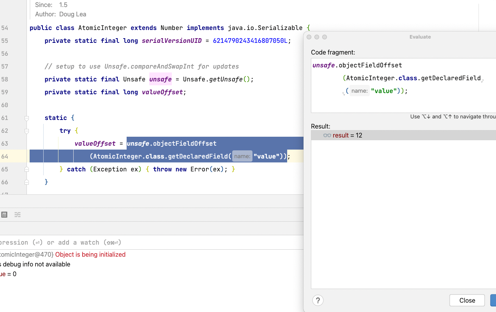
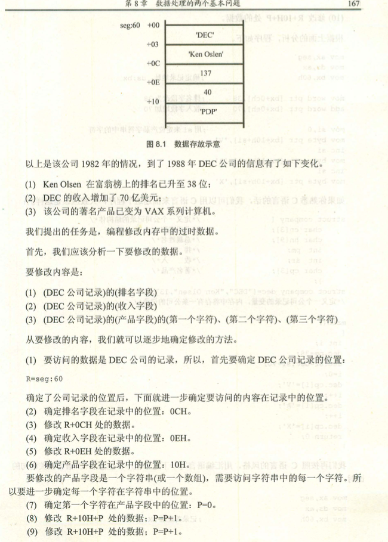
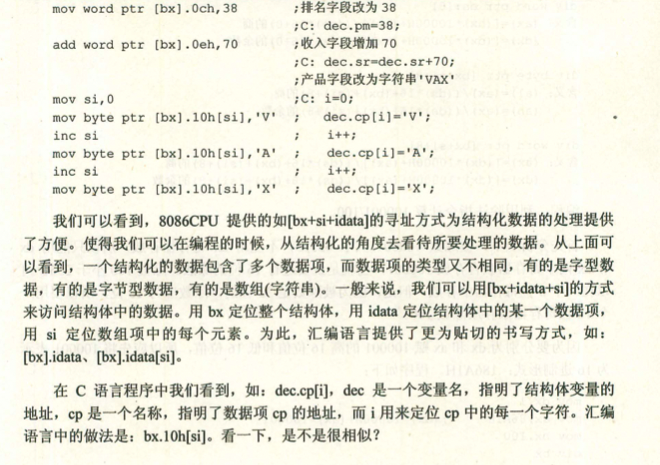
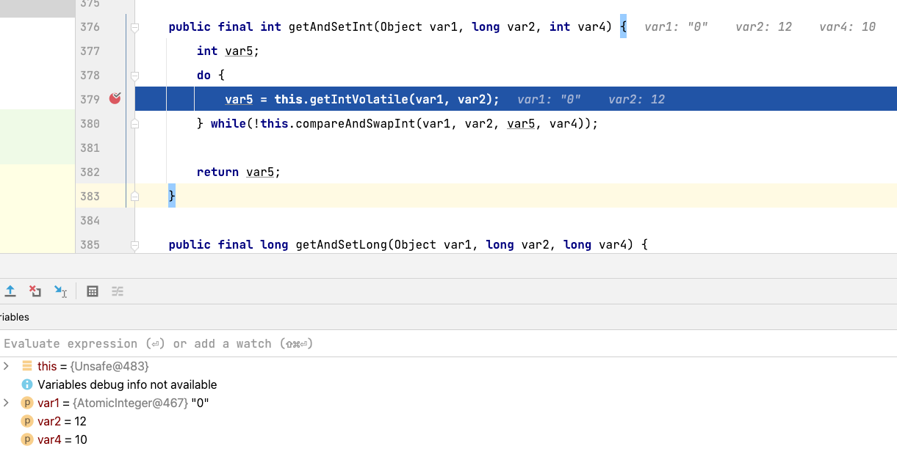

# cas

本文章主要使用`java.util.concurrent.atomic`下的`AtomicInteger`来探索`cas`，由于包下大部分代码都符合ocp原则，所以使用`AtomicInteger`进行讲解。

| 分组       |                                                                           类 |
| ---------- | ---------------------------------------------------------------------------: |
| 基础数据型 |                                       AtomicInteger AtomicBoolean AtomicLong |
| 数组型     |                    AtomicIntegerArray  AtomicLongArray  AtomicReferenceArray |
| 字段更新器 | AtomicIntegerFieldUpdater AtomicLongFieldUpdater AtomicReferenceFieldUpdater |
| 引用型     |               AtomicReference AtomicMarkableReference AtomicStampedReference |

## 对象布局

1. 查看一下`AtomicInteger`代码，这个时候我们会产生疑惑，`unsafe,valueOffset`这都是什么东西？

```java
public class AtomicInteger extends Number implements java.io.Serializable {
    // 序列化，这个没什么好讲的
    private static final long serialVersionUID = 6214790243416807050L;

    // 这个是干什么的呢？不知道
    // setup to use Unsafe.compareAndSwapInt for updates
    private static final Unsafe unsafe = Unsafe.getUnsafe();
    // 这又是什么呢？
    private static final long valueOffset;

    static {
        try {
            valueOffset = unsafe.objectFieldOffset
                (AtomicInteger.class.getDeclaredField("value"));
        } catch (Exception ex) { throw new Error(ex); }
    }

    private volatile int value;

    // 方法暂时忽略
}
```

2. 使用一段代码来解释`unsafe,valueOffset`到底是什么？先引入`pom`文件。

```java
<dependency>
    <groupId>org.openjdk.jol</groupId>
    <artifactId>jol-core</artifactId>
    <version>0.9</version>
</dependency>
```

3. 编写代码查看`AtomicInteger`对象的布局。

```java
public class AtomicIntegerTest {

    public static void main(String[] args) {
        AtomicInteger atomicInteger = new AtomicInteger(0);
        System.out.println(ClassLayout.parseInstance(atomicInteger).toPrintable());
    }
}
```

4. 输出数据，从数据中可以看到AtomicInteger.value在对象布局的OFFSET=12处，现在是使用`jol-core`进行打印的，如果我们想在代码中使用要怎么使用呢？

```java
java.util.concurrent.atomic.AtomicInteger object internals:
 OFFSET  SIZE   TYPE DESCRIPTION                               VALUE
      0     4        (object header)                           01 00 00 00 (00000001 00000000 00000000 00000000) (1)
      4     4        (object header)                           00 00 00 00 (00000000 00000000 00000000 00000000) (0)
      8     4        (object header)                           bc 3d 00 f8 (10111100 00111101 00000000 11111000) (-134201924)
     12     4    int AtomicInteger.value                       0
Instance size: 16 bytes
Space losses: 0 bytes internal + 0 bytes external = 0 bytes total
```

5. debug下上面的代码，从图中可以看到`valueOffset=12`，由于对象内存布局是一样的，所以这个值在初始化的时候已经被设置到`valueOffset`上面了。


## 数据结构布局

1. [深入理解计算机系统（原书第 3 版）3.9 异质的数据结构](https://book.douban.com/subject/26912767/)


2. [汇编语言（第3版）8.6 寻址方式的综合应用](https://book.douban.com/subject/25726019/)





## 常用方法

对于`unsafe,valueOffset`的困惑已经解开，看一下常用的方法

### unsafe.getAndSetInt

1. 进行debug这段代码，这里主要涉及到两个方法的调用`getIntVolatile`和`compareAndSwapInt`

```java
     public final int getAndSetInt(Object var1, long var2, int var4) {
        int var5;
        do {
            var5 = this.getIntVolatile(var1, var2);
        } while(!this.compareAndSwapInt(var1, var2, var5, var4));

        return var5;
    }
```

2. 查看调用的参数，可以看到这里拿到了对象，也就是`基地址`，var2就是偏移地址



3. `getIntVolatile`方法的形容如下，大概的讲解和上面数据结构布局一致，这里支持volatile语意，也就是可见性的解释，一个volatile变量的读，总是能看到（任意线程）对这个volatile变量最后的写入。

4. 代码注释讲解和上面[数据结构布局](./atomic.md#数据结构布局)基本一致，只是对于数组使用`基地址+类型*n`也就是`B+N*S`，可以参考[深入理解计算机系统（原书第 3 版）3.8数组分配和访问](https://book.douban.com/subject/26912767/)

### unsafe.compareAndSwapInt

1. 这个方法调用的是native方法，对于方法的形容是支持原子操作，也就是`cmpxchg`指令

```java
    public final native boolean compareAndSwapInt(Object o,long offset,int expected,int x);
```

## 总结

暂时只讲到了cas相关，其底层是直接操作内存地址，并且使用`cmpxchg`指令，关于其他unsafe相关功能，等到用到时在进行解释。

## 参考

* [Unsafe](http://hg.openjdk.java.net/jdk7/jdk7/jdk/file/9b8c96f96a0f/src/share/classes/sun/misc/Unsafe.java)
* [深入理解计算机系统（原书第 3 版）](https://book.douban.com/subject/26912767/)
* [汇编语言（第3版）](https://book.douban.com/subject/25726019/)
* [Java多线程编程实战指南（核心篇）](https://book.douban.com/subject/27034721/)
* [Java并发编程的艺术](https://book.douban.com/subject/26591326/)
