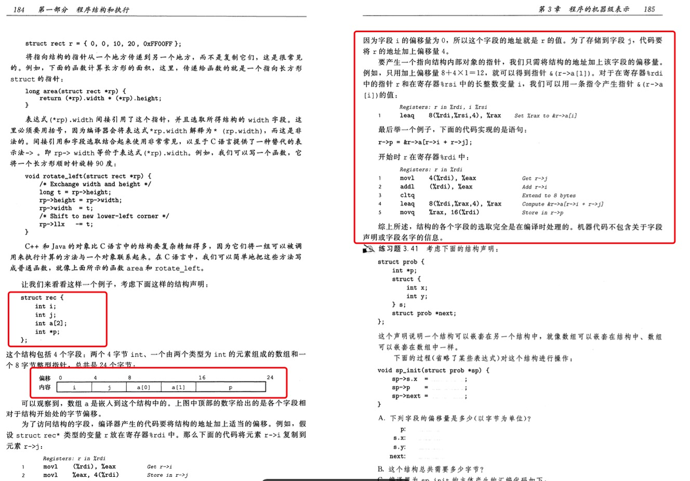

# atomic

本文章主要使用`java.util.concurrent.atomic`下的`AtomicInteger`来探索`cas`，由于包下大部分代码都符合ocp原则，所以使用`AtomicInteger`进行讲解。

| 分组       |                                                                           类 |
| ---------- | ---------------------------------------------------------------------------: |
| 基础数据型 |                                       AtomicInteger AtomicBoolean AtomicLong |
| 数组型     |                    AtomicIntegerArray  AtomicLongArray  AtomicReferenceArray |
| 字段更新器 | AtomicIntegerFieldUpdater AtomicLongFieldUpdater AtomicReferenceFieldUpdater |
| 引用型     |               AtomicReference AtomicMarkableReference AtomicStampedReference |

## 对象布局

1. 查看一下`AtomicInteger`代码，这个时候我们会产生疑惑，`unsafe,valueOffset`这都是什么东西？

```java
public class AtomicInteger extends Number implements java.io.Serializable {
    // 序列化，这个没什么好讲的
    private static final long serialVersionUID = 6214790243416807050L;

    // 这个是干什么的呢？不知道
    // setup to use Unsafe.compareAndSwapInt for updates
    private static final Unsafe unsafe = Unsafe.getUnsafe();
    // 这又是什么呢？
    private static final long valueOffset;

    static {
        try {
            valueOffset = unsafe.objectFieldOffset
                (AtomicInteger.class.getDeclaredField("value"));
        } catch (Exception ex) { throw new Error(ex); }
    }

    private volatile int value;

    // 方法暂时忽略
}
```

2. 使用一段代码来解释`unsafe,valueOffset`到底是什么？先引入`pom`文件。

```java
<dependency>
    <groupId>org.openjdk.jol</groupId>
    <artifactId>jol-core</artifactId>
    <version>0.9</version>
</dependency>
```

3. 编写代码查看`AtomicInteger`对象的布局。

```java
public class AtomicIntegerTest {

    public static void main(String[] args) {
        AtomicInteger atomicInteger = new AtomicInteger(0);
        System.out.println(ClassLayout.parseInstance(atomicInteger).toPrintable());
    }
}
```

4. 输出数据，从数据中可以看到AtomicInteger.value在对象布局的OFFSET=12处，现在是使用`jol-core`进行打印的，如果我们想在代码中使用要怎么使用呢？

```java
java.util.concurrent.atomic.AtomicInteger object internals:
 OFFSET  SIZE   TYPE DESCRIPTION                               VALUE
      0     4        (object header)                           01 00 00 00 (00000001 00000000 00000000 00000000) (1)
      4     4        (object header)                           00 00 00 00 (00000000 00000000 00000000 00000000) (0)
      8     4        (object header)                           bc 3d 00 f8 (10111100 00111101 00000000 11111000) (-134201924)
     12     4    int AtomicInteger.value                       0
Instance size: 16 bytes
Space losses: 0 bytes internal + 0 bytes external = 0 bytes total
```

5. 让我们来debug下上面的代码，从图中可以看到`valueOffset=12`，由于对象内存布局是一样的，所以这个值在初始化的时候已经被设置到`valueOffset`上面了。


## 数据结构布局

1. [深入理解计算机系统（原书第 3 版）](https://book.douban.com/subject/26912767/)书中，第3.9节讲了异质的数据结构是怎么进行布局的，其如图所示：



2. [汇编语言（第3版）](https://book.douban.com/subject/25726019/)书中，8.6 寻址方式的综合应用也有相应的讲解


## 常用方法

对于`unsafe,valueOffset`的困惑已经解开，来看一下常用的方法

### unsafe.getAndSetInt

1. 进行debug这段代码，这里主要涉及到两个方法的调用`getIntVolatile`和`compareAndSwapInt`

```java
     public final int getAndSetInt(Object var1, long var2, int var4) {
        int var5;
        do {
            var5 = this.getIntVolatile(var1, var2);
        } while(!this.compareAndSwapInt(var1, var2, var5, var4));

        return var5;
    }
```

2. 查看调用的参数，可以看到这里拿到了对象，也就是`基地址`，var2就是偏移地址


3. `getIntVolatile`方法的形容如下，大概的讲解和上面数据结构布局一致，这里支持volatile语意，也就是可见性的解释，一个volatile变量的读，总是能看到（任意线程）对这个volatile变量最后的写入。

4. 其实下面这段注释讲解的和上面[数据结构布局](./atomic.md#数据结构布局)基本一致，只是对于数据使用的是`基地址+类型*n`也就是`B+N*S`，这里也可以参考[深入理解计算机系统（原书第 3 版）](https://book.douban.com/subject/26912767/)第3.8数组分配和访问

```java
    /** Volatile version of {@link #getInt(Object, long)}  */
    public native int     getIntVolatile(Object o, long offset);

    /**
     * Fetches a value from a given Java variable.
     * More specifically, fetches a field or array element within the given
     * object <code>o</code> at the given offset, or (if <code>o</code> is
     * null) from the memory address whose numerical value is the given
     * offset.
     * <p>
     * The results are undefined unless one of the following cases is true:
     * <ul>
     * <li>The offset was obtained from {@link #objectFieldOffset} on
     * the {@link java.lang.reflect.Field} of some Java field and the object
     * referred to by <code>o</code> is of a class compatible with that
     * field's class.
     *
     * <li>The offset and object reference <code>o</code> (either null or
     * non-null) were both obtained via {@link #staticFieldOffset}
     * and {@link #staticFieldBase} (respectively) from the
     * reflective {@link Field} representation of some Java field.
     *
     * <li>The object referred to by <code>o</code> is an array, and the offset
     * is an integer of the form <code>B+N*S</code>, where <code>N</code> is
     * a valid index into the array, and <code>B</code> and <code>S</code> are
     * the values obtained by {@link #arrayBaseOffset} and {@link
     * #arrayIndexScale} (respectively) from the array's class.  The value
     * referred to is the <code>N</code><em>th</em> element of the array.
     *
     * </ul>
     * <p>
     * If one of the above cases is true, the call references a specific Java
     * variable (field or array element).  However, the results are undefined
     * if that variable is not in fact of the type returned by this method.
     * <p>
     * This method refers to a variable by means of two parameters, and so
     * it provides (in effect) a <em>double-register</em> addressing mode
     * for Java variables.  When the object reference is null, this method
     * uses its offset as an absolute address.  This is similar in operation
     * to methods such as {@link #getInt(long)}, which provide (in effect) a
     * <em>single-register</em> addressing mode for non-Java variables.
     * However, because Java variables may have a different layout in memory
     * from non-Java variables, programmers should not assume that these
     * two addressing modes are ever equivalent.  Also, programmers should
     * remember that offsets from the double-register addressing mode cannot
     * be portably confused with longs used in the single-register addressing
     * mode.
     *
     * @param o Java heap object in which the variable resides, if any, else
     *        null
     * @param offset indication of where the variable resides in a Java heap
     *        object, if any, else a memory address locating the variable
     *        statically
     * @return the value fetched from the indicated Java variable
     * @throws RuntimeException No defined exceptions are thrown, not even
     *         {@link NullPointerException}
     */
    public native int getInt(Object o, long offset);
```

### unsafe.compareAndSwapInt

1. 这个方法调用的是native方法，对于方法的形容是支持原子操作，也就是`cmpxchg`指令

```java
    /**
     * Atomically update Java variable to <tt>x</tt> if it is currently
     * holding <tt>expected</tt>.
     * @return <tt>true</tt> if successful
     */
    public final native boolean compareAndSwapInt(Object o, long offset,
                                                  int expected,
                                                  int x);

```

## 总结

暂时只讲到了cas相关，其底层是直接操作内存地址，并且使用`cmpxchg`指令，关于其他unsafe相关功能，等到用到时在进行解释。

## 参考

* [Unsafe](http://hg.openjdk.java.net/jdk7/jdk7/jdk/file/9b8c96f96a0f/src/share/classes/sun/misc/Unsafe.java)
* [深入理解计算机系统（原书第 3 版）](https://book.douban.com/subject/26912767/)
* [汇编语言（第3版）](https://book.douban.com/subject/25726019/)
* [Java多线程编程实战指南（核心篇）](https://book.douban.com/subject/27034721/)
* [Java并发编程的艺术](https://book.douban.com/subject/26591326/)
