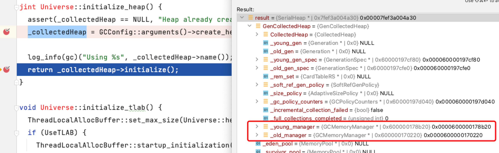
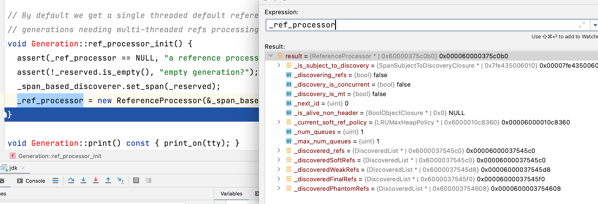
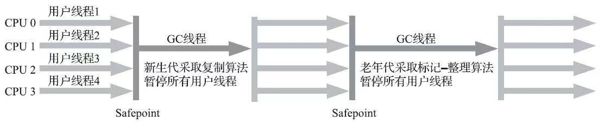

# SerialHeap

## 概念

`SerialHeap` 是用于 `Serial GC` 的 `CollectedHeap` 的实现。

堆在单个连续块中预先保留，分为两部分，新生代和老年代。新生代位于低地址，老年代位于高地址。代之间的边界地址是固定的。在一代内，已提交的内存向更高的地址增长。

从`serialHeap.hpp`可以看到以下注释，其中最大新生代分为`eden、from、to`区和老年代。

```c
// SerialHeap is the implementation of CollectedHeap for Serial GC.
//
// The heap is reserved up-front in a single contiguous block, split into two
// parts, the young and old generation. The young generation resides at lower
// addresses, the old generation at higher addresses. The boundary address
// between the generations is fixed. Within a generation, committed memory
// grows towards higher addresses.
//
//
// low                                                                              high
//
//                                              +-- generation boundary (fixed after startup)
//                                              |
// |<-    young gen (reserved MaxNewSize)     ->|<- old gen (reserved MaxOldSize) ->|
// +-----------------+--------+--------+--------+---------------+-------------------+
// |       eden      |  from  |   to   |        |      old      |                   |
// |                 |  (to)  | (from) |        |               |                   |
// +-----------------+--------+--------+--------+---------------+-------------------+
// |<-          committed            ->|        |<- committed ->|
//
```

## 初始化

`serialHeap`接口协议如下，包含了`eden、survivor、old`内存池，在`SerialHeap`初始化时候指定了垃圾回收算法，新生代使用`Copy`算法，老年代使用`MarkSweepCompact`算法。

```c
class SerialHeap : public GenCollectedHeap {
private:
  // eden内存池
  MemoryPool* _eden_pool;
  // survivor内存池
  MemoryPool* _survivor_pool;
  // 老年代
  MemoryPool* _old_pool;
  // 初始化
  virtual void initialize_serviceability();
}

SerialHeap::SerialHeap() :
    // 这里是父亲构造，会初始化回收次数，软引用策略
    GenCollectedHeap(Generation::DefNew,
                     Generation::MarkSweepCompact,
                     "Copy:MSC"),
    _eden_pool(NULL),
    _survivor_pool(NULL),
    _old_pool(NULL) {
  // 新生代使用复制算法
  _young_manager = new GCMemoryManager("Copy", "end of minor GC");
  // 老年代使用标记-整理算法
  _old_manager = new GCMemoryManager("MarkSweepCompact", "end of major GC");
}

GenCollectedHeap::GenCollectedHeap(Generation::Name young,
                                   Generation::Name old,
                                   const char* policy_counters_name) :
  CollectedHeap(),
  _young_gen(NULL),
  _old_gen(NULL),
  _young_gen_spec(new GenerationSpec(young,
                                     NewSize,
                                     MaxNewSize,
                                     GenAlignment)),
  _old_gen_spec(new GenerationSpec(old,
                                   OldSize,
                                   MaxOldSize,
                                   GenAlignment)),
  _rem_set(NULL),
  // 软引用策略
  _soft_ref_gen_policy(),
  _size_policy(NULL),
  _gc_policy_counters(new GCPolicyCounters(policy_counters_name, 2, 2)),
  _incremental_collection_failed(false),
  // fgc完成次数
  _full_collections_completed(0),
  _young_manager(NULL),
  _old_manager(NULL) {
}

CollectedHeap::CollectedHeap() :
  // 初始化一些默认参数，这里可以看到jvmstat提供查看的数据
  _capacity_at_last_gc(0),
  _used_at_last_gc(0),
  _is_gc_active(false),
  _last_whole_heap_examined_time_ns(os::javaTimeNanos()),
  _total_collections(0),
  _total_full_collections(0),
  _gc_cause(GCCause::_no_gc),
  _gc_lastcause(GCCause::_no_gc)
{
  const size_t max_len = size_t(arrayOopDesc::max_array_length(T_INT));
  const size_t elements_per_word = HeapWordSize / sizeof(jint);
  _filler_array_max_size = align_object_size(filler_array_hdr_size() +
                                             max_len / elements_per_word);
  NOT_PRODUCT(_promotion_failure_alot_count = 0;)
  NOT_PRODUCT(_promotion_failure_alot_gc_number = 0;)
  if (UsePerfData) {
    EXCEPTION_MARK;
    // 创建 gc 导致 jvmstat 计数器
    _perf_gc_cause = PerfDataManager::create_string_variable(SUN_GC, "cause",
                             80, GCCause::to_string(_gc_cause), CHECK);
    _perf_gc_lastcause =
                PerfDataManager::create_string_variable(SUN_GC, "lastCause",
                             80, GCCause::to_string(_gc_lastcause), CHECK);
  }
  // 日志相关，忽略
  if (LogEvents) {
    _gc_heap_log = new GCHeapLog();
  } else {
    _gc_heap_log = NULL;
  }
}

```

`_collectedHeap = GCConfig::arguments()->create_heap();`创建`SerialHeap`会设置两个内存管理器，其结果如图所示：



`_collectedHeap->initialize()`进行堆的初始化，不同空间使用不同`CollectedMemoryPool`，由于不同代使用算法会有所区别，所以在计算剩余空间时候需要不同算法计进行计算。

* `_eden_pool = ContiguousSpacePool` 新生代一般情况下使用复制算法，所以所以不需要进行分块，所以使用连续空间比较好
* `_survivor_pool = SurvivorContiguousSpacePool`
* `_old_pool = GenerationPool` 老年代对象一般存活对象占总比例比较多，所以使用`标记-清除`、`标记-整理`算法比较好

对于上面三个区域管理状况如下：

* `_young_manager`管理`_survivor_pool、_eden_pool`
* `_old_manager`管理`_old_pool、_survivor_pool、_eden_pool`

```c
void SerialHeap::initialize_serviceability() {

  // 配置不同的内存策略，新生代收集
  DefNewGeneration* young = young_gen();

  // 为每个空间添加一个内存池，年轻一代不支持低内存检测，因为它预计会被填满。
  _eden_pool = new ContiguousSpacePool(young->eden(),
                                       "Eden Space",
                                       young->max_eden_size(),
                                       false /* support_usage_threshold */);
  _survivor_pool = new SurvivorContiguousSpacePool(young,
                                                   "Survivor Space",
                                                   young->max_survivor_size(),
                                                   false /* support_usage_threshold */);
  // 老年代收集
  TenuredGeneration* old = old_gen();
  _old_pool = new GenerationPool(old, "Tenured Gen", true);

  _young_manager->add_pool(_eden_pool);
  _young_manager->add_pool(_survivor_pool);
  young->set_gc_manager(_young_manager);

  _old_manager->add_pool(_eden_pool);
  _old_manager->add_pool(_survivor_pool);
  _old_manager->add_pool(_old_pool);
  old->set_gc_manager(_old_manager);
}
```

模版方法`post_initialize`如下

```java
void GenCollectedHeap::post_initialize() {
  CollectedHeap::post_initialize();
  // 引用处理器，强、软、弱、虚
  ref_processing_init();
  DefNewGeneration* def_new_gen = (DefNewGeneration*)_young_gen;
  initialize_size_policy(def_new_gen->eden()->capacity(),
                         _old_gen->capacity(),
                         def_new_gen->from()->capacity());
  MarkSweep::initialize();
  ScavengableNMethods::initialize(&_is_scavengable);
}
```

`ref_processing_init`对于引用处理器可以查看下图：



`MarkSweep::initialize()`标记清除初始化，初始化代码如下：

```java
void MarkSweep::initialize() {
  MarkSweep::_gc_timer = new (ResourceObj::C_HEAP, mtGC) STWGCTimer();
  MarkSweep::_gc_tracer = new (ResourceObj::C_HEAP, mtGC) SerialOldTracer();
  MarkSweep::_string_dedup_requests = new StringDedup::Requests();
}
```

将堆注册到`MemoryService`进行管理，堆的初始化就结束了。

## 回收流程

::: tip
该图来自周志明[《深入理解Java虚拟机（第3版）》](https://book.douban.com/subject/34907497/)，如有侵权，请联系
:::


编写一段代码进行`GC`，查看调用栈，先查看`VM_GenCollectFull::doit()`，`inner_execute`中的`VM_Operation`使用了`commamd`设计模式

```java
Breakpoint reached: genCollectedHeap.cpp:882
Stack:
  GenCollectedHeap::do_full_collection(bool, GenCollectedHeap::GenerationType) genCollectedHeap.cpp:882
  VM_GenCollectFull::doit() gcVMOperations.cpp:191
  VM_Operation::evaluate() vmOperations.cpp:70
  VMThread::evaluate_operation(VM_Operation*) vmThread.cpp:282
  VMThread::inner_execute(VM_Operation*) vmThread.cpp:429
  VMThread::loop() vmThread.cpp:496
  VMThread::run() vmThread.cpp:175
  Thread::call_run() thread.cpp:358
  thread_native_entry(Thread*) os_bsd.cpp:575
  _pthread_start 0x00007ff81da4f4f4
  thread_start 0x00007ff81da4b00f
```

开启[safepoint](./safepoint.md)环绕切面，切面是否需要开启是根据当前命令进行判断的，垃圾回收核心代码在`evaluate_operation(_cur_vm_operation)`

```java
void VMThread::inner_execute(VM_Operation* op) {
  VM_Operation* prev_vm_operation = NULL;
  if (_cur_vm_operation != NULL) {
    if (!_cur_vm_operation->allow_nested_vm_operations()) {
      fatal("Unexpected nested VM operation %s requested by operation %s",
            op->name(), _cur_vm_operation->name());
    }
    op->set_calling_thread(_cur_vm_operation->calling_thread());
    prev_vm_operation = _cur_vm_operation;
  }
  // 上面都是一系列状态和操作校验，比如是否为虚拟机线程，还有当前操作是否支持
  _cur_vm_operation = op;

  HandleMark hm(VMThread::vm_thread());

  bool end_safepoint = false;
  bool has_timeout_task = (_timeout_task != nullptr);
  if (_cur_vm_operation->evaluate_at_safepoint() &&
      !SafepointSynchronize::is_at_safepoint()) {
    // 开启安全点
    SafepointSynchronize::begin();
    if (has_timeout_task) {
      _timeout_task->arm(_cur_vm_operation->name());
    }
    end_safepoint = true;
  }

  // 执行操作
  evaluate_operation(_cur_vm_operation);

  if (end_safepoint) {
    if (has_timeout_task) {
      _timeout_task->disarm();
    }
    // 关闭安全点
    SafepointSynchronize::end();
  }

  _cur_vm_operation = prev_vm_operation;
}

```

查看`command`，这里可以看到调用前面初始化`GenCollectedHeap`的`do_full_collection`方法

```java
void VM_GenCollectFull::doit() {
  SvcGCMarker sgcm(SvcGCMarker::FULL);

  GenCollectedHeap* gch = GenCollectedHeap::heap();
  GCCauseSetter gccs(gch, _gc_cause);
  // 真正回收
  gch->do_full_collection(gch->must_clear_all_soft_refs(), _max_generation);
}
```

方法为执行流程如下：

```c
void GenCollectedHeap::do_full_collection(bool clear_all_soft_refs,
                                          GenerationType last_generation) {
  do_collection(true,                   // full
                clear_all_soft_refs,    // clear_all_soft_refs
                0,                      // size
                false,                  // is_tlab
                last_generation);       // last_generation
  // 如果增量收集失败
  if (gc_cause() == GCCause::_gc_locker && incremental_collection_failed()) {
  // 这里会对老年代进行收集
    do_collection(true,                // full
                  clear_all_soft_refs, // clear_all_soft_refs
                  0,                   // size
                  false,               // is_tlab
                  OldGen);             // last_generation
  }
}
```

上面两个方法调用`do_collection`，垃圾回收真实的执行器

```java
void GenCollectedHeap::do_collection(bool           full,
                                     bool           clear_all_soft_refs,
                                     size_t         size,
                                     bool           is_tlab,
                                     GenerationType max_generation) {
  ResourceMark rm;
  DEBUG_ONLY(Thread* my_thread = Thread::current();)
  // 状态校验，安全点确定开启
  assert(SafepointSynchronize::is_at_safepoint(), "should be at safepoint");
  assert(my_thread->is_VM_thread(), "only VM thread");
  assert(Heap_lock->is_locked(),
         "the requesting thread should have the Heap_lock");
  // 保证gc还活着
  guarantee(!is_gc_active(), "collection is not reentrant");

  // gc不可用
  if (GCLocker::check_active_before_gc()) {
    return; // GC is disabled (e.g. JNI GetXXXCritical operation)
  }

  // 清除软引用
  const bool do_clear_all_soft_refs = clear_all_soft_refs ||
                          soft_ref_policy()->should_clear_all_soft_refs();

  ClearedAllSoftRefs casr(do_clear_all_soft_refs, soft_ref_policy());

  AutoModifyRestore<bool> temporarily(_is_gc_active, true);

  // 这里根据GenerationType，判断是否老年代收集
  bool complete = full && (max_generation == OldGen);
  // 这里判断是老年代收集还是新生代收集
  bool old_collects_young = complete && !ScavengeBeforeFullGC;
  bool do_young_collection = !old_collects_young && _young_gen->should_collect(full, size, is_tlab);
  const PreGenGCValues pre_gc_values = get_pre_gc_values();
  bool run_verification = total_collections() >= VerifyGCStartAt;
  bool prepared_for_verification = false;
  bool do_full_collection = false;

  if (do_young_collection) {
    GCIdMark gc_id_mark;
    GCTraceCPUTime tcpu;
    GCTraceTime(Info, gc) t("Pause Young", NULL, gc_cause(), true);
    print_heap_before_gc();
    if (run_verification && VerifyGCLevel <= 0 && VerifyBeforeGC) {
      prepare_for_verify();
      prepared_for_verification = true;
    }
    gc_prologue(complete);
    increment_total_collections(complete);
    // 新生代收集
    collect_generation(_young_gen,
                       full,
                       size,
                       is_tlab,
                       run_verification && VerifyGCLevel <= 0,
                       do_clear_all_soft_refs);
    if (size > 0 && (!is_tlab || _young_gen->supports_tlab_allocation()) &&
        size * HeapWordSize <= _young_gen->unsafe_max_alloc_nogc()) {
      size = 0;
    }
    do_full_collection = should_do_full_collection(size, full, is_tlab, max_generation);
    if (!do_full_collection) {
      _young_gen->compute_new_size();
      print_heap_change(pre_gc_values);
      MemoryService::track_memory_usage();
      gc_epilogue(complete);
    }
    print_heap_after_gc();
  } else {
    // 没有young collection，请问是否需要进行Full collection。
    do_full_collection = should_do_full_collection(size, full, is_tlab, max_generation);
  }

  // 需要老年代收集
  if (do_full_collection) {
    GCIdMark gc_id_mark;
    GCTraceCPUTime tcpu;
    GCTraceTime(Info, gc) t("Pause Full", NULL, gc_cause(), true);
    print_heap_before_gc();
    if (!prepared_for_verification && run_verification &&
        VerifyGCLevel <= 1 && VerifyBeforeGC) {
      prepare_for_verify();
    }
    if (!do_young_collection) {
      gc_prologue(complete);
      increment_total_collections(complete);
    }
    if (!complete) {
      increment_total_full_collections();
    }
    // 对于老年代的收集
    collect_generation(_old_gen,
                       full,
                       size,
                       is_tlab,
                       run_verification && VerifyGCLevel <= 1,
                       do_clear_all_soft_refs);

    // 修改大小
    _old_gen->compute_new_size();
    _young_gen->compute_new_size();
   // todo 其他省略
  }
}
```

从收集代码中，我们看到主要为`collect_generation`参数不同而已

```java
void GenCollectedHeap::collect_generation(Generation* gen, bool full, size_t size,
                                          bool is_tlab, bool run_verification, bool clear_soft_refs) {
  // 这里是垃圾回收核心代码
  {
    save_marks();
    // 引用处理器
    ReferenceProcessor* rp = gen->ref_processor();
    rp->start_discovery(clear_soft_refs);
    // 这里会调用真是策略，如果gen为新生代就调用新生代
    // 如果为老年代就调用老年代收集
    gen->collect(full, clear_soft_refs, size, is_tlab);
    rp->disable_discovery();
    rp->verify_no_references_recorded();
  }
}
```

### 新生代收集

新生代使用复制算法，复制算法可以参考[《垃圾回收的算法与实现》](https://book.douban.com/subject/26821357/)，对象之间引用关系为图论，在复制时，使用了图论中的深度优先、广度优先，两种方式各有利弊，优化方案，书中均有讲解。

```java
  // 处理晋升失败
  // 如果在收集期，一个对象不能从eden或from空间复制出来，新生代收集失败
  // Handling promotion failure.  A young generation collection
  // can fail if a live object cannot be copied out of its
  // location in eden or from-space during the collection.  If
  // 如果收集失败，年轻代将保持一致状态，以便可以通过完整收集进行收集
  // a collection fails, the young generation is left in a
  // consistent state such that it can be collected by a
  // full collection.
  //   收集前
  //   Before the collection
  //     对象在eden或from
  //     Objects are in eden or from-space
  //     所有进入年轻代的根都指向伊甸园或来自空间，这里的意思是没有跨代引用
  //     All roots into the young generation point into eden or from-space.
  //   收集后
  //   After a failed collection
  //     对象可能在eden from 或 to
  //     Objects may be in eden, from-space, or to-space
  //  在eden或from的a对象复制到to的b对象
  //     An object A in eden or from-space may have a copy B
  //  如果b存在，曾经指向 A 的所有根现在都必须指向 B
  //       in to-space.  If B exists, all roots that once pointed
  //       to A must now point to B.
  //  年轻代中的所有对象都没有标记
  //     All objects in the young generation are unmarked.
  //  fgc时候，Eden、 from-space、 to-space三个空间都会被回收
  //     Eden, from-space, and to-space will all be collected by
  //       the full collection.
  void handle_promotion_failure(oop);
```

新生代在回收时候比较麻烦，涉及到晋升失败问题，具体形容如上面注释。

```c
void DefNewGeneration::collect(bool   full,
                               bool   clear_all_soft_refs,
                               size_t size,
                               bool   is_tlab) {
  // todo 其他忽略
  // 初始化状态以乐观地假设不会发生升级失败
  init_assuming_no_promotion_failure();

  GCTraceTime(Trace, gc, phases) tm("DefNew", NULL, heap->gc_cause());

  heap->trace_heap_before_gc(&gc_tracer);

  IsAliveClosure is_alive(this);
  ScanWeakRefClosure scan_weak_ref(this);

  age_table()->clear();
  to()->clear(SpaceDecorator::Mangle);
  _preserved_marks_set.init(1);
  DefNewScanClosure       scan_closure(this);
  DefNewYoungerGenClosure younger_gen_closure(this, _old_gen);

  CLDScanClosure cld_scan_closure(&scan_closure);

  set_promo_failure_scan_stack_closure(&scan_closure);
  FastEvacuateFollowersClosure evacuate_followers(heap,
                                                  &scan_closure,
                                                  &younger_gen_closure);
  {
    StrongRootsScope srs(0);
  // 根结点进行扫描
    heap->young_process_roots(&scan_closure,
                              &younger_gen_closure,
                              &cld_scan_closure);
  }
  evacuate_followers.do_void();
  FastKeepAliveClosure keep_alive(this, &scan_weak_ref);
  // 引用处理器
  ReferenceProcessor* rp = ref_processor();
  ReferenceProcessorPhaseTimes pt(_gc_timer, rp->max_num_queues());
  SerialGCRefProcProxyTask task(is_alive, keep_alive, evacuate_followers);
  const ReferenceProcessorStats& stats = rp->process_discovered_references(task, pt);
  gc_tracer.report_gc_reference_stats(stats);
  gc_tracer.report_tenuring_threshold(tenuring_threshold());
  pt.print_all_references();
  WeakProcessor::weak_oops_do(&is_alive, &keep_alive);
  _string_dedup_requests.flush();
  // 如果晋升没有失败
  if (!_promotion_failed) {
   // 交换幸存者空间
    eden()->clear(SpaceDecorator::Mangle);
    from()->clear(SpaceDecorator::Mangle);
    if (ZapUnusedHeapArea) {
      to()->mangle_unused_area();
    }
    swap_spaces();
    adjust_desired_tenuring_threshold();
    AdaptiveSizePolicy* size_policy = heap->size_policy();
    size_policy->reset_gc_overhead_limit_count();
  } else {
    _promo_failure_scan_stack.clear(true);
    remove_forwarding_pointers();
    swap_spaces();   // For uniformity wrt ParNewGeneration.
    from()->set_next_compaction_space(to());
    heap->set_incremental_collection_failed();
    _old_gen->promotion_failure_occurred();
    gc_tracer.report_promotion_failed(_promotion_failed_info);
    NOT_PRODUCT(heap->reset_promotion_should_fail();)
  }
  _preserved_marks_set.reclaim();
  heap->trace_heap_after_gc(&gc_tracer);
  _gc_timer->register_gc_end();
  gc_tracer.report_gc_end(_gc_timer->gc_end(), _gc_timer->time_partitions());
}
```

### 老年代收集

老年代收集代码如下：

```c
void TenuredGeneration::collect(bool   full,
                                bool   clear_all_soft_refs,
                                size_t size,
                                bool   is_tlab) {
  GenCollectedHeap* gch = GenCollectedHeap::heap();
  ReferenceProcessorSpanMutator
    x(ref_processor(), gch->reserved_region());
  // 记录开始时间
  STWGCTimer* gc_timer = GenMarkSweep::gc_timer();
  gc_timer->register_gc_start();
  SerialOldTracer* gc_tracer = GenMarkSweep::gc_tracer();
  gc_tracer->report_gc_start(gch->gc_cause(), gc_timer->gc_start());
  // 前置操作
  gch->pre_full_gc_dump(gc_timer);
  // 核心代码
  GenMarkSweep::invoke_at_safepoint(ref_processor(), clear_all_soft_refs);
  // 后置操作
  gch->post_full_gc_dump(gc_timer);
  // 记录结束时间
  gc_timer->register_gc_end();
  gc_tracer->report_gc_end(gc_timer->gc_end(), gc_timer->time_partitions());
}
```

`GenMarkSweep::invoke_at_safepoint`可以看到其使用方式为标记整理，核心流程为:

<mermaid style="margin-bottom: 0px">
graph LR
    A[生成临时数据栈] --> B[标记活动对象]
    B --> C[计算新地址]
    C --> D[更新指针]
    D --> E[将对象移动到新位置]
</mermaid>

```c
void GenMarkSweep::invoke_at_safepoint(ReferenceProcessor* rp, bool clear_all_softrefs) {
  GenCollectedHeap* gch = GenCollectedHeap::heap();
#ifdef ASSERT
  if (gch->soft_ref_policy()->should_clear_all_soft_refs()) {
    assert(clear_all_softrefs, "Policy should have been checked earlier");
  }
#endif
  set_ref_processor(rp);
  gch->trace_heap_before_gc(_gc_tracer);
  _total_invocations++;
  gch->save_used_regions();
  // 用于遍历和存储恢复标记的临时数据结构
  allocate_stacks();
  // 标记活动对象
  mark_sweep_phase1(clear_all_softrefs);
  // 计算新地址
  mark_sweep_phase2();
  // 在第 3 阶段不要再添加任何派生指针
#if COMPILER2_OR_JVMCI
  assert(DerivedPointerTable::is_active(), "Sanity");
  DerivedPointerTable::set_active(false);
#endif
  // 更新指针
  mark_sweep_phase3();
  // 将对象移动到新位置
  mark_sweep_phase4();
  restore_marks();
  gch->save_marks();
  deallocate_stacks();
  MarkSweep::_string_dedup_requests->flush();
  CardTableRS* rs = gch->rem_set();
  Generation* old_gen = gch->old_gen();
  if (gch->young_gen()->used() == 0) {
    rs->clear_into_younger(old_gen);
  } else {
    rs->invalidate_or_clear(old_gen);
  }
  gch->prune_scavengable_nmethods();
  set_ref_processor(NULL);
  Universe::heap()->update_capacity_and_used_at_gc();
  Universe::heap()->record_whole_heap_examined_timestamp();
  gch->trace_heap_after_gc(_gc_tracer);
}
```

## 总结

::: tip
算法参考[《垃圾回收的算法与实现》](https://book.douban.com/subject/26821357/)
:::

* 新生代使用`复制算法`
* 老年代使用`标记--整理算法`
