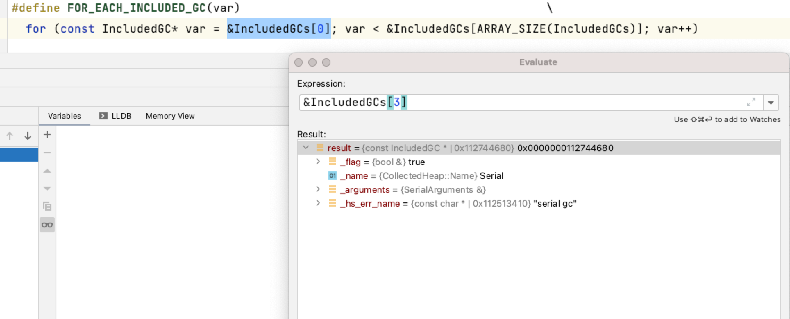

# jvm-select

启动虚拟机时增加 `-XX:` 参数可以选择不同类型的垃圾回收器，垃圾回收器主要分为两大类：吞吐量、最大停顿时间。不同版本`jvm`下可以选择的垃圾回收有所变化。
现在查看不同版本怎么选择垃圾回收器。

[javase8](https://docs.oracle.com/javase/8/docs/technotes/guides/vm/gctuning/collectors.html#sthref27)

* 如果应用程序的数据集很小（最高可达100MB），那么选择单线程序列收集器，使用参数`-XX:+UseSerialGC`
* 如果应用程序将在单个处理器上运行，并且没有暂停时间要求，则让`VM`选择收集器，或选择具有`-XX:+UseSerialGC`选项的单线程收集器
* 如果峰值应用程序性能是第一个优先级，并且没有暂停时间要求或暂停1秒或更长时间是可以接受的，那么让VM选择集器，或选择带有`-XX:+UseParallelGC`的并行集器
* 如果响应时间比整体吞吐量更重要，并且垃圾收集暂停时间必须缩短约1秒，请选择具有`-XX:+UseConcMarkSweepGC`或`-XX:+UseG1GC`的并发收集器

其他版本省略...

[javase17](https://docs.oracle.com/en/java/javase/17/gctuning/available-collectors.html#GUID-F215A508-9E58-40B4-90A5-74E29BF3BD3C)

* 如果应用程序的数据集很小（最高可达100MB），那么选择单线程序列收集器，使用参数`-XX:+UseSerialGC`
* 如果应用程序将在单个处理器上运行，并且没有暂停时间要求，则让VM选择收集器，或选择具有`-XX:+UseSerialGC`选项的单线程收集器
* 如果响应时间比整体吞吐量更重要，并且垃圾收集暂停时间必须缩短，那么请选择主要并发的收集器与`-XX:+UseG1GC`
* 如果响应时间是高优先级，请选择一个具有`-XX:UseZGC`的完全并发集器。

## 启动顺序

使用`-XX:+UseSerialGC`启动`jvm`查看垃圾回收器的启动顺序，垃圾回收器启动对配置文件`config = gcConfig`初始化，调用栈关系如下：

```C
Breakpoint reached: gcConfig.cpp:144
Stack: 
  GCConfig::select_gc() gcConfig.cpp:146
  GCConfig::initialize() gcConfig.cpp:179
  Arguments::set_ergonomics_flags() arguments.cpp:1610
  Arguments::apply_ergo() arguments.cpp:4053
  Threads::create_vm(JavaVMInitArgs*, bool*) thread.cpp:2714
  ::JNI_CreateJavaVM(JavaVM **, void **, void *) jni.cpp:3613
  ::JNI_CreateJavaVM(JavaVM **, void **, void *) jni.cpp:3701
  JavaMain java.c:1459
  JavaMain java.c:411
  ThreadJavaMain java_md_macosx.m:722
  _pthread_start 0x00007ff8121814f4
  thread_start 0x00007ff81217d00f
```

`GCConfig`初始化时候会选择一个垃圾回收器类型，从`GCConfig::initialize`方法中可以看出。

```C
void GCConfig::initialize() {
  // 选择gc
  _arguments = select_gc();
}

GCArguments* GCConfig::select_gc() {
  fail_if_non_included_gc_is_selected();
  // 异常退出
  if (is_no_gc_selected()) {
    select_gc_ergonomically();
    if (is_no_gc_selected()) {
      vm_exit_during_initialization("Garbage collector not selected "
                                    "(default collector explicitly disabled)", NULL);
    }
    _gc_selected_ergonomically = true;
  }
  // 异常退出
  if (!is_exactly_one_gc_selected()) {
    vm_exit_during_initialization("Multiple garbage collectors selected", NULL);
  }
  
  // 这里会选择垃圾回收器
  FOR_EACH_INCLUDED_GC(gc) {
    // 如果开启返回结果
    if (gc->_flag) {
      return &gc->_arguments;
    }
  }
  // 没有找到，应用程序启动失败
  fatal("Should have found the selected GC");
  return NULL;
}
```

`FOR_EACH_INCLUDED_GC`会调用宏代码，代码如下：

```C
#define FOR_EACH_INCLUDED_GC(var)                                            \
  for (const IncludedGC* var = &IncludedGCs[0]; var < &IncludedGCs[ARRAY_SIZE(IncludedGCs)]; var++)
```

整个数组的情况如下，并且从`IncludedGC`结构中可以看到参数分别为`flag、name、arguments、hs_err_name`，这里的`flag`是否开启标记根据`command  line flag`设置的。`flag = true`就是`-XX:`设置选择的垃圾回收器。

```C
// Table of included GCs, for translating between command
// line flag, CollectedHeap::Name and GCArguments instance.
static const IncludedGC IncludedGCs[] = {
   EPSILONGC_ONLY_ARG(IncludedGC(UseEpsilonGC,       CollectedHeap::Epsilon,    epsilonArguments,    "epsilon gc"))
        G1GC_ONLY_ARG(IncludedGC(UseG1GC,            CollectedHeap::G1,         g1Arguments,         "g1 gc"))
  PARALLELGC_ONLY_ARG(IncludedGC(UseParallelGC,      CollectedHeap::Parallel,   parallelArguments,   "parallel gc"))
    SERIALGC_ONLY_ARG(IncludedGC(UseSerialGC,        CollectedHeap::Serial,     serialArguments,     "serial gc"))
SHENANDOAHGC_ONLY_ARG(IncludedGC(UseShenandoahGC,    CollectedHeap::Shenandoah, shenandoahArguments, "shenandoah gc"))
         ZGC_ONLY_ARG(IncludedGC(UseZGC,             CollectedHeap::Z,          zArguments,          "z gc"))
};

struct IncludedGC {
  bool&               _flag;
  CollectedHeap::Name _name;
  GCArguments&        _arguments;
  const char*         _hs_err_name;

  IncludedGC(bool& flag, CollectedHeap::Name name, GCArguments& arguments, const char* hs_err_name) :
      _flag(flag), _name(name), _arguments(arguments), _hs_err_name(hs_err_name) {}
};
```

`jvm`启动时，使用的参数为`-XX:+UseSerialGC`，可以从下图中看到`SerialGC`的`flag = true`，其他垃圾回收器为`flag = false`。




`GCConfig::initialize`会将`_arguments`设置成`SerialArguments`，这里是工厂设计模式，`SerialArguments`代码如下：

```C
class CollectedHeap;

class SerialArguments : public GenArguments {
private:
  virtual CollectedHeap* create_heap();
};
// 工厂设计模式
CollectedHeap* SerialArguments::create_heap() {
  return new SerialHeap();
}
```

工厂创建对象进行初始化，这里已经指定了初始化堆`SerialHeap`的类型。

```C
Breakpoint reached: serialHeap.cpp:53
Stack: 
  SerialHeap::initialize_serviceability() serialHeap.cpp:57
  // 模版方法
  GenCollectedHeap::post_initialize() genCollectedHeap.cpp:195
  universe_post_init() universe.cpp:1019
  // 初始化全局
  init_globals() init.cpp:156
  Threads::create_vm(JavaVMInitArgs*, bool*) thread.cpp:2813
  ::JNI_CreateJavaVM(JavaVM **, void **, void *) jni.cpp:3613
  ::JNI_CreateJavaVM(JavaVM **, void **, void *) jni.cpp:3701
  JavaMain java.c:1459
  JavaMain java.c:411
  ThreadJavaMain java_md_macosx.m:722
  _pthread_start 0x00007ff8121814f4
  thread_start 0x00007ff81217d00f
```

`post_initialize`模版方法会调用底层实现策略，进行堆垃圾回收设定，关于[SerialHeap](./SerialHeap)

```C
void GenCollectedHeap::post_initialize() {
  // 会进行策略分发
  CollectedHeap::post_initialize();
  ref_processing_init();
  // 新生代使用DefNewGeneration
  DefNewGeneration* def_new_gen = (DefNewGeneration*)_young_gen;
  initialize_size_policy(def_new_gen->eden()->capacity(),
                         _old_gen->capacity(),
                         def_new_gen->from()->capacity());
  MarkSweep::initialize();
  ScavengableNMethods::initialize(&_is_scavengable);
}
```

## 总结

虚拟机在创建虚拟机时会根据参数选择不同虚拟机垃圾回收进行启动，并在`post_initialize`调用策略进行初始化。
