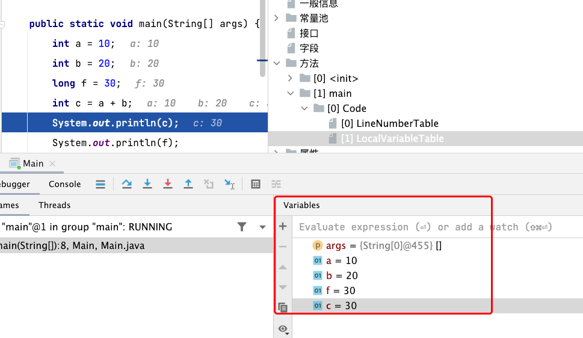
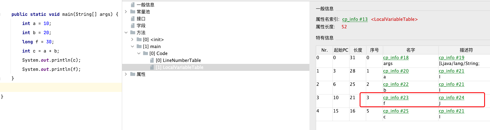
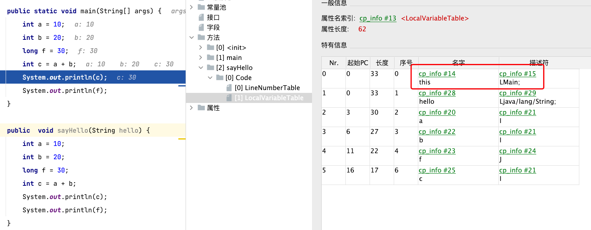

# 栈帧

::: tip 官方文档
A frame is used to store data and partial results, as well as to perform dynamic linking, return values for methods, and dispatch exceptions.

A new frame is created each time a method is invoked. A frame is destroyed when its method invocation completes, whether that completion is normal or abrupt (it throws an uncaught exception). Frames are allocated from the Java Virtual Machine stack (§2.5.2) of the thread creating the frame. Each frame has its own array of local variables (§2.6.1), its own operand stack (§2.6.2), and a reference to the run- time constant pool (§2.5.5) of the class of the current method.

A frame may be extended with additional implementation-specific information, such as debugging information.

The sizes of the local variable array and the operand stack are determined at compile-time and are supplied along with the code for the method associated with the frame (§4.7.3). Thus the size of the frame data structure depends only on the implementation of the Java Virtual Machine, and the memory for these structures can be allocated simultaneously on method invocation.

Only one frame, the frame for the executing method, is active at any point in a given thread of control. This frame is referred to as the current frame, and its method is known as the current method. The class in which the current method is defined is the current class. Operations on local variables and the operand stack are typically with reference to the current frame.

A frame ceases to be current if its method invokes another method or if its method completes. When a method is invoked, a new frame is created and becomes current when control transfers to the new method. On method return, the current frame passes back the result of its method invocation, if any, to the previous frame. The current frame is then discarded as the previous frame becomes the current one.

Note that a frame created by a thread is local to that thread and cannot be referenced by any other thread.
:::

`frame`用于存储数据和部分结果，以及执行动态链接、返回方法值和调度异常。
每次调用方法时都会创建一个新帧。当帧的方法调用完成时，无论该完成是正常还是突然的（它抛出未捕获的异常）都会被销毁。
帧从创建帧的线程的Java虚拟机堆栈（§2.5.2）中分配。每个帧都有自己的局部变量数组（§2.6.1），自己的操作数堆栈（§2.6.2），以及对当前方法类的运行时间常量池的引用（§2.5.5）。

`frame`可能会扩展为额外的特定于实现的信息，例如调试信息。

本地变量数组和操作数堆栈的大小在编译时确定，并与与框架关联的方法的代码一起提供（§4.7.3）。因此，框架数据结构的大小仅取决于Java虚拟机的实现，这些结构的内存可以在方法调用的基础上同时分配。

只有一个`frame`，即执行方法的`frame`，在给定控制线程的任何点处于活动状态。此帧称为当前帧，其方法称为当前方法。定义当前方法的类是当前类。局部变量和操作数堆栈的操作通常参考当前帧。

如果帧的方法调用其他方法或其方法完成，则帧将不再是当前。调用方法时，将创建一个新帧，并在控件转移到新方法时成为当前帧。在方法返回时，当前帧将其方法调用的结果（如果有的话）传回到上一个帧。然后，当上一帧成为当前帧时，当前帧将被丢弃。

请注意，线程创建的帧是该线程的本地帧，任何其他线程都无法引用。

编译代码查看字节码。

```java
public class Main {
   public static void main(String[] args) {
        int a = 10;
        int b = 20;
        long f = 30;
        int c = a + b;
        System.out.println(c);
        System.out.println(f);
    }
}

renfakai@renfakaideMacBook-Pro java % javac Main.java
renfakai@renfakaideMacBook-Pro java % javap -v Main

  public static void main(java.lang.String[]);
    descriptor: ([Ljava/lang/String;)V
    flags: ACC_PUBLIC, ACC_STATIC
    Code:
      stack=3, locals=6, args_size=1
         0: bipush        10
         2: istore_1
         3: bipush        20
         5: istore_2
         6: ldc2_w        #2                  // long 30l
         9: lstore_3
        10: iload_1
        11: iload_2
        12: iadd
        13: istore        5
        15: getstatic     #4                  // Field java/lang/System.out:Ljava/io/PrintStream;
        18: iload         5
        20: invokevirtual #5                  // Method java/io/PrintStream.println:(I)V
        23: getstatic     #4                  // Field java/lang/System.out:Ljava/io/PrintStream;
        26: lload_3
        27: invokevirtual #6                  // Method java/io/PrintStream.println:(J)V
        30: return
      LineNumberTable:
        line 4: 0
        line 5: 3
        line 6: 6
        line 7: 10
        line 8: 15
        line 9: 23
        line 10: 30
```

从源码中很容易看到局部变量表和操作数栈。

```java
class InterpreterFrameClosure : public OffsetClosure {
 private:
  const frame* _fr;
  OopClosure*  _f;
  int          _max_locals;
  int          _max_stack;

 public:
  InterpreterFrameClosure(const frame* fr, int max_locals, int max_stack,
                          OopClosure* f) {
    _fr         = fr;
    // 最大局部变量表
    _max_locals = max_locals;
    // 操作数栈
    _max_stack  = max_stack;
    _f          = f;
  }
// todo 其他省略
}
```

## Local Variables

::: tip 官方文档
Each frame (§2.6) contains an array of variables known as its local variables. The length of the local variable array of a frame is determined at compile-time and supplied in the binary representation of a class or interface along with the code for the method associated with the frame (§4.7.3).

A single local variable can hold a value of type boolean, byte, char, short, int, float, reference, or returnAddress. A pair of local variables can hold a value of type long or double.

Local variables are addressed by indexing. The index of the first local variable is zero. An integer is considered to be an index into the local variable array if and only if that integer is between zero and one less than the size of the local variable array.

A value of type long or type double occupies two consecutive local variables. Such a value may only be addressed using the lesser index. For example, a value of type double stored in the local variable array at index n actually occupies the local variables with indices n and n+1; however, the local variable at index n+1 cannot be loaded from. It can be stored into. However, doing so invalidates the contents of local variable n.

The Java Virtual Machine does not require n to be even. In intuitive terms, values of types long and double need not be 64-bit aligned in the local variables array. Implementors are free to decide the appropriate way to represent such values using the two local variables reserved for the value.

The Java Virtual Machine uses local variables to pass parameters on method invocation. On class method invocation, any parameters are passed in consecutive local variables starting from local variable 0. On instance method invocation, local variable 0 is always used to pass a reference to the object on which the instance method is being invoked (this in the Java programming language). Any parameters are subsequently passed in consecutive local variables starting from local variable 1.
:::

每个框架（§2.6）都包含一个变量数组，称为其局部变量。框架的局部变量数组的长度在编译时确定，并与与框架关联的方法的代码一起在类或接口的二进制表示形式中提供（§4.7.3）。

从上面字节码可以看到`stack=3, locals=6, args_size=1`，这里主要是`locals=6`。这个在编译时期就知道了。

* 使用`idea`进行`debug`查看


* 使用[jclasslib Bytecode Viewer](https://plugins.jetbrains.com/plugin/9248-jclasslib-bytecode-viewer)插件查看


单个本地变量可以保存`boolean, byte, char, short, int, float, reference, or returnAddress`。一对局部变量可以保存`long、double`。

局部变量通过索引解决。第一个局部变量的索引为零。只有当整数小于本地变量数组的大小在零到1之间时，整数才被视为本地变量数组的索引。

类型`long、double`的值占用两个连续的局部变量。这种值只能使用较小的索引来解决。例如，索引`n`的本地变量数组中的双类型值实际上占用了索引`n`和`n+1`的本地变量；但是，索引`n+1`的本地变量无法从中加载。它可以存储在里面。然而，这样做会使局部变量n的内容无效。
从第二章图中可以看出使用第3～4两个`solt`保存一个`long`类型。

Java虚拟机不需要`n`才能均匀。直觉上讲，在局部变量数组中，`long、double`的值不需要64位对齐。实现者可以使用为该值保留的两个局部变量自由决定表示此类值的适当方式。

Java虚拟机使用本地变量在方法调用上传递参数。在类方法调用中，任何参数都在从`locals[0]`开始的连续局部变量中传递。在实例方法调用中，`locals[0]`总是用于向调用实例方法的对象传递引用（在Java编程语言中）。从局部变量`locals[1]`开始，任何参数随后都会在连续的局部变量中传递。

这句话的意思是实例方法第0个槽存储this，详情见图。



## Operand Stacks

::: tip 官方文档
Each frame (§2.6) contains a last-in-first-out (LIFO) stack known as its operand stack. The maximum depth of the operand stack of a frame is determined at compile-time and is supplied along with the code for the method associated with the frame (§4.7.3).

Where it is clear by context, we will sometimes refer to the operand stack of the current frame as simply the operand stack.

The operand stack is empty when the frame that contains it is created. The Java Virtual Machine supplies instructions to load constants or values from local variables or fields onto the operand stack. Other Java Virtual Machine instructions take operands from the operand stack, operate on them, and push the result back onto the operand stack. The operand stack is also used to prepare parameters to be passed to methods and to receive method results.

For example, the iadd instruction (§iadd) adds two int values together. It requires that the int values to be added be the top two values of the operand stack, pushed there by previous instructions. Both of the int values are popped from the operand stack. They are added, and their sum is pushed back onto the operand stack. Subcomputations may be nested on the operand stack, resulting in values that can be used by the encompassing computation.

Each entry on the operand stack can hold a value of any Java Virtual Machine type, including a value of type long or type double.

Values from the operand stack must be operated upon in ways appropriate to their types. It is not possible, for example, to push two int values and subsequently treat them as a long or to push two float values and subsequently add them with an iadd instruction. A small number of Java Virtual Machine instructions (the dup instructions (§dup) and swap (§swap)) operate on run-time data areas as raw values without regard to their specific types; these instructions are defined in such a way that they cannot be used to modify or break up individual values. These restrictions on operand stack manipulation are enforced through class file verification (§4.10).
At any point in time, an operand stack has an associated depth, where a value of type long or double contributes two units to the depth and a value of any other type contributes one unit.
:::

每个帧（§2.6）包含一个最后的先出（LIFO）堆栈，称为其操作数堆栈。框架操作数堆栈的最大深度在编译时确定，并与与框架关联的方法的代码一起提供（§4.7.3）。
从`stack=3, locals=6, args_size=1`中`stack=3`表明了操作数栈已经在编译期确定了。

在上下文清晰的地方，我们有时会将当前帧的操作数堆栈简单地称为操作数堆栈。

创建包含操作数堆栈的帧时，操作数堆栈为空。Java虚拟机提供将常量或值从本地变量或字段加载到操作数堆栈的说明。其他Java虚拟机指令从操作数堆栈中获取操作数，对其进行操作，并将结果推回操作数堆栈。操作数堆栈还用于准备要传递给方法的参数并接收方法结果。

例如，iadd指令（§iadd）一起添加了两个int值。它要求要添加的int值是操作数堆栈的前两个值，由之前的指令推送到那里。这两个int值都是从操作数堆栈中弹出的。它们被添加，它们的和被推回操作数堆栈上。子计算可以嵌套在操作数堆栈上，从而产生包含计算可以使用的值。

操作数堆栈上的每个条目都可以包含任何Java虚拟机类型的值，包括类型`double、long`的值。

操作数堆栈中的值必须以适合其类型的方式操作。例如，不可能推送两个整数值，然后将它们视为长值，或者推送两个浮点值，然后用iadd指令添加它们。少数Java虚拟机指令（dup指令（§dup）和swap（§swap））作为原始值在运行时数据区域上运行，而不考虑其特定类型；这些指令的定义方式使其不能用于修改或分解单个值。这些对操作数堆栈操作的限制是通过类文件验证（§4.10）强制执行的。

在任何时候，操作数堆栈都有关联的深度，其中类型`double、long`的值为深度贡献两个单位，任何其他类型的值贡献一个单位。

具体操作数栈使用可以参考[翻译introduction-to-java-bytecode](/languages/java/introduction-to-java-bytecode.md#字节码探索)

## Dynamic Linking

::: tip 官方文档
Each frame (§2.6) contains a reference to the run-time constant pool (§2.5.5) for the type of the current method to support dynamic linking of the method code. The class file code for a method refers to methods to be invoked and variables to be accessed via symbolic references. Dynamic linking translates these symbolic method references into concrete method references, loading classes as necessary to resolve as-yet-undefined symbols, and translates variable accesses into appropriate offsets in storage structures associated with the run-time location of these variables.

This late binding of the methods and variables makes changes in other classes that a method uses less likely to break this code.
:::

每个框架（§2.6）都包含对当前方法类型的运行时常量池（§2.5.5）的引用，以支持方法代码的动态链接。方法的类文件代码是指要调用的方法和要通过符号引用访问的变量。动态链接将这些符号方法引用转换为具体的方法引用，必要时加载类以解决尚未定义的符号，并将变量访问转换为与这些变量的运行时位置相关的存储结构中适当的偏移量。

例如下面字节码中的`invokevirtual #5`就会找到方法引用`#5 = Methodref          #20.#21`，在进一步查找`#20 = Class              #28,#28 = Utf8               java/io/PrintStream`.`#21 = NameAndType        #29:#30, #29 = Utf8               println,#30 = Utf8               (I)V`方法。

方法和变量的这种延迟绑定使方法使用的其他类的更改不太可能破坏此代码。

```java

Constant pool:
   #1 = Methodref          #8.#17         // java/lang/Object."<init>":()V
   #2 = Long               30l
   #4 = Fieldref           #18.#19        // java/lang/System.out:Ljava/io/PrintStream;
   #5 = Methodref          #20.#21        // java/io/PrintStream.println:(I)V
   #6 = Methodref          #20.#22        // java/io/PrintStream.println:(J)V
   #7 = Class              #23            // Main
   #8 = Class              #24            // java/lang/Object
   #9 = Utf8               <init>
  #10 = Utf8               ()V
  #11 = Utf8               Code
  #12 = Utf8               LineNumberTable
  #13 = Utf8               main
  #14 = Utf8               ([Ljava/lang/String;)V
  #15 = Utf8               SourceFile
  #16 = Utf8               Main.java
  #17 = NameAndType        #9:#10         // "<init>":()V
  #18 = Class              #25            // java/lang/System
  #19 = NameAndType        #26:#27        // out:Ljava/io/PrintStream;
  #20 = Class              #28            // java/io/PrintStream
  #21 = NameAndType        #29:#30        // println:(I)V
  #22 = NameAndType        #29:#31        // println:(J)V
  #23 = Utf8               Main
  #24 = Utf8               java/lang/Object
  #25 = Utf8               java/lang/System
  #26 = Utf8               out
  #27 = Utf8               Ljava/io/PrintStream;
  #28 = Utf8               java/io/PrintStream
  #29 = Utf8               println
  #30 = Utf8               (I)V
  #31 = Utf8               (J)V

public static void main(java.lang.String[]);
    descriptor: ([Ljava/lang/String;)V
    flags: ACC_PUBLIC, ACC_STATIC
    Code:
      stack=3, locals=6, args_size=1
         0: bipush        10
         2: istore_1
         3: bipush        20
         5: istore_2
         6: ldc2_w        #2                  // long 30l
         9: lstore_3
        10: iload_1
        11: iload_2
        12: iadd
        13: istore        5
        15: getstatic     #4                  // Field java/lang/System.out:Ljava/io/PrintStream;
        18: iload         5
        20: invokevirtual #5                  // Method java/io/PrintStream.println:(I)V
        23: getstatic     #4                  // Field java/lang/System.out:Ljava/io/PrintStream;
        26: lload_3
        27: invokevirtual #6                  // Method java/io/PrintStream.println:(J)V
        30: return
```

## Normal Method Invocation Completion

::: tip 官方文档
A method invocation completes normally if that invocation does not cause an exception (§2.10) to be thrown, either directly from the Java Virtual Machine or as a result of executing an explicit throw statement. If the invocation of the current method completes normally, then a value may be returned to the invoking method. This occurs when the invoked method executes one of the return instructions (§2.11.8), the choice of which must be appropriate for the type of the value being returned (if any).
The current frame (§2.6) is used in this case to restore the state of the invoker, including its local variables and operand stack, with the program counter of the invoker appropriately incremented to skip past the method invocation instruction.

Execution then continues normally in the invoking method's frame with the returned value (if any) pushed onto the operand stack of that frame.
:::

如果方法调用不会导致直接从Java虚拟机或执行显式抛出语句而引发异常（§2.10），则方法调用通常完成。如果当前方法的调用正常完成，则可以返回调用方法的值。当调用的方法执行其中一个返回指令时，就会发生这种情况（§2.11.8），其选择必须适合返回的值类型（如果有的话）。

在这种情况下，当前框架（§2.6）用于恢复调用者的状态，包括其局部变量和操作数堆栈，并适当增加调用者的程序计数器，以跳过方法调用指令。然后，执行在调用方法的帧中正常继续，返回的值（如果有的话）推送到该帧的操作数堆栈上。

## Abrupt Method Invocation Completion

::: tip 官方文档
A method invocation completes abruptly if execution of a Java Virtual Machine instruction within the method causes the Java Virtual Machine to throw an exception (§2.10), and that exception is not handled within the method. Execution of an athrow instruction (§athrow) also causes an exception to be explicitly thrown and, if the exception is not caught by the current method, results in abrupt method invocation completion. A method invocation that completes abruptly never returns a value to its invoker.
:::

如果方法内Java虚拟机指令的执行导致Java虚拟机抛出异常（§2.10），并且该异常不在方法内处理，则方法调用将突然完成。执行抛出指令（§athrow）也会导致显式抛出异常，如果当前方法没有捕获异常，则会导致突然完成方法调用。突然完成的方法调用永远不会向其调用器返回值。

## 参考资料

* [Introduction to Java Bytecode](https://dzone.com/articles/introduction-to-java-bytecode)
* [The Java® VirtualMachine Specification](https://docs.oracle.com/javase/specs/jvms/se17/jvms17.pdf)
