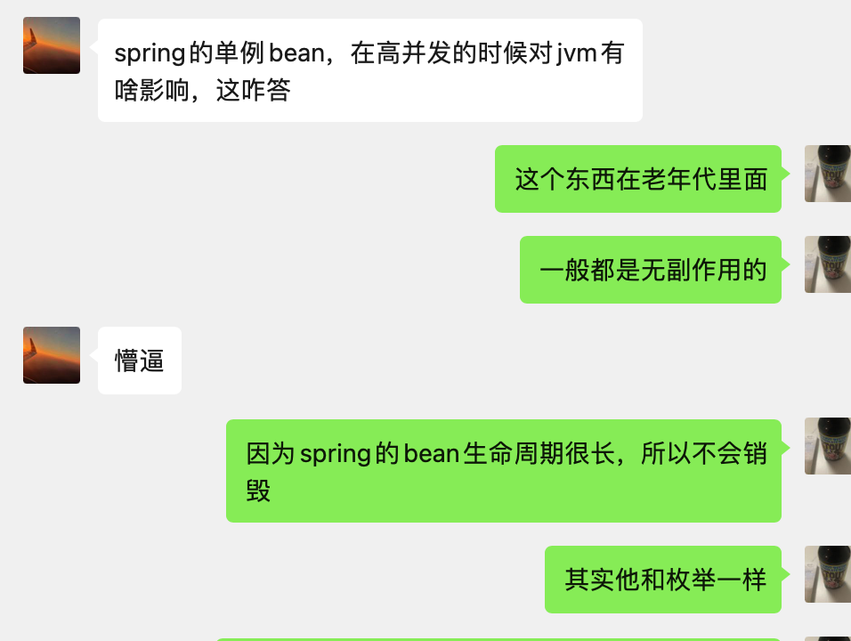

# Spring单例bean对jvm的影响

问题是朋友在面试遇到的，自己从知识框架里找到了相关的知识点，写个文章记录一下。


## 单例设计模式

单例设计模式大家都会写，不管是懒汉式还是饿汉式，只要单例被初始化后基本上都会随着虚拟机生命周期销毁而销毁，即然是这样，那在虚拟机中必然会从新生代晋级到老年代。

### 扩展

如果在工作中需要多个单例的bean，还不想被spring生命周期管理，可以使用下面方式进行编写。

```java
// hashcode and eq方法省略
public class Student {

    private String name;

    private int age;

    public String getName() {
        return name;
    }

    public void setName(String name) {
        this.name = name;
    }

    public int getAge() {
        return age;
    }

    public void setAge(int age) {
        this.age = age;
    }
}

public enum StudentPredicateE {

    NAME_SUPPLIER(student -> {
        if (null == student || student.getName() == null) {
            return false;
        }
        return student.getName().length() > 10;
    }),

    AGE_SUPPLIER(student -> student.getAge() > 10),

    ;

    StudentPredicateE(Predicate<Student> p) {
        this.p = p;
    }

    // 这里一定设置成final，并且不提供set方法
    private final Predicate<Student> p;

    public Predicate<Student> getP() {
        return p;
    }
}

// todo 省略查询和添加过程
List<Student> l = new ArrayList<>();
// 判断年龄符合条件
List<Student> ageS = l.stream().filter(StudentPredicateE.AGE_SUPPLIER.getP()).collect(Collectors.toList());
// 判断姓名符合条件
List<Student> nameS = l.stream().filter(StudentPredicateE.NAME_SUPPLIER.getP()).collect(Collectors.toList());

// 查找年龄和姓名都不符合条件，这里使用了negate
List<Student> negate = l.stream()
  .filter(StudentPredicateE.NAME_SUPPLIER.getP().negate()
  .and(StudentPredicateE.AGE_SUPPLIER.getP().negate()))
  .collect(Collectors.toList());
```

## Spring单例bean

1. SpringBean包含多种范围(Singleton、Prototype、Request、Session、Global-Session)，相关详细内容可以[参考](https://www.geeksforgeeks.org/singleton-and-prototype-bean-scopes-in-java-spring/)；
2. 一般情况下单例bean都是无副作用的，即成员变量不会在高并发下产生错误影响，如果会产生错误影响就不建议使用单例bean，在现实工作中也会将结果数据封闭到方法内，即Frames中，可以[参考](../jvm/layout/Frames.md)；
3. 单例Bean可以跳过虚拟机加载、验证、准备、解析等类加载和校验机制，性能特别高、原型设计模式也是此方法跳过类加载机制的，可以[参考](https://refactoringguru.cn/design-patterns/prototype)，小提醒，个人对xxx没有观点，只是该网站设计模式写的比较清晰才推荐。

## 影响

1. 跳过虚拟机加载和验证机制，因为能力问题暂时先写到这里；
2. 对象从新生代晋升到老年代，即然对象不会被清除，这时候对虚拟机调优时需要考虑虚拟机最大吞吐量、最短回收停顿时间那个优先，以此从垃圾回收算法上考虑产生的影响。
   * 复制算法，因为新生代总是朝生夕死，所以新生代基本上都是复制算法，单例bean对此方法产生不大。
   * 标记整理，标记整理需要移动对象，所以需要复制之前的对象，并将其整理到一起，可以写一下[此算法](https://leetcode.cn/problems/copy-list-with-random-pointer/solution/)感受下复杂程度，Java对象引用实际上是有向图，复杂程度要比刚才算法高很多，还要考虑数据在内存中分页以提高性能等。
   * 标记清除，如果老年代对象都是大对象，并且在极致情况下空余空间无法分配给新晋级的对象，依然会产生标记整理方法，这也就是为什么`CMS`垃圾回收需要`Serial Old`作为兜底。

## 进阶

标记整理算法需要考虑对象之间的引用尽量放到同一个内存页内，也是就是安排对象位置，与Mysql查询数据优化一致，这也是对标记整理算法的进阶，可以参考[垃圾回收的算法与实现 作者: 中村成洋 / 相川光](https://book.douban.com/subject/26821357/)中的第4.5 近似深度优先搜索方法。

## 参考

* [Singleton and Prototype Bean Scopes in Java Spring](https://www.geeksforgeeks.org/singleton-and-prototype-bean-scopes-in-java-spring/)
* [虚拟机 Frames](https://docs.oracle.com/javase/specs/jvms/se17/jvms17.pdf)
* [原型模式](https://refactoringguru.cn/design-patterns/prototype)
* [垃圾回收的算法与实现 作者: 中村成洋 / 相川光](https://book.douban.com/subject/26821357/)
* [138. 复制带随机指针的链表](https://leetcode.cn/problems/copy-list-with-random-pointer/solution/)
