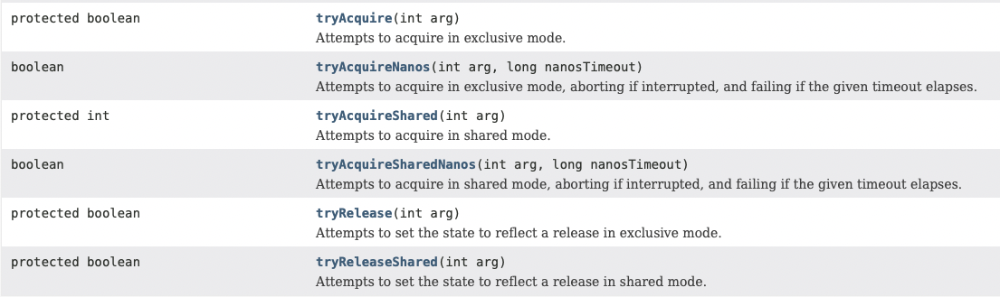
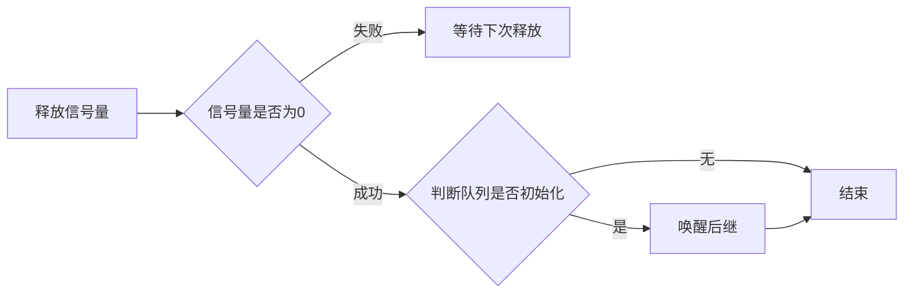

# aqs

aqs设计原理，请查看[文档地址](http://gee.cs.oswego.edu/dl/papers/aqs.pdf)，或者查看代码注释

## 个人见解

设计使用一个`int`值来代表是否持有锁，这种设计是一种规约，获取变量，使用cas指令更新新值

* 更新新值成功，当前线程获取了锁，
* 更新新值失败，没有获取到锁，进入队列自旋或阻塞

### Sync

进一步实现了`AbstractQueuedSynchronizer`

```java
abstract static class Sync extends AbstractQueuedSynchronizer {
    private static final long serialVersionUID = -5179523762034025860L;

    // 抽象
    abstract void lock();

    protected final boolean tryRelease(int releases) {
        // 拿到新的设定的值
        int c = getState() - releases;
        // 当前线程没有持有锁，异常，违反规约
        if (Thread.currentThread() != getExclusiveOwnerThread())
            throw new IllegalMonitorStateException();
        boolean free = false;
        if (c == 0) {
            // 释放锁
            free = true;
            setExclusiveOwnerThread(null);
        }
        setState(c);
        return free;
    }

    protected final boolean isHeldExclusively() {
        // 当前线程是否持有锁
        return getExclusiveOwnerThread() == Thread.currentThread();
    }
    // todo其他代码忽略
}
```

### NonfairSync

非公平锁效率较高，默认使用，如：`public ReentrantLock() { sync = new NonfairSync();}`

```java
static final class NonfairSync extends Sync {
    private static final long serialVersionUID = 7316153563782823691L;

    // 实现锁
    final void lock() {
        // cas设置锁，成功了，设置当前线程
        if (compareAndSetState(0, 1))
            setExclusiveOwnerThread(Thread.currentThread());
        else
            // 走队列流程
            acquire(1);
    }

    // acquire会调用父亲，在调用到这里
    protected final boolean tryAcquire(int acquires) {
        return nonfairTryAcquire(acquires);
    }
}
```

### FairSync

严格按照公平进行处理，后来的进行排队

```java
static final class FairSync extends Sync {
    private static final long serialVersionUID = -3000897897090466540L;

    final void lock() {
        acquire(1);
    }

    protected final boolean tryAcquire(int acquires) {
        // 获取当前线程
        final Thread current = Thread.currentThread();
        int c = getState();

        if (c == 0) {
            // 如果队列没有排队的，才进行处理
            if (!hasQueuedPredecessors() &&
                compareAndSetState(0, acquires)) {
                setExclusiveOwnerThread(current);
                return true;
            }
        }
        // 重入，这里逻辑没有多大变化
        else if (current == getExclusiveOwnerThread()) {
            int nextc = c + acquires;
            if (nextc < 0)
                throw new Error("Maximum lock count exceeded");
            setState(nextc);
            return true;
        }
        return false;
    }
}
```

## 核心代码

Subclasses can maintain other state fields, but only the atomically updated int value manipulated using methods getState(), setState(int) and compareAndSetState(int, int) is tracked with respect to synchronization.

子类可以维护其他状态字段，但只有使用 `getState()、setState(int)、compareAndSetState(int, int)` 方法操作的原子更新的 `int` 值才会被同步跟踪。

### static代码块

1. 静态代码块，可参考[atomic](./atomic.md)
2. 从这里可以看出`state、head、tail、waitStatus、next`都是使用cas进行实现的。

```java
 static {
        try {
            stateOffset = unsafe.objectFieldOffset
                (AbstractQueuedSynchronizer.class.getDeclaredField("state"));
            headOffset = unsafe.objectFieldOffset
                (AbstractQueuedSynchronizer.class.getDeclaredField("head"));
            tailOffset = unsafe.objectFieldOffset
                (AbstractQueuedSynchronizer.class.getDeclaredField("tail"));
            waitStatusOffset = unsafe.objectFieldOffset
                (Node.class.getDeclaredField("waitStatus"));
            nextOffset = unsafe.objectFieldOffset
                (Node.class.getDeclaredField("next"));

        } catch (Exception ex) { throw new Error(ex); }
    }
```

### setState

1. 此方法主要是持有锁线程调用

```java
protected final void setState(int newState) {
    state = newState;
}
```

### getState

```java
// 获取状态 0 为未持有锁，1～n为持有或者重入
private volatile int state;
protected final int getState() {
    return state;
}
```

### compareAndSetState

1. 使用cas，也就是`cmpxchg`指令进行更新内存值

```java
protected final boolean compareAndSetState(int expect, int update) {
    return unsafe.compareAndSwapInt(this, stateOffset, expect, update);
}
```

## acquire/release


从api中可以看到aqs主要支持两种模式，独占模式和共享模式

* 独占模式
  * `tryAcquire(int arg)`
  * `tryAcquireNanos(int arg, long nanosTimeout)`
  * `tryRelease(int arg)`
* 共享模式
  * `tryAcquireShared(int arg)`
  * `tryAcquireSharedNanos(int arg, long nanosTimeout)`
  * `tryReleaseShared(int arg)`

## acquire

<mermaid style="margin-bottom: 0px">
graph LR
    A[线程] --> B{获取锁}
    B -->|成功| Z[结束]
    B -->|失败| C[生成节点]
    C --> E[加入队列]
    E --> F[自旋阻塞]
    F --> G{前驱为头节点}
    G -->|失败| F
    G -->|成功| H{获取锁}
    H -->|成功| I[设置当前节点为头]
    I --> Z
    H -->|失败| F
</mermaid>

先对独占模式进行分析，其核心概念如下：

```java
  Acquire:
       while (!tryAcquire(arg)) {
          enqueue thread if it is not already queued;
          possibly block current thread;
       }
```

主要调用了4个方法，也就是`tryAcquire、acquireQueued、addWaiter、selfInterrupt`

```java
public final void acquire(int arg) {
    if (!tryAcquire(arg) &&
        acquireQueued(addWaiter(Node.EXCLUSIVE), arg))
        selfInterrupt();
}
```

`addWaiter`创建`Node.EXCLUSIVE`类型模式的节点，并加入到尾部

```java
 // Node.EXCLUSIVE模式
private Node addWaiter(Node mode) {
    // 创建一个新节点
    Node node = new Node(Thread.currentThread(), mode);
    // 找到哨兵模式的尾巴
    Node pred = tail;
    // 如果有节点则进行设置
    if (pred != null) {
        node.prev = pred;
        // cas设置到队尾
        // 如果没有线程进行竞争的话，这里是可以直接设置到tail
        // 如果这里在设置的时候，被其他线程提前一步，那就需要使用enq进行补偿
        if (compareAndSetTail(pred, node)) {
            pred.next = node;
            return node;
        }
    }
    // 如果队列为空
    enq(node);
    return node;
}

// cas
private final boolean compareAndSetTail(Node expect, Node update) {
    // 这里又一次用到了偏移地址
    return unsafe.compareAndSwapObject(this, tailOffset, expect, update);
}
```

`enq(node)`，将节点插入队列，必要时对队列初始化

```java
private Node enq(final Node node) {
    // 一直循环
    for (;;) {
        // 如果尾巴没空的话，说明整个fifo都是空的
        Node t = tail;
        if (t == null) { // Must initialize
            if (compareAndSetHead(new Node()))
                tail = head;
        } else {
            // 将新节点插入到后面，并设置成尾巴
            node.prev = t;
            if (compareAndSetTail(t, node)) {
                t.next = node;
                return t;
            }
        }
    }
}
```

`acquireQueued`自旋过程，判断自己前驱节点是否为头节点，如果是的话尝试获取锁，拿到锁，推进队列

```java
final boolean acquireQueued(final Node node, int arg) {
    boolean failed = true;
    try {
        boolean interrupted = false;
        for (;;) {
            final Node p = node.predecessor();
            // 如果前驱节点为头节点，尝试拿锁，能够拿到锁，将自己设置成头，推进队列
            // 否则进行自旋转
            if (p == head && tryAcquire(arg)) {
                // 新节点设置为头，推进队列
                setHead(node);
                p.next = null; // help GC
                failed = false;
                return interrupted;
            }
            if (shouldParkAfterFailedAcquire(p, node) &&
                parkAndCheckInterrupt())
                interrupted = true;
        }
    } finally {
        // 如果失败
        if (failed)
            // 取消获取锁
            cancelAcquire(node);
    }
}
```

`shouldParkAfterFailedAcquire`如果获取失败，进行`possibly block current thread`

```java
private static boolean shouldParkAfterFailedAcquire(Node pred, Node node) {
    int ws = pred.waitStatus;
    if (ws == Node.SIGNAL)
        // 这个节点已经设置了状态，要求释放信号，所以它可以安全地停放
        return true;
    if (ws > 0) {
        // 前驱被取消，跳过前驱并指示重试。
        do {
            node.prev = pred = pred.prev;
        } while (pred.waitStatus > 0);
        pred.next = node;
    } else {
        compareAndSetWaitStatus(pred, ws, Node.SIGNAL);
    }
    return false;
}
```

`cancelAcquire`取消获取锁

```java
private void cancelAcquire(Node node) {
    // 节点为空不处理
    if (node == null)
        return;
    node.thread = null;
    // 跳过取消的前驱
    Node pred = node.prev;
    //  static final int CANCELLED =  1;
    //  如果大于0也是取消状态
    while (pred.waitStatus > 0)
        node.prev = pred = pred.prev;

    Node predNext = pred.next;
    node.waitStatus = Node.CANCELLED;
    // 尾巴设置成为最后一个未取消的
    if (node == tail && compareAndSetTail(node, pred)) {
        // 如果当前节点是尾巴，直接从第一个未取消的截断
        compareAndSetNext(pred, predNext, null);
    } else {
        int ws;
        // 不是头
        if (pred != head &&
        // 并且信号为 Node.SIGNAL
            ((ws = pred.waitStatus) == Node.SIGNAL ||
              // 或者其他信号，将信号更新成Node.SIGNAL，而且线程还不能为空
              (ws <= 0 && compareAndSetWaitStatus(pred, ws, Node.SIGNAL))) &&
            pred.thread != null) {
            Node next = node.next;
            if (next != null && next.waitStatus <= 0)
                // 移除掉本节点
                compareAndSetNext(pred, predNext, next);
        } else {
            unparkSuccessor(node);
        }

        node.next = node; // help GC
    }
}
```

### tryAcquire

父类没有实现，需要子类进行实现

```java
protected boolean tryAcquire(int arg) {
    throw new UnsupportedOperationException();
}
```

公平锁在获取锁的时候需要判断队列是否有自旋或阻塞线程（排除掉取消节点的线程）

```java
protected final boolean tryAcquire(int acquires) {
    // 获取当前线程
    final Thread current = Thread.currentThread();
    int c = getState();
    // 如果当前队列没有排队线程
    if (c == 0) {
        if (!hasQueuedPredecessors() &&
            compareAndSetState(0, acquires)) {
            setExclusiveOwnerThread(current);
            return true;
        }
    }
    // 重入，这里逻辑没有多大变化
    else if (current == getExclusiveOwnerThread()) {
        int nextc = c + acquires;
        if (nextc < 0)
            throw new Error("Maximum lock count exceeded");
        setState(nextc);
        return true;
    }
    return false;
}

// 判断队列是否有排队线程，并且排队线程不是当前线程
public final boolean hasQueuedPredecessors() {
    Node t = tail; // Read fields in reverse initialization order
    Node h = head;
    Node s;
    return h != t &&
        ((s = h.next) == null || s.thread != Thread.currentThread());
}
```

非公平锁直接获取锁，无需判断队列是否中有节点在自旋或阻塞

```java
final boolean nonfairTryAcquire(int acquires) {
    // 获取当前线程
    final Thread current = Thread.currentThread();
    // 如果没有锁
    int c = getState();
    if (c == 0) {
        // 进行cas设置
        if (compareAndSetState(0, acquires)) {
            // 如果成功了设置线程
            setExclusiveOwnerThread(current);
            return true;
        }
    }
    // 如果当前有锁，并且当前线程持有锁
    else if (current == getExclusiveOwnerThread()) {
        // 进行重入计数
        int nextc = c + acquires;
        if (nextc < 0) // overflow
            throw new Error("Maximum lock count exceeded");
        // 更新值
        setState(nextc);
        return true;
    }
    // 拿不到锁
    return false;
}
```

## release

### 核心概念



```java
 Release:
       if (tryRelease(arg))
          unblock the first queued thread;
```

### 代码

```java
public final boolean release(int arg) {
    // 释放锁，只有计算为0才为释放成功，主要有重入问题
    if (tryRelease(arg)) {
        Node h = head;
        if (h != null && h.waitStatus != 0)
            unparkSuccessor(h);
        return true;
    }
    return false;
}
```

`tryRelease`为释放信号量，只有锁拥有者可以释放，`state = 0`时才释放权限，也就是释放锁成功，否则只更新信号量

```java
protected final boolean tryRelease(int releases) {
    // 拿到新的设定的值
    int c = getState() - releases;
    // 只有锁拥有者可以释放
    if (Thread.currentThread() != getExclusiveOwnerThread())
        throw new IllegalMonitorStateException();
    boolean free = false;
    if (c == 0) {
        // 释放锁
        free = true;
        // 释放权限
        setExclusiveOwnerThread(null);
    }
    // 更新信号量
    setState(c);
    return free;
}
```

`unparkSuccessor`队列初始化并且有节点未取消，进行唤醒

```java
private void unparkSuccessor(Node node) {
    // 找到节点的等待状态
    int ws = node.waitStatus;
    if (ws < 0)
        compareAndSetWaitStatus(node, ws, 0);

    // 后续节点
    Node s = node.next;
    if (s == null || s.waitStatus > 0) {
        s = null;
        // 从尾巴开始找，找到node后面的第一个节点
        // 如果cancelled的话后续可能为空，所以是有从后向前查找
        for (Node t = tail; t != null && t != node; t = t.prev)
            if (t.waitStatus <= 0)
                s = t;
    }
    // 唤醒前驱
    if (s != null)
        LockSupport.unpark(s.thread);
}

// 唤醒线程
public static void unpark(Thread thread) {
    if (thread != null)
        UNSAFE.unpark(thread);
}
```

## 总结

使用状态位的规约代替重量级锁，使用cas+自旋构建aqs的基石

## 参考

* [Unsafe](http://hg.openjdk.java.net/jdk7/jdk7/jdk/file/9b8c96f96a0f/src/share/classes/sun/misc/Unsafe.java)
* [aqs](http://gee.cs.oswego.edu/dl/papers/aqs.pdf)
