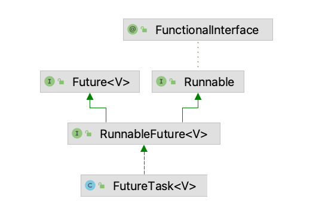

# FutureTask

`Future`表示异步计算的结果。 提供了检查计算是否完成、等待其完成以及检索计算结果的方法。结果只能在计算完成后使用方法`get`检索，必要时阻塞，直到它准备好。取消是通过`cancel`方法执行的。提供了额外的方法来确定任务是正常完成还是被取消。一旦计算完成，就不能取消计算。如果您想使用`Future`来取消可取消性但不提供可用的结果，您可以声明`Future<?>`形式的类型并返回null作为底层任务的结果·。

## 概念

`FutureTask`使用接口隔离和装饰者设计模式进行处理，对于等待结果着只需要关系`Future`，而不关心什么时机`run`。

### Runnable



从继承关系上可以看出分别实现了`Future`和`Runnable`，使用接口隔离保证了客户端对无用信息的无感知，只需要关注自己需要关注的。

```java
@FunctionalInterface
public interface Runnable {

    public abstract void run();
}

public interface RunnableFuture<V> extends Runnable, Future<V> {

    void run();
}
```

### Future

接口提供了取消和获取接口，已经是否完成等

```java
public interface Future<V> {

    boolean cancel(boolean mayInterruptIfRunning);

    boolean isCancelled();

    boolean isDone();

    V get() throws InterruptedException, ExecutionException;

    V get(long timeout, TimeUnit unit)
        throws InterruptedException, ExecutionException, TimeoutException;
}
```

### 装饰者

```java
public class FutureTask<V> implements RunnableFuture<V> {

    // 被装饰者
    private Callable<V> callable;
    // 运行任务的线程
    private volatile Thread runner;
    //  结果
    private Object outcome;
    private volatile WaitNode waiters;

}
```

#### 直接装饰

对于`Callable`进行直接装饰者

```java
public FutureTask(Callable<V> callable) {
    if (callable == null)
        throw new NullPointerException();
    this.callable = callable;
    this.state = NEW;       // ensure visibility of callable
}
```

#### 间接装饰

适配器转换后进行装饰

```java
public FutureTask(Runnable runnable, V result) {
    this.callable = Executors.callable(runnable, result);
    this.state = NEW;       // ensure visibility of callable
}

public static <T> Callable<T> callable(Runnable task, T result) {
    if (task == null)
        throw new NullPointerException();
    // 适配
    return new RunnableAdapter<T>(task, result);
}

// 将Runnable转换成Callable，因为Runnable是没有返回结果的，所以这里需要给一个默认的返回值
private static final class RunnableAdapter<T> implements Callable<T> {
    private final Runnable task;
    private final T result;
    RunnableAdapter(Runnable task, T result) {
        this.task = task;
        this.result = result;
    }
    public T call() {
        task.run();
        return result;
    }
    public String toString() {
        return super.toString() + "[Wrapped task = " + task + "]";
    }
}
```

### 核心代码

当线程执行任务的时候会调用到这个类的`run`，这里会进行任务一些列装饰，比如执行结果处理，异常保存

```java
public void run() {
  // 在运行前会设置线程，也就给取消提供了机会
  if (state != NEW ||
      !RUNNER.compareAndSet(this, null, Thread.currentThread()))
      return;
  try {
      Callable<V> c = callable;
      if (c != null && state == NEW) {
          V result;
          boolean ran;
          try {
              //  如果提交任务为Runnable,这里就是RunnableAdapter.call
              //  如果提交任务为Callable，这里被真实调用
              result = c.call();
              ran = true;
          } catch (Throwable ex) {
              result = null;
              ran = false;
              setException(ex);
          }
          if (ran)
              set(result);
      }
  } finally {
      runner = null;
      int s = state;
      if (s >= INTERRUPTING)
          handlePossibleCancellationInterrupt(s);
  }
}
```

取消任务时候，先判断状态，并且是否在运行时中断

```java
public boolean cancel(boolean mayInterruptIfRunning) {
    if (!(state == NEW && STATE.compareAndSet
          (this, NEW, mayInterruptIfRunning ? INTERRUPTING : CANCELLED)))
        return false;
    try {    // in case call to interrupt throws exception
        if (mayInterruptIfRunning) {
            try {
                // 找到真实的执行者
                Thread t = runner;
                if (t != null)
                    // 进行中断
                    t.interrupt();
            } finally { // final state
                STATE.setRelease(this, INTERRUPTED);
            }
        }
    } finally {
        finishCompletion();
    }
    return true;
}
```

获取结果提供了两种方式，一种是阻塞，一种是超时，两者区别在于如果在特定时间没完成，会丢出超时异常和等待。

```java
// 阻塞等待
public V get() throws InterruptedException, ExecutionException {
    int s = state;
    if (s <= COMPLETING)
        s = awaitDone(false, 0L);
    return report(s);
}
// 超时异常
public V get(long timeout, TimeUnit unit)
    throws InterruptedException, ExecutionException, TimeoutException {
    if (unit == null)
        throw new NullPointerException();
    int s = state;
    if (s <= COMPLETING &&
        (s = awaitDone(true, unit.toNanos(timeout))) <= COMPLETING)
        throw new TimeoutException();
    return report(s);
}

private int awaitDone(boolean timed, long nanos)
    throws InterruptedException {
    long startTime = 0L
    WaitNode q = null;
    boolean queued = false;
    // 自旋
    for (;;) {
        // 如果已经完成
        int s = state;
        if (s > COMPLETING) {
            if (q != null)
                q.thread = null;
            // 清除线程信息，返回结果
            return s;
        }
        // 如果出去完成
        else if (s == COMPLETING)
            Thread.yield();
        else if (Thread.interrupted()) {
            // 线程被中断移除等待节点
            removeWaiter(q);
            throw new InterruptedException();
        }
        else if (q == null) {
            // 如果开启超时，并且没时间了返回现在状态
            if (timed && nanos <= 0L)
                return s;
            // 创建首节点
            q = new WaitNode();
        }
        else if (!queued)
            // q!=null,进队列
            queued = WAITERS.weakCompareAndSet(this, q.next = waiters, q);
        else if (timed) {
            // 开启时间限制，使用时间
            final long parkNanos;
            if (startTime == 0L) {
                // 第一次
                startTime = System.nanoTime();
                if (startTime == 0L)
                    startTime = 1L;
                parkNanos = nanos;
            } else {
                long elapsed = System.nanoTime() - startTime;
                if (elapsed >= nanos) {
                    removeWaiter(q);
                    return state;
                }
                // 剩余时间
                parkNanos = nanos - elapsed;
            }
            // nanoTime may be slow; recheck before parking
            if (state < COMPLETING)
                LockSupport.parkNanos(this, parkNanos);
        }
        else
            // 没有时间限制，进行阻塞
            LockSupport.park(this);
    }
}
```

## 总结

* 使用接口隔离很好的实现了任务提交者和执行者的感知隔离
* 装饰者在任务运行基础上增加了取消任务
