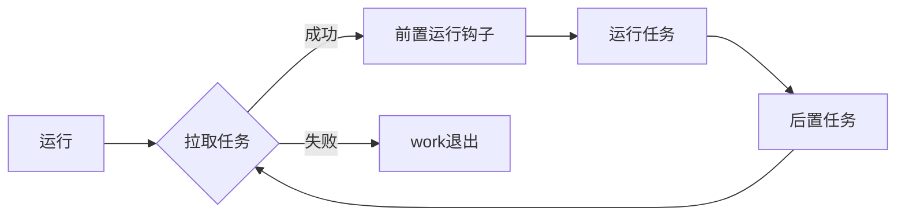

# Worker

`Worker`是线程池中真实干活的线程，继承`AbstractQueuedSynchronizer`和实现了`Runnable`，使用接口隔离。

```java
private final class Worker
    extends AbstractQueuedSynchronizer
    implements Runnable{
  // todo 其他省略
}
```

## 核心代码

### 创建Worker

初始化时会设置线程状态，并设置第一个任务，使用[线程工厂](./thread-factory.md)创建一个线程，设置了群组，优先级，线程类型，名称等

```java
Worker(Runnable firstTask) {
    setState(-1); // inhibit interrupts until runWorker
    this.firstTask = firstTask;
    this.thread = getThreadFactory().newThread(this);
}
```

### Worker运行



`Worker`运行后先拉取任务，运行任务，拉取任务先从`Worker`里获取，然后一直从队列里面获取，拉取任务[getTask()](./thread-pool-executor.md#getTask)，线程在无任务时进行退出[processWorkerExit()](./thread-pool-executor.md#processWorkerExit)。

```java
public void run() {
    runWorker(this);
}
final void runWorker(Worker w) {
    // 当前线程
    Thread wt = Thread.currentThread();
    // 先从Worker里获取任务
    Runnable task = w.firstTask;
    w.firstTask = null;
    w.unlock(); // allow interrupts
    boolean completedAbruptly = true;
    try {
        //  如果从Worker拿到任务task != null
        //  如果task==null，从队列里面拿
        while (task != null || (task = getTask()) != null) {
            w.lock();
            // 如果池正在停止，请确保线程被中断；
            // 如果没有，请确保线程不被中断。
            // 这需要在第二种情况下重新检查以在清除中断时处理 shutdownNow 竞争
            if ((runStateAtLeast(ctl.get(), STOP) ||
                  (Thread.interrupted() &&
                  runStateAtLeast(ctl.get(), STOP))) &&
                !wt.isInterrupted())
                wt.interrupt();
            try {
                // 执行前，钩子方法，hook
                beforeExecute(wt, task);
                Throwable thrown = null;
                try {
                    // 执行本次任务
                    task.run();
                } catch (RuntimeException x) {
                    thrown = x; throw x;
                } catch (Error x) {
                    thrown = x; throw x;
                } catch (Throwable x) {
                    thrown = x; throw new Error(x);
                } finally {
                    // 执行后，钩子方法，hook
                    afterExecute(task, thrown);
                }
            } finally {
                // 清除本次任务
                task = null;
                w.completedTasks++;
                w.unlock();
            }
        }
        completedAbruptly = false;
    } finally {
        processWorkerExit(w, completedAbruptly);
    }
}

//  Extension hooks 钩子方法
protected void beforeExecute(Thread t, Runnable r) { }
protected void afterExecute(Runnable r, Throwable t) { }
```

## 总结

* 线程被包装成`work`，每个`work`会记录一些信息，例如完成任务数量；
* 计算机常被抽象成`读，处理，写`；
* `SpringBatch`框架中也被抽象为`读，处理，写`；
* `work`使用也可以[参考](/middleware/netty/nio/event-loop/nio-event-loop.md)。
