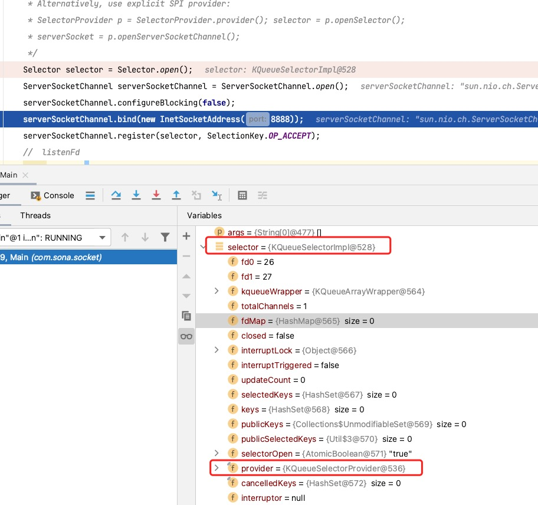
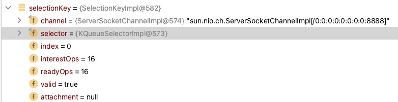

# 基础知识

::: tip 网络编程知识
推荐阅读[《深入理解计算机系统（原书第 3 版）》11～13章](https://book.douban.com/subject/26912767/)
:::

## 计算机 IO

`Linux Shell` 创建每个进程时都会打开三个文件：标准输入（ 描述符 0 )、标准输出（ 描述符 1 )和标准错误（ 描述符 2 )。

## 网络编程

网络编程关于服务器进程与客户端进行连接、处理进行展开讲解。


进程网络编程
::: center

图来自《深入理解计算机系统（原书第 3 版）》
:::

### IO抽象

IO包含BIO、NIO、AIO，在不同IO中 `open_listenfd`和`connfd`表现形式也不一样。

| IO  | listenfd            |        connfd |
| --- | ------------------- | ------------: |
| BIO | ServerSocket        |        Socket |
| NIO | ServerScoketChannel | SocketChannel |

::: tip AIO
AIO异步非阻塞的IO，在Linux和类Unix系统上支持不太好，Win支持比较好，但是服务器一般部署到Linux，所以后续不在进行讲解。
:::

## Netty 底层

### Nio 编程

```java
 public static void main(String[] args) throws Exception {
        // 创建一个channel管理器，从管理器中可以查找到当前准备好的事件
        Selector selector = Selector.open();
        // 创建一个listenfd，也就是Accept
        ServerSocketChannel serverSocketChannel = ServerSocketChannel.open();
        // 设置阻塞为false
        serverSocketChannel.configureBlocking(false);
        // 服务器绑定端口
        serverSocketChannel.bind(new InetSocketAddress(8888));
        // 设置关注的事件，Accept只负责接受连接，不负责处理数据
        // 因为acceptor为cpu密集型，性能在网络
        serverSocketChannel.register(selector, SelectionKey.OP_ACCEPT);
        // 开启listenFd
        while (true) {
            // 有事件发生
            while (selector.select() > 0) {
                Iterator<SelectionKey> iterator = selector.selectedKeys().iterator();
                while (iterator.hasNext()) {
                    // 迭代器模式迭代事件
                    SelectionKey selectionKey = iterator.next();
                    iterator.remove();
                    // 如果是Accept，也就是需要创建connectionFd（handler)
                    if (selectionKey.isAcceptable()) {
                        // 创建connectionFd
                        SocketChannel accept = serverSocketChannel.accept();
                        // 设置非阻塞
                        accept.configureBlocking(false);
                        // 注册到管理器中
                        accept.register(selector, SelectionKey.OP_READ);
                    }
                    if (selectionKey.isReadable()) {
                        // 如果这里是可读的，也就是数据都准备好了，开始处理事件
                        SocketChannel read = (SocketChannel) selectionKey.channel();
                        read.configureBlocking(false);
                        ByteBuffer dst = ByteBuffer.allocate(1024);
                        read.read(dst);
                        read.write(dst);
                        read.close();
                    }
                }
            }
        }
    }
```

### Selector

::: tip 提示
Alternatively, use explicit SPI provider:
SelectorProvider p = SelectorProvider.provider();
selector = p.openSelector();
serverSocket = p.openServerSocketChannel();
:::

在 `Doug lea` 的 `ppt` 中出现了上面提示这一段话是什么意思？其实不同系统中 `java new io` 调用的底层 `Nio` 实现不一样，所以使用了 `spi` 机制，具体如图所示:

::: center

:::

如图所示，可以看出 `SelectorProvider` 在 `java.nio.channel.spi` 下，并且注释为 `Returns the system-wide default selector provider for this invocation of the Java virtual machine.` ，也就是不同平台下虚拟机调用返回实现是不一样的。

::: center

:::

看上图，已经初始化了两个`fd`，并且包含 `fdMap` ，这里与计算机底层理论知识对齐了，关于不同系统提供的 `Selector` 如下所示：

| os    |        selector |
| ----- | --------------: |
| mac   |  KQueueSelector |
| linux |   EpollSelector |
| win   | WindowsSelector |

相关平台支持也可以参考[nginx官方文档](https://nginx.org/en/docs/events.html)，距离内容如图所示：
::: center

:::

### Channel

关于 `channel`，我们发现 `ServerSocketChannel` 和 `SocketChannel`两种，其底层可以认为是 `listenFd` 和 `connectionFd`。让我们来看看其功能有什么区别。

::: center

核心内容在于bind和accept
:::
::: center

核心内容在于read和write
:::

从两张图中进行对比可以看出 `ServerSocketChannel` 负责连接包含 `accept()` ， `SocketChannel` 负责处理包含`read()、write()` 方法为核心。在 `AbstractSelectableChannel` 模版设计模式中 `validOps()` 对关心事件进行验证。

```java
  public final SelectionKey register(Selector sel, int ops,
                                       Object att)
        throws ClosedChannelException
    {
        synchronized (regLock) {
           // 如果关闭了丢出关闭异常
            if (!isOpen())
                throw new ClosedChannelException();
                // 在这里调用了子类的方法，并对不用的channle做了事件的校验
            if ((ops & ~validOps()) != 0)
                throw new IllegalArgumentException();
            if (blocking)
                throw new IllegalBlockingModeException();
            SelectionKey k = findKey(sel);
            if (k != null) {
                k.interestOps(ops);
                k.attach(att);
            }
            if (k == null) {
                synchronized (keyLock) {
                    if (!isOpen())
                        throw new ClosedChannelException();
                    k = ((AbstractSelector)sel).register(this, ops, att);
                    addKey(k);
                }
            }
            return k;
        }
    }
```

`ServerSocketChannel` 中关心事件如下:

```java
public final int validOps() {
    return SelectionKey.OP_ACCEPT;
}
```

`SocketChannel` 中关心事件如下:

```java
public final int validOps() {
    return (SelectionKey.OP_READ
            | SelectionKey.OP_WRITE
            | SelectionKey.OP_CONNECT);
}
```

做下总结， `ServerSocketChannel` 只负责连接， `SocketChannel` 负责处理数据，`server`和`client` 处理数据使用的都是 `SocketChannel` 。
| SelectionKey        | OP_ACCEPT | OP_WRITE | OP_WRITE | OP_CONNECT |
| ------------------- | --------: | -------: | -------: | ---------: |
| ServerSocketChannel |         O |        N |        N |          N |
| SocketChannel       |         N |        O |        O |          O |

### SelectionKey

`SelectionKey` 包含了什么属性呢?

```java
public class SelectionKeyImpl extends AbstractSelectionKey {
    final SelChImpl channel;
    public final SelectorImpl selector;
    private int index;
    private volatile int interestOps;
    private int readyOps;
}
```

对代码进行 `Debug` 一下，看下结果，从下图显示其是把 `Channel` 和 `Selector` 绑定到一块。

::: center

:::

## 总结

<!-- Channels: Connections to files, sockets etc that support non-blocking reads -->
* **通道：** 链接文件，网络套接字等支持非阻塞(其实也就是 fd，文件描述符)；
::: center

:::
<!-- Selectors: Tell which of a set of Channels have IO events -->
* **选择器（管理器）:** 管理一系列的通道事件，主要是管理 `Channels` 的事件状态的，事件状态使用状态机流转；
::: center

:::
<!-- SelectionKeys: Maintain IO event status and bindings -->
* **数据绑定器（SelectionKeys）：** 维持 IO 事件状态和绑定；
::: center

:::
<!-- Buffers: Array-like objects that can be directly read or written by Channels -->
* **缓冲区：** 对于通道的直接读和写，像数组一样的对象。
