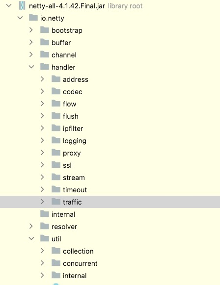
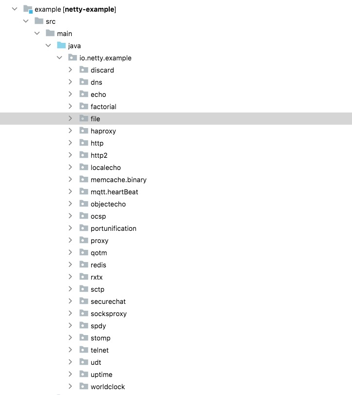

# 快速上手

如何快速上手是开发最关注的事情，上手前先查看包的分类，也就是模块化。然后根据工作需要找到模块`demo`，有很多`demo`是可以直接使用到生产中的，如果需要定制化就需要`debug`了。

## 包的分类

::: center

Netty Example
:::

包分类是将功能模块化，在开发、维护上职责清晰，按照上图进行`Netty`包的分类：

* `bootstrap` 客户端、服务端的启动`Builder`类
* `buffer` 数据容器
* `chanel` 服务器监听、连接
* `util` 集合、多线程工具类
* `handler` 业务处理
  + `codec` 编码
  + `timeout` 心跳问题
  + `traffic` 流量整形
  + `ipfilter`ip 黑白名单问题
  + 打印进出站数据问题

## 使用 Example学习

合适场景，查找相应 `Example` ，`Debug`和测试，查看其流程，进行快速学习。`Netty Example`比较全，可以详细参考下图。

::: center

Netty Example
:::

## 总结

* 包职责拆分清晰，设计易理解，维护迭代容易；
* Example 多，支持快速学习和使用。
