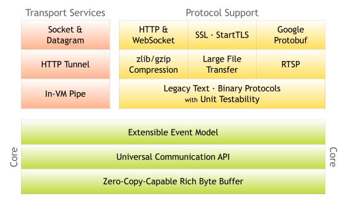
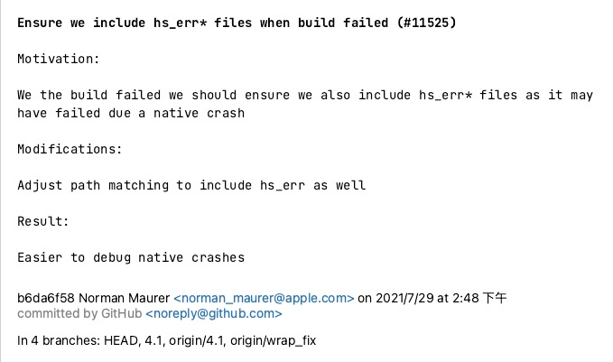
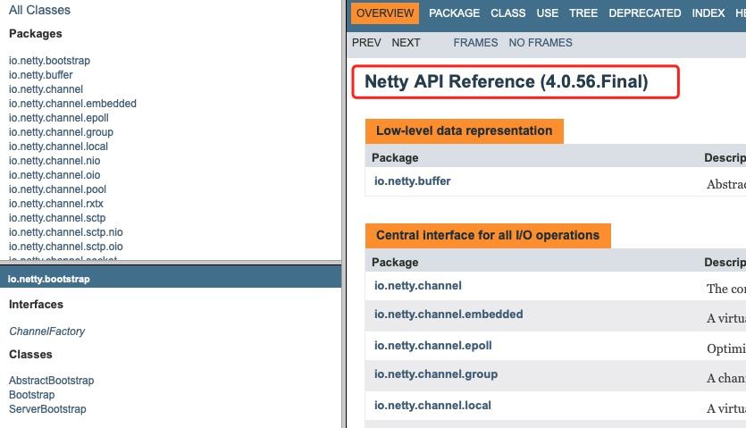
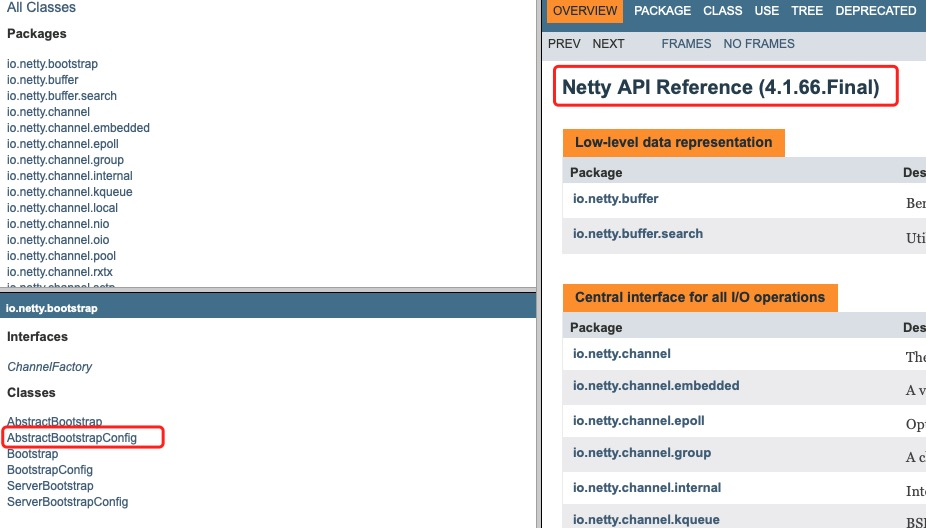
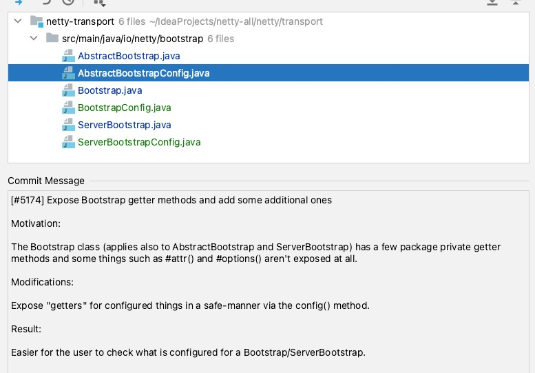
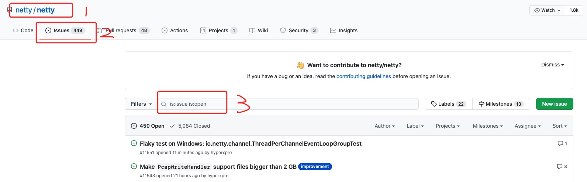
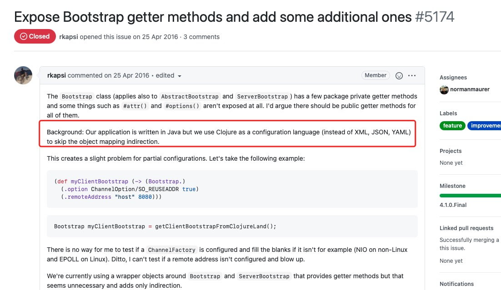

# 如何读源码

## 为什么要会读源码？

* 书上讲的都是理论知识，无法直接使用到项目中，空有理论知识，不能落地，学过的知识很快就忘记了；
* 视频里都是讲案例和部分源码，看过之后犹如沙子上画画，风一吹就没了；

## 查看官网

打开[官网](https://netty.io)，查看架构设计，这一步很重要，其可以快速了解项目设计理念和应用。

::: center

:::

[Netty](https://netty.io) 是一款异步事件驱动的网络应用程序框架，支持快速地开发可维护的、高性能的、面向协议的服务器和客户端。

## 为什么要看源码历史？

### 为什么？

* 根据提交历史记录拨丝抽茧找到代码核心底层逻辑；
* 根据历史提交追根溯源，知道代码为什么要这么写。

### 怎么做？

按照下面流程进行操作：


### 详细流程

打开[netty github](https://github.com/netty/netty)，找到仓库地址，`git clone`或者`IDE`拉取代码，查看 Git 提交历史，这个东西到底该怎么用呢？

::: center

:::

每个提交点都提交了什么东西呢？



### 如何使用历史提交记录呢？

如何看明白一段或者一行代码呢？其主流程如下：


#### 案例

以`Netty AbstractBootstrapConfig`为例查看为什么它会出现？让我们对比 4.0 版本和 4.1 版本`io.netty.bootstrap`包的区别。

::: center


:::

对比发现 4.1 版本的包比 4.0 版本的包多了`BootstrapConfig`，为什么会出现这个类呢？不用多想肯定是有需求才会有产生这样变化。需求是什么呢？打开`AbstractBootstrapConfig`查看这个代码的提交点。



查看提交点`Git template`提交了什么信息？

```yml
暴露Bootstrap数据数据获取方法
[#5174] Expose Bootstrap getter methods and add some additional ones

动机:因为Bootstrap暴露的获取数量的方法过少
Motivation:  The Bootstrap class (applies also to AbstractBootstrap and ServerBootstrap) has a few package private getter methods and some things such as #attr() and #options() aren't exposed at all.
变更:使用更安全的管理方式暴露配置数据
Modifications:  Expose "getters" for configured things in a safe-manner via the config() method.
结果:更简单的检查配置好的启动程序
Result:  Easier for the user to check what is configured for a Bootstrap/ServerBootstrap.
```

产生这次变动的[动机](https://github.com/netty/netty/issues/5174)是什么？

::: center

:::

在 3 处输入 5174，就可以看到结果。

::: center

:::

译文：我们的程序使用 `Java` 开发，但是我们用`Clojure`代替了普通配置文件，但是我们无法测试远程地址是否未配置，这时候我们就理解了`AbstractBootstrapConfig`为什么会出现以及它的职责。

## 总结

* 使用上述方式可以快速查看代码历史背景和需求推动；
* `Netty`很值得学习的一点就是关于背景、动机、结果描述的很清晰，让后面参与的维护者可以通过 `Git` 提交记录感知到历史上下文，降低口口传递成本。
