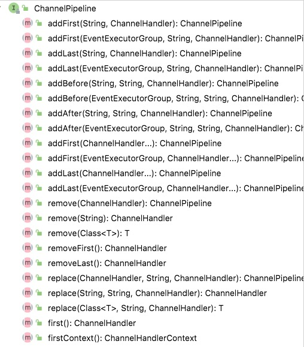
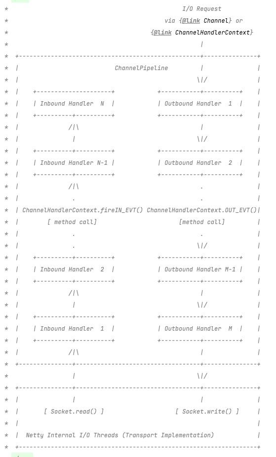
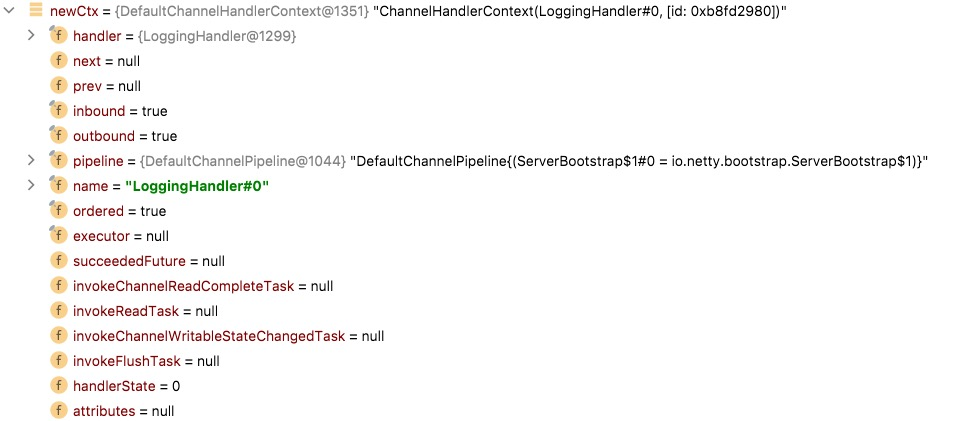
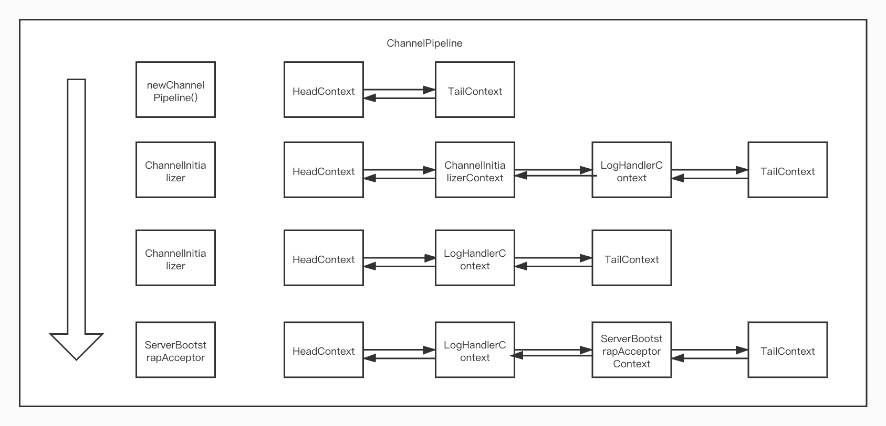

# Channel-Pipeline

### Pipeline 的初始化

::: tip 提示
Each channel has its own pipeline and it is created automatically when a new channel is created.
每一个 channel 创建的时候都会有自己的 pipeline。
:::

1. `Channel`的`Pipeline`初始化都是在`AbstractChannel`中进行的。

```java
protected AbstractChannel(Channel parent) {
    this.parent = parent;
    id = newId();
    unsafe = newUnsafe();
    // 这里会初始化Pipeline
    pipeline = newChannelPipeline();
}

// 这里使用在AbstractChannel初始化时候初始化DefaultChannelPipeline
// spring对于这种处理不好，因为循环依赖问题
protected DefaultChannelPipeline newChannelPipeline() {
    return new DefaultChannelPipeline(this);
}

public class DefaultChannelPipeline implements ChannelPipeline {
    // 注意这两个属性，其是责任链处理的关键
    final AbstractChannelHandlerContext head;
    final AbstractChannelHandlerContext tail;
}
```

### ChannelPipeline

1. `Pipeline`是一个容器，其主要是处理`handler`，可以从其 API 中看出，基本所有的方法都包含`handler`的处理。



2. `Pipeline`对`channel`的处理流程是按照进和出进行处理的，这里有一张官方文档的图。



### AbstractChannelHandlerContext

1. 出现`AbstractChannelHandlerContext`主要是解决`handler`元信息处理，比如`handler`是处理`inbound`还是`outbound`，这样在后面使用的时候性能更高，而不需要每次都判断上层接口来处理`inbound`还是`outbound`。
2. 上下文是一个双向链表，对于`inbound`或`outbound`处理起来很方面。

```java
final class DefaultChannelHandlerContext extends AbstractChannelHandlerContext {

    // 保存处理器
    private final ChannelHandler handler;

    DefaultChannelHandlerContext(
            DefaultChannelPipeline pipeline, EventExecutor executor, String name, ChannelHandler handler) {
        // 其他信息父类已经处理过
        super(pipeline, executor, name, isInbound(handler), isOutbound(handler));
        if (handler == null) {
            throw new NullPointerException("handler");
        }
        this.handler = handler;
    }
}
```

### ChannelPipeline addHandler

1. `demo`代码

```java
//  这里是一个handler
public class EchoServerHandler extends ChannelInboundHandlerAdapter {
    @Override
    public void channelRead(ChannelHandlerContext ctx, Object msg) throws Exception {
        ByteBuf in = (ByteBuf) msg;
        System.out.println("server received" + in.toString(Charset.defaultCharset()));
        ctx.write(in);
    }
    @Override
    public void channelReadComplete(ChannelHandlerContext ctx) throws Exception {
        ctx.writeAndFlush(Unpooled.EMPTY_BUFFER)
                .addListener(ChannelFutureListener.CLOSE);
    }
    @Override
    public void exceptionCaught(ChannelHandlerContext ctx, Throwable cause) throws Exception {
        super.exceptionCaught(ctx, cause);
        cause.printStackTrace();
        ctx.close();
    }
}

public class ChannelHandlers {

    private final int port;

    public ChannelHandlers(int port) {
        this.port = port;
    }

    public static void main(String[] args) throws Exception {
        new ChannelHandlers(9999).start();
    }
    public void start() throws Exception {
        final LoggingHandler loggingHandler = new LoggingHandler();
        EventLoopGroup boss = new NioEventLoopGroup();
        EventLoopGroup work = new NioEventLoopGroup();
        try {
            ServerBootstrap b = new ServerBootstrap();
            b.group(boss, work)
                    .channel(NioServerSocketChannel.class)
                    .localAddress(new InetSocketAddress(port))
                    .handler(loggingHandler)
                    .childHandler(new ChannelInitializer<SocketChannel>() {
                        @Override
                        protected void initChannel(SocketChannel ch) throws Exception {
                            ch.pipeline().addLast(new EchoServerHandler());
                            ch.pipeline().addLast(loggingHandler);
                        }
                    });
            ChannelFuture sync = b.bind().sync();
            sync.channel().closeFuture().sync();
        } finally {
            boss.shutdownGracefully().sync();
            work.shutdownGracefully().sync();
        }
    }
}
```

2. 上下文的初始化，在`Pipeline`初始化的时候，先增加了一个`HeadContext`和`TailContext`。
3. 在`pipeline.invokeHandlerAddedIfNeeded();`中会增加`ChannelHandler`。

```java
p.addLast(new ChannelInitializer<Channel>() {
  @Override
  public void initChannel(final Channel ch) throws Exception {
      final ChannelPipeline pipeline = ch.pipeline();
      ChannelHandler handler = config.handler();
      if (handler != null) {
          pipeline.addLast(handler);
      }
      ch.eventLoop().execute(new Runnable() {
          @Override
          public void run() {
              pipeline.addLast(new ServerBootstrapAcceptor(
                      ch, currentChildGroup, currentChildHandler, currentChildOptions, currentChildAttrs));
          }
      });
  }
});
```

4. `LoggingHandler`会被包装成一个上下文。



5. 初始化流程`context`的变化如下：



6. `ServerBootstrapAcceptor`会在`SocketChannel`产生的时候设置一个`ChannelInitializer`，然后注册时候产生的任务和注册行为就与之前的`ServerSocketChanel`处理一致了。

7. `handler`使用，在`pipeline.fireChannelRead(byteBuf);`和`pipeline.fireChannelReadComplete();`都会产生责任链调用。

```java
 public final void read() {
  final ChannelConfig config = config();
  if (shouldBreakReadReady(config)) {
      clearReadPending();
      return;
  }
  final ChannelPipeline pipeline = pipeline();
  final ByteBufAllocator allocator = config.getAllocator();
  final RecvByteBufAllocator.Handle allocHandle = recvBufAllocHandle();
  allocHandle.reset(config);

  ByteBuf byteBuf = null;
  boolean close = false;
  try {
      do {
          byteBuf = allocHandle.allocate(allocator);
          allocHandle.lastBytesRead(doReadBytes(byteBuf));
          if (allocHandle.lastBytesRead() <= 0) {
              byteBuf.release();
              byteBuf = null;
              close = allocHandle.lastBytesRead() < 0;
              if (close) {
                  readPending = false;
              }
              break;
          }

          allocHandle.incMessagesRead(1);
          readPending = false;
          // 责任链处理Read事件 这里会调用EchoServerHandler#channelRead
          pipeline.fireChannelRead(byteBuf);
          byteBuf = null;
      } while (allocHandle.continueReading());

      allocHandle.readComplete();
      // 责任链处理fireChannelReadComplete事件 处理EchoServerHandler#channelReadComplete
      pipeline.fireChannelReadComplete();

      if (close) {
          closeOnRead(pipeline);
      }
  } catch (Throwable t) {
      handleReadException(pipeline, byteBuf, t, close, allocHandle);
  } finally {
      if (!readPending && !config.isAutoRead()) {
          removeReadOp();
      }
  }
}
```

### 总结

`netty` 的整体调用流程已经写完了，其中对于各个数据的处理都是使用责任链进行处理的，责任链的添加在 `Pipeline` 中。
