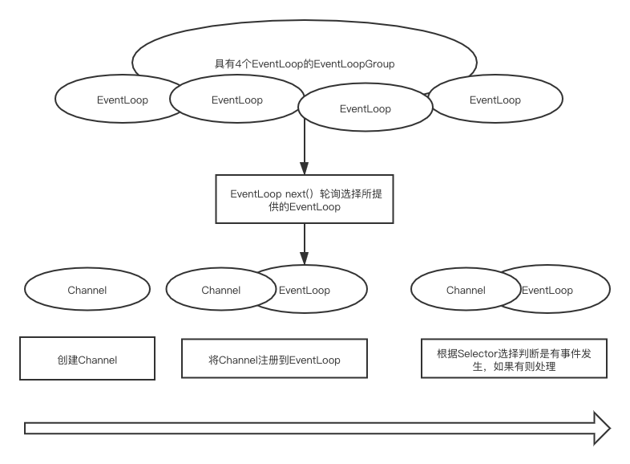

# Channel-register

### Channel 注册

1. 因为`EventLoop`对于`ServerChannel`还是普通`channel`是无差异的，所以其注册流程如图所示。



::: tip
有差异的是分组不同，一般 Boss EventLoopGroup 负责接收，Work EventLoopGroup 负责业务处理。
:::

### ServerChannel 注册

1. 注册还是在`initAndRegister()`进行的，从配置中获取到`workGroup`，然后将`channel`注册进去。

```java
// 其他代码省略
final ChannelFuture initAndRegister() {
    // 异步进行注册
    // config = ServerBootstrapConfig
    // group 获取的是work的group
    ChannelFuture regFuture = config().group().register(channel);
    return regFuture;
}

@Override
public ChannelFuture register(Channel channel) {
    // 获取一个EventLoop进行注册
    return next().register(channel);
}
// 用EventExecutorChooserFactory.EventExecutorChooser 选择一个EventLoop
public EventExecutor next() {
    return chooser.next();
}
```

1. 向`EventLoop`注册`channel`，先产生一个`DefaultChannelPromise`，其包含`chanel`和`nioEventGroup`，然后就包含了`channel，selector`的所有信息了。

```java
// SingleThreadEventLoop
@Override
public ChannelFuture register(Channel channel) {
    return register(new DefaultChannelPromise(channel, this));
}

// channel绑定一个EventLoop
public DefaultChannelPromise(Channel channel, EventExecutor executor) {
    super(executor);
    this.channel = checkNotNull(channel, "channel");
}

// 这里已经委托给EventLoop进行处理
public ChannelFuture register(final ChannelPromise promise) {
      ObjectUtil.checkNotNull(promise, "promise");
      // AbstractUnsafe
      promise.channel().unsafe().register(this, promise);
      return promise;
}

public final void register(EventLoop eventLoop, final ChannelPromise promise) {
  // 省略校验部分
  AbstractChannel.this.eventLoop = eventLoop;
  // 判断当前线程与eventLoop里面的线程是否为同一个线程
  if (eventLoop.inEventLoop()) {
      // 如果是同一个线程则进行注册，如果不是同一个线程，委托给eventLoop进行处理
      register0(promise);
  } else {
      try {
          // 将任务提交给eventLoop进行处理
          eventLoop.execute(new Runnable() {
              @Override
              public void run() {
                  register0(promise);
              }
          });
      } catch (Throwable t) {
         // 省略
      }
  }
}
```

2. 处理任务，先增加任务到队列里面，然后判断是否需要开启线程。

```java
// SingleThreadEventExecutor#execute
public void execute(Runnable task) {
  // 省略
  boolean inEventLoop = inEventLoop();
  addTask(task);
  // 如果SingleThreadEventExecutor没有初始化过线程，则上面为false
  if (!inEventLoop) {
      startThread();
      if (isShutdown() && removeTask(task)) {
          reject();
      }
  }
  if (!addTaskWakesUp && wakesUpForTask(task)) {
      wakeup(inEventLoop);
  }
}
```

3. 开启线程

```java
private void startThread() {
    // 对状态进行判断，判断是否没开启过
  if (state == ST_NOT_STARTED) {
      if (STATE_UPDATER.compareAndSet(this, ST_NOT_STARTED, ST_STARTED)) {
          try {
              // 设置线程已经初始化过了
              doStartThread();
          } catch (Throwable cause) {
              STATE_UPDATER.set(this, ST_NOT_STARTED);
              PlatformDependent.throwException(cause);
          }
      }
  }
}

private void doStartThread() {
    // 线程为空
    assert thread == null;
    // io.netty.util.concurrent.ThreadPerTaskExecutor
    executor.execute(new Runnable() {
        @Override
        public void run() {
            // 将创建的线程绑定到event
            thread = Thread.currentThread();
            if (interrupted) {
                thread.interrupt();
            }
            boolean success = false;
            updateLastExecutionTime();
            try {
                // 这个时候listenfd的线程已经启动了
                SingleThreadEventExecutor.this.run();
                success = true;
            } catch (Throwable t) {
                logger.warn("Unexpected exception from an event executor: ", t);
            } finally {
               // 省略...
            }
        }
    });
}

```

# NioEventLoop 线程
1. 这里已经切换线程了，使用`NioEventLoop`中的线程。

```java
 // 创建一个线程去执行
public final class ThreadPerTaskExecutor implements Executor {
    private final ThreadFactory threadFactory;

    public ThreadPerTaskExecutor(ThreadFactory threadFactory) {
        if (threadFactory == null) {
            throw new NullPointerException("threadFactory");
        }
        this.threadFactory = threadFactory;
    }

    // 因为其线程工厂为DefaultThreadFactory，所以创建出来的线程为FastThreadLocalThread
    @Override
    public void execute(Runnable command) {
        threadFactory.newThread(command).start();
    }
}
```

2. 新线程中的任务`SingleThreadEventExecutor.this.run();`
3. 处理任务和事件，由于线程还没有绑定端口，所以这时候是没有`SelectedKeys`要处理，仅仅只有`Queue<Runnable> taskQueue`中的任务需要处理，这个`task`也就是前面的`register0(promise);`。

```java
@Override
protected void run() {
	for (;;) {
		try {
			// 结果为0，处理default
			switch (selectStrategy.calculateStrategy(selectNowSupplier, hasTasks())) {
				case SelectStrategy.CONTINUE:
					continue;
				case SelectStrategy.SELECT:
					select(wakenUp.getAndSet(false));
					if (wakenUp.get()) {
						selector.wakeup();
					}
				default:
			}

			cancelledKeys = 0;
			needsToSelectAgain = false;
			final int ioRatio = this.ioRatio;
			if (ioRatio == 100) {
				try {
					processSelectedKeys();
				} finally {
					runAllTasks();
				}
			} else {
				final long ioStartTime = System.nanoTime();
				try {
          // 因为没有事件处理
					processSelectedKeys();
				} finally {
					final long ioTime = System.nanoTime() - ioStartTime;
          // 开始处理当前线程所有事情
					runAllTasks(ioTime * (100 - ioRatio) / ioRatio);
				}
			}
		} catch (Throwable t) {
			handleLoopException(t);
		}
		try {
			if (isShuttingDown()) {
				closeAll();
				if (confirmShutdown()) {
					return;
				}
			}
		} catch (Throwable t) {
			handleLoopException(t);
		}
	}
}

protected boolean runAllTasks(long timeoutNanos) {
   // 没有调度任务
    fetchFromScheduledTaskQueue();
    // 队列中拉取任务
    Runnable task = pollTask();
    if (task == null) {
        afterRunningAllTasks();
        return false;
    }

    final long deadline = ScheduledFutureTask.nanoTime() + timeoutNanos;
    long runTasks = 0;
    long lastExecutionTime;
    for (;;) {
         // 第一个任务是register0
        safeExecute(task);

        runTasks ++;
        if ((runTasks & 0x3F) == 0) {
            lastExecutionTime = ScheduledFutureTask.nanoTime();
            if (lastExecutionTime >= deadline) {
                break;
            }
        }
        task = pollTask();
        if (task == null) {
            lastExecutionTime = ScheduledFutureTask.nanoTime();
            break;
        }
    }

    afterRunningAllTasks();
    this.lastExecutionTime = lastExecutionTime;
    return true;
}
```

### 第一个任务

1. 从队列中拉取的第一个任务`register0`。

```java
// 之前提交的任务
  eventLoop.execute(new Runnable() {
                @Override
                public void run() {
                    register0(promise);
                }
  });
// 队列中的任务开始处理
private void register0(ChannelPromise promise) {
    try {
        if (!promise.setUncancellable() || !ensureOpen(promise)) {
            return;
        }
        boolean firstRegistration = neverRegistered;
        // 开始注册
        doRegister();
        neverRegistered = false;
        registered = true;
        // 这里开始要处理handler了
        pipeline.invokeHandlerAddedIfNeeded();

        // 处理完所有任务后，这里设置成功
        safeSetSuccess(promise);
        pipeline.fireChannelRegistered();
        if (isActive()) {
            if (firstRegistration) {
                pipeline.fireChannelActive();
            } else if (config().isAutoRead()) {
                beginRead();
            }
        }
    } catch (Throwable t) {
        closeForcibly();
        closeFuture.setClosed();
        safeSetFailure(promise, t);
    }
}
```

### 核心代码

1. 向`Selector`中注册`java.nio.ServerSocketChannel`。

```java
// 真实的注册任务
protected void doRegister() throws Exception {
  boolean selected = false;
  for (;;) {
      try {
          // 将channel注册到到Selector中
          selectionKey = javaChannel().register(eventLoop().unwrappedSelector(), 0, this);
          return;
      } catch (CancelledKeyException e) {
          if (!selected) {
              eventLoop().selectNow();
              selected = true;
          } else {
              throw e;
          }
      }
}
```

### 总结

核心是异步处理线程的注册，由对应的 `NioEventLoop` 进行处理，也处理了线程初始化问题。
