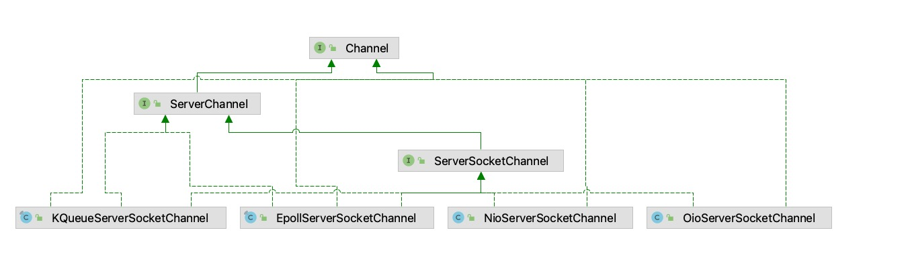
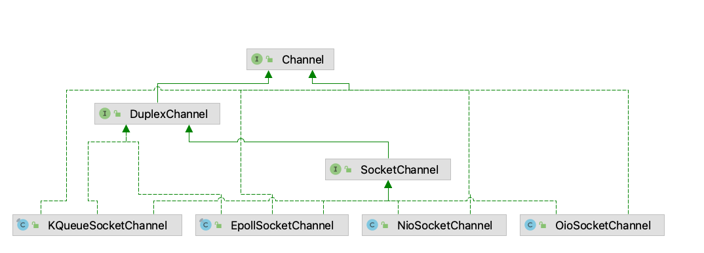

# Channle

### [开放—封闭原则（OCP）](https://book.douban.com/subject/1140457/)

::: tip 提示
A Channel can have a parent depending on how it was created. For instance, a SocketChannel, that was accepted by ServerSocketChannel, will return the ServerSocketChannel as its parent on parent().

从 `Channel` 的文档中可以看出 `SocketChannel` 是由 `ServerSocketChannel` 产生的。
其实从《深入理解计算机系统》中我们知道 connectionfd 是从 listenfd 中产生而来的。
:::

* ServerSocketChannel



* SocketChannel



从上面两种图中可以看出整体的设计是按照 `OCP` 原则进行编写的。

* [敏捷软件开发 第九章 开放—封闭原则（OCP）](https://book.douban.com/subject/1140457/)

### ServerChannel 创建

1. 查看 demo 配置

```java
  ServerBootstrap b = new ServerBootstrap();
  b.group(boss, work)
          //  这里设置了需要初始化的channel
          .channel(NioServerSocketChannel.class);
```

1. 查看`NioServerSocketChannel`配置，使用泛型处理，其实这里还有一个小技巧，`AbstractBootstrap<B extends AbstractBootstrap<B, C>, C extends Channel>`的用法妙处可以自行查阅。

```java
 public B channel(Class<? extends C> channelClass) {
    if (channelClass == null) {
        throw new NullPointerException("channelClass");
    }
    return channelFactory(new ReflectiveChannelFactory<C>(channelClass));
 }
```

2. 反射工厂使用要求，必须有一个无参构造器
3. 泛型进行限定，反射工厂进行创建

```java
Channel channel = null;
try {
    // 这里进行创建，使用反射
    channel = channelFactory.newChannel();
    init(channel);
} catch (Throwable t) {
    // 省略
}

// 调用这里创建一个channel
public NioServerSocketChannel() {
      this(newSocket(DEFAULT_SELECTOR_PROVIDER));
}
// 这里也就是nio中的SelectorProvider
private static final SelectorProvider DEFAULT_SELECTOR_PROVIDER = SelectorProvider.provider();

private static ServerSocketChannel newSocket(SelectorProvider provider) {
  try {
      return provider.openServerSocketChannel();
  } catch (IOException e) {
     // 省略
  }
}

public NioServerSocketChannel(ServerSocketChannel channel) {
    super(null, channel, SelectionKey.OP_ACCEPT);
    config = new NioServerSocketChannelConfig(this, javaChannel().socket());
}
```

4. 创建了`channel`，并设置信息

```java
protected AbstractChannel(Channel parent) {
    // 创建的channel为ServerSocketChannel,所以没有父亲
    this.parent = parent;
    // 创建一个channelId
    id = newId();
    // 返回一个NioMessageUnsafe
    unsafe = newUnsafe();
    // 创建一个Pipeline，在创建的时候将this传递了进去，这个时候AbstractChannel已经创建了，
    // 所以这里是没有循环依赖的，这样channel里面有pipeline,pipeline里面有channel
    pipeline = newChannelPipeline();
}

protected DefaultChannelPipeline(Channel channel) {
  this.channel = ObjectUtil.checkNotNull(channel, "channel");
  succeededFuture = new SucceededChannelFuture(channel, null);
  voidPromise =  new VoidChannelPromise(channel, true);

  // 初始化了AbstractChannelHandlerContext的链路
  tail = new TailContext(this);
  head = new HeadContext(this);

  head.next = tail;
  tail.prev = head;
}

protected AbstractNioChannel(Channel parent, SelectableChannel ch, int readInterestOp) {
  super(parent);
  // 设置channel
  this.ch = ch;
  // 关心的事件
  this.readInterestOp = readInterestOp;
  try {
      // 非阻塞
      ch.configureBlocking(false);
  } catch (IOException e) {
      // 省略
  }
}
```

5. 产生`DefaultServerSocketChannelConfig`

```java
public DefaultServerSocketChannelConfig(ServerSocketChannel channel, ServerSocket javaSocket) {
    super(channel);
    if (javaSocket == null) {
        throw new NullPointerException("javaSocket");
    }
    // 这里持有socket
    this.javaSocket = javaSocket;
}

public DefaultChannelConfig(Channel channel) {
    // 设置channel和自适应接收字节缓冲区分配器
    this(channel, new AdaptiveRecvByteBufAllocator());
}

protected DefaultChannelConfig(Channel channel, RecvByteBufAllocator allocator) {
    // 从channel中将数据copy到config，职责很清晰
    setRecvByteBufAllocator(allocator, channel.metadata());
    this.channel = channel;
}
```

# 总结

反射+泛型+工厂保证了配置的性，而 OCP 原则也给开发人员留下架子让其设计自己业务的 `channel` 。
