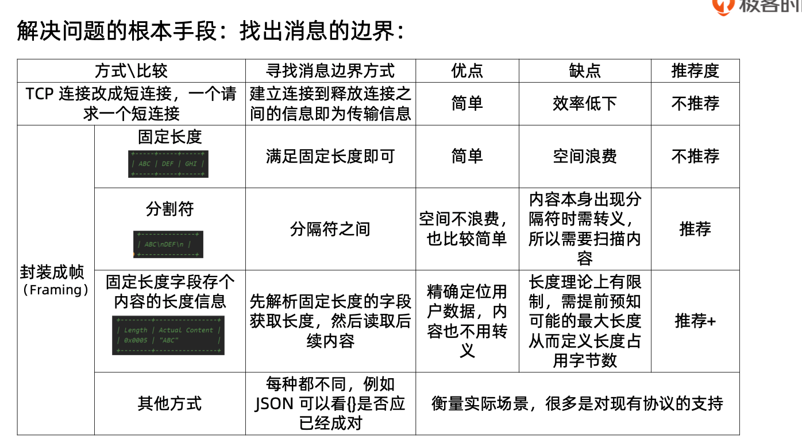
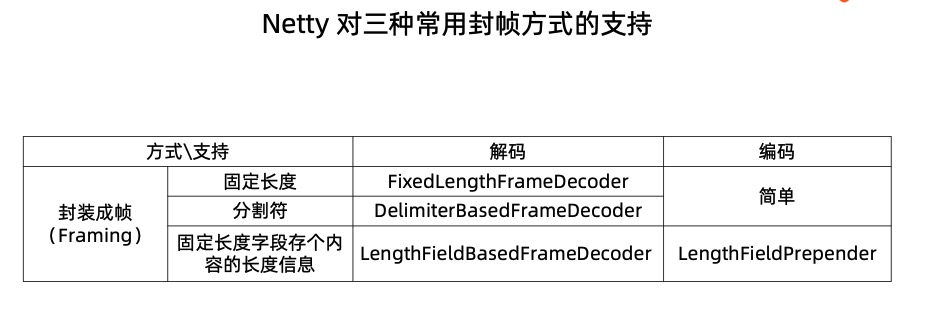
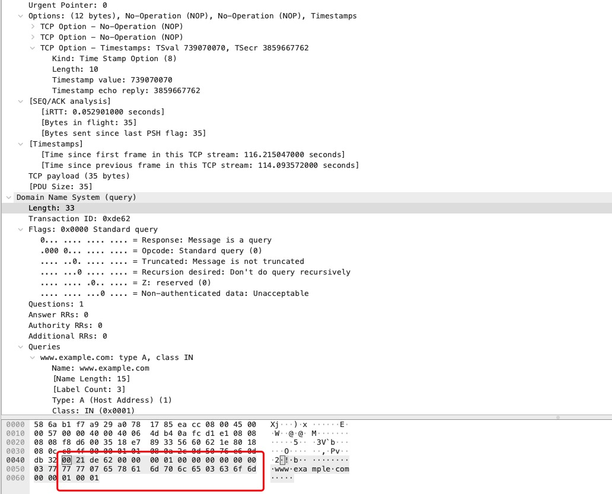

# 粘包和半包

::: tip 提示
关于粘包和半包主要参考极客时间 Netty，这里只搬运一些重要概念，其他详情，请参考视频和 PPT，具体请点击[链接](https://github.com/geektime-geekbang/geek_netty/blob/master/第二章：%20Netty%20源码：从“点”（领域知识）的角度剖析.pdf)
:::

### 粘包主要原因

* 发送方每次写入数据 < 套接字缓冲区大小
* 接收方读取套接字缓冲区数据不够及时

### 半包主要原因

* 发送方写入数据 > 套接字缓冲区大小
* 发送的数据大于协议的 MTU(Maximum Transmission Unit，最大传输单元)，必须拆包

### 具体分析

* 收发 一个发送可能被多次接收，多个发送可能被一次接收
* 传输 一个发送可能占用多个传输包，多个发送可能公用一个传输包

### 根本原因

TCP 是流式协议，消息无边界。

### 解决方案



### Netty 支持



### 解码器

* 一次解码器: ByteToMessageDecoder
  + io.netty.buffer. ByteBuf (原始数据流)-> io.netty.buffer. ByteBuf (用户数据)
* 二次解码器: MessageToMessageDecoder
  + io.netty.buffer. ByteBuf (用户数据)-> Java Object

### 查看 TcpDnsClient 代码

```java
public final class TcpDnsClient {
    private static final String QUERY_DOMAIN = "www.example.com";
    private static final int DNS_SERVER_PORT = 53;
    private static final String DNS_SERVER_HOST = "8.8.8.8";

    private TcpDnsClient() {
    }

    private static void handleQueryResp(DefaultDnsResponse msg) {
        if (msg.count(DnsSection.QUESTION) > 0) {
            DnsQuestion question = msg.recordAt(DnsSection.QUESTION, 0);
            System.out.printf("name: %s%n", question.name());
        }
        for (int i = 0, count = msg.count(DnsSection.ANSWER); i < count; i++) {
            DnsRecord record = msg.recordAt(DnsSection.ANSWER, i);
            if (record.type() == DnsRecordType.A) {
                //just print the IP after query
                DnsRawRecord raw = (DnsRawRecord) record;
                System.out.println(NetUtil.bytesToIpAddress(ByteBufUtil.getBytes(raw.content())));
            }
        }
    }

    public static void main(String[] args) throws Exception {
        EventLoopGroup group = new NioEventLoopGroup();
        try {
            Bootstrap b = new Bootstrap();
            b.group(group)
                    .channel(NioSocketChannel.class)
                    .handler(new ChannelInitializer<SocketChannel>() {
                        @Override
                        protected void initChannel(SocketChannel ch) {
                            ChannelPipeline p = ch.pipeline();
                            // 二级编码器
                            p.addLast(new TcpDnsQueryEncoder())
                                     // 解码器
                                    .addLast(new TcpDnsResponseDecoder())
                                    // 二次解码器
                                    .addLast(new SimpleChannelInboundHandler<DefaultDnsResponse>() {
                                        @Override
                                        protected void channelRead0(ChannelHandlerContext ctx, DefaultDnsResponse msg) {
                                            try {
                                                handleQueryResp(msg);
                                            } finally {
                                                ctx.close();
                                            }
                                        }
                                    });
                        }
                    });

            final Channel ch = b.connect(DNS_SERVER_HOST, DNS_SERVER_PORT).sync().channel();

            int randomID = new Random().nextInt(60000 - 1000) + 1000;
            DnsQuery query = new DefaultDnsQuery(randomID, DnsOpCode.QUERY)
                    .setRecord(DnsSection.QUESTION, new DefaultDnsQuestion(QUERY_DOMAIN, DnsRecordType.A));
            ch.writeAndFlush(query).sync();
            boolean success = ch.closeFuture().await(10, TimeUnit.SECONDS);
            if (!success) {
                System.err.println("dns query timeout!");
                ch.close().sync();
            }
        } finally {
            group.shutdownGracefully();
        }
    }
}

```

### TcpDnsQueryEncoder

1. `TcpDnsQueryEncoder`会按照[RFC-7766](https://tools.ietf.org/html/rfc7766#section-8)规范`DnsQuery`编码成下面二进制。

```java
         +-------------------------------------------------+
         |  0  1  2  3  4  5  6  7  8  9  a  b  c  d  e  f |
+--------+-------------------------------------------------+----------------+
|00000000| 00 21 de 62 00 00 00 01 00 00 00 00 00 00 03 77 |.!.b...........w|
|00000010| 77 77 07 65 78 61 6d 70 6c 65 03 63 6f 6d 00 00 |ww.example.com..|
|00000020| 01 00 01                                        |...             |
+--------+-------------------------------------------------+----------------+
```



```java
Domain Name System (query)
    //  00 21
    Length: 33
    // de 62
    Transaction ID: 0xde62
    //  00 00
    Flags: 0x0000 Standard query
        0... .... .... .... = Response: Message is a query
        .000 0... .... .... = Opcode: Standard query (0)
        .... ..0. .... .... = Truncated: Message is not truncated
        .... ...0 .... .... = Recursion desired: Don't do query recursively
        .... .... .0.. .... = Z: reserved (0)
        .... .... ...0 .... = Non-authenticated data: Unacceptable
    // 00 01
    Questions: 1
    // 00 00
    Answer RRs: 0
    // 00 00
    Authority RRs: 0
    // 00 00
    Additional RRs: 0
    Queries
        www.example.com: type A, class IN
            Name: www.example.com
            [Name Length: 15]
            [Label Count: 3]
            // 0001
            Type: A (Host Address) (1)
            // 00 01
            Class: IN (0x0001)
```

### TcpDnsResponseDecoder

1. `TcpDnsResponseDecoder`解码会对接收的结果进行一次解码，讲结果转换成`DefaultDnsResponse`。

```java
         +-------------------------------------------------+
         |  0  1  2  3  4  5  6  7  8  9  a  b  c  d  e  f |
+--------+-------------------------------------------------+----------------+
|00000000| 00 31 d1 c5 80 80 00 01 00 01 00 00 00 00 03 77 |.1.............w|
|00000010| 77 77 07 65 78 61 6d 70 6c 65 03 63 6f 6d 00 00 |ww.example.com..|
|00000020| 01 00 01 c0 0c 00 01 00 01 00 00 4c b3 00 04 5d |...........L...]|
|00000030| b8 d8 22                                        |.."             |
+--------+-------------------------------------------------+----------------+
```

2. `new SimpleChannelInboundHandler<DefaultDnsResponse>`会处理`DefaultDnsResponse`，其使用的是`acceptInboundMessage`。

```java
public boolean acceptInboundMessage(Object msg) throws Exception {
   return matcher.match(msg);
}
```

### LengthFieldBasedFrameDecoder

1. 构造器

```java
public LengthFieldBasedFrameDecoder(
    int maxFrameLength,
    int lengthFieldOffset, int lengthFieldLength,
    int lengthAdjustment, int initialBytesToStrip) {
  this(
      maxFrameLength,
      lengthFieldOffset, lengthFieldLength, lengthAdjustment,
      initialBytesToStrip, true);
}
```

1. 不同设置，报文处理不一样，常用的几种模式如下。

```java
 * <pre>
 * <b>lengthFieldOffset</b>   = <b>0</b>
 * <b>lengthFieldLength</b>   = <b>2</b>
 * lengthAdjustment    = 0
 * initialBytesToStrip = 0 (= do not strip header)
 *
 * BEFORE DECODE (14 bytes)         AFTER DECODE (14 bytes)
 * +--------+----------------+      +--------+----------------+
 * | Length | Actual Content |----->| Length | Actual Content |
 * | 0x000C | "HELLO, WORLD" |      | 0x000C | "HELLO, WORLD" |
 * +--------+----------------+      +--------+----------------+
 * </pre>

 * <pre>
 * lengthFieldOffset   = 0
 * lengthFieldLength   = 2
 * lengthAdjustment    = 0
 * <b>initialBytesToStrip</b> = <b>2</b> (= the length of the Length field)
 *
 * BEFORE DECODE (14 bytes)         AFTER DECODE (12 bytes)
 * +--------+----------------+      +----------------+
 * | Length | Actual Content |----->| Actual Content |
 * | 0x000C | "HELLO, WORLD" |      | "HELLO, WORLD" |
 * +--------+----------------+      +----------------+
 * </pre>

 * <pre>
 * lengthFieldOffset   =  0
 * lengthFieldLength   =  2
 * <b>lengthAdjustment</b>    = <b>-2</b> (= the length of the Length field)
 * initialBytesToStrip =  0
 *
 * BEFORE DECODE (14 bytes)         AFTER DECODE (14 bytes)
 * +--------+----------------+      +--------+----------------+
 * | Length | Actual Content |----->| Length | Actual Content |
 * | 0x000E | "HELLO, WORLD" |      | 0x000E | "HELLO, WORLD" |
 * +--------+----------------+      +--------+----------------+
 * </pre>

 * <pre>
 * <b>lengthFieldOffset</b>   = <b>2</b> (= the length of Header 1)
 * <b>lengthFieldLength</b>   = <b>3</b>
 * lengthAdjustment    = 0
 * initialBytesToStrip = 0
 *
 * BEFORE DECODE (17 bytes)                      AFTER DECODE (17 bytes)
 * +----------+----------+----------------+      +----------+----------+----------------+
 * | Header 1 |  Length  | Actual Content |----->| Header 1 |  Length  | Actual Content |
 * |  0xCAFE  | 0x00000C | "HELLO, WORLD" |      |  0xCAFE  | 0x00000C | "HELLO, WORLD" |
 * +----------+----------+----------------+      +----------+----------+----------------+
 * </pre>

 * <pre>
 * lengthFieldOffset   = 0
 * lengthFieldLength   = 3
 * <b>lengthAdjustment</b>    = <b>2</b> (= the length of Header 1)
 * initialBytesToStrip = 0
 *
 * BEFORE DECODE (17 bytes)                      AFTER DECODE (17 bytes)
 * +----------+----------+----------------+      +----------+----------+----------------+
 * |  Length  | Header 1 | Actual Content |----->|  Length  | Header 1 | Actual Content |
 * | 0x00000C |  0xCAFE  | "HELLO, WORLD" |      | 0x00000C |  0xCAFE  | "HELLO, WORLD" |
 * +----------+----------+----------------+      +----------+----------+----------------+
 * </pre>

 * <pre>
 * lengthFieldOffset   = 1 (= the length of HDR1)
 * lengthFieldLength   = 2
 * <b>lengthAdjustment</b>    = <b>1</b> (= the length of HDR2)
 * <b>initialBytesToStrip</b> = <b>3</b> (= the length of HDR1 + LEN)
 *
 * BEFORE DECODE (16 bytes)                       AFTER DECODE (13 bytes)
 * +------+--------+------+----------------+      +------+----------------+
 * | HDR1 | Length | HDR2 | Actual Content |----->| HDR2 | Actual Content |
 * | 0xCA | 0x000C | 0xFE | "HELLO, WORLD" |      | 0xFE | "HELLO, WORLD" |
 * +------+--------+------+----------------+      +------+----------------+
 * </pre>

 * <pre>
 * lengthFieldOffset   =  1
 * lengthFieldLength   =  2
 * <b>lengthAdjustment</b>    = <b>-3</b> (= the length of HDR1 + LEN, negative)
 * <b>initialBytesToStrip</b> = <b> 3</b>
 *
 * BEFORE DECODE (16 bytes)                       AFTER DECODE (13 bytes)
 * +------+--------+------+----------------+      +------+----------------+
 * | HDR1 | Length | HDR2 | Actual Content |----->| HDR2 | Actual Content |
 * | 0xCA | 0x0010 | 0xFE | "HELLO, WORLD" |      | 0xFE | "HELLO, WORLD" |
 * +------+--------+------+----------------+      +------+----------------+
 * </pre>
```

### 总结

* 因为 TCP 是流式协议，消息无边界，所以`LengthFieldBasedFrameDecoder` 处理起来更好，其核心底层思想与 Java 字节码常量池翻译思想基本一致。
* 二次编码主要是对第一编码处理好的类型，使用`TypeParameterMatcher`进行处理器查找进行处理。

### 参考材料

[深入理解 Java 虚拟机（第 3 版）](https://book.douban.com/subject/34907497/)

* 字节码
* 泛型

[Netty 源码剖析与实战](https://time.geekbang.org/course/intro/100036701)
