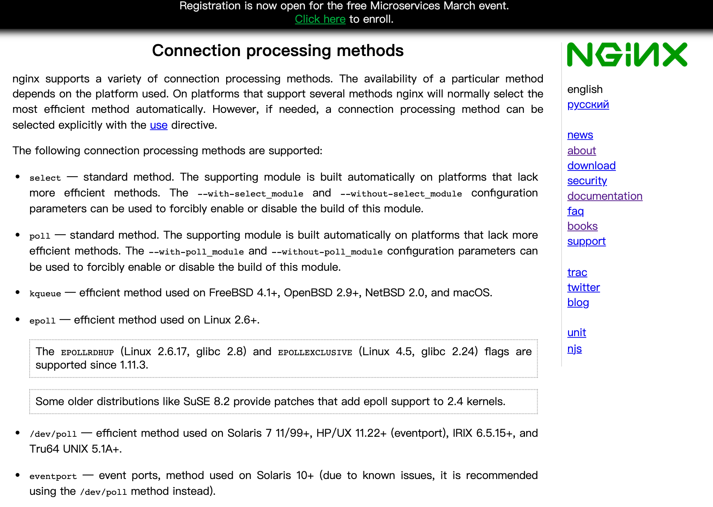

# nginx

花了一晚上时间看完了nginx介绍，就当走马观花吧。从里面学习到了很多有用的思想，这里进行记录一下。

## 动态刷新资源文件

::: tip
Once the master process receives the signal to reload configuration, it checks the syntax validity of the new configuration file and tries to apply the configuration provided in it. If this is a success, the master process starts new worker processes and sends messages to old worker processes, requesting them to shut down. Otherwise, the master process rolls back the changes and continues to work with the old configuration. Old worker processes, receiving a command to shut down, stop accepting new connections and continue to service current requests until all such requests are serviced. After that, the old worker processes exit.
:::

一旦主进程收到重新加载配置的信号，它就会检查新配置文件的语法有效性并尝试应用其中提供的配置。 如果成功，主进程启动新的工作进程并向旧的工作进程发送消息，请求它们关闭。 否则，主进程回滚更改并继续使用旧配置。旧工作进程收到关闭命令，停止接受新连接并继续为当前请求提供服务，直到所有此类请求都得到服务。之后，旧的工作进程退出。

* Java中的HashMap使用的也是以上机制。如果后面需要设计相关内容可以参考。

## 平台支持

平台支持在设计模式中其实是符合OCP原则，所以在后续学习时查看一个策略即可。

::: center

:::

## [hash](https://nginx.org/en/docs/hash.html)

资源进行记录要么使用hash，要么使用表头增加元信息进行记录，ng对资源文件使用hash进行记载，所以可以看出hash数据结构有多么重要。

## 匹配规则

在匹配上出现多个分歧混淆时定义优先级规则，例如依赖冲突时使用就近原则一样，都是解决问题方案。

## [负载均衡](https://nginx.org/en/docs/http/load_balancing.html)

需要支持多种协议并且支持插件式扩展。

## 安全

https开启，即支持对公钥加密数据进行解密。主要是ssl会消耗大量资源，在58时有个加密解密是在https基础上增加的，每台服务器最大容量到400qps已经到达极限，超出部分会导致解密失败，后面服务无法处理。

## 参考

[nginx官网](https://nginx.org/en/docs/)
