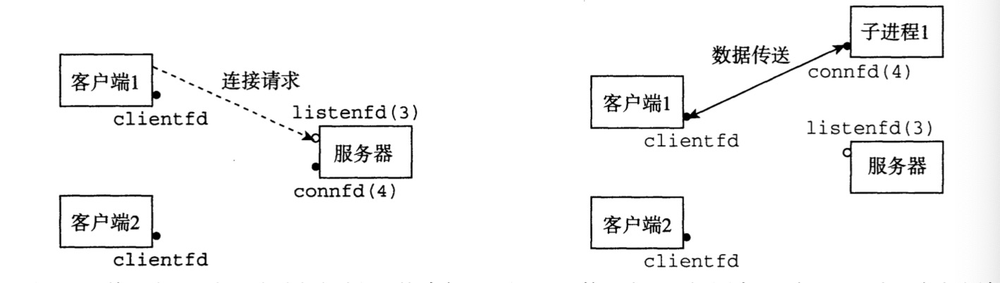
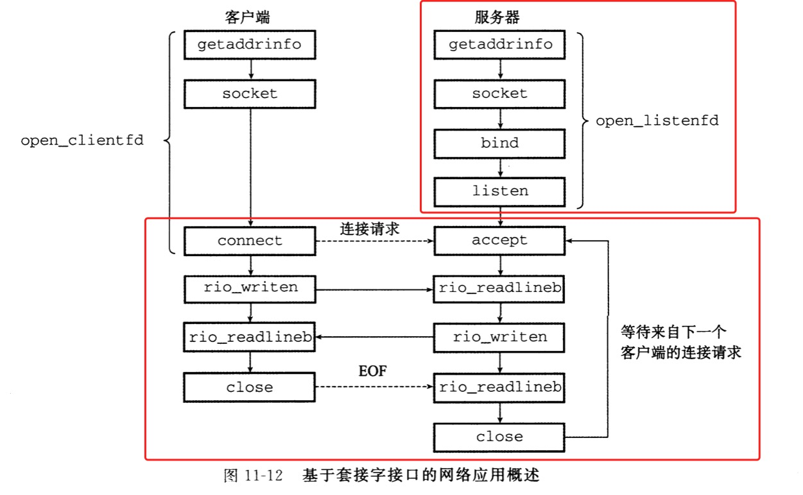
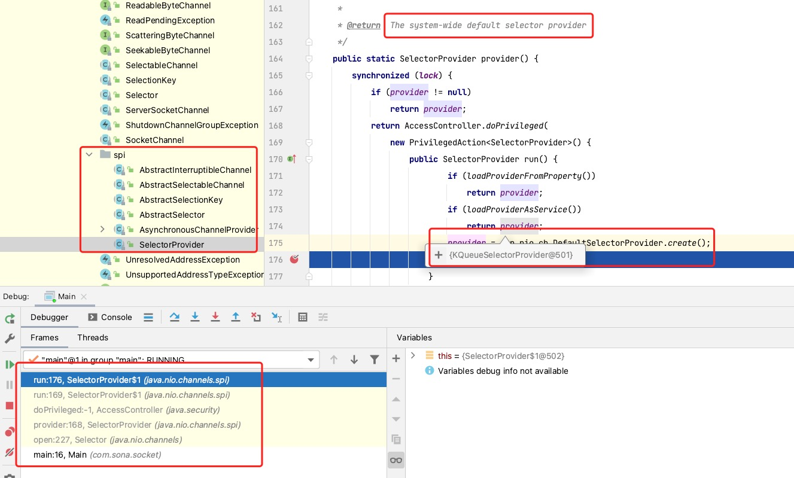
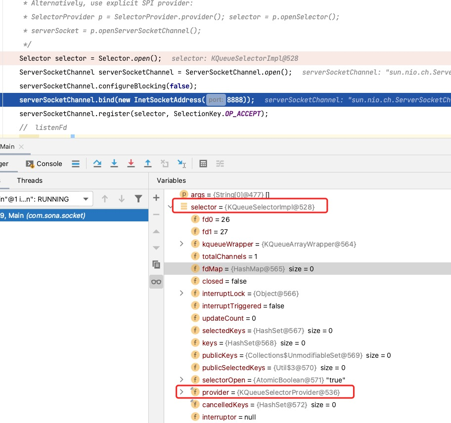
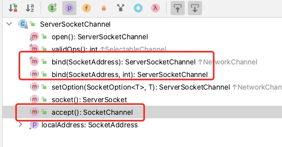
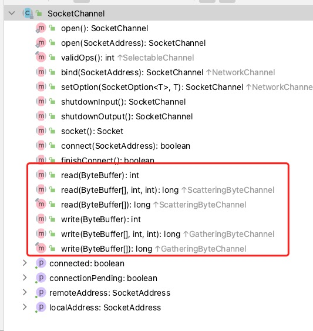
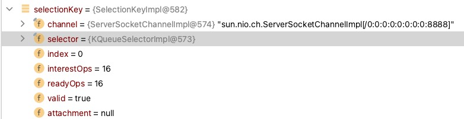
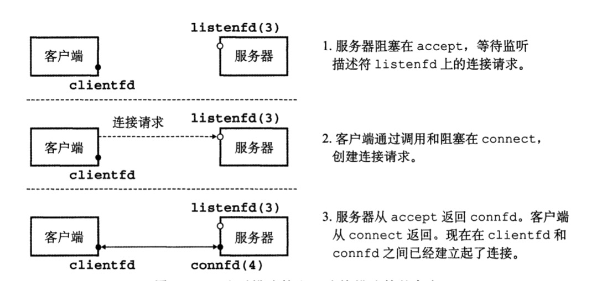
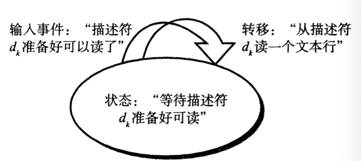
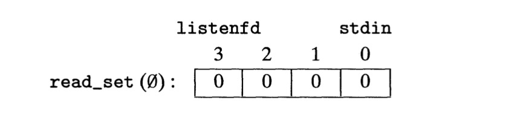

# 基础知识

::: tip
因特网连接和套接字接口基本复制与《深入理解计算机系统》
:::

### 计算机 I/O

[深入理解计算机系统（原书第 3 版）](https://book.douban.com/subject/26912767/)</br>
Linux Shell 创建的每个进程开始时都会有三个打开的文件：标准输入（描述符 0)、标准输出（描述符 1)和标准错误（描述符 2)。

### 网络编程





不同 I/O 抽象结果，其中 open_listenfd 由 `ServerSocket` 或 `ServerScoketChannel` 进行创建，数据的读写由 `Socket` 或 `SocketChannel` 进行处理。
| I/O | Socket |
| --- | --------------------------------: |
| BIO | ServerSocket/Socket |
| NIO | ServerScoketChannel/SocketChannel |

### Netty 底层

Netty 是基于 `java.nio` Support 的。

### nio 编程

```java
 public static void main(String[] args) throws Exception {
        /**
         * Alternatively, use explicit SPI provider:
         * SelectorProvider p = SelectorProvider.provider();
         * selector = p.openSelector();
         * serverSocket = p.openServerSocketChannel();
         */
        Selector selector = Selector.open();
        ServerSocketChannel serverSocketChannel = ServerSocketChannel.open();
        serverSocketChannel.configureBlocking(false);
        serverSocketChannel.bind(new InetSocketAddress(8888));
        serverSocketChannel.register(selector, SelectionKey.OP_ACCEPT);
        // 开启listenFd

        while (true) {
            while (selector.select() > 0) {
                Iterator<SelectionKey> iterator = selector.selectedKeys().iterator();
                while (iterator.hasNext()) {

                    SelectionKey selectionKey = iterator.next();
                    iterator.remove();

                    if (selectionKey.isAcceptable()) {
                        // 创建connectionFd
                        SocketChannel accept = serverSocketChannel.accept();
                        accept.configureBlocking(false);
                        accept.register(selector, SelectionKey.OP_READ);
                    }
                    if (selectionKey.isReadable()) {
                        // handler
                        SocketChannel read = (SocketChannel) selectionKey.channel();
                        read.configureBlocking(false);
                        ByteBuffer dst = ByteBuffer.allocate(1024);
                        read.read(dst);
                        read.write(dst);
                        read.close();
                    }
                }
            }
        }
    }
```

::: tip
Alternatively, use explicit SPI provider: </br>
SelectorProvider p = SelectorProvider.provider(); </br>
selector = p.openSelector(); </br>
serverSocket = p.openServerSocketChannel(); </br>
:::

#### Selector

让我们看 selector，在 Doug lea 的 pdf 中出现了这一段话是什么意思？由于不同系统中 java new io 调用的底层 Nio 实现不一样，所以使用了 spi 机制，具体如图所示:



如图所示，可以看出 `SelectorProvider` 在 `java.nio.channel.spi` 下，并且注释为 `Returns the system-wide default selector provider for this invocation of the Java virtual machine.` ，也就是不同平台下虚拟机返回是不一样的。



来看这张图，其中已经初始化了两个 fd，并且包含 fdMap，从这里已经与计算机底层对齐了。</br>

关于不同系统提供的 selector 如下所示：
| os | selector |
| ----- | --------------: |
| mac | KQueueSelector |
| linux | EpollSelector |
| win | WindowsSelector |

#### Channel

让我们来看 channel，我们发现 `ServerSocketChannel` 和 `SocketChannel` ，其在底层可以认为是 `listenFd` 和 `connectionFd` 。让我们来看看其功能有什么区别。





从两张图中已经可以看出 `ServerSocketChannel` 负责连接，其中包含 `accept()` ， `SocketChannel` 负责处理， `read()，write()` 方法为核心。</br>
在 `AbstractSelectableChannel` 模版设计模式中 `validOps()` 对关心事件进行验证。

```java
  public final SelectionKey register(Selector sel, int ops,
                                       Object att)
        throws ClosedChannelException
    {
        synchronized (regLock) {
           // 如果关闭了丢出关闭异常
            if (!isOpen())
                throw new ClosedChannelException();
                // 在这里调用了子类的方法，并对不用的channle做了事件的校验
            if ((ops & ~validOps()) != 0)
                throw new IllegalArgumentException();
            if (blocking)
                throw new IllegalBlockingModeException();
            SelectionKey k = findKey(sel);
            if (k != null) {
                k.interestOps(ops);
                k.attach(att);
            }
            if (k == null) {
                // New registration
                synchronized (keyLock) {
                    if (!isOpen())
                        throw new ClosedChannelException();
                    k = ((AbstractSelector)sel).register(this, ops, att);
                    addKey(k);
                }
            }
            return k;
        }
    }
```

`ServerSocketChannel` 中关心事件如下:

```java
public final int validOps() {
    return SelectionKey.OP_ACCEPT;
}
```

`SocketChannel` 中关心事件如下:

```java
public final int validOps() {
    return (SelectionKey.OP_READ
            | SelectionKey.OP_WRITE
            | SelectionKey.OP_CONNECT);
}
```

根据这里总结如下， `ServerSocketChannel` 只负责链接， `SocketChannel` 负责处理数据， `client` 和 `server` 处理数据使用的都是 `SocketChannel` 。
| SelectionKey | OP_ACCEPT | OP_WRITE | OP_WRITE | OP_CONNECT |
| ------------------- | --------: | -------: | -------: | ---------: |
| ServerSocketChannel | O | N | N | N |
| SocketChannel | N | O | O | O |

#### SelectionKey

`SelectionKey` 里面包含了什么属性呢?

```java
public class SelectionKeyImpl extends AbstractSelectionKey {
    final SelChImpl channel;
    public final SelectorImpl selector;
    private int index;
    private volatile int interestOps;
    private int readyOps;
}
```

这里显示是把 `Channel` 和 `Selector` 绑定到一块，我们对代码进行 `Debug` 一下，看下结果



### 总结

Channels: Connections to files, sockets etc that support non-blocking reads</br>
通道：链接文件，网络套接字等支持非阻塞(其实也就是 fd，文件描述符)</br>



Buffers: Array-like objects that can be directly read or written by Channels</br>
缓冲区：对于通道的直接读和写，像数组一样的对象。</br>

Selectors: Tell which of a set of Channels have IO events</br>
选择器: 管理一系列的通道事件，主要是管理 Channels 的事件状态的，因为事件的状态使用状态机流转方式。</br>



SelectionKeys: Maintain IO event status and bindings</br>
选择器持：维持 IO 事件状态和绑定</br>


