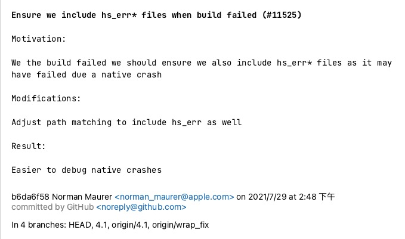

# 如何读源码

## 为什么要会读源码？

* 书上讲的都是理论知识，无法直接使用到项目中，空有理论知识，不能落地，学过的知识很快就忘记了
* 视频里都是讲案例和部分源码，看过之后犹如沙子上画画，风一吹就没了

## 查看官网

打开官网[netty](https://netty.io)，然后看看整体架构设计，这一步很重要，其可以快速了解项目设计理念和应用。

::: tip 官网介绍
Netty is an asynchronous event-driven network application framework
for rapid development of maintainable high performance protocol servers & clients.
:::

Netty 是一款异步的事件驱动的网络应用程序框架，支持快速地开发可维护的高性能的面向协议的服务器和客户端。


## 为什么要看源码历史背景？

* 可以根据背景拨丝抽茧找到代码核心底层逻辑
* 可以根据历史提交追根溯源，查找代码为什么要这么写

我们按照下面流程克隆源码和查看提交历史


### clone 代码和查看提交历史及提交模版

打开[netty github](https://github.com/netty/netty)，可以看到代码，`git clone`或者`IDE`拉取代码，查看 Git 提交历史，这个东西到底该怎么用呢？


每个提交点都提交了什么东西呢？



### 如何使用历史背景呢？

如何看明白一段或者一行代码呢？其主流程如下：


以`Netty AbstractBootstrapConfig`为例查看为什么它会出现？让我们对比 4.0 版本和 4.1 版本`io.netty.bootstrap`包的区别。


进行对比发现 4.1 版本的包比 4.0 版本的包多了`BootstrapConfig`，为什么会出现这个类呢？不用多想肯定是有需求，才会有产生，需求是什么呢？打开`AbstractBootstrapConfig`查看这个代码的提交点。


查看提交点`Git template`提交了什么信息？

```yml
暴露Bootstrap数据数据获取方法
[#5174] Expose Bootstrap getter methods and add some additional ones

动机:因为Bootstrap暴露的获取数量的方法过少
Motivation:  The Bootstrap class (applies also to AbstractBootstrap and ServerBootstrap) has a few package private getter methods and some things such as #attr() and #options() aren't exposed at all.
变更:使用更安全的管理方式暴露配置数据
Modifications:  Expose "getters" for configured things in a safe-manner via the config() method.
结果:更简单的检查配置好的启动程序
Result:  Easier for the user to check what is configured for a Bootstrap/ServerBootstrap.
```

产生这次变动的[动机](https://github.com/netty/netty/issues/5174)是什么？


在 3 处输入 5174，就可以看到结果。


我们使用 java 开发程序，但是我们用`Clojure`代替了普通配置文件，但是我们我无法测试远程地址是否未配置，其实这时候我们就理解了`AbstractBootstrapConfig`为什么会出现以及它的职责。

### 包的分类

包的分类是功能模块化，在开发和维护上可以职责清晰，看下`Netty`包的分类

* `bootstrap` 处理客户端和服务端的启动
* `buffer` 为数据的容器
* `chanel` 负责服务器接听和连接
* `util` 集合，多线程工具类
* `handler` 也是就是业务处理
  + `codec` 处理一次编码和二次编码问题
  + `timeout` 处理心跳问题
  + `traffic` 进行流量整形
  + `ipfilter` 主要是 ip 黑白名单问题
  + 打印进出站数据问题


### 使用 Example学习

合适的场景，查找相应 `Example` ，进行运行(`Debug`)和测试，查看其流程，进行快速学习。


## 总结

* 使用上面学习方式可以快速查看代码历史背景和需求推动
* `Netty`特别好的一点就是关于背景、动机、结果写的特别清晰，让后面参与这可以通过 Git 提交记录感知到历史上下文，降低口口传递成本
* 包职责拆分清晰，架构设计容易理解，维护迭代更容易
* Example 较多，可以快速的使用和学习
