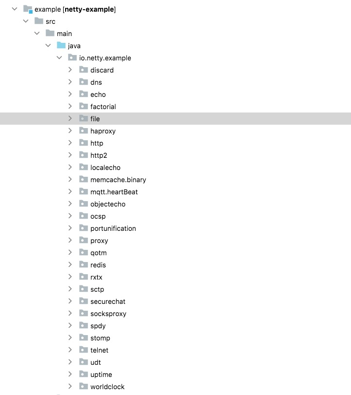

# 如何读源码

### 为什么要会读源码？

* 书上讲的都是理论知识，无法直接使用到项目中，空有理论知识，不能落地，学过的知识很快就忘记了。
* 视频里都是讲案例和部分源码，看过之后犹如沙子上画画，风一吹就没了。

### 查看官网

打开官网[netty](https://netty.io)，然后看看整体架构设计。</br>
Netty is an asynchronous event-driven network application framework
for rapid development of maintainable high performance protocol servers & clients.</br>

Netty 是一款异步的事件驱动的网络应用程序框架，支持快速地开发可维护的高性能的面向协议的服务器和客户端。


### 如何看源码历史背景？

* 可以根据历史背景拨丝抽茧找到代码核心底层逻辑。
* 可以根据历史提交追根溯源，查找代码为什么要这么写。

### clone 代码和查看提交历史及提交模版

1. 打开[netty github](https://github.com/netty/netty)，然后就可以看到代码。
2. `git clone`或者`IDE`拉取代码，可以看到 Git 提交历史，这个东西到底该怎么用呢？


3. 每次提交都提交了什么东西呢？


### 如何使用历史背景呢？

1. 以`Netty AbstractBootstrapConfig`为案例查看为什么它会出现？让我们对比 4.0 版本和 4.1 版本`io.netty.bootstrap`包的区别。


2. 你会发现 4.1 版本的包比 4.0 版本的包多了`BootstrapConfig`，那为什么会出现这个类呢？不用多想肯定是有需求，才会有产生，需求是什么呢？打开`AbstractBootstrapConfig`查看这个代码的第一次提交。


3. 来让我们看看这段`Git template`写了什么？

```yml
暴露Bootstrap数据数据获取方法
[#5174] Expose Bootstrap getter methods and add some additional ones

动机:因为Bootstrap暴露的获取数量的方法过少
Motivation:  The Bootstrap class (applies also to AbstractBootstrap and ServerBootstrap) has a few package private getter methods and some things such as #attr() and #options() aren't exposed at all.
变更:使用更安全的管理方式暴露配置数据
Modifications:  Expose "getters" for configured things in a safe-manner via the config() method.
结果:更简单的检查配置好的启动程序
Result:  Easier for the user to check what is configured for a Bootstrap/ServerBootstrap.
```

4. 产生这次变动的[动机](https://github.com/netty/netty/issues/5174)是什么？


5. 在 3 处输入 5174，就可以看到结果。


6. 我们使用 java 开发程序，但是我们用`Clojure`代替了普通配置文件，但是我们我无法测试远程地址是否未配置。

### 包的分类

* bootstrap 主要处理客户端和服务端的启动
* buffer 为数据的容器
* chanel 负责服务器接听和连接
* util 集合，多线程工具类
* handler 也是就是业务处理
  + codec 处理一次编码和二次编码问题
  + timeout 处理心跳问题
  + traffic 进行流量整形
  + ipfilter 主要是 ip 黑白名单问题
  + 打印进出站数据问题


### 合理使用 Example

对于合适的场景，查找合适的 `Example` ，进行运行和测试，查看其流程。



### 总结

* 使用上面的方式就可以根据历史背景查看需求推动，`Netty`特别好的一点就是关于背景，动机，结果写的特别清晰，可以让后面人员通过 Git 提交记录感知到上下文，减少了口口传递的成本。
* 包分配清晰，容易理解架构
* Example 较多，可以快速的使用和学习
