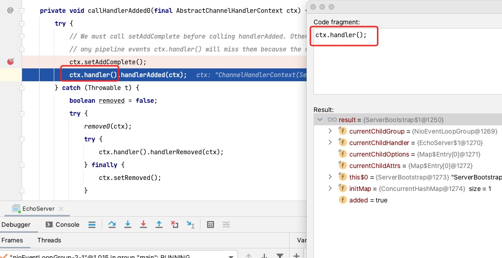
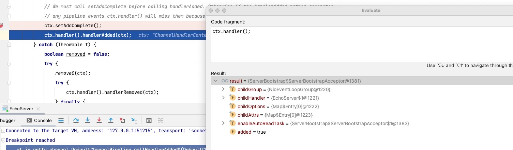
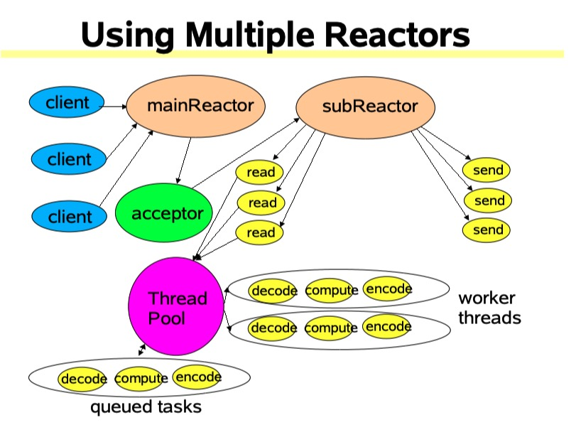

# Channel-handler

### handle 初始化

1. 之前在`DefaultChannelPipeline#pendingHandlerCallbackHead`设置的任务，在`register0#pipeline.invokeHandlerAddedIfNeeded();`中要被处理了。
2. 在`callHandlerAddedForAllHandlers`拿到刚才的`ChannelInitializer`的任务。

```java
     private void callHandlerAddedForAllHandlers() {
        final PendingHandlerCallback pendingHandlerCallbackHead;
        synchronized (this) {
            assert !registered;
            registered = true;

            // 刚才设置的task
            pendingHandlerCallbackHead = this.pendingHandlerCallbackHead;
            this.pendingHandlerCallbackHead = null;
        }
        PendingHandlerCallback task = pendingHandlerCallbackHead;
        while (task != null) {
			// 刚才的任务进行处理
            task.execute();
            task = task.next;
        }
    }

 	private void callHandlerAdded0(final AbstractChannelHandlerContext ctx) {
        try {
			// 设置增加完成
            ctx.setAddComplete();
			// 拿到处理器进行增加
            ctx.handler().handlerAdded(ctx);
        } catch (Throwable t) {
		    // 去除异常情况代码
        }
    }
```

3. 从下图可以看出这个 `handler` 就是刚才那个`ChannelInitializer`。



4. 先初始化，在移除自己，因为`ChannelInitializer`产生的这个上下文作用就是为了初始化而存在的。

```java
 	private boolean initChannel(ChannelHandlerContext ctx) throws Exception {
        if (initMap.putIfAbsent(ctx, Boolean.TRUE) == null) { // Guard against re-entrance.
            try {
				// 初始化initChannel
                initChannel((C) ctx.channel());
            } catch (Throwable cause) {
                exceptionCaught(ctx, cause);
            } finally {
                remove(ctx);
            }
            return true;
        }
        return false;
    }

    // 上面的代码会调用到之前的增加的initChannel
p.addLast(new ChannelInitializer<Channel>() {
        @Override
        public void initChannel(final Channel ch) throws Exception {
            final ChannelPipeline pipeline = ch.pipeline();
            ChannelHandler handler = config.handler();
            if (handler != null) {
                pipeline.addLast(handler);
            }

            ch.eventLoop().execute(new Runnable() {
                @Override
                public void run() {
                    pipeline.addLast(new ServerBootstrapAcceptor(
                            ch, currentChildGroup, currentChildHandler, currentChildOptions, currentChildAttrs));
                }
            });
        }
    });
```

5. 在`ChannelInitializer`初始化后，这里会在重复一次流程处理，主要为`ServerSocketChannel`增加`ServerBootstrapAcceptor`。



::: tip 提示
`ServerBootstrapAcceptor` = `acceptor` 。
:::



6. 两次栈轨迹分别如下:

```java
//  第一次新增ChannelInitializer
Breakpoint reached
	at io.netty.channel.DefaultChannelPipeline.callHandlerAdded0(DefaultChannelPipeline.java:636)
	at io.netty.channel.DefaultChannelPipeline.access$000(DefaultChannelPipeline.java:46)
	at io.netty.channel.DefaultChannelPipeline$PendingHandlerAddedTask.execute(DefaultChannelPipeline.java:1487)
	at io.netty.channel.DefaultChannelPipeline.callHandlerAddedForAllHandlers(DefaultChannelPipeline.java:1161)
	at io.netty.channel.DefaultChannelPipeline.invokeHandlerAddedIfNeeded(DefaultChannelPipeline.java:686)
	at io.netty.channel.AbstractChannel$AbstractUnsafe.register0(AbstractChannel.java:510)
	at io.netty.channel.AbstractChannel$AbstractUnsafe.access$200(AbstractChannel.java:423)
	at io.netty.channel.AbstractChannel$AbstractUnsafe$1.run(AbstractChannel.java:482)
	at io.netty.util.concurrent.AbstractEventExecutor.safeExecute$$$capture(AbstractEventExecutor.java:163)
	at io.netty.util.concurrent.AbstractEventExecutor.safeExecute(AbstractEventExecutor.java:-1)
	at io.netty.util.concurrent.SingleThreadEventExecutor.runAllTasks(SingleThreadEventExecutor.java:404)
	at io.netty.channel.nio.NioEventLoop.run(NioEventLoop.java:462)
	at io.netty.util.concurrent.SingleThreadEventExecutor$5.run(SingleThreadEventExecutor.java:897)
	at io.netty.util.concurrent.FastThreadLocalRunnable.run(FastThreadLocalRunnable.java:30)
	at java.lang.Thread.run(Thread.java:748)
//  ServerBootstrapAcceptor
Breakpoint reached at io.netty.channel.DefaultChannelPipeline.callHandlerAdded0(DefaultChannelPipeline.java:636)
Breakpoint reached
	at io.netty.channel.DefaultChannelPipeline.callHandlerAdded0(DefaultChannelPipeline.java:636)
	at io.netty.channel.DefaultChannelPipeline.addLast(DefaultChannelPipeline.java:235)
	at io.netty.channel.DefaultChannelPipeline.addLast(DefaultChannelPipeline.java:409)
	at io.netty.channel.DefaultChannelPipeline.addLast(DefaultChannelPipeline.java:396)
	at io.netty.bootstrap.ServerBootstrap$1$1.run(ServerBootstrap.java:181)
	at io.netty.util.concurrent.AbstractEventExecutor.safeExecute$$$capture(AbstractEventExecutor.java:163)
	at io.netty.util.concurrent.AbstractEventExecutor.safeExecute(AbstractEventExecutor.java:-1)
	at io.netty.util.concurrent.SingleThreadEventExecutor.runAllTasks(SingleThreadEventExecutor.java:404)
	at io.netty.channel.nio.NioEventLoop.run(NioEventLoop.java:462)
	at io.netty.util.concurrent.SingleThreadEventExecutor$5.run(SingleThreadEventExecutor.java:897)
	at io.netty.util.concurrent.FastThreadLocalRunnable.run(FastThreadLocalRunnable.java:30)
	at java.lang.Thread.run(Thread.java:748)
```

### 总结

我们开发时候会为 `boss` 设置一些 `handler` ，而 `netty` 使用 `ChannelInitializer` 获取到 `boss` 的 `handler` ，在其基础上增加 `ServerBootstrapAcceptor` 。
因为服务器的流程是固定的，所以增加 `ServerBootstrapAcceptor` 可以保存 `work socketchannel` 的一些属性。
å
