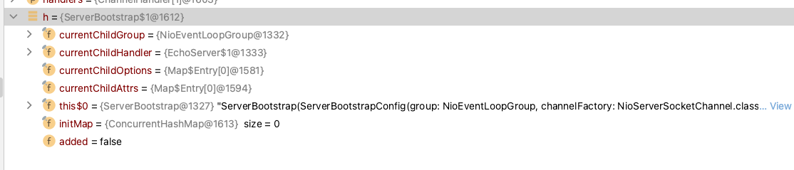

# Channel-Init

### 设置属性

1. 设置属性，并且设置`handler`初始化任务

```java
 void init(Channel channel) throws Exception {
        // 为channel设置Optio
        final Map<ChannelOption<?>, Object> options = options0();
        // 这里使用了最小锁原则
        synchronized (options) {
            setChannelOptions(channel, options, logger);
        }
        // 设置属性
        final Map<AttributeKey<?>, Object> attrs = attrs0();
        synchronized (attrs) {
            for (Entry<AttributeKey<?>, Object> e: attrs.entrySet()) {
                @SuppressWarnings("unchecked")
                AttributeKey<Object> key = (AttributeKey<Object>) e.getKey();
                channel.attr(key).set(e.getValue());
            }
        }

        // 这里在AbstractChannel时候初始化过了
        ChannelPipeline p = channel.pipeline();
        // 为孩子设置属性
        final EventLoopGroup currentChildGroup = childGroup;
        final ChannelHandler currentChildHandler = childHandler;
        final Entry<ChannelOption<?>, Object>[] currentChildOptions;
        final Entry<AttributeKey<?>, Object>[] currentChildAttrs;
        synchronized (childOptions) {
            currentChildOptions = childOptions.entrySet().toArray(newOptionArray(0));
        }
        synchronized (childAttrs) {
            currentChildAttrs = childAttrs.entrySet().toArray(newAttrArray(0));
        }

        // 为pipeline处理handlers ChannelInitializer会将上面属性带过去
        p.addLast(new ChannelInitializer<Channel>() {
            @Override
            public void initChannel(final Channel ch) throws Exception {
                final ChannelPipeline pipeline = ch.pipeline();
                ChannelHandler handler = config.handler();
                if (handler != null) {
                    pipeline.addLast(handler);
                }

                ch.eventLoop().execute(new Runnable() {
                    @Override
                    public void run() {
                        pipeline.addLast(new ServerBootstrapAcceptor(
                                ch, currentChildGroup, currentChildHandler, currentChildOptions, currentChildAttrs));
                    }
                });
            }
        });
    }
```

2. ChannelInitializer 会将上面属性带过去



```java
 public final ChannelPipeline addLast(EventExecutorGroup group, String name, ChannelHandler handler) {
        final AbstractChannelHandlerContext newCtx;
        synchronized (this) {
            // 检查被多次添加过
            checkMultiplicity(handler);

            // 创建一个上下文 在上下文中设置pipeline，执行器，处理inbound还是outbound
            newCtx = newContext(group, filterName(name, handler), handler);

            // 修正链路，双向链表修正上下文
            addLast0(newCtx);

            if (!registered) {
                // 没注册过，设置ININ到ADD_PENDING
                newCtx.setAddPending();
                // 回调任务
                callHandlerCallbackLater(newCtx, true);
                return this;
            }

            EventExecutor executor = newCtx.executor();
            if (!executor.inEventLoop()) {
                newCtx.setAddPending();
                executor.execute(new Runnable() {
                    @Override
                    public void run() {
                        callHandlerAdded0(newCtx);
                    }
                });
                return this;
            }
        }
        callHandlerAdded0(newCtx);
        return this;
    }

    private static void checkMultiplicity(ChannelHandler handler) {
        if (handler instanceof ChannelHandlerAdapter) {
            ChannelHandlerAdapter h = (ChannelHandlerAdapter) handler;
            // 如果handler不是共享的，并且添加过则丢出异常
            if (!h.isSharable() && h.added) {
                throw new ChannelPipelineException(
                        h.getClass().getName() +
                        " is not a @Sharable handler, so can't be added or removed multiple times.");
            }
            // 设置已经被添加过，这里很好，每个对象自己管理状态，不需要统一管理
            h.added = true;
        }
    }

  private void callHandlerCallbackLater(AbstractChannelHandlerContext ctx, boolean added) {
    assert !registered;

    // 如果标记位为true，则新增，否则移除
    PendingHandlerCallback task = added ? new PendingHandlerAddedTask(ctx) : new PendingHandlerRemovedTask(ctx);
    PendingHandlerCallback pending = pendingHandlerCallbackHead;
    // 如有头回调为空，则使用PendingHandlerAddedTask任务处理，这里也就是把自己设置成了头
    if (pending == null) {
        pendingHandlerCallbackHead = task;
    } else {
        // Find the tail of the linked-list.
        while (pending.next != null) {
            pending = pending.next;
        }
        pending.next = task;
    }
  }
```

### 总结

在初始化时候主要是产生了 `ChannelInitializer` 的 `handler` ，并将任务设置到 `DefaultChannelPipeline` 中，后面会在注册完毕后对 `handler` 进行初始化。
