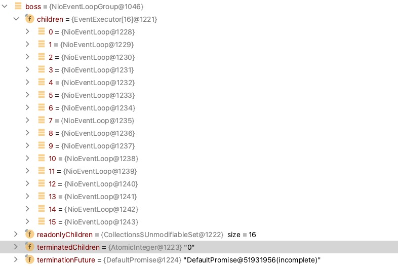
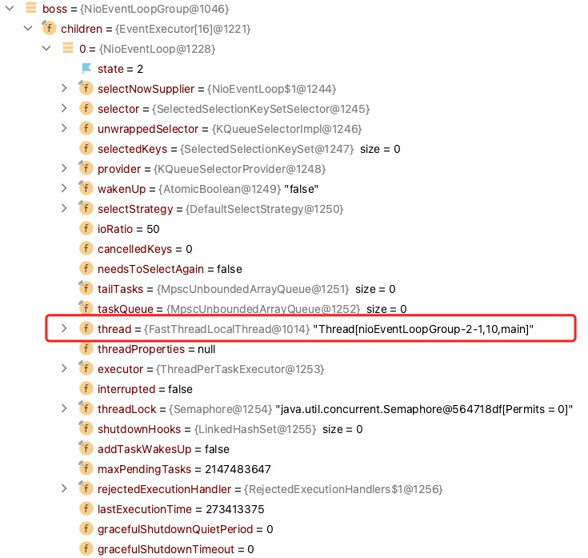
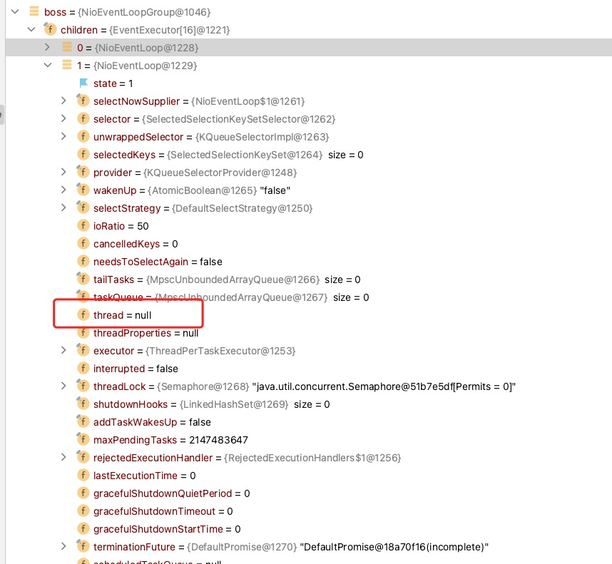
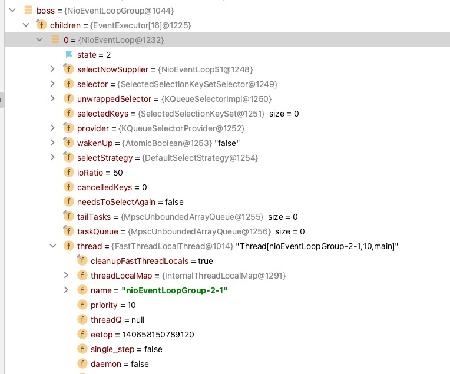
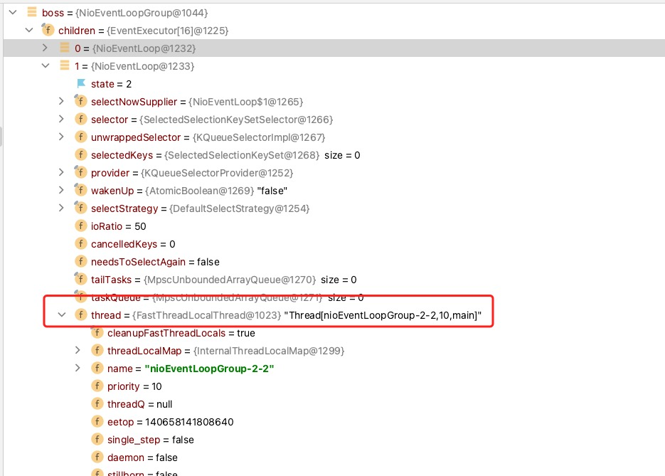
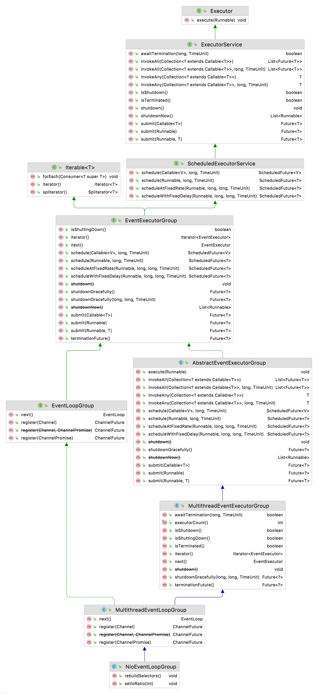
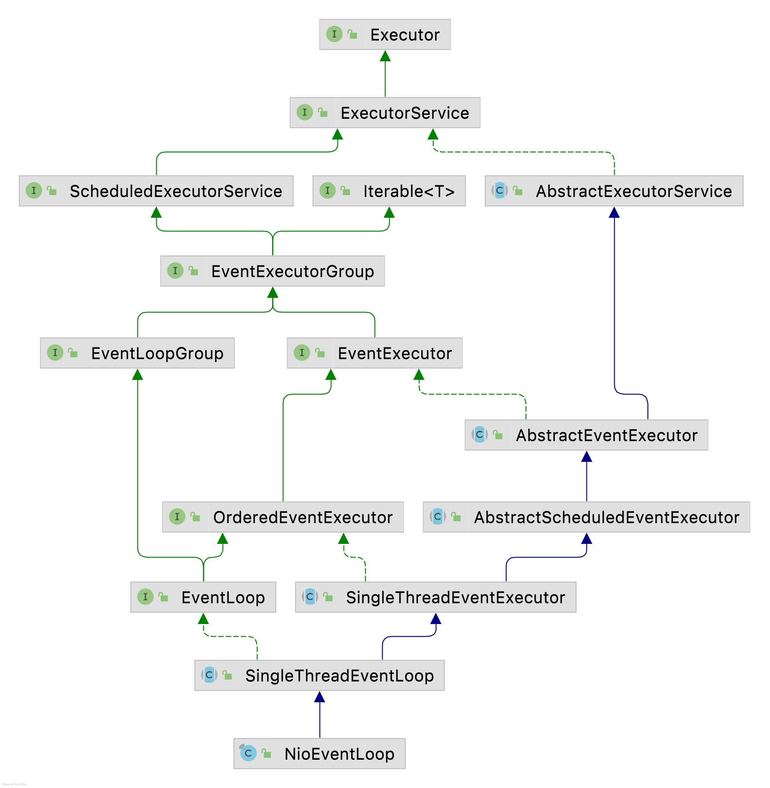

# EventLoopGroup

### Boss 选择

Boss EventLoopGroup 要处理的是 acceptor，也就是 `listenfd` ，所以如果需要开启一个端口，使用一个 `EventLoop` 即可，如果需要开启多个端口，则需要多个 `EventLoop` 。

### 绑定一个端口

对于程序来说，开启一个 `listen` 端口，就是为`EventLoop`开启一个线程， `boss` 使用 `new NioEventLoopGroup(1)` 会好一些，即使使用默认策略也没多大关系，没有端口开启就不会有 `channel` 提交到其他 `EventLoop` 里面，也就不会开启相应的线程。

1. `EventLoopGroup group` 会管理所有的 `EventLoop` ，如果使用默认策略会产生 `NettyRuntime.availableProcessors() * 2` 个 `EventLoop` 。



2. `EventLoop[0]` 由于被 `ChooserFactory` 选到了，并且初始化 `ServerSocketChannle` 时创建了线程，所以线程不为空。



3. `EventLoop[1-15]` 后面没有在处理注册，开启端口，所以线程都为空。




### 绑定多个端口

1. 绑定多个端口的`demo`如下

```java
public static void main(String[] args) throws Exception {
      new EchoServer().start();
  }
  public void start() throws Exception {
      final EchoServerHandler echoServerHandler = new EchoServerHandler();
      EventLoopGroup boss = new NioEventLoopGroup();
      EventLoopGroup work = new NioEventLoopGroup();
      try {
          ServerBootstrap b = new ServerBootstrap();
          b.group(boss, work)
                  .channel(NioServerSocketChannel.class)
                  .childHandler(new ChannelInitializer<SocketChannel>() {
                      @Override
                      protected void initChannel(SocketChannel ch) throws Exception {
                          ch.pipeline().addLast(echoServerHandler);
                      }
                  });
          // 绑定多个端口
          ChannelFuture bind = b.bind(8080);
          ChannelFuture bind1 = b.bind(9090);
          ChannelFuture bind2 = b.bind(9091);
          bind.channel().closeFuture().sync();
          bind1.channel().closeFuture().sync();
          bind2.channel().closeFuture().sync();
      } finally {
          boss.shutdownGracefully().sync();
          work.shutdownGracefully().sync();
      }
}
```

2. 看一下`Eventloop`。







### Group

::: tip 提示
根据 OCP 原则，选择 `EventLoopGroup` 和 `EventLoop` 进行展示
:::

1. 从名字中可以看出`EventLoopGroup`有组的概念，其中以`MultithreadEventExecutorGroup`为主线全部都是与线程有关系的，其保证了`channel`注册的时候支持异步事件。
   而 `EventLoopGroup` 主要是为 `channel` 找到需要被注册到的 `EventLoop` ，其所有接口都与注册有关系。而 `NioEventLoopGroup` 其组内包含 `1...n` 个 `EventLoop` ，所以其设计需要一个选择 `EventLoop next(); ` 的方法，下面视图根据 OCP 原则，选择 `NioEventLoopGroup` 进行展示。




2. `EventLoop`也就是事件循环，其是`EventLoopGroup`扩展，因为从其继承关系，我们看到其继承了`EventLoopGroup`，对于`NioEventLoop`继承了`SingleThreadEventLoop`也就是自己为一组，这里展现出，其实`Netty`的支持组内在分组的，只是因为其业务这里使用了`SingleThreadEventLoop`。

```java
public interface EventLoop extends OrderedEventExecutor, EventLoopGroup {
    @Override
    EventLoopGroup parent();
}

// SingleThreadEventLoop 返回的是this
@Override
public EventExecutor next() {
    return this;
}

// private final EventExecutorChooserFactory.EventExecutorChooser chooser;
// EventLoopGroup 选择的时候使用的是EventExecutorChooser
@Override
public EventExecutor next() {
    return chooser.next();
}
```



### 总结

* `netty`支持 1 ～ N 个端口绑定，`boss group`属于 CPU 密集型，处理速度很快，在一般场景下不需要多个`Eventloop`，所以建议开启一个端口即可。
* 对于组的设计，支持多种方式，根据业务不同未来可以设计出符合自己的实现。
