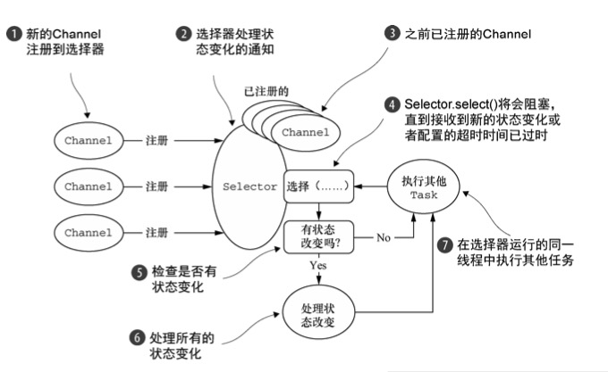
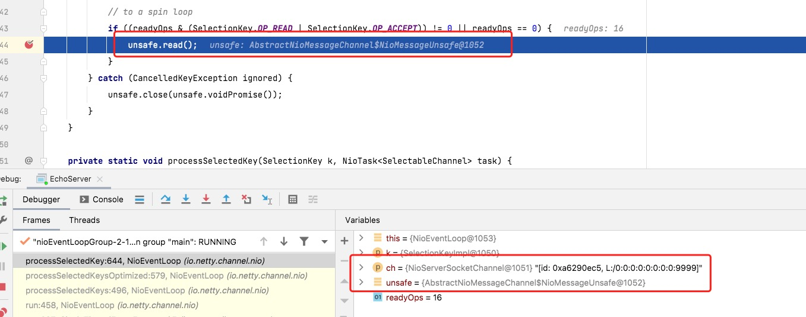
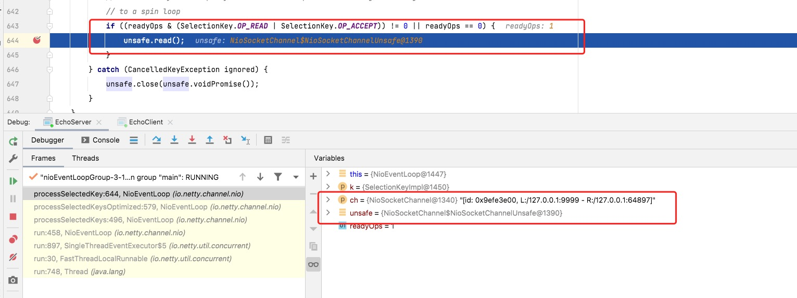

# EventLoop

### 线程开启

1.  所有的`EventLoop`线程初始化和绑定关系，都是在`eventLoop.execute()`接受任后开始的，如果当前`EventLoop`没有初始化的话，会进行初始化，并将线程引用绑定到`EventLoop`中。

```java
// 提交任务到eventloop里面
@Override
public void execute(Runnable task) {
    if (task == null) {
        throw new NullPointerException("task");
    }
    boolean inEventLoop = inEventLoop();
    addTask(task);
    if (!inEventLoop) {
        // 这里会开启一个线程
        startThread();
        if (isShutdown() && removeTask(task)) {
            reject();
        }
    }

    if (!addTaskWakesUp && wakesUpForTask(task)) {
        wakeup(inEventLoop);
    }
}
```

2. 开启线程时需要状态的判断

```java
private void startThread() {
      // eventloop状态判断
      if (state == ST_NOT_STARTED) {
          if (STATE_UPDATER.compareAndSet(this, ST_NOT_STARTED, ST_STARTED)) {
              try {
                  // 开启线程
                  doStartThread();
              } catch (Throwable cause) {
                  STATE_UPDATER.set(this, ST_NOT_STARTED);
                  PlatformDependent.throwException(cause);
              }
          }
      }
}
```

3. 线程开启后需要做的事情。

* 创建线程时候，将线程绑定到 `eventloop`，这样后面能确保相应的任务在相应线程内处理。
* `inEventLoop(Thread thread)`会判断点当前线程是否与 channel 注册的线程是否为一个。
* `SingleThreadEventExecutor.this.run(); `进入死循环。

```java
private void doStartThread() {
    // 确保线程为空
    assert thread == null;
    // 提交任务给线程工厂，这样就会创建线程了
    executor.execute(new Runnable() {
        @Override
        public void run() {
            thread = Thread.currentThread();
            if (interrupted) {
                thread.interrupt();
            }

            boolean success = false;
            updateLastExecutionTime();
            try {
                // 进入死循环
                SingleThreadEventExecutor.this.run();
                success = true;
            } catch (Throwable t) {
                logger.warn("Unexpected exception from an event executor: ", t);
            } finally {
              // 省略...
            }
        }
    });
}
```

### EventLoop 进行死循环



* 一个 EventLoopGroup 包含一个或者多个 EventLoop;
`EventLoopGroup` 组的概念，包含多个孩子，因为其 `next()` 方法决定了从中选择孩子。
* 一个 EventLoop 在它的生命周期内只和一个 Thread 绑定;
`EventLoop` 其实也是一个分组，在这里说与一个线程绑定不太合适，应该是其子类 `SingleThreadEventLoop` 在它的生命周期内只和一个 Thread 绑定。
* 所有由 EventLoop 处理的 I/O 事件都将在它专有的 Thread 上被处理;
`NioEventLoop` 继承了 `SingleThreadEventLoop` ，并且绑定了一个线程，一个 `Selector` ，所以 `Channel` 事件都是由 `Selector` 进行选择， `NioEventLoop` 线程进行处理的。
* 一个 Channel 在它的生命周期内只注册于一个 EventLoop;
  使用 `EventLoopGroup#next()` 获取 `NioEventLoop` 并进行注册
* 一个 EventLoop 可能会被分配给一个或多个 Channel。
`EventLoop` 在领域设计上是 `1~n` 关系

::: tip 提示
上图来自《Netty 实战》
:::

1. 核心代码就是先处理所有的事件，然后在处理队列中的任务，也就是上图中流程 4 ～ 7。

```java
if (ioRatio == 100) {
    try {
        // 处理事件
        processSelectedKeys();
    } finally {
        // 处理任务
        runAllTasks();
    }
} else {
    final long ioStartTime = System.nanoTime();
    try {
        // 处理事件
        processSelectedKeys();
    } finally {
        // 处理任务
        final long ioTime = System.nanoTime() - ioStartTime;
        runAllTasks(ioTime * (100 - ioRatio) / ioRatio);
    }
}
```

2. `processSelectedKeysOptimized();`与`processSelectedKeysPlain(selector.selectedKeys());`主要涉及三个方面。
   - 优化版本底层是 `SelectedSelectionKeySet` ，未优化版本底层数据结构为 `HashSet` 。
   - 数据迭代使用数组效率会更高。
   - 重新选择数据( selectAgain(); )时候，需要手工处理数组

```java

if (a instanceof AbstractNioChannel) {
    processSelectedKey(k, (AbstractNioChannel) a);
} else {
    @SuppressWarnings("unchecked")
    NioTask<SelectableChannel> task = (NioTask<SelectableChannel>) a;
    processSelectedKey(k, task);
}

private void processSelectedKey(SelectionKey k, AbstractNioChannel ch) {
    final AbstractNioChannel.NioUnsafe unsafe = ch.unsafe();
    // 如果channel关心事件校验不过，比如ServerSocket去关心读事件
    if (!k.isValid()) {
        final EventLoop eventLoop;
        try {
            eventLoop = ch.eventLoop();
        } catch (Throwable ignored) {
            return;
        }
        if (eventLoop == this) {
            unsafe.close(unsafe.voidPromise());
        }
        return;
    }

    try {
        // 事件
        int readyOps = k.readyOps();
        if ((readyOps & SelectionKey.OP_CONNECT) != 0) {
            int ops = k.interestOps();
            ops &= ~SelectionKey.OP_CONNECT;
            k.interestOps(ops);
            // 这里的unsafe是从SelectKey的attach中拿到的
            unsafe.finishConnect();
        }

        if ((readyOps & SelectionKey.OP_WRITE) != 0) {
            // 写事件，进行刷新
            ch.unsafe().forceFlush();
        }

        // 读或者连接事件
        if ((readyOps & (SelectionKey.OP_READ | SelectionKey.OP_ACCEPT)) != 0 || readyOps == 0) {
            // 因为ServerNioSocketChannle和NioSocketChannle中的NioUnsafe实现不一样，所有这里是一个模版方法
            unsafe.read();
        }
    } catch (CancelledKeyException ignored) {
        unsafe.close(unsafe.voidPromise());
    }
}

```

3. 从上面看，所有的事件，都委托给了`AbstractNioChannel.NioUnsafe NioMessageUnsafe`进行处理，所以`ServerNioSocketChannle`和`NioSocketChannle`的实现也就是不同的策略。

### 任务 Consumer

1. 所有任务都是以`Producer`的方式向`Eventloop#tailTasks`的队列中提交的，因为`Eventloop`继承了`SingleThreadEventExecutor`，所以所有的任务都会被增加到`private final Queue<Runnable> tailTasks;`。

```java
// 比如这个，当前线程就是生产者，并将事件推送到特定的EventLoop
channel.eventLoop().execute(new Runnable() {
    @Override
    public void run() {
        if (regFuture.isSuccess()) {
            channel.bind(localAddress, promise).addListener(ChannelFutureListener.CLOSE_ON_FAILURE);
        } else {
            promise.setFailure(regFuture.cause());
        }
    }
});
```

2. `NioEventLoop`无限循环，也就是任务的 `Consumer`，也就是`runAllTasks();`或者`runAllTasks(ioTime * (100 - ioRatio) / ioRatio);`

```java
// 无限循环
for (;;) {
    safeExecute(task);
    runTasks ++;
    // 每64个任务校验一下超时时间，保证与SelectedKeys处理时间在特定比例内
    if ((runTasks & 0x3F) == 0) {
        lastExecutionTime = ScheduledFutureTask.nanoTime();
        if (lastExecutionTime >= deadline) {
            break;
        }
    }
    task = pollTask();
    if (task == null) {
        lastExecutionTime = ScheduledFutureTask.nanoTime();
        break;
    }
}
```

### 如何产生 SocketChannel

1. 当产生了连接事件，`int localRead = doReadMessages(readBuf);`会产生一个新的`SocketChannel`。



1. `SocketChannel`通过`ServerSocketChannel`产生，并且初始化流程与`ServerSocketChannel`一致，只是初始化关心事件变更为`SelectionKey.OP_READ`。

```java
@Override
protected int doReadMessages(List<Object> buf) throws Exception {
    // 在这里产生
    SocketChannel ch = SocketUtils.accept(javaChannel());
    try {
        if (ch != null) {
            buf.add(new NioSocketChannel(this, ch));
            return 1;
        }
    } catch (Throwable t) {
      // ....
    }
    return 0;
}

public static SocketChannel accept(final ServerSocketChannel serverSocketChannel) throws IOException {
    try {
        // 权限处理
        return AccessController.doPrivileged(new PrivilegedExceptionAction<SocketChannel>() {
            @Override
            public SocketChannel run() throws IOException {
                return serverSocketChannel.accept();
            }
        });
    } catch (PrivilegedActionException e) {
        throw (IOException) e.getCause();
    }
}
```

2. 将新产生的`NioSocketChanel`传递给`work group`;

```java
int size = readBuf.size();
for (int i = 0; i < size; i ++) {
    readPending = false;
    pipeline.fireChannelRead(readBuf.get(i));
}
// 这里会清除掉，所以 pipeline.fireChannelRead(readBuf.get(i));肯定会把孩子交给work group
readBuf.clear();
```

3. `ServerBootstrapAcceptor`在`channelRead`时候会将新产生的连接注册到`work group`里面去。

```java
public void channelRead(ChannelHandlerContext ctx, Object msg) {

    // 这个信息是孩子
    final Channel child = (Channel) msg;

    // 为孩子增加handler，其初始化过程与之前一致。
    child.pipeline().addLast(childHandler);

    setChannelOptions(child, childOptions, logger);

    for (Entry<AttributeKey<?>, Object> e: childAttrs) {
        child.attr((AttributeKey<Object>) e.getKey()).set(e.getValue());
    }

    try {
        // 先轮询出一个eventloop，然后将孩子注册到eventloop
        childGroup.register(child).addListener(new ChannelFutureListener() {
            @Override
            public void operationComplete(ChannelFuture future) throws Exception {
                if (!future.isSuccess()) {
                    forceClose(child, future.cause());
                }
            }
        });
    } catch (Throwable t) {
        forceClose(child, t);
    }
}
```

### NioSockectChannel

1. 这个时候使用的`invokeChannelRead`就会找到真实的逻辑处理器了。


