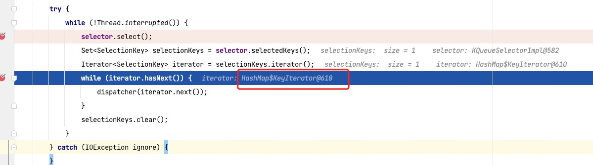

# OpenSelector

### 动机

3ce9ab2e Trustin Lee <t@motd.kr> on 2013/6/10 at 11:00 下午</br>
Replace the sun.nio.ch. SelectorImpl.selectedKeys with faster one</br>
替换 SelectorImpl.selectedKeys 使用更快的方式</br>

* Yield much less garbage</br>
  更少的垃圾回收</br>
* Slight performance gain (1~2%)</br>
  性能略有提高</br>
  SelectorImpl 基础代码

```java
public abstract class SelectorImpl extends AbstractSelector {
    protected Set<SelectionKey> selectedKeys = new HashSet();
    protected HashSet<SelectionKey> keys = new HashSet();
    private Set<SelectionKey> publicKeys;
    private Set<SelectionKey> publicSelectedKeys;
}
```

底层:



当我看 `openSelector` 这个方法时候，我发现这里这么一大段代码， 只是感觉感觉这里写的很妙，但是完全很茫然，等我看到动机后，就完全明白了。

### 原始代码

```java
  private Selector openSelector() {
        try {
            return provider.openSelector();
        } catch (IOException e) {
            throw new ChannelException("failed to open a new selector", e);
        }
  }
```

优化前的代码是不是很简单，直接创建了一个选择器，我们写 demo 时候也会这么写。

### 优化提交的代码

```java
  // 判断是否打开了优化
  private static final boolean DISABLE_KEYSET_OPTIMIZATION =
            SystemPropertyUtil.getBoolean("io.netty.noKeySetOptimization", false);

   private Selector openSelector() {
        final Selector selector;
        try {
            selector = provider.openSelector();
        } catch (IOException e) {
            throw new ChannelException("failed to open a new selector", e);
        }

        // 如果没有优化直接返回
        if (DISABLE_KEYSET_OPTIMIZATION) {
            return selector;
        }

        try {

            // 数组的set结果
            SelectedSelectionKeySet selectedKeySet = new SelectedSelectionKeySet();

            Class<?> selectorImplClass =
                    Class.forName("sun.nio.ch.SelectorImpl", false, ClassLoader.getSystemClassLoader());
            selectorImplClass.isAssignableFrom(selector.getClass());

            // 反射
            Field selectedKeysField = selectorImplClass.getDeclaredField("selectedKeys");
            Field publicSelectedKeysField = selectorImplClass.getDeclaredField("publicSelectedKeys");

            selectedKeysField.setAccessible(true);
            publicSelectedKeysField.setAccessible(true);

            // 反射替换值
            selectedKeysField.set(selector, selectedKeySet);
            publicSelectedKeysField.set(selector, selectedKeySet);

            selectedKeys = selectedKeySet;
            logger.trace("Instrumented an optimized java.util.Set into: {}", selector);
        } catch (Throwable t) {
            selectedKeys = null;
            logger.trace("Failed to instrument an optimized java.util.Set into: {}", selector, t);
        }

        return selector;
    }

    final class SelectedSelectionKeySet extends AbstractSet<SelectionKey> {

    private SelectionKey[] keysA;
    private int keysASize;
    private SelectionKey[] keysB;
    private int keysBSize;
    private boolean isA = true;
    }
```

### 优化理论

替换 hashset 为数组，因为数组支持基地址+偏移地址进行遍历，节省更多空间，遍历更快。可参考[深入理解计算机系统（原书第 3 版）](https://book.douban.com/subject/26912767/) ( 3.8 数组分配和访问 - 3.9 异质的数据结构)

java 中的应用 `RandomAccess` 其中有一段注释为

```java
     for (int i=0, n=list.size(); i &lt; n; i++)
         list.get(i);

     runs faster than this loop:

     for (Iterator i=list.iterator(); i.hasNext(); )
```

### 代码权限

```java
   Object maybeSelectorImplClass = AccessController.doPrivileged(new PrivilegedAction<Object>() {
            @Override
            public Object run() {
                try {
                    return Class.forName(
                            "sun.nio.ch.SelectorImpl",
                            false,
                            PlatformDependent.getSystemClassLoader());
                } catch (Throwable cause) {
                    return cause;
                }
            }
        });
```

这段代码主要是关于代码权限的问题，比如 B 系统没有 C 文件夹写的权限，但是 A 有 C 文件夹写的权限，B 系统委托给 A 系统调用，使用 `AccessController.doPrivileged` 可以解决权限链向上检查问题，从 A 系统有权限就终止了，想深入了解请自行查找资料。

### 版本优化

支持 JDK9 及以上版本</br>
动机：在 JDK8 使用反射替换 `key set` ，在 JDK9 以后在域反射使用 `setAccessible(true)` 不在生效。</br>

NioEventLoop should also use our special SelectionKeySet on Java9 and later. (#8260)</br>
Motivation: In Java8 and earlier we used reflection to replace the used key set if not otherwise told. This does not work on Java9 and later without special flags as its not possible to call setAccessible(true) on the Field anymore.
Modifications: - Use Unsafe to instrument the Selector with out special set when sun.misc. Unsafe is present and we are using Java9+.
Result: NIO transport produce less GC on Java9 and later as well.

```java
   if (PlatformDependent.javaVersion() >= 9 && PlatformDependent.hasUnsafe()) {

   }
```

### SelectorTuple

持续优化带来的产物

* [Use a single array in SelectedSelectionKeySet](https://github.com/netty/netty/issues/6058)
* [NioEventLoop#rebuildSelector0 throws ClassCastException](https://github.com/netty/netty/issues/6607)

### 总结

减少复杂度学习源码复杂度，可以在 debug 代码时候可以回归到原始状态。
