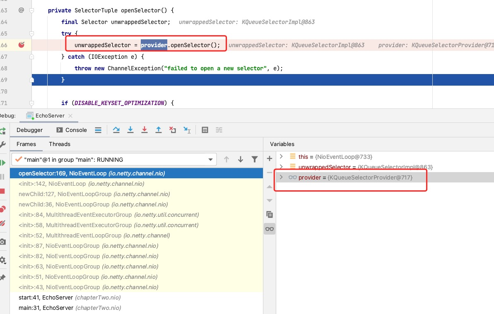
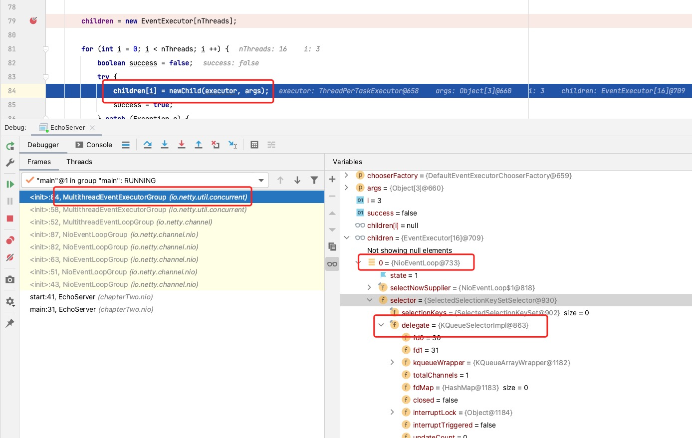
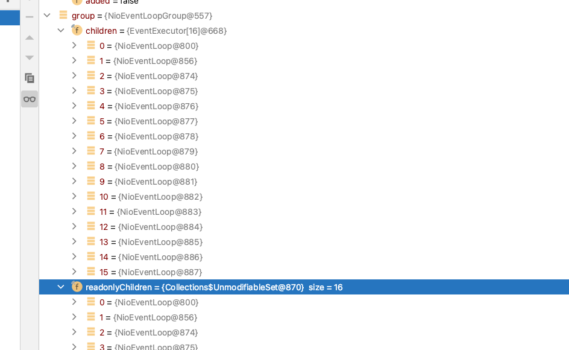

# Selector

### Netty 中是怎么使用的 Selector

从前面基础知识中，我们知道 Selector 是事件管理和处理器，对于 `ServerSocketChannel` 和 `SocketChannel` 是一样的，那在 Netty 中是怎么使用的呢？

* 先从[Netty Github](https://github.com/netty/netty/tree/4.1/example/src/main/java/io/netty/example/echo)拉取一个 demo，开始进行查找其应用。
* 开始对代码进行验证

```java
  EventLoopGroup group = new NioEventLoopGroup();
```

`EventLoopGroup` 其实就是管理线程的，而一个线程一般只会存在一个 `Selector` ，如果是多个的话需要考虑竞争和切换问题。</br>



从图中可以看出创建了 16 个线程，代码如下所示:

```java
 private final EventExecutor[] children;
 children = new EventExecutor[nThreads];
```



从这张图中可以看出一共创建了 16 个线程，每个线程配置一个 Selector，最终结果如图所示:



### 代码 Debug

```java
    public NioEventLoopGroup() {
         // 无参数构造
        this(0);
    }

    public NioEventLoopGroup(int nThreads) {
        // nThreads= 0
        this(nThreads, (Executor) null);
    }

   // nThreads= 0
    public NioEventLoopGroup(int nThreads, Executor executor) {
       // 0  null , 虚拟机provider
        this(nThreads, executor, SelectorProvider.provider());
    }

    public NioEventLoopGroup(
            int nThreads, Executor executor, final SelectorProvider selectorProvider) {
        this(nThreads, executor, selectorProvider, DefaultSelectStrategyFactory.INSTANCE);
    }

    public NioEventLoopGroup(int nThreads, Executor executor, final SelectorProvider selectorProvider,
                             final SelectStrategyFactory selectStrategyFactory) {
               // 0  null  虚拟机提供，任务策略，拒绝策略
        super(nThreads, executor, selectorProvider, selectStrategyFactory, RejectedExecutionHandlers.reject());
    }

    protected MultithreadEventLoopGroup(int nThreads, Executor executor, Object... args) {
        // 线程为0取io.netty.eventLoopThreads配置，获取不到用 NettyRuntime.availableProcessors() * 2
        super(nThreads == 0 ? DEFAULT_EVENT_LOOP_THREADS : nThreads, executor, args);
    }

     protected MultithreadEventExecutorGroup(int nThreads, Executor executor, Object... args) {
        // 16 null  线程选择策略，如果是2的倍数则使用位移处理，性能更高效，否则轮询获取
        // args = selectorProvider
        //        selectStrategyFactory select策略
        //        RejectedExecutionHandlers 拒绝处理策略
        this(nThreads, executor, DefaultEventExecutorChooserFactory.INSTANCE, args);
    }
```

### 核心代码

```java
    children[i] = newChild(executor, args);

    NioEventLoop(NioEventLoopGroup parent, Executor executor, SelectorProvider selectorProvider,
                 SelectStrategy strategy, RejectedExecutionHandler rejectedExecutionHandler) {
        super(parent, executor, false, DEFAULT_MAX_PENDING_TASKS,
        rejectedExecutionHandler);

        // 如果SelectorProvider为空产生异常
        if (selectorProvider == null) {
            throw new NullPointerException("selectorProvider");
        }
        // select选择策略
        if (strategy == null) {
            throw new NullPointerException("selectStrategy");
        }
        // todo 后面会用
        provider = selectorProvider;

        // 这里会专门使用一章进行讲解，属于一个优化子线
        final SelectorTuple selectorTuple = openSelector();
        // 如果没有优化的话这里 unwrappedSelector = selector
        // 如果优化了的话 unwrappedSelector = 原始selector
        // 如果优化了的话 selector = SelectedSelectionKeySetSelector
        selector = selectorTuple.selector;
        unwrappedSelector = selectorTuple.unwrappedSelector;
        selectStrategy = strategy;
    }
```

### Main

当程序启动后，发现程序在 `DefaultPromise.await` 无限期等待。

```java
"main" #1 prio=5 os_prio=31 tid=0x00007f979600f800 nid=0x2603 in Object.wait() [0x000000030e252000]
   java.lang.Thread.State: WAITING (on object monitor)
        at java.lang.Object.wait(Native Method)
        - waiting on <0x000000076b966430> (a io.netty.channel.AbstractChannel$CloseFuture)
        at java.lang.Object.wait(Object.java:502)
        at io.netty.util.concurrent.DefaultPromise.await(DefaultPromise.java:231)
        - locked <0x000000076b966430> (a io.netty.channel.AbstractChannel$CloseFuture)
        at io.netty.channel.DefaultChannelPromise.await(DefaultChannelPromise.java:131)
        at io.netty.channel.DefaultChannelPromise.await(DefaultChannelPromise.java:30)
        at io.netty.util.concurrent.DefaultPromise.sync(DefaultPromise.java:337)
        at io.netty.channel.DefaultChannelPromise.sync(DefaultChannelPromise.java:119)
        at io.netty.channel.DefaultChannelPromise.sync(DefaultChannelPromise.java:30)
        at chapterTwo.nio.EchoServer.start(EchoServer.java:66)
        at chapterTwo.nio.EchoServer.main(EchoServer.java:31)
```

### Listen

```java
"nioEventLoopGroup-2-1" #14 prio=10 os_prio=31 tid=0x00007f9786055000 nid=0x9d93 runnable [0x000000030f9a4000]
   java.lang.Thread.State: RUNNABLE
        at sun.nio.ch.KQueueArrayWrapper.kevent0(Native Method)
        at sun.nio.ch.KQueueArrayWrapper.poll(KQueueArrayWrapper.java:198)
        at sun.nio.ch.KQueueSelectorImpl.doSelect(KQueueSelectorImpl.java:117)
        at sun.nio.ch.SelectorImpl.lockAndDoSelect(SelectorImpl.java:86)
        - locked <0x000000076b797170> (a io.netty.channel.nio.SelectedSelectionKeySet)
        - locked <0x000000076b784d48> (a java.util.Collections$UnmodifiableSet)
        - locked <0x000000076b7629e0> (a sun.nio.ch.KQueueSelectorImpl)
        at sun.nio.ch.SelectorImpl.select(SelectorImpl.java:97)
        at io.netty.channel.nio.SelectedSelectionKeySetSelector.select(SelectedSelectionKeySetSelector.java:62)
        at io.netty.channel.nio.NioEventLoop.select(NioEventLoop.java:753)
        at io.netty.channel.nio.NioEventLoop.run(NioEventLoop.java:408)
        at io.netty.util.concurrent.SingleThreadEventExecutor$5.run(SingleThreadEventExecutor.java:897)
        // 这里已经被装饰成FastThreadLocalRunnable
        at io.netty.util.concurrent.FastThreadLocalRunnable.run(FastThreadLocalRunnable.java:30)
        at java.lang.Thread.run(Thread.java:748)
```
